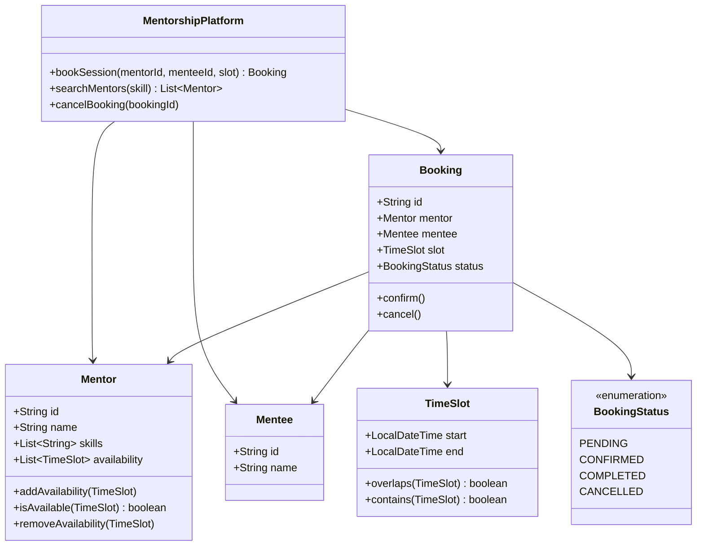

# Design Mentorship Platform (Preplaced / Topmate)

> **Difficulty**: Medium
> **Topics**: Marketplace Dynamics, Availability Management, State Machine
> **Key Concepts**: TimeSlot management, Booking concurrency, Optimistic vs. pessimistic locking.

---

## Real-Life Analogy

Think of a professional gym with personal trainers. You want a trainer who specializes in weightlifting and is free on Tuesday mornings. You browse available trainers, find Alice (weightlifting, available Tue 9–11 AM), and book a slot. While you're filling out your payment form, Bob is also booking Alice for that same Tuesday slot. Only one of you gets it — the other sees "Slot unavailable."

This is **Calendly meets LinkedIn**: mentors publish their availability, mentees browse and book, and the system ensures no double-booking. The hardest part is not the booking itself — it's the **race condition** when two mentees click "Book" at the same millisecond.

---

## Phase 1: Requirements

### Functional Requirements
- Mentors define and manage their available time slots.
- Mentees search for mentors by skill/domain.
- Mentees book a specific time slot with a mentor.
- System sends confirmation notifications (email/SMS) after booking.
- Bookings can be cancelled by either party.

### Non-Functional Requirements
- **Consistency**: A slot must never be double-booked.
- **Availability**: The platform should handle search queries at high throughput.
- **Low Latency**: Booking confirmation should feel instantaneous (<500ms).

### Concurrency Constraints
- Two mentees can simultaneously attempt to book the same mentor slot.
- Only one should succeed; the other must receive a clear failure response.
- In a single-server scenario: per-mentor `ReentrantLock`.
- In a distributed scenario: database row-level locking (`SELECT ... FOR UPDATE`) or Redis distributed lock (`Redlock`).

---

## Phase 2: Use Cases

### Actors
- **Mentor**: Sets availability, views bookings, conducts sessions.
- **Mentee**: Searches mentors, books sessions, cancels if needed.
- **System**: Enforces consistency, sends notifications, handles payments.

### UC1: Mentor Sets Availability
**Actor**: Mentor
**Flow**:
1. Mentor selects a date and time range (e.g., "Mon 9–11 AM").
2. System checks for conflicts with existing bookings on that slot.
3. System stores the `TimeSlot` as `AVAILABLE`.

### UC2: Mentee Books a Session
**Actor**: Mentee
**Flow**:
1. Mentee searches mentors by skill (e.g., "System Design").
2. Mentee views Alice's calendar and selects Mon 9–10 AM.
3. System acquires a per-mentor lock.
4. System re-validates that the slot is still available (double-checked under lock).
5. System creates a `Booking` (status: `CONFIRMED`) and removes the slot from availability.
6. System releases the lock and sends confirmation notifications.
7. If slot was taken between steps 2 and 3: return "Slot no longer available."

### UC3: Cancel Booking
**Actor**: Mentor or Mentee
**Flow**:
1. Actor requests cancellation.
2. System validates cancellation is allowed (e.g., not within 1 hour of session).
3. Booking transitions to `CANCELLED`; slot is restored to mentor's availability.

---

## Phase 3: Class Diagram

### Core Entities
- **MentorshipPlatform**: Top-level facade coordinating search and booking.
- **Mentor**: Owns a list of available `TimeSlot`s and a skill set.
- **Mentee**: The consumer; has no domain logic beyond identity.
- **Booking**: The central transaction object with a state machine.
- **TimeSlot**: Value object representing a contiguous time range with overlap detection.

### Key Design Decisions
- `TimeSlot` is a **value object** (no identity, compared by value) — two slots with the same start/end are equal.
- `Booking` owns the **state machine** (`PENDING → CONFIRMED → COMPLETED / CANCELLED`).
- The `bookSession` method is the only place that writes to availability — all under a lock.



---

## Phase 4: Design Patterns Applied

### 1. Observer Pattern
**What**: When a `Booking` changes state, interested parties (email service, SMS service, dashboard) are notified automatically.
**Why**: The booking engine should not know about email servers or push notification APIs. Adding a new notification channel (WhatsApp) means adding a new observer — zero changes to `BookingSystem`.

### 2. State Pattern
**What**: `Booking` delegates behavior to its current state object (`PendingState`, `ConfirmedState`, `CancelledState`).
**Why**: A `COMPLETED` booking cannot be cancelled. A `CANCELLED` booking cannot be confirmed. Rather than littering `if (status == X)` checks everywhere, each state object defines which transitions are legal.

### 3. Strategy Pattern (for search)
**What**: `MentorSearchStrategy` interface with implementations like `SkillMatchStrategy`, `AvailabilityFirstStrategy`.
**Why**: Search ranking criteria evolve — you might rank by rating, response rate, or price. Strategy lets you swap algorithms without changing the platform facade.

---

## Phase 5: Key Java Implementation

The most interesting part is the **concurrent booking** — ensuring that when two mentees race to book the same slot, exactly one wins. The pattern is: acquire lock → validate under lock → write → release.

```java
import java.time.LocalDateTime;
import java.util.*;
import java.util.concurrent.*;
import java.util.concurrent.locks.*;

// --- Value Object ---
class TimeSlot {
    final LocalDateTime start;
    final LocalDateTime end;

    public TimeSlot(LocalDateTime start, LocalDateTime end) {
        if (!start.isBefore(end)) throw new IllegalArgumentException("start must be before end");
        this.start = start;
        this.end = end;
    }

    // Two slots overlap if one starts before the other ends
    public boolean overlaps(TimeSlot other) {
        return this.start.isBefore(other.end) && other.start.isBefore(this.end);
    }

    // Does this slot fully contain the requested sub-slot?
    public boolean contains(TimeSlot requested) {
        return !this.start.isAfter(requested.start) && !this.end.isBefore(requested.end);
    }

    @Override
    public boolean equals(Object o) {
        if (!(o instanceof TimeSlot)) return false;
        TimeSlot t = (TimeSlot) o;
        return start.equals(t.start) && end.equals(t.end);
    }

    @Override public int hashCode() { return Objects.hash(start, end); }
}

// --- Mentor ---
class Mentor {
    final String id;
    final String name;
    final List<String> skills;
    private final List<TimeSlot> availability = new ArrayList<>();

    public Mentor(String id, String name, List<String> skills) {
        this.id = id; this.name = name; this.skills = skills;
    }

    public synchronized void addAvailability(TimeSlot slot) {
        // Reject overlapping availability declarations
        for (TimeSlot existing : availability) {
            if (existing.overlaps(slot))
                throw new IllegalStateException("Overlapping availability slot");
        }
        availability.add(slot);
    }

    // Does the mentor have any availability slot that CONTAINS the requested slot?
    public synchronized boolean isAvailable(TimeSlot requested) {
        return availability.stream().anyMatch(s -> s.contains(requested));
    }

    public synchronized void removeAvailability(TimeSlot slot) {
        availability.removeIf(s -> s.equals(slot));
    }
}

// --- Booking ---
enum BookingStatus { PENDING, CONFIRMED, CANCELLED, COMPLETED }

class Booking {
    final String id = UUID.randomUUID().toString();
    final Mentor mentor;
    final Mentee mentee;
    final TimeSlot slot;
    volatile BookingStatus status = BookingStatus.CONFIRMED;

    Booking(Mentor mentor, Mentee mentee, TimeSlot slot) {
        this.mentor = mentor; this.mentee = mentee; this.slot = slot;
    }
}

class Mentee {
    final String id; final String name;
    Mentee(String id, String name) { this.id = id; this.name = name; }
}

// --- Booking System: the concurrency-critical path ---
public class BookingSystem {
    private final Map<String, Booking> bookings = new ConcurrentHashMap<>();
    // One lock per mentor — coarse but correct for single-server deployments
    private final ConcurrentHashMap<String, ReentrantLock> mentorLocks = new ConcurrentHashMap<>();

    public Booking bookSession(Mentor mentor, Mentee mentee, TimeSlot requestedSlot) {
        ReentrantLock lock = mentorLocks.computeIfAbsent(mentor.id, k -> new ReentrantLock());
        lock.lock();
        try {
            // Double-checked availability: slot might have been taken since mentee saw the calendar
            if (!mentor.isAvailable(requestedSlot)) {
                System.out.println("FAILED: Slot no longer available for " + mentor.name);
                return null;
            }

            // Atomically: create booking + remove slot from mentor's calendar
            Booking booking = new Booking(mentor, mentee, requestedSlot);
            bookings.put(booking.id, booking);
            mentor.removeAvailability(requestedSlot);

            System.out.println("CONFIRMED [" + booking.id + "]: "
                    + mentee.name + " with " + mentor.name + " at " + requestedSlot.start);
            return booking;

        } finally {
            lock.unlock();
        }
    }

    // Simulate two mentees racing for the same slot
    public static void main(String[] args) throws InterruptedException {
        BookingSystem system = new BookingSystem();
        Mentor alice = new Mentor("m1", "Alice", List.of("System Design", "Java"));
        TimeSlot slot = new TimeSlot(
            LocalDateTime.of(2025, 6, 9, 10, 0),
            LocalDateTime.of(2025, 6, 9, 11, 0)
        );
        alice.addAvailability(slot);

        Mentee bob   = new Mentee("u1", "Bob");
        Mentee carol = new Mentee("u2", "Carol");

        ExecutorService pool = Executors.newFixedThreadPool(2);
        pool.submit(() -> system.bookSession(alice, bob,   slot));
        pool.submit(() -> system.bookSession(alice, carol, slot));
        pool.shutdown();
        pool.awaitTermination(5, TimeUnit.SECONDS);
        // Exactly one booking is created; the other gets "Slot no longer available"
    }
}
```

---

## Phase 6: Trade-offs and Extensions

### Trade-off: Single-server lock vs. distributed lock
| Approach | Pros | Cons |
|---|---|---|
| `ReentrantLock` | Simple, fast | Fails across multiple servers |
| DB row lock (`SELECT FOR UPDATE`) | Works distributed | DB becomes bottleneck |
| Redis Redlock | Fast, distributed | Operational complexity, clock skew risk |

### Extension: Calendar Sync (Google Calendar)
- **Pull**: Google sends a webhook when an event is created → block corresponding slot in our DB.
- **Push**: When booking is confirmed, use Google Calendar API to create an event in both parties' calendars.

### Extension: Optimizing Mentor Search
- Index mentors in Elasticsearch with fields `skills`, `rating`, `price`.
- Store availability as nested time-range objects for range-query support.
- Query: "Find mentors with skill=Java who have a slot on Monday between 9–11 AM."

### Extension: Recurring Sessions
- A `RecurringBooking` references a base `TimeSlot` plus a `RecurrenceRule` (weekly, biweekly).
- System generates individual `Booking` instances per occurrence; each can be independently cancelled.

---

## SOLID Principles
- **S**: `BookingSystem` coordinates, `Mentor` manages availability, `Booking` owns state.
- **O**: New booking types (group sessions, webinars) extend `Booking` without changing `BookingSystem`.
- **I**: `NotificationService` is an interface; email/SMS implementations are injected.
- **D**: `BookingSystem` depends on `NotificationService` abstraction, not concrete email classes.
