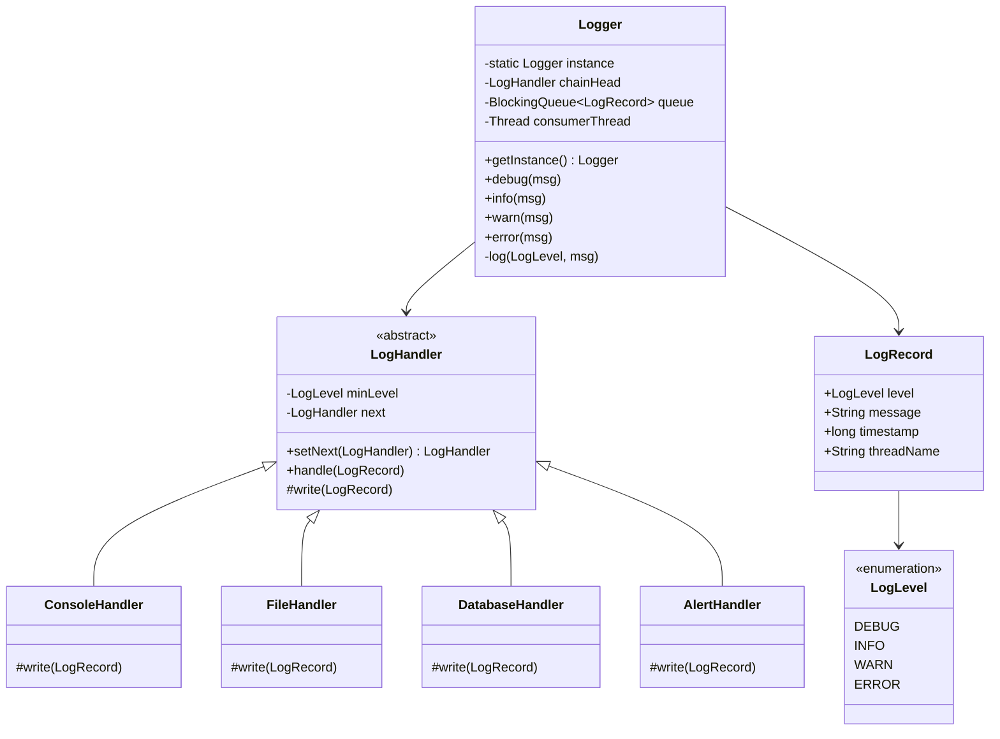

# Design Logger Library

> **Difficulty**: Easy/Medium
> **Topics**: Chain of Responsibility, Singleton, Observer
> **Key Concepts**: Log levels, multiple sinks, async decoupling via BlockingQueue.

---

## What Breaks Without This Design?

```java
class Logger {
    public static void log(String level, String message) {
        if (level.equals("DEBUG") || level.equals("INFO") 
            || level.equals("WARN") || level.equals("ERROR")) {
            // write to console
            System.out.println("[" + level + "] " + message);
        }
        if (level.equals("WARN") || level.equals("ERROR")) {
            // write to file
            try (FileWriter fw = new FileWriter("app.log", true)) {
                fw.write("[" + level + "] " + message + "\n");
            } catch (IOException e) { e.printStackTrace(); }
        }
        if (level.equals("ERROR")) {
            // write to DB
            DB.execute("INSERT INTO logs VALUES ('" + level + "', '" + message + "')");
        }
    }
}
```

**Concrete failures**:
1. **`log()` blocks the calling thread on I/O**: The DB write is synchronous. In a high-throughput service, every `logger.error()` call holds the caller's thread for the duration of a DB round-trip (~5ms). At 10,000 req/sec, this is 50 seconds of wasted thread-time per second.
2. **OCP violation**: Adding a new sink (Splunk, Datadog) requires editing `log()`. The routing table (`ERROR` → file + DB) is hardcoded.
3. **SRP violation**: `Logger.log()` knows the routing rules AND the write implementation for every sink.
4. **Multiple `Logger` instances compile silently**: Two components instantiate `Logger` and log to different file handles. File output is interleaved or duplicated.
5. **Level filtering is centralized and rigid**: All `INFO` logs always go to console. Making `INFO` go to file in production requires editing the method.

---

## Derive the Class Structure

**Force 1 — Logging must not block the caller**: I/O (file, DB, network) is slow. The caller should never wait for a write. Decouple: the `log()` method enqueues to a `BlockingQueue<LogRecord>`; a single background thread drains the queue and dispatches to sinks. The caller's thread returns immediately after the enqueue.

**Force 2 — Sinks and their level thresholds vary independently**: `ConsoleHandler` handles `INFO+`, `FileHandler` handles `WARN+`, `DBHandler` handles `ERROR` only. Each handler is a link in a chain — it checks its minimum level, handles if eligible, and passes down. Extract `LogHandler` abstract class with `setNext()` and `handle(LogRecord)`. Each sink is a subclass.

**Force 3 — `LogRecord` must carry context**: The raw string is insufficient — you need level, timestamp, thread name, and message for structured logging. Extract `LogRecord` (immutable value object).

**Force 4 — One global logger instance**: Multiple instances would produce duplicate log entries and split the `BlockingQueue`. Make `Logger` a Singleton.

**Force 5 — Adding a new sink must not touch existing code**: A new `SplunkHandler` implementing `LogHandler` plugs into the chain without editing `Logger` or existing handlers.

**Result** — the class split these forces produce:
```
God class → Logger (Singleton, BlockingQueue, background dispatcher thread)
          → LogRecord (level, message, timestamp, thread — immutable)
          → LogLevel (enum: DEBUG < INFO < WARN < ERROR, with compareTo)
          → LogHandler (abstract: minLevel, next, handle(LogRecord))
             → ConsoleHandler, FileHandler, DatabaseHandler, RemoteHandler
```

---

## Real-Life Analogy

Think of the **black box flight recorder** on an airplane. It captures everything: routine sensor data, pilot communications, warnings, and critical failures. It writes to multiple destinations: the cockpit display (console), the flight data recorder (file), and sometimes a live telemetry stream to ground control (remote sink). Critically, it operates **asynchronously** — the logging system never pauses the plane's flight computer waiting for a write to finish.

The severity levels mirror aviation: `DEBUG` is routine telemetry, `INFO` is normal flight events, `WARN` is turbulence warnings, `ERROR` is engine anomalies that need immediate attention. A log message flows through a **chain of handlers**, each deciding whether to process it based on its configured minimum severity.

---

## Phase 1: Requirements

### Functional Requirements
- Log messages at multiple severity levels: `DEBUG < INFO < WARN < ERROR`.
- Route messages to multiple destinations: Console, File, Database, Remote API.
- Configure which levels go to which destination (e.g., `ERROR` → File + DB, `INFO` → Console only).
- Single global access point: `Logger.getInstance()`.

### Non-Functional Requirements
- **Performance**: Logging must not block the calling thread on I/O. Critical for high-throughput services.
- **Reliability**: `ERROR`-level logs must not be lost even under load.
- **Extensibility**: Adding a new sink (e.g., Splunk, Datadog) requires zero changes to existing handlers.

### Concurrency Constraints
- Multiple threads call `logger.log()` concurrently.
- Solution: the `log()` method enqueues to a `BlockingQueue`; a single background thread drains the queue and writes to sinks, eliminating lock contention on I/O.

---

## Phase 2: Use Cases

### Actors
- **Client Application**: The code calling `logger.info(...)`, `logger.error(...)`.
- **Logger System**: Receives calls, enqueues messages, dispatches to the handler chain.
- **Log Sinks**: Physical destinations — stdout, `error.log`, database table, Splunk HTTP endpoint.

### UC1: Log a Routine Event
**Actor**: Client Application
**Flow**:
1. Client calls `logger.info("User login: user_id=42")`.
2. Logger wraps message in a `LogRecord` (level, timestamp, thread name, message).
3. Record is placed on the `BlockingQueue`.
4. Background consumer thread picks it up.
5. `ConsoleHandler` (min level `INFO`) accepts and writes it.
6. `FileHandler` (min level `WARN`) rejects it — level too low.

### UC2: Log a Critical Error
**Actor**: Client Application
**Flow**:
1. Client calls `logger.error("DB connection pool exhausted")`.
2. `LogRecord` enters queue.
3. Consumer dispatches through chain: `ConsoleHandler` writes → `FileHandler` writes → `DatabaseHandler` inserts row → `AlertHandler` sends PagerDuty alert.
4. All handlers process `ERROR`-level messages.

---

## Phase 3: Class Diagram

### Core Entities
- **Logger**: Singleton facade. Exposes `info()`, `warn()`, `error()`. Owns the queue and background thread.
- **LogHandler (abstract)**: The chain node. Holds `minLevel` and reference to `nextHandler`. Implements the "should I handle this?" decision.
- **Concrete Handlers**: `ConsoleHandler`, `FileHandler`, `DatabaseHandler` — each overrides `write()`.
- **LogRecord**: Immutable value object carrying level, timestamp, thread, message.

### Key Design Decisions
- The chain is built **once** at startup; handlers form a linked list.
- Each handler calls `write()` if `message.level >= this.minLevel`, then **always forwards** to next — a single message can be processed by multiple handlers.
- The `BlockingQueue` is the boundary between caller threads and I/O threads.



---

## Phase 4: Design Patterns Applied

### 1. Chain of Responsibility
**What**: A log record is passed along a linked list of handlers. Each handler independently decides to process it based on its `minLevel` threshold.
**Why**: Routing rules are complex and change over time. The chain lets you configure "WARN+ goes to File, ERROR+ goes to DB and Alert" without a monolithic `if/else` tree. Adding a new handler means appending it to the chain — no existing code changes.

### 2. Singleton Pattern
**What**: `Logger.getInstance()` returns the single, globally shared logger.
**Why**: A logger needs to be accessible from every class without being passed as a dependency. It also owns shared state (the queue, the background thread) that must exist exactly once.

### 3. Producer-Consumer (Async decoupling)
**What**: `log()` puts a `LogRecord` onto a `BlockingQueue`. A dedicated background thread drains the queue and dispatches to the chain.
**Why**: File and database writes are slow (milliseconds). On a high-throughput path (e.g., logging every HTTP request), synchronous writes would cripple throughput. The queue decouples the caller from I/O latency. The calling thread pays only the cost of `queue.offer()` (~nanoseconds).

---

## Phase 5: Key Java Implementation

The interesting parts are (a) the `handle()` method that passes the record down the chain regardless of whether this handler processed it, and (b) the async queue that decouples callers from I/O.

```java
import java.time.Instant;
import java.util.concurrent.*;

// --- Log Level ---
enum LogLevel {
    DEBUG(0), INFO(1), WARN(2), ERROR(3);
    final int priority;
    LogLevel(int p) { this.priority = p; }
}

// --- Immutable Log Record ---
record LogRecord(LogLevel level, String message, long timestamp, String threadName) {
    static LogRecord of(LogLevel level, String message) {
        return new LogRecord(level, message, Instant.now().toEpochMilli(), Thread.currentThread().getName());
    }
}

// --- Abstract Handler (Chain of Responsibility node) ---
abstract class LogHandler {
    private final LogLevel minLevel;
    private LogHandler next;

    protected LogHandler(LogLevel minLevel) { this.minLevel = minLevel; }

    // Fluent builder for chaining: ConsoleHandler.then(FileHandler).then(DBHandler)
    public LogHandler then(LogHandler next) { this.next = next; return next; }

    public final void handle(LogRecord record) {
        if (record.level().priority >= this.minLevel.priority) {
            write(record);
        }
        // Always forward — one message can be processed by multiple handlers
        if (next != null) next.handle(record);
    }

    protected abstract void write(LogRecord record);
}

// --- Concrete Handlers ---
class ConsoleHandler extends LogHandler {
    ConsoleHandler() { super(LogLevel.DEBUG); }

    @Override
    protected void write(LogRecord r) {
        System.out.printf("[%s][%s][%s] %s%n",
            r.level(), r.threadName(),
            Instant.ofEpochMilli(r.timestamp()), r.message());
    }
}

class FileHandler extends LogHandler {
    FileHandler() { super(LogLevel.WARN); }

    @Override
    protected void write(LogRecord r) {
        // In production: BufferedWriter to a rotating log file
        System.out.printf("[FILE] %s: %s%n", r.level(), r.message());
    }
}

class AlertHandler extends LogHandler {
    AlertHandler() { super(LogLevel.ERROR); }

    @Override
    protected void write(LogRecord r) {
        // In production: POST to PagerDuty / Slack webhook
        System.out.printf("[ALERT] Firing on-call page: %s%n", r.message());
    }
}

// --- Logger: Singleton + Async Queue ---
public class Logger {
    private static volatile Logger instance;
    private final LogHandler chain;
    // Bounded queue: if full, oldest messages are dropped rather than blocking the caller
    private final BlockingQueue<LogRecord> queue = new LinkedBlockingQueue<>(10_000);

    private Logger() {
        // Build chain: Console (all) → File (WARN+) → Alert (ERROR+)
        ConsoleHandler console = new ConsoleHandler();
        console.then(new FileHandler()).then(new AlertHandler());
        this.chain = console;

        // Single background I/O thread — keeps I/O off the hot path
        Thread consumer = new Thread(this::drain, "logger-consumer");
        consumer.setDaemon(true);
        consumer.start();
    }

    public static Logger getInstance() {
        if (instance == null) {
            synchronized (Logger.class) {
                if (instance == null) instance = new Logger();
            }
        }
        return instance;
    }

    // Non-blocking enqueue — caller is never delayed by I/O
    private void log(LogLevel level, String message) {
        queue.offer(LogRecord.of(level, message));
    }

    public void debug(String msg) { log(LogLevel.DEBUG, msg); }
    public void info(String msg)  { log(LogLevel.INFO,  msg); }
    public void warn(String msg)  { log(LogLevel.WARN,  msg); }
    public void error(String msg) { log(LogLevel.ERROR, msg); }

    // Background thread: drain queue and dispatch through handler chain
    private void drain() {
        while (true) {
            try {
                LogRecord record = queue.take(); // Blocks when queue is empty
                chain.handle(record);
            } catch (InterruptedException e) {
                Thread.currentThread().interrupt();
                break;
            }
        }
    }

    // Demo
    public static void main(String[] args) throws InterruptedException {
        Logger logger = Logger.getInstance();

        logger.debug("Connection pool initialized (8 connections)");
        logger.info("User 42 logged in");
        logger.warn("Response time 450ms exceeds 400ms SLA");
        logger.error("DB write failed: connection refused");

        Thread.sleep(200); // Let async consumer flush
        // Expected:
        // Console: all 4 messages
        // File:    WARN + ERROR
        // Alert:   ERROR only
    }
}
```

---

## Phase 6: Trade-offs and Extensions

### Trade-off: Synchronous vs. Asynchronous logging
| Mode | Latency Impact | Risk |
|---|---|---|
| Synchronous | Every log call pays I/O cost | Predictable, no message loss |
| Async (BlockingQueue) | ~nanoseconds per call | Messages in queue can be lost on crash |
| Async + persistence | ~nanoseconds, durable | Higher complexity (WAL / journal) |

For `ERROR`-level logs that must not be lost: flush the queue synchronously before process exit, or use a persistent queue (e.g., Kafka).

### Extension: Adding Splunk
Create `SplunkHandler extends LogHandler`, post to Splunk HEC endpoint in `write()`. Append to the chain: `alertHandler.then(new SplunkHandler())`. Zero existing code changes — this is the Open/Closed Principle in action.

### Extension: Named Loggers (like SLF4J)
`LoggerFactory.getLogger(MyService.class)` returns a logger whose records include the class name as context. The factory returns the same singleton but wraps it in a `NamedLogger` that prefixes messages automatically.

### Extension: Structured Logging (JSON)
Instead of free-text messages, log `Map<String, Object>` payloads. Handlers serialize to JSON. This makes logs machine-parseable by tools like Elasticsearch, Splunk, or BigQuery without regex parsing.

---

## Concurrency Depth

### Why BlockingQueue Beats synchronized on Sinks

The current design: `log()` enqueues to `LinkedBlockingQueue`; a single consumer thread drains to handlers. This is correct and the canonical pattern. Here's why alternatives fail:

```java
// WRONG: synchronized on each write
class Logger {
    public synchronized void log(LogLevel level, String msg) {
        handlers.forEach(h -> h.handle(new LogRecord(level, msg))); // I/O inside lock!
    }
}
// Problem: all caller threads block each other waiting for I/O (file write, network).
// With 100 concurrent callers and FileHandler taking 1ms, throughput = 1000 logs/sec.
// With BlockingQueue + single consumer: log() = CAS enqueue (~10ns); throughput = 100M/sec.
```

**Key insight:** move I/O entirely off the critical path. `log()` never does I/O — it only touches the queue.

### Semaphore for Bounded Queue Backpressure

`LinkedBlockingQueue` defaults to `Integer.MAX_VALUE` capacity — memory grows unboundedly under log bursts. Use a bounded queue with explicit Semaphore for caller backpressure:

```java
public class Logger {
    private final int CAPACITY = 10_000;
    // Fair semaphore: under backpressure, callers wait in FIFO order (prevents starvation)
    private final Semaphore queuePermits = new Semaphore(CAPACITY, true);
    private final BlockingQueue<LogRecord> queue = new LinkedBlockingQueue<>(CAPACITY);

    public void log(LogLevel level, String msg) {
        queuePermits.acquire(); // blocks caller if queue is full (backpressure)
        queue.offer(new LogRecord(level, msg, ...));
    }

    private void drain() {
        while (true) {
            LogRecord record = queue.take();
            queuePermits.release(); // unblock a waiting caller
            chain.handle(record);
        }
    }
}
```

**Alternative (non-blocking):** if queue is full, drop the record or sample (1-in-N). Use this for high-throughput metrics logging where losing 0.01% of logs is acceptable. Use the Semaphore approach for audit logs where no record can be dropped.

### Thread-Pool Sizing for Async Sink Dispatch

If each handler writes to a different destination and you want parallel sink dispatch (instead of chained):

```java
// I/O-bound sinks: DB write ~50ms, file write ~1ms, network ~100ms
// On 4-CPU machine, for DB handler: 4 × (1 + 50ms/1ms) = 4 × 51 = 204 threads
// Cap at 50 — more threads doesn't help if DB connection pool is 50
int dbHandlerThreads = Math.min(
    Runtime.getRuntime().availableProcessors() * (1 + 50),
    dbConnectionPoolSize  // don't exceed pool size
);
ExecutorService dbSinkExecutor = Executors.newFixedThreadPool(dbHandlerThreads);
```

---

## SOLID Principles
- **S**: `LogHandler` handles routing/filtering; concrete classes handle the actual write destination.
- **O**: New sinks extend `LogHandler` — no existing code modified.
- **L**: All handlers are interchangeable in the chain — substituting `FileHandler` with `S3Handler` works transparently.
- **D**: `Logger` depends on the `LogHandler` abstraction, not any concrete sink.

---

## Interview Questions Asked

### Google
1. **"Design a logging library like log4j from scratch"** → Probe: log levels, handler chain, formatter, configurability. Hint: `Logger` → `LogRecord(level, message, timestamp, context)` → Chain of Responsibility through `LogHandler` list; each handler checks level threshold, formats, and writes to its sink (console, file, remote); handlers are composable and independently configurable.

### Amazon
1. **"How do you implement async logging so it doesn't block the application?"** → Probe: async appender design, queue backpressure, crash safety. Hint: `BlockingQueue<LogRecord>` (bounded, e.g., 100K capacity); application thread enqueues in O(1) nanoseconds; dedicated background thread dequeues and writes to sink; on queue full: drop (lossy) or block (backpressure) depending on log level — always block for ERROR.

### Common Follow-ups
1. **"How do you prevent logging from becoming a throughput bottleneck?"** → Async appender with `ArrayBlockingQueue`; batch writes (flush every 100ms or 1000 records, whichever first); memory-mapped files for file appender; avoid synchronization on critical path — use lock-free queue (`ConcurrentLinkedQueue`) for non-blocking producers.
2. **"Log level filtering: compile-time vs runtime — trade-offs?"** → Runtime filtering (standard): check `if (level >= threshold)` before formatting; format string still evaluated unless guarded with `if (logger.isDebugEnabled())`; compile-time (via annotation processors or constants): DEBUG calls compiled out entirely in production builds — zero overhead but requires recompile to change; runtime is far more flexible for ops.
3. **"Structured logging (JSON) vs plain text — when does it matter?"** → Plain text: human-readable, easy to grep; JSON: machine-parseable, enables log aggregation tools (Elasticsearch, Splunk, BigQuery) to query by field without regex; at scale (10K+ services), structured logging is essential — field-based queries like `level=ERROR AND service=payment-api` are trivial with JSON, painful with text.
4. **"How do you implement a circular buffer for in-memory log buffering?"** → Fixed-size `byte[]` or `LogRecord[]` array with read and write pointers; write pointer advances on new record, wraps around on overflow overwriting oldest; read pointer trails write pointer; lock-free with `AtomicInteger` pointers for single-producer single-consumer; useful for crash diagnostics — dump last N records on exception.
