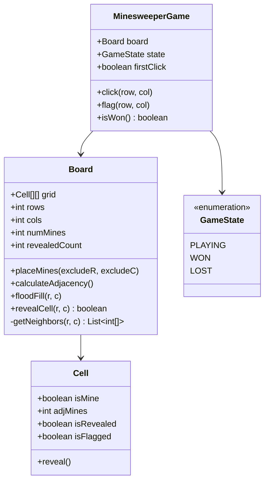

# Design Minesweeper

> **Difficulty**: Medium
> **Topics**: Flood Fill (DFS/BFS), 2D Grid, Recursion
> **Key Concepts**: Cell state machine, adjacency counting, flood-fill reveal algorithm.

---

## Real-Life Analogy

Think of a minefield on a military training map. The map is a grid of squares. Some squares hide a mine; most are safe. When a soldier carefully checks a square and finds it empty, they also learn **how many of its 8 neighbors contain mines** — that number is written on the square. If a safe square has **zero** neighboring mines, the soldier can safely reveal all its neighbors too, and their neighbors, in a chain reaction — a flood fill.

The game is exactly this: a 10×10 (or larger) grid where each cell is either a mine or a number. Click a mine → game over. Click a `0` → an ever-expanding safe zone opens up around you, stopping only when it hits numbered cells. Click a numbered cell → just reveal that one number.

The interesting engineering challenge: the **flood-fill** must expand efficiently without revisiting cells (no infinite loops), and the **first click should never be a mine** — which means we delay mine placement until after the first click.

---

## Phase 1: Requirements

### Functional Requirements
- Initialize an N×M grid with a configurable number of mines.
- Player clicks a cell to reveal it.
  - If mine: game over, reveal all mines.
  - If zero adjacent mines: recursively reveal all connected zero-cells and their numeric borders.
  - If N adjacent mines (N > 0): display the number.
- Player can flag/unflag a cell to mark a suspected mine.
- Win condition: all non-mine cells are revealed.
- First click guarantee: first revealed cell is never a mine.

### Non-Functional Requirements
- **Correctness**: Flood fill must terminate (no revisiting revealed cells).
- **Performance**: For a 1000×1000 grid, flood fill must use BFS (not recursive DFS) to avoid stack overflow.

### Concurrency Constraints
- Single-player game; no concurrency needed at the core.
- If building a multiplayer variant, use optimistic locking on cell state.

---

## Phase 2: Use Cases

### Actors
- **Player**: Clicks cells, toggles flags.
- **Game Engine**: Manages board state, evaluates win/loss, runs flood fill.

### UC1: Start Game
**Actor**: Player
**Flow**:
1. Player selects 10×10 board with 10 mines.
2. Engine creates grid of unrevealed cells (mines not placed yet).
3. Engine displays the masked grid.

### UC2: Player Clicks Cell
**Actor**: Player
**Flow**:
1. Player clicks `(r, c)`.
2. If this is the **first click**: place mines now, excluding `(r, c)` and its 8 neighbors.
3. Pre-compute `adjMines` count for all cells.
4. Reveal `(r, c)`:
   - If mine: mark `GAME_OVER`, reveal all mines.
   - If `adjMines == 0`: trigger BFS flood fill from `(r, c)`.
   - If `adjMines > 0`: reveal just this cell.
5. Check win condition: `totalCells - revealedCount == numMines`.

### UC3: Player Flags Cell
**Actor**: Player
**Flow**:
1. Player right-clicks `(r, c)`.
2. If unrevealed: toggle `isFlagged`. Flagged cells cannot be accidentally clicked.
3. No validation — player can flag any unrevealed cell, even non-mines.

---

## Phase 3: Class Diagram

### Core Entities
- **MinesweeperGame**: Controller. Manages game state (`PLAYING`, `WON`, `LOST`). Delegates to `Board`.
- **Board**: The 2D grid. Owns mine placement, adjacency calculation, and flood-fill logic.
- **Cell**: Single square. Value object tracking: `isMine`, `adjMines`, `isRevealed`, `isFlagged`.

### Key Design Decisions
- Mine placement is **deferred to first click** for fairness.
- `adjMines` is **pre-calculated** once after mine placement — O(1) lookup during play instead of recalculating on each reveal.
- Flood fill uses **BFS with a visited check** (`isRevealed`) to prevent infinite loops and stack overflow.



---

## Phase 4: Design Patterns Applied

### 1. State Pattern (Game States)
**What**: `MinesweeperGame` maintains a `GameState` enum (`PLAYING`, `WON`, `LOST`). All input is ignored unless state is `PLAYING`.
**Why**: Without this, you need `if (!gameOver)` checks scattered across every method. The State pattern centralizes transition logic — a click while `LOST` simply does nothing.

### 2. Template Method Pattern (Cell Reveal)
**What**: `revealCell()` defines the skeleton: check guards → reveal → branch on mine/zero/number. Subclasses (or overrides in variants) can change the mine behavior without touching flood-fill.
**Why**: The three outcomes of a click (mine, zero, number) share the same guard logic. Template method keeps this DRY.

### 3. Strategy Pattern (Difficulty)
**What**: A `DifficultyStrategy` interface provides `(rows, cols, mines)` for Beginner (9×9, 10), Intermediate (16×16, 40), Expert (30×16, 99).
**Why**: Avoids hardcoding difficulty parameters in the game constructor.

---

## Phase 5: Key Java Implementation

The interesting algorithm is the **BFS flood fill** — when a `0`-cell is revealed, expand to all reachable `0`-cells and their numeric borders, without revisiting. Recursive DFS risks stack overflow on large grids; BFS is safer.

```java
import java.util.*;

// --- Cell ---
class Cell {
    boolean isMine;
    int adjMines;
    boolean isRevealed;
    boolean isFlagged;
}

// --- Board ---
class Board {
    final Cell[][] grid;
    final int rows, cols, numMines;
    int revealedCount = 0;

    Board(int rows, int cols, int numMines) {
        this.rows = rows; this.cols = cols; this.numMines = numMines;
        grid = new Cell[rows][cols];
        for (int r = 0; r < rows; r++)
            for (int c = 0; c < cols; c++)
                grid[r][c] = new Cell();
    }

    // Called on first click — never places a mine on (safeR, safeC) or its 8 neighbors
    void placeMines(int safeR, int safeC) {
        Set<Integer> safeZone = new HashSet<>();
        for (int[] n : getNeighbors(safeR, safeC))
            safeZone.add(n[0] * cols + n[1]);
        safeZone.add(safeR * cols + safeC);

        Random rng = new Random();
        int placed = 0;
        while (placed < numMines) {
            int r = rng.nextInt(rows), c = rng.nextInt(cols);
            if (!grid[r][c].isMine && !safeZone.contains(r * cols + c)) {
                grid[r][c].isMine = true;
                placed++;
            }
        }
        calculateAdjacency();
    }

    void calculateAdjacency() {
        for (int r = 0; r < rows; r++) {
            for (int c = 0; c < cols; c++) {
                if (grid[r][c].isMine) continue;
                int count = 0;
                for (int[] n : getNeighbors(r, c))
                    if (grid[n[0]][n[1]].isMine) count++;
                grid[r][c].adjMines = count;
            }
        }
    }

    // Returns true if the cell was a mine (game over)
    boolean revealCell(int r, int c) {
        Cell cell = grid[r][c];
        if (cell.isRevealed || cell.isFlagged) return false;

        cell.isRevealed = true;
        revealedCount++;

        if (cell.isMine) return true; // Caller handles game-over

        // BFS flood fill: expand through all connected zero-cells
        if (cell.adjMines == 0) {
            floodFill(r, c);
        }
        return false;
    }

    // BFS flood fill — iterative to avoid stack overflow on large grids
    void floodFill(int startR, int startC) {
        Queue<int[]> queue = new LinkedList<>();
        queue.add(new int[]{startR, startC});

        while (!queue.isEmpty()) {
            int[] pos = queue.poll();
            int r = pos[0], c = pos[1];

            for (int[] n : getNeighbors(r, c)) {
                Cell neighbor = grid[n[0]][n[1]];
                if (neighbor.isRevealed || neighbor.isFlagged || neighbor.isMine) continue;

                neighbor.isRevealed = true;
                revealedCount++;

                // Only continue expanding through zero-cells
                // Numbered cells are revealed but act as a border — do not expand further
                if (neighbor.adjMines == 0) {
                    queue.add(new int[]{n[0], n[1]});
                }
            }
        }
    }

    void toggleFlag(int r, int c) {
        if (!grid[r][c].isRevealed)
            grid[r][c].isFlagged = !grid[r][c].isFlagged;
    }

    boolean isWon() {
        return revealedCount == (rows * cols - numMines);
    }

    // All 8 directions, bounds-checked
    List<int[]> getNeighbors(int r, int c) {
        int[] dr = {-1,-1,-1, 0, 0, 1, 1, 1};
        int[] dc = {-1, 0, 1,-1, 1,-1, 0, 1};
        List<int[]> result = new ArrayList<>();
        for (int i = 0; i < 8; i++) {
            int nr = r + dr[i], nc = c + dc[i];
            if (nr >= 0 && nr < rows && nc >= 0 && nc < cols)
                result.add(new int[]{nr, nc});
        }
        return result;
    }

    void printBoard(boolean revealAll) {
        for (int r = 0; r < rows; r++) {
            for (int c = 0; c < cols; c++) {
                Cell cell = grid[r][c];
                if (!revealAll && !cell.isRevealed) { System.out.print(cell.isFlagged ? "F " : ". "); }
                else if (cell.isMine)                { System.out.print("* "); }
                else if (cell.adjMines > 0)          { System.out.print(cell.adjMines + " "); }
                else                                 { System.out.print("  "); }
            }
            System.out.println();
        }
    }
}

// --- Game Controller ---
class MinesweeperGame {
    enum GameState { PLAYING, WON, LOST }

    private final Board board;
    private GameState state = GameState.PLAYING;
    private boolean firstClick = true;

    MinesweeperGame(int rows, int cols, int numMines) {
        board = new Board(rows, cols, numMines);
    }

    void click(int r, int c) {
        if (state != GameState.PLAYING) return;

        // Defer mine placement to first click for fairness
        if (firstClick) {
            board.placeMines(r, c);
            firstClick = false;
        }

        boolean hitMine = board.revealCell(r, c);

        if (hitMine) {
            state = GameState.LOST;
            System.out.println("BOOM! Game Over.");
            board.printBoard(true);
        } else if (board.isWon()) {
            state = GameState.WON;
            System.out.println("You Win!");
            board.printBoard(true);
        }
    }

    void flag(int r, int c) {
        if (state == GameState.PLAYING) board.toggleFlag(r, c);
    }

    void printBoard() { board.printBoard(false); }

    public static void main(String[] args) {
        MinesweeperGame game = new MinesweeperGame(9, 9, 10);
        game.click(4, 4); // First click — always safe
        game.printBoard();

        game.click(0, 0); // Might reveal a big flood-fill area or hit a mine
        game.printBoard();
    }
}
```

---

## Phase 6: Trade-offs and Extensions

### Trade-off: DFS (recursive) vs. BFS (iterative) for Flood Fill
| Approach | Pros | Cons |
|---|---|---|
| Recursive DFS | Simple, elegant code | Stack overflow on large grids (e.g., 1000×1000 open area) |
| Iterative BFS | Safe for any grid size | Slightly more code (explicit queue) |

Always use BFS for production. Java's default stack depth (~512 frames) limits recursive DFS to boards of roughly 500 open cells in the worst case.

### Extension: First-Click Safety
Implemented above — mine placement is deferred until after the first click, excluding the clicked cell and its 8 neighbors from mine placement. This guarantees the first reveal always produces a safe area.

### Extension: Infinite Minesweeper
If the board is unbounded, replace `Cell[][] grid` with `HashMap<String, Cell>` keyed by `"r,c"`. Generate cells on demand as the player explores. The flood-fill BFS works identically — it just reads from the map instead of the array.

### Extension: Chord Click
Standard Minesweeper feature: if a revealed numbered cell is surrounded by exactly N flags (where N equals its `adjMines` count), clicking it again reveals all unflagged neighbors. Implement as a `chordClick(r, c)` method that checks the flag count and bulk-reveals.

---

## SOLID Principles
- **S**: `Board` owns grid logic; `MinesweeperGame` owns game flow and state transitions.
- **O**: New cell behaviors (e.g., "Super Mine" that reveals a 5×5 area) extend `Cell` without touching `Board`.
- **L**: A `BigBoard` backed by a HashMap could substitute for the array-backed `Board` transparently.
- **D**: `MinesweeperGame` depends on `Board` abstraction — could be extracted to an interface for testing.
