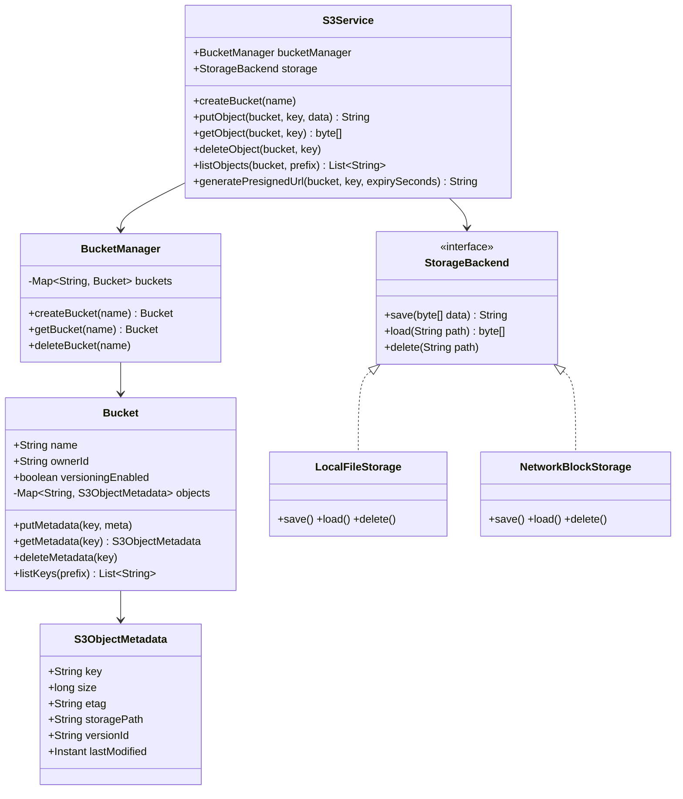

# Design AWS S3 (Object Storage)

> **Difficulty**: Hard
> **Topics**: Distributed Systems, Blob Storage, Metadata Management
> **Key Concepts**: Metadata/data separation, immutable objects, flat namespace, multipart upload.

---

## Real-Life Analogy

Imagine a **warehouse with infinite shelves**, organized by aisle (bucket) and shelf location (key). You walk in and say: "Put this box labeled `vacation.jpg` in aisle `my-photos`, shelf `2023/europe/`." The warehouse clerk stamps it with a receipt number (ETag), records where the box physically lives in the back room (storage path), and hands you a confirmation.

The key insight: the **box is immutable**. You never open an existing box and modify its contents. If you want an updated version, you bring a new box with the same label — the warehouse replaces the old one (or keeps both, if versioning is on). Two clerks handle different concerns: the **Metadata Clerk** manages the aisle/shelf index; the **Storage Clerk** moves physical boxes to physical shelves. They never do each other's job.

The hardest design challenge: uploading a 5 GB file without timing out — solved by **multipart upload** (split into 100 MB chunks, upload in parallel, assemble).

---

## Phase 1: Requirements

### Functional Requirements
- **Bucket operations**: Create, Delete, List buckets.
- **Object operations**: PutObject, GetObject, DeleteObject, ListObjects.
- **Versioning** (optional): Keep multiple versions of the same key; DeleteObject creates a "delete marker."
- **Pre-signed URLs**: Generate time-limited URLs for direct client access.
- **Lifecycle policies**: Auto-delete or archive objects after N days.
- **Multipart Upload**: For files larger than a configurable threshold (e.g., 100 MB).

### Non-Functional Requirements
- **Durability**: 11 nines (99.999999999%) — data must survive disk and node failures.
- **Consistency**: Strong read-after-write consistency (S3 now provides this).
- **Throughput**: Handle millions of PUT/GET requests per second across buckets.

### Concurrency Constraints
- Concurrent writes to the same key: last-writer-wins (no locking by default).
- Concurrent multipart uploads: identified by `uploadId`; parts can be uploaded in any order.
- Bucket name uniqueness: global; enforce with a distributed lock or compare-and-swap on the metadata store.

---

## Phase 2: Use Cases

### Actors
- **User/Service**: Uploads or downloads objects via REST API.
- **Storage System**: Manages physical byte storage (disk/SSD, potentially distributed across nodes).
- **Metadata System**: Manages bucket/object index, versioning, ACLs.

### UC1: Create Bucket
**Actor**: User
**Flow**:
1. User calls `createBucket("my-photos")`.
2. System checks bucket name is globally unique (no other user owns it).
3. System records new bucket in Metadata Store with owner, region, creation time.
4. Returns success.

### UC2: Put Object
**Actor**: User
**Flow**:
1. User calls `putObject("my-photos", "vacation.jpg", bytes)`.
2. System validates bucket exists and user has write permission.
3. Storage system streams bytes to a physical location; generates a content-addressed path.
4. System records metadata: `{bucket: "my-photos", key: "vacation.jpg", path: "/node3/disk2/abc123", size: 4MB, etag: "md5hash", version: "v1"}`.
5. Returns `ETag` as confirmation.

### UC3: Get Object
**Actor**: User
**Flow**:
1. User calls `getObject("my-photos", "vacation.jpg")`.
2. Metadata lookup returns `storagePath`.
3. Storage system reads bytes from that path.
4. Returns byte stream.

### UC4: Multipart Upload (Large File)
**Actor**: User
**Flow**:
1. `initiateMultipartUpload()` → returns `uploadId`.
2. Client uploads parts in parallel: `uploadPart(uploadId, partNumber, bytes)` → returns per-part `ETag`.
3. `completeMultipartUpload(uploadId, [(partNum, ETag)])` → server assembles metadata; physical data already on disk.
4. Object becomes visible atomically when complete is called.

---

## Phase 3: Class Diagram

### Core Entities
- **S3Service**: Facade hiding metadata + storage coordination.
- **BucketManager**: Owns bucket-level metadata; enforces name uniqueness.
- **Bucket**: Container for object metadata.
- **S3ObjectMetadata**: Per-object record (key, size, ETag, storagePath, version).
- **StorageBackend**: Interface for physical byte storage — swappable (local disk, HDFS, network).

### Key Design Decisions
- **Metadata and storage are separate subsystems** — this is the fundamental S3 design insight. Metadata lives in a fast K-V store (like DynamoDB); raw bytes live on cheap disk.
- `StorageBackend` is an interface (Strategy pattern) — lets you swap `LocalFileStorage` for `DistributedBlockStorage` without touching `S3Service`.
- Objects are **immutable** — `putObject` always creates a new physical entry; the metadata pointer is swapped atomically.



---

## Phase 4: Design Patterns Applied

### 1. Strategy Pattern (StorageBackend)
**What**: `StorageBackend` is an interface. `S3Service` is constructed with a concrete implementation injected.
**Why**: Storage tiers change — you might use local SSDs in dev, HDFS in production, and Glacier (tape) for archival. Swapping the backend requires zero changes to `S3Service` or `Bucket`.

### 2. Facade Pattern (S3Service)
**What**: `S3Service` provides a simple six-method API that hides the coordination between `BucketManager` (metadata) and `StorageBackend` (bytes).
**Why**: Without the facade, callers would need to know to write bytes first, then update metadata. The facade enforces this order and handles rollback if metadata write fails after a successful blob write.

### 3. Flyweight / Content-Addressed Storage
**What**: When versioning is enabled, if two versions of an object have identical content (same MD5), the physical blob is stored once. Both version records point to the same `storagePath`.
**Why**: Massive storage savings. Git uses this exact technique — unchanged files between commits share the same blob.

---

## Phase 5: Key Java Implementation

The interesting part is the **separation of metadata and blob writes**, including the rollback case where the blob write succeeds but the metadata write fails (data integrity).

```java
import java.io.*;
import java.nio.file.*;
import java.security.MessageDigest;
import java.time.Instant;
import java.util.*;
import java.util.concurrent.ConcurrentHashMap;

// --- StorageBackend interface (Strategy) ---
interface StorageBackend {
    String save(byte[] data) throws IOException;
    byte[] load(String pathId) throws IOException;
    void delete(String pathId) throws IOException;
}

// --- Local file system implementation ---
class LocalFileStorage implements StorageBackend {
    private final String rootDir;

    LocalFileStorage(String rootDir) throws IOException {
        this.rootDir = rootDir;
        Files.createDirectories(Paths.get(rootDir));
    }

    @Override
    public String save(byte[] data) throws IOException {
        // Content-addressed: filename = MD5 of content (deduplication)
        String contentHash = md5(data);
        Path path = Paths.get(rootDir, contentHash);
        if (!Files.exists(path)) { // Don't overwrite if identical content already stored
            Files.write(path, data);
        }
        return path.toString();
    }

    @Override
    public byte[] load(String pathId) throws IOException {
        return Files.readAllBytes(Paths.get(pathId));
    }

    @Override
    public void delete(String pathId) throws IOException {
        Files.deleteIfExists(Paths.get(pathId));
    }

    private String md5(byte[] data) {
        try {
            byte[] hash = MessageDigest.getInstance("MD5").digest(data);
            StringBuilder sb = new StringBuilder();
            for (byte b : hash) sb.append(String.format("%02x", b));
            return sb.toString();
        } catch (Exception e) { throw new RuntimeException(e); }
    }
}

// --- Metadata entities ---
class S3ObjectMetadata {
    final String key;
    final long size;
    final String etag;
    final String storagePath;
    final String versionId;
    final Instant lastModified;

    S3ObjectMetadata(String key, long size, String etag, String storagePath) {
        this.key = key; this.size = size; this.etag = etag;
        this.storagePath = storagePath;
        this.versionId = UUID.randomUUID().toString().substring(0, 8);
        this.lastModified = Instant.now();
    }
}

class Bucket {
    final String name;
    // In production: this map lives in DynamoDB, not in-process memory
    private final ConcurrentHashMap<String, S3ObjectMetadata> objects = new ConcurrentHashMap<>();

    Bucket(String name) { this.name = name; }

    void putMetadata(String key, S3ObjectMetadata meta) { objects.put(key, meta); }
    S3ObjectMetadata getMetadata(String key) { return objects.get(key); }
    boolean deleteMetadata(String key) { return objects.remove(key) != null; }

    List<String> listKeys(String prefix) {
        return objects.keySet().stream()
            .filter(k -> prefix == null || k.startsWith(prefix))
            .sorted()
            .toList();
    }
}

// --- S3 Service (Facade) ---
public class S3Service {
    private final StorageBackend storage;
    private final ConcurrentHashMap<String, Bucket> buckets = new ConcurrentHashMap<>();

    public S3Service(StorageBackend storage) { this.storage = storage; }

    // --- Bucket operations ---

    public void createBucket(String name) {
        if (buckets.putIfAbsent(name, new Bucket(name)) != null)
            throw new IllegalArgumentException("Bucket already exists: " + name);
        System.out.println("Bucket created: " + name);
    }

    // --- Object operations ---

    public String putObject(String bucketName, String key, byte[] data) throws IOException {
        Bucket bucket = getBucketOrThrow(bucketName);

        // 1. Write bytes to storage (may fail — no metadata written yet)
        String storagePath = storage.save(data);
        String etag = Integer.toHexString(Arrays.hashCode(data));

        // 2. Write metadata atomically (ConcurrentHashMap.put is atomic)
        //    If this step fails, the orphaned blob will be cleaned up by a lifecycle job
        S3ObjectMetadata meta = new S3ObjectMetadata(key, data.length, etag, storagePath);
        bucket.putMetadata(key, meta);

        System.out.printf("PUT s3://%s/%s (%d bytes, etag=%s)%n", bucketName, key, data.length, etag);
        return etag;
    }

    public byte[] getObject(String bucketName, String key) throws IOException {
        Bucket bucket = getBucketOrThrow(bucketName);
        S3ObjectMetadata meta = bucket.getMetadata(key);
        if (meta == null) throw new NoSuchElementException("Key not found: " + key);

        // 1. Read metadata (fast — in-process or K-V store)
        // 2. Read blob from storage (potentially network I/O)
        return storage.load(meta.storagePath);
    }

    public void deleteObject(String bucketName, String key) throws IOException {
        Bucket bucket = getBucketOrThrow(bucketName);
        S3ObjectMetadata meta = bucket.getMetadata(key);
        if (meta == null) return; // Idempotent delete

        // Delete metadata first — prevents new readers from finding the object
        bucket.deleteMetadata(key);
        // Then delete physical data (async in production — background GC job)
        storage.delete(meta.storagePath);
        System.out.printf("DELETE s3://%s/%s%n", bucketName, key);
    }

    public List<String> listObjects(String bucketName, String prefix) {
        return getBucketOrThrow(bucketName).listKeys(prefix);
    }

    // Pre-signed URL: encode bucket+key+expiry+signature into a URL token
    // In production: HMAC-SHA256 signed with a secret key; server validates on request
    public String generatePresignedUrl(String bucketName, String key, int expirySeconds) {
        long expiry = Instant.now().getEpochSecond() + expirySeconds;
        return String.format("https://s3.example.com/%s/%s?expiry=%d&sig=HMAC(%s/%s/%d)",
            bucketName, key, expiry, bucketName, key, expiry);
    }

    private Bucket getBucketOrThrow(String name) {
        Bucket b = buckets.get(name);
        if (b == null) throw new IllegalArgumentException("No such bucket: " + name);
        return b;
    }

    // --- Demo ---
    public static void main(String[] args) throws IOException {
        S3Service s3 = new S3Service(new LocalFileStorage("./s3_data"));

        s3.createBucket("my-photos");
        s3.createBucket("backups");

        // Put objects
        byte[] photo = "JPEG binary data here".getBytes();
        String etag = s3.putObject("my-photos", "2023/europe/paris.jpg", photo);
        System.out.println("ETag: " + etag);

        // Overwrite same key (immutable — new blob written, metadata pointer updated)
        s3.putObject("my-photos", "2023/europe/paris.jpg", "UPDATED JPEG".getBytes());

        // List with prefix
        s3.putObject("my-photos", "2023/asia/tokyo.jpg", "JPEG2".getBytes());
        s3.putObject("my-photos", "2022/london.jpg", "JPEG3".getBytes());
        System.out.println("2023 photos: " + s3.listObjects("my-photos", "2023/"));

        // Get
        byte[] retrieved = s3.getObject("my-photos", "2023/asia/tokyo.jpg");
        System.out.println("Retrieved: " + new String(retrieved));

        // Pre-signed URL
        System.out.println(s3.generatePresignedUrl("my-photos", "2023/europe/paris.jpg", 3600));

        // Delete
        s3.deleteObject("my-photos", "2022/london.jpg");
        System.out.println("After delete: " + s3.listObjects("my-photos", null));
    }
}
```

---

## Phase 6: Trade-offs and Extensions

### Trade-off: Strong vs. eventual consistency
| Consistency model | Read-after-write | Trade-off |
|---|---|---|
| Strong (S3 since 2020) | Always sees latest write | Slightly higher latency |
| Eventual | May see stale data briefly | Higher availability, lower latency |

S3 achieves strong consistency by routing all reads for a key through the same metadata server (primary), not a replica.

### Extension: Versioning
When versioning is enabled, `putObject` generates a new `versionId` instead of overwriting the metadata record. `getObject` returns the latest version unless `?versionId=X` is specified. `deleteObject` creates a "delete marker" version — the data is not actually deleted until explicitly requested.

### Extension: Multipart Upload for Large Files
```
initiateMultipartUpload(bucket, key)          → uploadId
uploadPart(uploadId, partNum, bytes)          → partETag (per chunk)
completeMultipartUpload(uploadId, partETags)  → final ETag (metadata assembled)
abortMultipartUpload(uploadId)                → clean up orphaned parts
```
Parts are written to storage individually. `complete` only updates metadata — it doesn't reassemble bytes (they're concatenated on read via range headers, or physically assembled asynchronously).

### Extension: Lifecycle Policies
A background `LifecycleJob` (runs daily) scans object metadata for keys matching a rule (e.g., `prefix="logs/", age>30days`). It transitions them to Glacier or deletes them. Rules are stored as JSON configuration on the bucket.

---

## SOLID Principles
- **S**: `StorageBackend` handles bytes; `BucketManager` handles metadata; `S3Service` handles coordination.
- **O**: Add `GlacierBackend` by implementing `StorageBackend` — zero changes to `S3Service`.
- **L**: `LocalFileStorage` and `NetworkBlockStorage` are interchangeable anywhere `StorageBackend` is expected.
- **I**: `StorageBackend` has a minimal interface (`save`/`load`/`delete`) — no fat interface.
- **D**: `S3Service` depends on `StorageBackend` abstraction injected at construction time.
