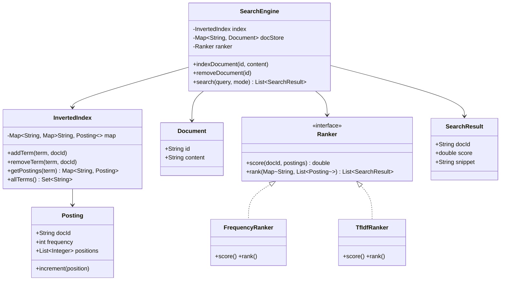

# Design Search Engine (Mini Google)

> **Difficulty**: Hard
> **Topics**: Inverted Index, TF-IDF, Ranking, Tokenization
> **Key Concepts**: Inverted index as the core data structure, multi-keyword intersection/union, TF-IDF scoring.

---

## Real-Life Analogy

Open any textbook and flip to the **back-of-book index**. You see entries like:

```
banana    ...  12, 47, 103, 218
recipe    ...  47, 103, 312
```

This is an inverted index. Instead of scanning every page to find where "banana" appears, you look it up directly and get the exact page list. Building the index means reading every page, extracting every word, and recording which page it appeared on.

The **Indexer** is the person who built the back-of-book index. The **Searcher** is you flipping to the back. A search for "banana recipe" means: find pages with "banana" AND pages with "recipe" → intersect the two lists → pages 47 and 103 are your results. Ranking them means: page 47 mentions "banana" 5 times and "recipe" 3 times; page 103 mentions each only once → page 47 ranks higher.

The architectural insight: **read performance is everything**. The index is built offline (slow, expensive) so that queries are answered in milliseconds.

---

## Phase 1: Requirements

### Functional Requirements
- **Index a document**: Accept a document ID and text content; extract tokens and update the index.
- **Keyword search**: Support single-keyword and multi-keyword queries.
  - AND query: return documents containing ALL keywords.
  - OR query: return documents containing ANY keyword.
- **Ranked results**: Sort results by relevance score (frequency count, or TF-IDF).
- **Remove document**: Delete a document and its entries from the index.

### Non-Functional Requirements
- **Latency**: Queries must return in <100ms even with millions of indexed documents.
- **Throughput**: High read QPS (search is far more frequent than indexing).
- **Consistency**: Index updates may be slightly delayed (near-real-time, like Elasticsearch).

### Concurrency Constraints
- Multiple threads can index new documents concurrently: use `ConcurrentHashMap` or segment locks on the index.
- Reads and writes can be concurrent: Elasticsearch uses **immutable segments** — new documents go to a new in-memory segment; segments are merged in the background.

---

## Phase 2: Use Cases

### Actors
- **User**: Types a search query.
- **Publisher/Crawler**: Submits documents for indexing.
- **Search Engine**: Indexes, scores, and ranks documents.

### UC1: Index a Document
**Actor**: Publisher
**Flow**:
1. Publisher submits `{id: "doc1", content: "Apple banana smoothie recipe"}`.
2. Tokenizer lowercases and splits: `["apple", "banana", "smoothie", "recipe"]`.
3. For each token, `InvertedIndex` records: `token → {docId, frequency}`.
4. Document is stored in the document store for snippet retrieval.

### UC2: Search a Query
**Actor**: User
**Flow**:
1. User searches `"banana recipe"`.
2. Query parser splits into tokens: `["banana", "recipe"]`.
3. For each token, look up the posting list in `InvertedIndex`.
4. Intersect posting lists (AND) or union (OR).
5. Score each result document (sum of TF scores for matched tokens).
6. Sort by score descending; return top-K results.

### UC3: Remove a Document
**Actor**: Publisher
**Flow**:
1. Publisher calls `removeDocument("doc1")`.
2. Engine scans all posting lists and removes entries for `doc1`.
3. Document is removed from the document store.
   - In real Elasticsearch: documents are soft-deleted (marked, not removed); compact on merge.

---

## Phase 3: Class Diagram

### Core Entities
- **SearchEngine**: Facade. Coordinates `Indexer`, `Searcher`, `Ranker`.
- **InvertedIndex**: Core data structure. `Map<token, Map<docId, Posting>>`.
- **Posting**: Per-document metadata for a token (frequency, position list).
- **Document**: Raw content + ID. Stored separately from the index.
- **Ranker**: Strategy interface for scoring/sorting results.

### Key Design Decisions
- The index maps `word → {docId → Posting}` (inner map keyed by docId) rather than `word → List<Posting>` — this enables O(1) frequency increment during indexing and O(1) docId lookup during AND intersection.
- `Ranker` is a Strategy — swapping from frequency-count to TF-IDF to BM25 requires only replacing the `Ranker` implementation.
- AND search uses **shortest-posting-list-first**: intersect the rarest word first to prune early.



---

## Phase 4: Design Patterns Applied

### 1. Inverted Index (Core Data Structure)
**What**: `Map<String, Map<String, Posting>>` — for each word, a map from docId to its posting (frequency + positions).
**Why**: Transforms search from O(N×D) (scan every word in every document) to O(1) per token lookup. This is why Google can search billions of pages in under 100ms. Without an inverted index, you're doing `grep` over the entire corpus on every query.

### 2. Strategy Pattern (Ranker)
**What**: `Ranker` interface with `FrequencyRanker` (simple sum of term frequencies) and `TfIdfRanker` (TF×IDF scoring).
**Why**: Ranking algorithms are the key differentiator between search engines and evolve continuously. Making `Ranker` pluggable lets you A/B test BM25 vs TF-IDF vs your custom model without touching the indexing or retrieval logic.

### 3. Facade Pattern (SearchEngine)
**What**: `SearchEngine` hides the internal pipeline: tokenize → index lookup → intersection/union → score → sort.
**Why**: The caller just calls `search("banana recipe", Mode.AND)`. They don't need to know about posting lists, TF-IDF, or intersection algorithms.

---

## Phase 5: Key Java Implementation

The interesting parts: (a) the AND intersection using shortest-posting-list-first optimization, and (b) TF-IDF scoring.

```java
import java.util.*;
import java.util.concurrent.ConcurrentHashMap;
import java.util.stream.*;

// --- Posting: one word's presence in one document ---
class Posting {
    final String docId;
    int frequency;
    final List<Integer> positions = new ArrayList<>();

    Posting(String docId, int position) {
        this.docId = docId;
        this.frequency = 1;
        positions.add(position);
    }

    void increment(int position) { frequency++; positions.add(position); }
}

// --- Inverted Index ---
class InvertedIndex {
    // word → { docId → Posting }
    private final ConcurrentHashMap<String, ConcurrentHashMap<String, Posting>> map = new ConcurrentHashMap<>();

    void addTerm(String term, String docId, int position) {
        map.computeIfAbsent(term, k -> new ConcurrentHashMap<>())
           .compute(docId, (id, existing) -> {
               if (existing == null) return new Posting(docId, position);
               existing.increment(position);
               return existing;
           });
    }

    void removeTerm(String term, String docId) {
        ConcurrentHashMap<String, Posting> postings = map.get(term);
        if (postings != null) postings.remove(docId);
    }

    // Returns docId → Posting map for a term (empty map if term not found)
    Map<String, Posting> getPostings(String term) {
        return map.getOrDefault(term.toLowerCase(), new ConcurrentHashMap<>());
    }

    int documentFrequency(String term) {
        return map.getOrDefault(term, new ConcurrentHashMap<>()).size();
    }

    Set<String> allTerms() { return map.keySet(); }
}

// --- Search result ---
record SearchResult(String docId, double score) {}

// --- Search modes ---
enum SearchMode { AND, OR }

// --- Search Engine (Facade) ---
public class SearchEngine {
    private final InvertedIndex index = new InvertedIndex();
    private final Map<String, String> docStore = new ConcurrentHashMap<>(); // docId → content
    private int totalDocs = 0;

    // --- Indexing ---

    public void indexDocument(String id, String content) {
        docStore.put(id, content);
        totalDocs++;

        String[] tokens = tokenize(content);
        for (int pos = 0; pos < tokens.length; pos++) {
            index.addTerm(tokens[pos], id, pos);
        }
        System.out.println("Indexed: " + id + " (" + tokens.length + " tokens)");
    }

    public void removeDocument(String id) {
        if (!docStore.containsKey(id)) return;
        docStore.remove(id);
        totalDocs--;
        // Remove this doc from every term's posting list
        for (String term : index.allTerms()) {
            index.removeTerm(term, id);
        }
    }

    // --- Search ---

    public List<SearchResult> search(String query, SearchMode mode) {
        String[] queryTokens = tokenize(query);
        if (queryTokens.length == 0) return Collections.emptyList();

        Map<String, Double> docScores;
        if (mode == SearchMode.AND) {
            docScores = andSearch(queryTokens);
        } else {
            docScores = orSearch(queryTokens);
        }

        return docScores.entrySet().stream()
            .map(e -> new SearchResult(e.getKey(), e.getValue()))
            .sorted(Comparator.comparingDouble(SearchResult::score).reversed())
            .collect(Collectors.toList());
    }

    // AND: only documents containing ALL query terms
    // Optimization: start with the rarest term to prune candidate set early
    private Map<String, Double> andSearch(String[] tokens) {
        // Sort tokens by posting list size (ascending) — rarest term first
        List<String> sortedTokens = Arrays.stream(tokens)
            .sorted(Comparator.comparingInt(t -> index.getPostings(t).size()))
            .collect(Collectors.toList());

        // Start with the rarest term's document set
        Set<String> candidates = new HashSet<>(index.getPostings(sortedTokens.get(0)).keySet());

        // Intersect with each subsequent term's document set
        for (int i = 1; i < sortedTokens.size(); i++) {
            candidates.retainAll(index.getPostings(sortedTokens.get(i)).keySet());
            if (candidates.isEmpty()) return Collections.emptyMap(); // Early termination
        }

        // Score surviving candidates using TF-IDF
        return scoreDocs(candidates, tokens);
    }

    // OR: documents containing ANY query term
    private Map<String, Double> orSearch(String[] tokens) {
        Set<String> candidates = new HashSet<>();
        for (String token : tokens) {
            candidates.addAll(index.getPostings(token).keySet());
        }
        return scoreDocs(candidates, tokens);
    }

    // TF-IDF scoring: for each candidate doc, sum TF-IDF for each query token
    private Map<String, Double> scoreDocs(Set<String> candidates, String[] tokens) {
        Map<String, Double> scores = new HashMap<>();
        for (String docId : candidates) {
            double score = 0.0;
            for (String token : tokens) {
                Map<String, Posting> postings = index.getPostings(token);
                Posting p = postings.get(docId);
                if (p == null) continue;

                // TF = frequency in this doc (normalized by doc length)
                String docContent = docStore.get(docId);
                int docLength = docContent == null ? 1 : tokenize(docContent).length;
                double tf = (double) p.frequency / docLength;

                // IDF = log(totalDocs / docsContainingTerm) — penalizes common words
                int df = index.documentFrequency(token);
                double idf = Math.log((double) (totalDocs + 1) / (df + 1));

                score += tf * idf;
            }
            if (score > 0) scores.put(docId, score);
        }
        return scores;
    }

    private String[] tokenize(String text) {
        return Arrays.stream(text.toLowerCase().split("[^a-z0-9]+"))
            .filter(t -> !t.isEmpty())
            .toArray(String[]::new);
    }

    // --- Demo ---
    public static void main(String[] args) {
        SearchEngine engine = new SearchEngine();

        engine.indexDocument("doc1", "Apple banana smoothie recipe");
        engine.indexDocument("doc2", "Banana chocolate cake recipe recipe");  // "recipe" twice
        engine.indexDocument("doc3", "Apple pie recipe from grandma");
        engine.indexDocument("doc4", "Chocolate banana ice cream");
        engine.indexDocument("doc5", "Java programming language tutorial");

        System.out.println("\n=== AND Search: 'banana recipe' ===");
        // Should return: doc1, doc2, doc3 (all have both words)
        engine.search("banana recipe", SearchMode.AND)
            .forEach(r -> System.out.printf("  %s (score=%.4f)%n", r.docId(), r.score()));

        System.out.println("\n=== OR Search: 'banana recipe' ===");
        // Should return: doc1, doc2, doc3, doc4 (any has banana or recipe)
        engine.search("banana recipe", SearchMode.OR)
            .forEach(r -> System.out.printf("  %s (score=%.4f)%n", r.docId(), r.score()));

        System.out.println("\n=== AND Search: 'java' ===");
        engine.search("java", SearchMode.AND)
            .forEach(r -> System.out.printf("  %s (score=%.4f)%n", r.docId(), r.score()));
    }
}
```

---

## Phase 6: Trade-offs and Extensions

### Trade-off: Frequency count vs. TF-IDF vs. BM25
| Algorithm | Pros | Cons |
|---|---|---|
| Raw frequency | Simple, fast | Common words ("the", "a") dominate results |
| TF-IDF | Penalizes common words | Doesn't account for document length variation well |
| BM25 | Industry standard (Elasticsearch default) | More complex formula, needs tuning |

### Extension: Phrase Search ("banana recipe" as a phrase, not just co-occurrence)
Use **position lists** stored in `Posting`. For query `"banana recipe"`, look up positions for "banana" in doc1 = `[1]`, "recipe" in doc1 = `[3]`. Check if any position for "recipe" = any position for "banana" + 1. If yes, it's a phrase match.

### Extension: Distributed Index (Shard by Document)
- **Horizontal partitioning**: Each shard indexes a subset of documents (e.g., shard 1: doc1–doc1M, shard 2: doc1M+1–doc2M).
- A query fan-outs to all shards in parallel; results are merged and re-ranked.
- **Advantage**: Linear throughput scaling.

### Extension: Near-Real-Time Indexing (Lucene approach)
New documents go into an in-memory **segment** (a small inverted index). The background thread periodically flushes and merges in-memory segments to disk. Queries search all segments (in-memory + on-disk) and merge results. Deleted documents are marked with a bitset; physically removed during merge.

---

## Concurrency Depth

### ReentrantReadWriteLock for the Inverted Index

The inverted index is a classic read-heavy data structure: queries (reads) happen 100× more often than indexing (writes). `ConcurrentHashMap` on the outer map is correct, but individual posting-list mutations need coordination:

```java
class InvertedIndex {
    // Per-term ReadWriteLock: reads on different terms don't block each other
    private final ConcurrentHashMap<String, ReentrantReadWriteLock> termLocks =
        new ConcurrentHashMap<>();
    private final ConcurrentHashMap<String, List<Posting>> index = new ConcurrentHashMap<>();

    private ReentrantReadWriteLock lockFor(String term) {
        return termLocks.computeIfAbsent(term, k -> new ReentrantReadWriteLock());
    }

    public List<Posting> getPostings(String term) {
        ReentrantReadWriteLock lock = lockFor(term);
        lock.readLock().lock();
        try {
            List<Posting> postings = index.get(term);
            return postings == null ? List.of() : new ArrayList<>(postings); // defensive copy
        } finally {
            lock.readLock().unlock();
        }
    }

    public void addDocument(int docId, List<String> tokens) {
        Map<String, Integer> termFreq = computeTermFrequencies(tokens);
        for (Map.Entry<String, Integer> entry : termFreq.entrySet()) {
            String term = entry.getKey();
            ReentrantReadWriteLock lock = lockFor(term);
            lock.writeLock().lock();
            try {
                index.computeIfAbsent(term, k -> new ArrayList<>())
                     .add(new Posting(docId, entry.getValue()));
            } finally {
                lock.writeLock().unlock();
            }
        }
    }
}
```

**Why per-term locks:** a global `ReentrantReadWriteLock` on the entire index would serialize all writes — indexing "apple" blocks indexing "orange". Per-term locks allow independent terms to be indexed concurrently (fine-grained locking).

### Semaphore for Bounded Query Concurrency

Search query execution is CPU-intensive (posting list intersection, scoring). Cap concurrent queries to prevent CPU saturation:

```java
public class SearchEngine {
    // 2× CPU count: queries have some I/O (disk reads for large posting lists)
    private final Semaphore queryPermits =
        new Semaphore(Runtime.getRuntime().availableProcessors() * 2, true);

    public List<Document> search(String queryText) {
        queryPermits.acquire();
        try {
            return executeQuery(queryText);
        } finally {
            queryPermits.release();
        }
    }
}
```

### Thread-Pool Sizing for Parallel Segment Search

In a multi-segment index (Lucene-style), query each segment in parallel:

```java
// Query execution: mostly CPU (posting list merge + scoring), some disk I/O
// Segments typically fit in OS page cache → effectively CPU-bound
// N_threads = N_cpu + 1 (CPU-bound)
int segmentThreads = Runtime.getRuntime().availableProcessors() + 1;
ExecutorService segmentSearchExecutor = Executors.newFixedThreadPool(segmentThreads);

public List<Document> search(String query) {
    List<Future<List<Document>>> futures = segments.stream()
        .map(seg -> segmentSearchExecutor.submit(() -> seg.search(query)))
        .collect(Collectors.toList());
    // Merge results from all segments, re-rank globally
    return mergeAndRank(futures.stream().map(this::getResult).collect(Collectors.toList()));
}
```

---

## SOLID Principles
- **S**: `InvertedIndex` owns data structure operations; `SearchEngine` owns query orchestration; `Ranker` owns scoring.
- **O**: New ranking algorithms extend `Ranker` interface — no existing code changes.
- **L**: `TfIdfRanker` can substitute for `FrequencyRanker` anywhere `Ranker` is used.
- **I**: `Ranker` interface has only what's needed — `score()` and `rank()`.
- **D**: `SearchEngine` depends on `Ranker` abstraction injected at construction time.
