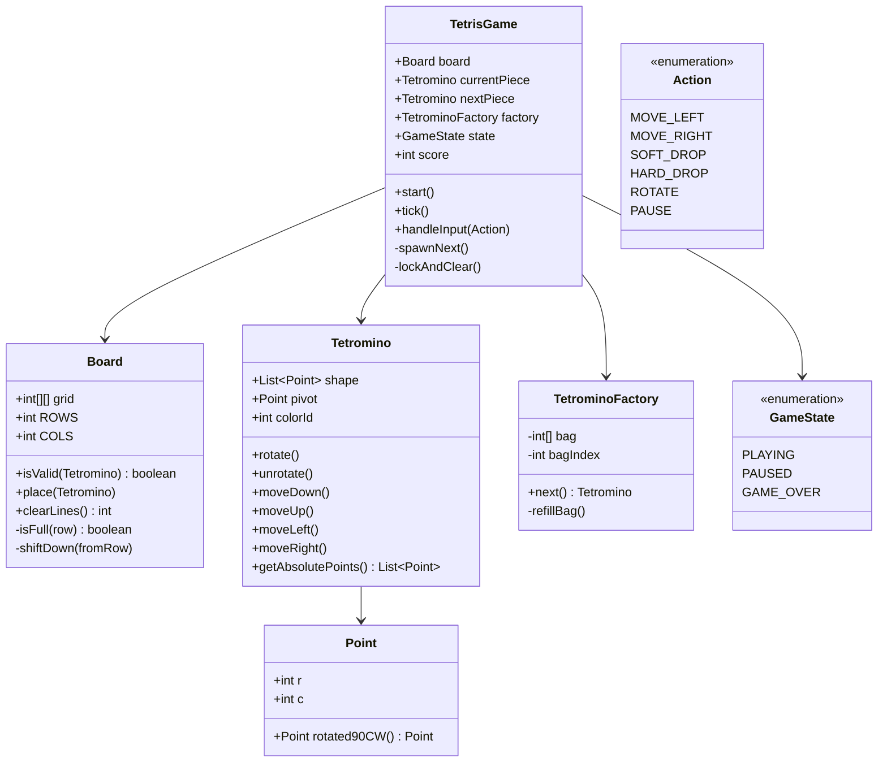

# Design Tetris Game

> **Difficulty**: Medium
> **Topics**: Matrix Manipulation, Game Loop, Factory Pattern
> **Key Concepts**: Rotation matrix math, collision detection, line clearing, game loop separation.

---

## Real-Life Analogy

Picture a narrow well (the board) with blocks falling from the top. Each block is a **tetromino** — one of 7 fixed shapes made of 4 squares (I, O, T, S, Z, J, L). Gravity pulls the active piece down one row every 500ms. You can slide it left/right and rotate it before it lands. When a piece can't fall any further, it locks in place. If an entire row is now full, that row disappears and everything above shifts down.

The engineering is all in three questions:
1. **Is this move valid?** Check all 4 squares of the piece against the board's walls and existing locked blocks.
2. **How do you rotate?** Apply a 90-degree clockwise rotation matrix to each relative coordinate: `(r, c) → (c, -r)`.
3. **How do you clear a line?** Scan bottom-to-top; when a full row is found, remove it and shift everything down.

The game loop is the heartbeat: every tick, the piece moves down one row. If it collides, it locks. If rows are full, clear them. Spawn the next piece.

---

## Phase 1: Requirements

### Functional Requirements
- 7 standard tetrominoes: I, O, T, S, Z, J, L — each with a distinct shape and color.
- Movement: left, right, soft drop (down one), hard drop (instant bottom).
- Rotation: 90 degrees clockwise. "Wall kick" if rotation would go out of bounds.
- Line clear: full rows vanish; blocks above fall down. Score multiplier for multi-line clears.
- Game over: when a newly spawned piece immediately collides (board is full).
- Next piece preview.

### Non-Functional Requirements
- **Frame rate**: 60 FPS rendering; gravity tick is independent (configurable per level).
- **Determinism**: Given the same random seed, the piece sequence must be identical (for replays and AI training).
- **Separation**: Game logic (pure Java) must be fully decoupled from rendering (Swing/JavaFX) so it's testable.

### Concurrency Constraints
- Input events (key presses) and the gravity tick run in separate threads.
- All board mutations must be synchronized or funneled through a single game loop thread.
- Standard pattern: input events are enqueued; the game loop dequeues and processes them sequentially on each tick.

---

## Phase 2: Use Cases

### Actors
- **Player**: Issues move/rotate/drop commands.
- **Game Loop (System)**: Fires gravity ticks, processes input queue, updates board state, triggers rendering.

### UC1: Gravity Tick
**Actor**: Game Loop
**Flow**:
1. Timer fires (every `gravityIntervalMs`).
2. Attempt to move active piece down 1 row.
3. If valid (no collision): update piece position; render.
4. If invalid (collision): undo move; **lock piece** to board; check for full lines; clear them; spawn next piece.
5. If newly spawned piece immediately collides: transition to `GAME_OVER`.

### UC2: Player Rotates Piece
**Actor**: Player
**Flow**:
1. Player presses Up/W.
2. Game loop dequeues `ROTATE` action.
3. Apply rotation matrix to piece's relative coordinates.
4. Check validity of new positions.
5. If valid: commit rotation.
6. If invalid: try wall kicks (shift piece ±1 column and recheck). If all kicks fail: discard rotation.

### UC3: Player Hard Drops
**Actor**: Player
**Flow**:
1. Player presses Space.
2. Move piece down repeatedly until collision.
3. Lock piece immediately (skip soft-landing delay).
4. Award bonus score based on drop distance.

---

## Phase 3: Class Diagram

### Core Entities
- **TetrisGame**: Top-level controller. Owns game state, game loop, score.
- **Board**: 20×10 grid of locked cells. Owns collision detection, locking, line clearing.
- **Tetromino**: Active falling piece. Owns its shape (list of relative coordinates), pivot position, and rotation logic.
- **TetrominoFactory**: Creates the 7 shapes. Can use a "7-bag" shuffle for fair piece distribution.
- **Point**: Relative coordinate within a piece's shape.

### Key Design Decisions
- Tetromino stores **relative coordinates** around a pivot `(0, 0)`. The absolute position on the board is `pivot + relative`. Rotation is applied only to relative coordinates.
- The board stores only **locked** cells. The active piece is a separate object overlaid during rendering.
- `clearLines()` scans bottom-to-top to avoid index confusion when rows shift down.



---

## Phase 4: Design Patterns Applied

### 1. Factory Pattern (TetrominoFactory)
**What**: `TetrominoFactory.next()` creates and returns one of the 7 tetrominoes, using a "7-bag" shuffle to guarantee each piece appears exactly once every 7 spawns.
**Why**: Piece creation is complex (7 shapes × 4 rotations, distinct colors, initial positions). The factory centralizes this. The game loop simply asks for `factory.next()` — it doesn't know or care which piece it gets.

### 2. Command Pattern (Input Handling)
**What**: Player inputs (`MOVE_LEFT`, `ROTATE`, etc.) are enqueued as `Action` enum values. The game loop dequeues and processes them on each tick.
**Why**: Decouples the input thread from the game loop thread. Prevents race conditions where a rotate fires exactly as gravity fires. Also enables replay: record the action sequence and play it back with the same seed.

### 3. Template Method (Tick Sequence)
**What**: `tick()` defines a fixed sequence: (1) process input, (2) apply gravity, (3) check collision, (4) lock if needed, (5) clear lines, (6) check game-over.
**Why**: The structure of a tick never changes; only specific steps vary (what gravity does vs. what hard drop does). Template method keeps the skeleton in one place.

---

## Phase 5: Key Java Implementation

The most interesting parts: (a) the rotation matrix `(r,c) → (c,-r)`, (b) collision detection, and (c) line clearing with correct index handling.

```java
import java.util.*;

// --- Point with rotation ---
class Point {
    int r, c;
    Point(int r, int c) { this.r = r; this.c = c; }

    // 90-degree clockwise rotation around origin: (r, c) → (c, -r)
    Point rotated90CW() { return new Point(c, -r); }

    @Override public String toString() { return "(" + r + "," + c + ")"; }
}

// --- Tetromino ---
class Tetromino {
    List<Point> shape; // Relative to pivot
    Point pivot;       // Absolute position on board (top-left of bounding box)
    final int colorId;

    Tetromino(List<Point> shape, int startCol, int colorId) {
        this.shape = new ArrayList<>(shape);
        this.pivot = new Point(0, startCol);
        this.colorId = colorId;
    }

    // Apply rotation to all relative points
    void rotate() {
        List<Point> rotated = new ArrayList<>();
        for (Point p : shape) rotated.add(p.rotated90CW());
        shape = rotated;
    }

    // Reverse rotation (applied when collision check fails)
    void unrotate() {
        // Three more clockwise = one counter-clockwise
        rotate(); rotate(); rotate();
    }

    // Absolute positions on the board = pivot + relative
    List<Point> getAbsolutePoints() {
        List<Point> abs = new ArrayList<>();
        for (Point p : shape)
            abs.add(new Point(pivot.r + p.r, pivot.c + p.c));
        return abs;
    }

    void moveDown()  { pivot.r++; }
    void moveUp()    { pivot.r--; }
    void moveLeft()  { pivot.c--; }
    void moveRight() { pivot.c++; }
}

// --- Factory with 7-bag random ---
class TetrominoFactory {
    // The 7 standard shapes (relative coordinates around pivot)
    private static final List<List<Point>> SHAPES = List.of(
        // I: ----
        List.of(new Point(0,-1), new Point(0,0), new Point(0,1), new Point(0,2)),
        // O: square
        List.of(new Point(0,0), new Point(0,1), new Point(1,0), new Point(1,1)),
        // T
        List.of(new Point(0,-1), new Point(0,0), new Point(0,1), new Point(-1,0)),
        // S
        List.of(new Point(0,-1), new Point(0,0), new Point(-1,0), new Point(-1,1)),
        // Z
        List.of(new Point(-1,-1), new Point(-1,0), new Point(0,0), new Point(0,1)),
        // J
        List.of(new Point(0,-1), new Point(0,0), new Point(0,1), new Point(-1,-1)),
        // L
        List.of(new Point(0,-1), new Point(0,0), new Point(0,1), new Point(-1,1))
    );

    private final int[] bag = {0,1,2,3,4,5,6};
    private int bagIdx = 7; // Force refill on first call
    private final Random rng;

    TetrominoFactory(long seed) { this.rng = new Random(seed); }

    Tetromino next() {
        if (bagIdx >= bag.length) refillBag();
        int shapeId = bag[bagIdx++];
        // Spawn at top-center of a 10-wide board
        return new Tetromino(new ArrayList<>(SHAPES.get(shapeId)), 4, shapeId);
    }

    private void refillBag() {
        // Fisher-Yates shuffle
        for (int i = 6; i > 0; i--) {
            int j = rng.nextInt(i + 1);
            int tmp = bag[i]; bag[i] = bag[j]; bag[j] = tmp;
        }
        bagIdx = 0;
    }
}

// --- Board ---
class Board {
    static final int ROWS = 20;
    static final int COLS = 10;
    final int[][] grid = new int[ROWS][COLS]; // 0 = empty, N = colorId of locked block

    // Check if all absolute points of the piece are in bounds and unoccupied
    boolean isValid(Tetromino piece) {
        for (Point p : piece.getAbsolutePoints()) {
            if (p.c < 0 || p.c >= COLS) return false;  // Wall collision
            if (p.r >= ROWS) return false;               // Floor collision
            if (p.r >= 0 && grid[p.r][p.c] != 0) return false; // Block collision
        }
        return true;
    }

    // Lock the piece into the grid permanently
    void place(Tetromino piece) {
        for (Point p : piece.getAbsolutePoints()) {
            if (p.r >= 0) grid[p.r][p.c] = piece.colorId + 1;
        }
    }

    // Scan bottom-to-top; remove full rows and shift everything down
    // Returns number of lines cleared
    int clearLines() {
        int cleared = 0;
        for (int row = ROWS - 1; row >= 0; row--) {
            if (isRowFull(row)) {
                removeRow(row);
                cleared++;
                row++; // Re-check this index (rows shifted down into it)
            }
        }
        return cleared;
    }

    private boolean isRowFull(int row) {
        for (int col = 0; col < COLS; col++)
            if (grid[row][col] == 0) return false;
        return true;
    }

    private void removeRow(int targetRow) {
        // Shift all rows above targetRow down by 1
        for (int row = targetRow; row > 0; row--)
            grid[row] = Arrays.copyOf(grid[row - 1], COLS);
        // Clear the top row
        Arrays.fill(grid[0], 0);
        System.out.println("Line cleared!");
    }

    void print() {
        System.out.println("+----------+");
        for (int r = 0; r < ROWS; r++) {
            System.out.print("|");
            for (int c = 0; c < COLS; c++)
                System.out.print(grid[r][c] == 0 ? " " : "#");
            System.out.println("|");
        }
        System.out.println("+----------+");
    }
}

// --- Game Controller ---
class TetrisGame {
    enum GameState { PLAYING, GAME_OVER }
    enum Action { MOVE_LEFT, MOVE_RIGHT, SOFT_DROP, HARD_DROP, ROTATE }

    final Board board = new Board();
    final TetrominoFactory factory;
    Tetromino currentPiece;
    int score = 0;
    GameState state = GameState.PLAYING;

    TetrisGame(long seed) {
        factory = new TetrominoFactory(seed);
        currentPiece = factory.next();
    }

    // Called by game loop on each gravity tick
    void tick() {
        if (state != GameState.PLAYING) return;
        applyGravity();
    }

    void handleInput(Action action) {
        if (state != GameState.PLAYING) return;
        switch (action) {
            case MOVE_LEFT  -> { currentPiece.moveLeft();  if (!board.isValid(currentPiece)) currentPiece.moveRight(); }
            case MOVE_RIGHT -> { currentPiece.moveRight(); if (!board.isValid(currentPiece)) currentPiece.moveLeft(); }
            case SOFT_DROP  -> applyGravity();
            case HARD_DROP  -> hardDrop();
            case ROTATE     -> rotate();
        }
    }

    private void applyGravity() {
        currentPiece.moveDown();
        if (!board.isValid(currentPiece)) {
            currentPiece.moveUp(); // Undo — piece has landed
            lockAndClear();
        }
    }

    private void hardDrop() {
        int distance = 0;
        while (board.isValid(currentPiece)) { currentPiece.moveDown(); distance++; }
        currentPiece.moveUp(); // Undo the one that failed
        score += distance * 2; // Bonus for hard drop
        lockAndClear();
    }

    private void rotate() {
        currentPiece.rotate();
        if (!board.isValid(currentPiece)) {
            // Wall kick: try shifting ±1 column
            currentPiece.moveRight();
            if (!board.isValid(currentPiece)) {
                currentPiece.moveLeft(); currentPiece.moveLeft(); // shift left from original
                if (!board.isValid(currentPiece)) {
                    currentPiece.moveRight(); // Back to original
                    currentPiece.unrotate();  // Discard rotation
                }
            }
        }
    }

    private void lockAndClear() {
        board.place(currentPiece);
        int lines = board.clearLines();
        // Tetris scoring: 1=100, 2=300, 3=500, 4=800
        int[] bonuses = {0, 100, 300, 500, 800};
        score += bonuses[Math.min(lines, 4)];

        currentPiece = factory.next();
        if (!board.isValid(currentPiece)) {
            state = GameState.GAME_OVER;
            System.out.println("Game Over! Score: " + score);
        }
    }

    public static void main(String[] args) throws InterruptedException {
        TetrisGame game = new TetrisGame(42L);

        // Simulate 10 gravity ticks
        for (int i = 0; i < 10; i++) {
            game.tick();
            System.out.println("Tick " + (i+1) + " | Score: " + game.score);
        }

        game.handleInput(TetrisGame.Action.ROTATE);
        game.handleInput(TetrisGame.Action.MOVE_LEFT);
        game.handleInput(TetrisGame.Action.HARD_DROP);
        System.out.println("Final Score: " + game.score);
    }
}
```

---

## Phase 6: Trade-offs and Extensions

### Trade-off: Relative coordinates vs. rotation states
| Approach | Pros | Cons |
|---|---|---|
| Compute rotation with matrix math | Works for any shape | Rounding errors possible; I-piece needs special pivot |
| Pre-define all 4 rotation states | Perfectly accurate, mirrors official Tetris Guideline | More data to maintain; harder to extend to custom shapes |

Production Tetris implementations (like Tetris Effect) use pre-defined rotation tables from the official Tetris Guideline.

### Extension: Wall Kick (Super Rotation System)
The Tetris Guideline defines 5 kick offsets to try when a rotation fails. Currently implemented above as ±1 column. Full SRS defines offset tables per piece type per rotation state.

### Extension: Ghost Piece
The "shadow" showing where the piece will land. Implement by cloning `currentPiece` and dropping it to the bottom with the same `hardDrop` logic (but without locking). Render the ghost at a lower opacity.

### Extension: AI / Bot
A Tetris bot evaluates each possible placement of the current piece using a heuristic scoring function:
- Minimize aggregate height of all columns.
- Minimize number of holes (empty cells with a block above them).
- Maximize lines cleared.
- Minimize "bumpiness" (variance between column heights).
The bot picks the placement with the highest heuristic score.

---

## SOLID Principles
- **S**: `Board` manages grid state and line clearing; `Tetromino` manages shape and movement; `TetrisGame` manages game flow.
- **O**: New piece types (pentominoes) are added to `TetrominoFactory` without touching `Board` or `TetrisGame`.
- **L**: A `BigBoard` (30×20) substitutes for the standard board transparently.
- **I**: `Action` enum provides only the actions the game needs — no fat interface.
- **D**: `TetrisGame` depends on `TetrominoFactory` abstraction — can inject a deterministic factory for testing.
