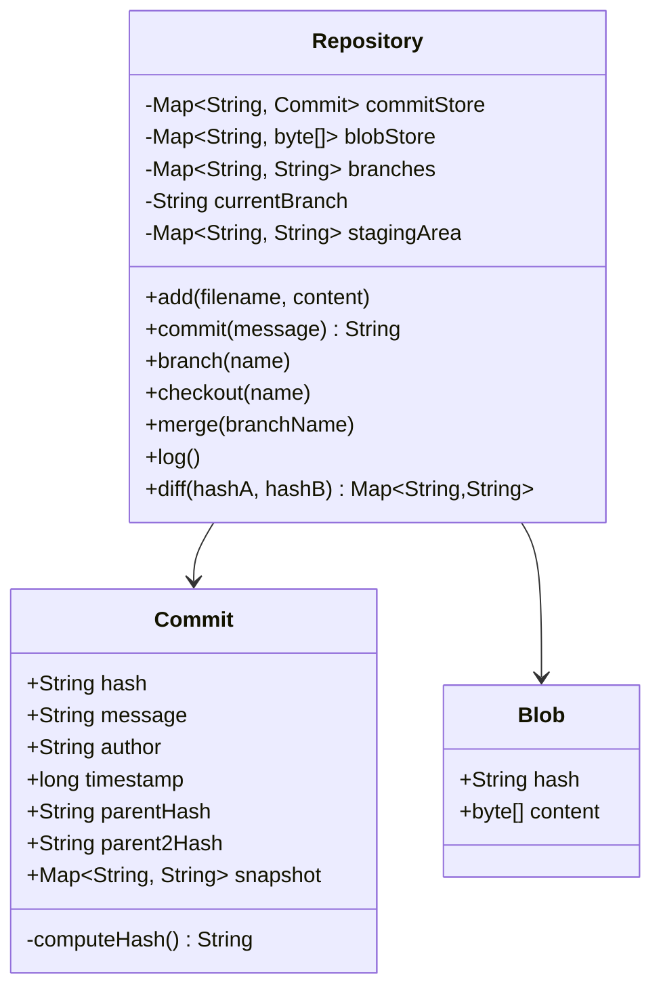

# Design Version Control System (Git)

> **Difficulty**: Hard
> **Topics**: Graph Theory (DAG), Hashing, Content-Addressable Storage
> **Key Concepts**: Snapshots vs. deltas, commit DAG, branch as a pointer, Merkle property.

---

## Real-Life Analogy

Git is exactly what it sounds like: **a time machine for your file system**. Every time you commit, you take a **photograph** of the entire project (not a list of changes — a full snapshot). Each photograph is labeled with a fingerprint (SHA-1 hash) computed from its content plus the fingerprint of the previous photograph. This chain means you can't tamper with history — changing commit #50 changes its hash, which breaks commit #51's reference to it, which cascades forward forever.

A **branch** is just a sticky note on a photograph. "This is where `feature-x` currently lives." When you commit on `feature-x`, the sticky note moves to the new photograph. Branches are **free** — creating one just writes 40 bytes (a hash) to a file.

The storage trick: if `app.js` didn't change between commit 1 and commit 50, both commits reference the exact same **blob** (file content object). The blob is stored once. This is content-addressable storage — the key is the hash of the content, not the filename.

The hardest part to implement is **merge** — specifically, finding the Lowest Common Ancestor of two branch tips and doing a three-way diff.

---

## Phase 1: Requirements

### Functional Requirements
- `add(filename, content)`: Stage a file for the next commit.
- `commit(message)`: Create a snapshot of all staged files; advance the current branch pointer.
- `branch(name)`: Create a new branch pointing to the current commit.
- `checkout(branchOrHash)`: Switch working state to a different branch or commit.
- `log()`: Walk the commit graph from HEAD, printing history.
- `merge(branch)`: Combine two branches. Three-way merge using LCA.
- `diff(commitA, commitB)`: Show what changed between two commits.

### Non-Functional Requirements
- **Integrity**: Commit hashes must be deterministic (same content → same hash) and tamper-evident.
- **Efficiency**: Unchanged files are not stored twice (content-addressed deduplication).
- **Correctness of merge**: Detect true conflicts (both branches changed the same file differently).

### Concurrency Constraints
- Single-developer local repo: no concurrency needed.
- Distributed (remote push/pull): optimistic concurrency — push fails if remote has diverged; user must pull and merge first.

---

## Phase 2: Use Cases

### Actors
- **Developer**: Stages files, creates commits, manages branches.
- **Repository**: Owns the object store, branch pointers, staging area.

### UC1: Commit Changes
**Actor**: Developer
**Flow**:
1. Developer adds `auth.java` to staging area: `repo.add("auth.java", content)`.
2. Developer calls `repo.commit("Add JWT auth")`.
3. System inherits parent commit's file snapshot.
4. System overlays staged files on top of parent snapshot.
5. System creates `Commit` object with: snapshot, parent hash, message, timestamp.
6. System computes SHA-1 of the commit; this is the commit's identity.
7. Current branch pointer advances to the new commit hash.
8. Staging area is cleared.

### UC2: Create and Switch Branch
**Actor**: Developer
**Flow**:
1. Developer calls `repo.branch("feature-payment")`.
2. System writes `feature-payment → currentCommitHash` in the branch map.
3. Developer calls `repo.checkout("feature-payment")`.
4. `currentBranch` pointer moves to `feature-payment`.
5. Future commits advance `feature-payment`'s tip without affecting `main`.

### UC3: Merge Branch
**Actor**: Developer
**Flow**:
1. Developer calls `repo.merge("feature-payment")` while on `main`.
2. System finds Lowest Common Ancestor (LCA) of `main` tip and `feature-payment` tip.
3. For each file: compare file content at LCA, `main` tip, and `feature-payment` tip.
   - Changed in `feature-payment` only → take `feature-payment` version.
   - Changed in `main` only → keep `main` version.
   - Changed in both → **CONFLICT** (report to user).
4. Create a merge commit with two parent hashes.

---

## Phase 3: Class Diagram

### Core Entities
- **Repository**: The top-level object. Owns the object store (commits, blobs), branch map, and staging area.
- **Commit**: Immutable snapshot. Contains: message, parent hash, file snapshot (filename → blob hash), author, timestamp. Its identity is its SHA-1 hash.
- **Blob**: Immutable file content. Identity is SHA-1 of content. Two identical files → one blob.
- **Branch**: Just a named pointer (String → commitHash) stored in a Map.

### Key Design Decisions
- **Commit is a value object**: once created, it is never modified. Its hash is computed from its content (Merkle property).
- **Blob deduplication**: `blobStore` maps `contentHash → content`. If two commits reference the same file content, they share the same entry in `blobStore`.
- **Branch is a mutable pointer, not a copy**: creating a branch is O(1) — just a Map entry.



---

## Phase 4: Design Patterns Applied

### 1. Flyweight / Content-Addressed Storage
**What**: `blobStore` maps `SHA-1(content) → content`. Multiple commits can reference the same blob hash. The blob bytes are stored exactly once.
**Why**: If `README.md` hasn't changed in 100 commits, it's stored once, not 100 times. This is why a Git repository of 10,000 commits is typically smaller than a single copy of the working files.

### 2. Composite Pattern (Tree Objects)
**What**: A real Git `Tree` object contains entries that are either `Blob`s (files) or other `Tree`s (subdirectories). The `Commit` points to a root `Tree`.
**Why**: Represents the recursive directory structure uniformly. A commit on a deeply nested file only creates new `Tree` objects along the path from root to that file; all other subtrees are referenced unchanged.

### 3. Chain of Responsibility (Commit Graph Walk)
**What**: `log()` and merge's LCA algorithm walk the linked list of commit `parentHash` pointers.
**Why**: The commit graph is a linked list (or DAG for merges). Walking it follows the Chain of Responsibility pattern — each commit delegates "what's my history?" to its parent.

---

## Phase 5: Key Java Implementation

The most interesting parts: (a) the Merkle property (commit hash depends on content + parent hash), (b) content-addressed blob deduplication, and (c) three-way merge with LCA.

```java
import java.nio.charset.StandardCharsets;
import java.security.MessageDigest;
import java.util.*;

// --- Immutable Commit object ---
class Commit {
    final String hash;
    final String message;
    final String author;
    final long timestamp;
    final String parentHash;   // null for initial commit
    final String parent2Hash;  // non-null for merge commits
    final Map<String, String> snapshot; // filename → blobHash

    Commit(String message, String author, String parentHash, String parent2Hash,
           Map<String, String> snapshot) {
        this.message = message;
        this.author = author;
        this.timestamp = System.currentTimeMillis();
        this.parentHash = parentHash;
        this.parent2Hash = parent2Hash;
        this.snapshot = Collections.unmodifiableMap(new HashMap<>(snapshot));
        this.hash = computeHash(); // Merkle property: hash covers all fields
    }

    // Commit hash is a function of its content + parent hash.
    // Tamper with any ancestor → hash chain breaks.
    private String computeHash() {
        String data = message + author + timestamp + parentHash + parent2Hash + snapshot.toString();
        try {
            byte[] digest = MessageDigest.getInstance("SHA-1")
                .digest(data.getBytes(StandardCharsets.UTF_8));
            StringBuilder sb = new StringBuilder();
            for (byte b : digest) sb.append(String.format("%02x", b));
            return sb.toString().substring(0, 10); // Short hash for readability
        } catch (Exception e) { throw new RuntimeException(e); }
    }

    @Override public String toString() {
        return String.format("commit %s\n  Author: %s\n  Message: %s", hash, author, message);
    }
}

// --- Repository ---
public class Repository {
    private final Map<String, Commit> commitStore = new HashMap<>();
    // Content-addressed blob store: SHA-1(content) → content string
    private final Map<String, String> blobStore = new HashMap<>();
    private final Map<String, String> branches = new LinkedHashMap<>(); // branch → commitHash
    private String currentBranch = "main";
    private Map<String, String> stagingArea = new HashMap<>(); // filename → blobHash

    public Repository() {
        branches.put("main", null); // main starts with no commits
    }

    // --- Staging ---

    public void add(String filename, String content) {
        // Store blob (deduplicated by content hash)
        String blobHash = sha1(content);
        blobStore.put(blobHash, content);
        stagingArea.put(filename, blobHash);
        System.out.printf("Staged: %s (blob %s)%n", filename, blobHash.substring(0, 6));
    }

    // --- Commit ---

    public String commit(String message) {
        String parentHash = branches.get(currentBranch);

        // Inherit parent's file snapshot, then overlay staged changes
        Map<String, String> newSnapshot = new HashMap<>();
        if (parentHash != null) {
            newSnapshot.putAll(commitStore.get(parentHash).snapshot);
        }
        newSnapshot.putAll(stagingArea); // Staged files override parent state

        Commit c = new Commit(message, "developer", parentHash, null, newSnapshot);
        commitStore.put(c.hash, c);
        branches.put(currentBranch, c.hash);
        stagingArea.clear();

        System.out.printf("[%s] %s: %s%n", currentBranch, c.hash.substring(0, 7), message);
        return c.hash;
    }

    // --- Branch & Checkout ---

    public void branch(String name) {
        String head = branches.get(currentBranch);
        branches.put(name, head);
        System.out.printf("Branch '%s' created at %s%n", name,
            head == null ? "root" : head.substring(0, 7));
    }

    public void checkout(String name) {
        if (!branches.containsKey(name)) {
            System.out.println("Branch not found: " + name);
            return;
        }
        currentBranch = name;
        System.out.println("Switched to branch '" + name + "'");
    }

    // --- Log ---

    public void log() {
        String hash = branches.get(currentBranch);
        System.out.println("=== History: " + currentBranch + " ===");
        while (hash != null) {
            Commit c = commitStore.get(hash);
            System.out.println("  " + c);
            hash = c.parentHash;
        }
    }

    // --- Diff ---

    public Map<String, String> diff(String hashA, String hashB) {
        Map<String, String> snapA = hashA == null ? Map.of() : commitStore.get(hashA).snapshot;
        Map<String, String> snapB = hashB == null ? Map.of() : commitStore.get(hashB).snapshot;

        Map<String, String> changes = new LinkedHashMap<>();
        Set<String> allFiles = new HashSet<>();
        allFiles.addAll(snapA.keySet()); allFiles.addAll(snapB.keySet());

        for (String file : allFiles) {
            String blobA = snapA.get(file);
            String blobB = snapB.get(file);
            if (Objects.equals(blobA, blobB)) continue;
            if (blobA == null) changes.put(file, "ADDED");
            else if (blobB == null) changes.put(file, "DELETED");
            else changes.put(file, "MODIFIED: " + blobA.substring(0,4) + " → " + blobB.substring(0,4));
        }
        return changes;
    }

    // --- Three-way Merge ---

    public void merge(String otherBranch) {
        String myHash    = branches.get(currentBranch);
        String theirHash = branches.get(otherBranch);
        if (theirHash == null) { System.out.println("Nothing to merge."); return; }
        if (Objects.equals(myHash, theirHash)) { System.out.println("Already up-to-date."); return; }

        // Find LCA by BFS on both sides simultaneously
        String lca = findLCA(myHash, theirHash);
        Map<String, String> lcaSnap   = lca == null ? Map.of() : commitStore.get(lca).snapshot;
        Map<String, String> mySnap    = myHash == null ? Map.of() : commitStore.get(myHash).snapshot;
        Map<String, String> theirSnap = commitStore.get(theirHash).snapshot;

        Set<String> allFiles = new HashSet<>();
        allFiles.addAll(mySnap.keySet()); allFiles.addAll(theirSnap.keySet());

        Map<String, String> mergedSnapshot = new HashMap<>(mySnap);
        List<String> conflicts = new ArrayList<>();

        for (String file : allFiles) {
            String lcaBlob   = lcaSnap.get(file);
            String myBlob    = mySnap.get(file);
            String theirBlob = theirSnap.get(file);

            boolean myChanged    = !Objects.equals(myBlob, lcaBlob);
            boolean theirChanged = !Objects.equals(theirBlob, lcaBlob);

            if (!myChanged && theirChanged) {
                // Only they changed it — take their version
                if (theirBlob == null) mergedSnapshot.remove(file);
                else mergedSnapshot.put(file, theirBlob);
            } else if (myChanged && theirChanged && !Objects.equals(myBlob, theirBlob)) {
                // Both changed it differently — conflict
                conflicts.add(file);
            }
            // If only mine changed or neither changed: keep mine (already in mergedSnapshot)
        }

        if (!conflicts.isEmpty()) {
            System.out.println("CONFLICT in files: " + conflicts + " — resolve and re-commit.");
            return;
        }

        // Create merge commit with two parents
        Commit mergeCommit = new Commit(
            "Merge '" + otherBranch + "' into " + currentBranch,
            "developer", myHash, theirHash, mergedSnapshot
        );
        commitStore.put(mergeCommit.hash, mergeCommit);
        branches.put(currentBranch, mergeCommit.hash);
        System.out.printf("Merged '%s' → '%s' [%s]%n", otherBranch, currentBranch,
            mergeCommit.hash.substring(0, 7));
    }

    // BFS from both tips simultaneously; first hash seen on both sides is the LCA
    private String findLCA(String hashA, String hashB) {
        Set<String> ancestorsA = new HashSet<>();
        Queue<String> qA = new LinkedList<>(), qB = new LinkedList<>();
        if (hashA != null) qA.add(hashA);
        if (hashB != null) qB.add(hashB);

        // Collect all ancestors of A
        while (!qA.isEmpty()) {
            String h = qA.poll();
            if (h == null || !commitStore.containsKey(h)) continue;
            ancestorsA.add(h);
            Commit c = commitStore.get(h);
            if (c.parentHash != null) qA.add(c.parentHash);
            if (c.parent2Hash != null) qA.add(c.parent2Hash);
        }
        // Walk B's ancestry until we hit something in A's set
        while (!qB.isEmpty()) {
            String h = qB.poll();
            if (h == null || !commitStore.containsKey(h)) continue;
            if (ancestorsA.contains(h)) return h;
            Commit c = commitStore.get(h);
            if (c.parentHash != null) qB.add(c.parentHash);
            if (c.parent2Hash != null) qB.add(c.parent2Hash);
        }
        return null; // No common ancestor (disjoint histories)
    }

    private String sha1(String content) {
        try {
            byte[] digest = MessageDigest.getInstance("SHA-1")
                .digest(content.getBytes(StandardCharsets.UTF_8));
            StringBuilder sb = new StringBuilder();
            for (byte b : digest) sb.append(String.format("%02x", b));
            return sb.toString().substring(0, 8);
        } catch (Exception e) { throw new RuntimeException(e); }
    }

    // --- Demo ---
    public static void main(String[] args) {
        Repository repo = new Repository();

        // Initial commit on main
        repo.add("README.md", "# My Project");
        repo.add("App.java", "public class App {}");
        repo.commit("Initial commit");

        // Feature branch
        repo.branch("feature-auth");
        repo.checkout("feature-auth");
        repo.add("Auth.java", "public class Auth { /* JWT */ }");
        repo.commit("Add JWT auth");

        // Back to main — independent change
        repo.checkout("main");
        repo.add("App.java", "public class App { /* main updated */ }");
        repo.commit("Update App.java on main");

        repo.log(); // main history

        // Merge feature into main
        repo.merge("feature-auth");

        repo.log(); // Should show merge commit

        // Diff between two commits
        String mainTip    = repo.branches.get("main");
        String featureTip = repo.branches.get("feature-auth");
        System.out.println("\nDiff main vs feature-auth: " + repo.diff(mainTip, featureTip));
    }
}
```

---

## Phase 6: Trade-offs and Extensions

### Trade-off: Snapshots vs. Deltas (Git vs. SVN)
| Approach | Checkout speed | Storage |
|---|---|---|
| Snapshots (Git) | O(1) — read latest snapshot | Higher raw storage, offset by dedup |
| Deltas (SVN) | O(N) — apply N diffs from base | Lower raw storage for linear history |

Git wins on checkout speed because accessing any commit is a direct lookup, not "base + N patches."

### Extension: Rebase
`rebase(onto)` replays your branch's commits on top of another branch tip, creating new commits with new hashes. It produces a linear history (no merge commit). Implementation: find LCA, collect commits between LCA and current branch tip in order, re-apply them one by one on top of `onto`.

### Extension: Stash
`stash()` saves the current staged changes and working directory changes to a temporary commit (not on any branch), then resets to HEAD. `stashPop()` applies that commit and discards it. Useful for "I need to quickly switch branches without committing."

### Extension: Distributed (push/pull)
- `push(remote)`: Send all commits the remote is missing (objects in local commitStore not in remote).
- `pull(remote)`: Fetch new commits from remote; if remote has advanced beyond local HEAD, merge automatically.
- Remote stores branch pointers (`origin/main`) separately from local branch pointers.

---

## SOLID Principles
- **S**: `Commit` stores immutable snapshot data; `Repository` manages workflow and object store.
- **O**: The hash algorithm can be swapped (SHA-1 → SHA-256) by changing one private method.
- **L**: A `RemoteRepository` implementing the same interface as `Repository` can be used interchangeably.
- **D**: Merge logic depends on `Commit`'s data fields, not its construction — decoupled.
