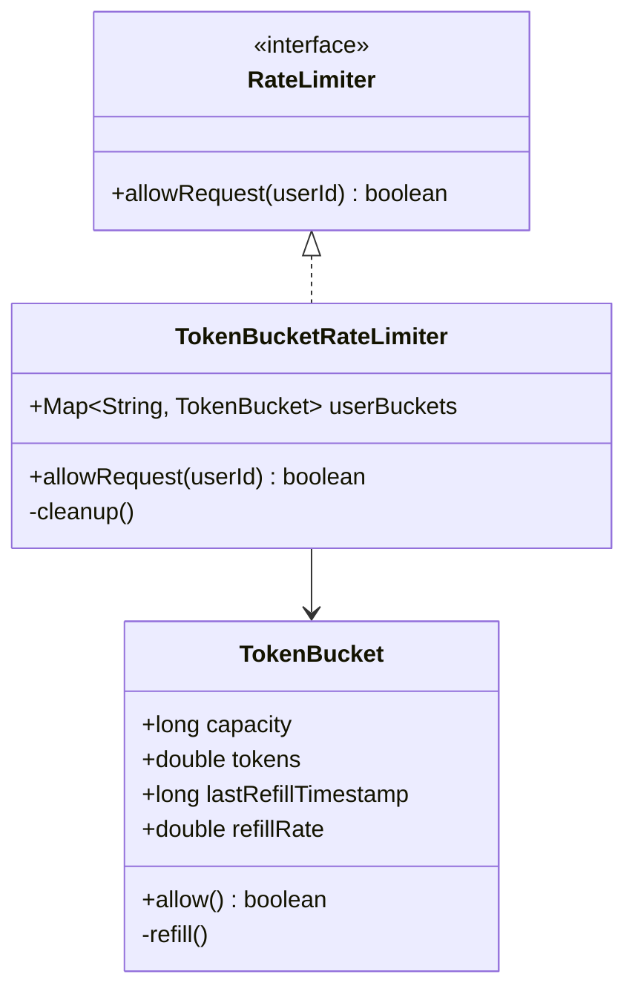

# Design Rate Limiter (Low Level)

> **Difficulty**: Medium
> **Topics**: Concurrency, Design Patterns (Strategy), Token Bucket Algorithm
> **Context**: Designing the internal class implementation (Thread-Safe), not the distributed system.

---

## What Breaks Without This Design?

```java
class RateLimiter {
    private Map<String, Integer> requestCounts = new HashMap<>();
    private Map<String, Long> windowStarts = new HashMap<>();
    private final int limit = 10;
    private final long windowMs = 1000;

    public boolean allow(String userId) {
        long now = System.currentTimeMillis();
        long windowStart = windowStarts.getOrDefault(userId, now);

        if (now - windowStart > windowMs) {
            // Reset window
            windowStarts.put(userId, now);
            requestCounts.put(userId, 1);
            return true;
        }

        int count = requestCounts.getOrDefault(userId, 0);
        if (count < limit) {
            requestCounts.put(userId, count + 1);
            return true;
        }
        return false;
    }
}
```

**Concrete failures**:
1. **Race condition on `count`**: Thread A reads `count = 9`, Thread B reads `count = 9`. Both see `count < 10 → true`. Both increment to 10. Two requests are allowed when the limit should have stopped at the 10th. At high concurrency, the limit is violated by a factor of the thread count.
2. **`HashMap` is not thread-safe**: Concurrent `put()` operations on `HashMap` can corrupt the internal structure (`ConcurrentModificationException` or silent data loss).
3. **Fixed-window burst**: A user sends 10 requests at 00:00.999 (end of window) and 10 more at 00:01.001 (start of next window). Total: 20 requests in 2ms — 2× the allowed rate. Fixed windows allow this burst at window boundaries.
4. **One algorithm hardcoded**: Switching from Fixed Window to Token Bucket or Sliding Window requires rewriting the class. No way to test the algorithm independently.
5. **No per-user bucket isolation**: `requestCounts` and `windowStarts` are shared maps — high-cardinality user bases cause lock contention (if synchronized) or corruption (if not).

---

## Derive the Class Structure

**Force 1 — The rate-limiting algorithm must be swappable**: Token Bucket, Fixed Window, Sliding Window Log — each is a different algorithm. Extract `RateLimitAlgorithm` interface with `boolean allow(String userId)`. Each algorithm is a class.

**Force 2 — Per-user state must be isolated**: Each user has an independent token bucket (or window counter). A `ConcurrentHashMap<String, TokenBucket>` gives per-user isolation: `computeIfAbsent` creates a bucket on first use, and subsequent accesses go to the per-user object. Locking can be done at the bucket level, not the map level.

**Force 3 — `allow()` must be atomic**: The check-and-decrement (`tokens > 0 → tokens--`) must be a single atomic operation. Synchronize on the per-user `TokenBucket` object, not the global map. This eliminates the global bottleneck while ensuring correctness per user.

**Force 4 — Bucket refill must be lazy (not scheduled)**: A background thread refilling every user's bucket is O(N users) per tick. Instead, record the `lastRefillTime` in the bucket; on each `allow()` call, compute how many tokens should have been added since `lastRefillTime` and add them inline. Refill cost is O(1) per call.

**Force 5 — Inactive user cleanup**: `ConcurrentHashMap` grows unboundedly if users never call `allow()` again. A background thread with a `WeakReference` or TTL-based eviction handles this.

**Result** — the class split these forces produce:
```
God class → RateLimiter (ConcurrentHashMap<userId, Bucket>, delegates to algorithm)
          → RateLimitAlgorithm (interface: boolean allow(userId))
             → TokenBucketAlgorithm, SlidingWindowAlgorithm, FixedWindowAlgorithm
          → TokenBucket (tokens, capacity, refillRate, lastRefillTime, synchronized allow())
          → RateLimiterConfig (limit, windowMs, refillRate — immutable value object)
```

---

## Real-Life Analogy

**A turnstile at a metro station.**

The metro allows only a certain number of passengers through per minute. When the turnstile is open, you tap your card and walk through. During peak hours, the gate may temporarily pause entry — not because you're blocked forever, but because the system needs to meter flow.

Key observations:
- Each passenger (request) taps the gate (calls `allowRequest`).
- The gate has a token bucket internally — it refills tokens over time at a fixed rate (e.g., 10 per second).
- If there are tokens left, the passenger gets through (allowed). If not, they're held back (throttled).
- Different turnstile lines (users) have independent buckets — Alice's burst doesn't affect Bob's allowance.
- The system decides locally, in memory, with zero network calls. This is **class-level design**, not distributed infrastructure.

---

## LLD vs HLD: Rate Limiter — What's the Difference?

This is a common interview trap. Rate limiting appears in both Low-Level Design and High-Level Design interviews. They are entirely different problems.

| Dimension | LLD (This Document) | HLD (Distributed System) |
|---|---|---|
| **Scope** | Single-process, in-memory class design | Multi-server, distributed system design |
| **Storage** | `ConcurrentHashMap<userId, TokenBucket>` in JVM heap | Redis (shared, persistent, atomic) |
| **Atomicity** | `synchronized` on `TokenBucket.allow()` | Lua scripts in Redis (atomic get-refill-set) |
| **State location** | Local memory per server | Centralized store shared by all servers |
| **Problem** | Thread-safe class API design | Consistency across N servers, network latency |
| **Failure mode** | No failure — in-process | Redis unavailable → fail-open or fail-closed? |
| **Cleanup** | Background thread to evict inactive users | Redis TTL on keys |
| **Algorithms discussed** | Token Bucket (lazy refill via `nanoTime`) | Token Bucket, Sliding Window Log, Fixed Window Counter |

**Why you can't use this LLD in a distributed system**: If your service runs on 3 servers and a user sends 30 requests, each server might see 10 requests and allow all of them — a total of 30 allowed even though the limit is 10. The buckets are in local memory, not shared. The HLD fix: store the bucket state in Redis and use a Lua script to atomically check-refill-decrement in a single round trip.

---

## Phase 1: Requirements Gathering

### Goals
- Design a library to limit requests based on a defined policy.
- Identify core entities: User, Request, Bucket.
- Define behavior for allowed vs. denied requests.

### 1. Who are the actors?
- **Client Application**: Sends requests that need to be rate-limited.
- **Rate Limiter System**: Decides whether to allow or block a request.

### 2. What are the must-have features? (Core)
- **User-based Limiting**: Limit requests per `userId`.
- **Configurable Rules**: Define limits (e.g., 10 requests per second).
- **Boolean Response**: Return `true` (Allowed) or `false` (Throttled).
- **Thread Safety**: Handle concurrent requests correctly.

### 3. What are the constraints?
- **Low Latency**: The check must be extremely fast (< 5ms).
- **Memory Efficiency**: Minimal memory footprint per user.
- **Concurrency**: Must handle thousands of concurrent threads.

---

## Phase 2: Use Cases

### UC1: Allow Request
**Actor**: Client App
**Flow**:
1. Client calls `allowRequest(userId)`.
2. Rate Limiter retrieves the bucket for `userId`.
3. System refills tokens based on time elapsed since last check.
4. System checks if `tokens >= 1`.
5. If yes, decrement token and return `true`.
6. If no, return `false`.

### UC2: Cleanup (Internal)
**Actor**: System
**Flow**:
1. Background process identifies inactive users (no requests for > 1 hour).
2. Remove their buckets to free memory.

---

## Phase 3: Class Diagram

### Step 1: Core Entities
- **RateLimiter** (Interface): Defines contract.
- **TokenBucketRateLimiter**: Concrete implementation using Token Buckets.
- **TokenBucket**: Holds tokens and timestamps for a specific user.

### Step 2: Relationships
- `TokenBucketRateLimiter` **implements** `RateLimiter`.
- `TokenBucketRateLimiter` **has-many** `TokenBucket` (Map: UserId -> Bucket).

### UML Diagram



---

## Phase 4: Design Patterns

### 1. Strategy Pattern
- **Description**: Defines a family of algorithms, encapsulates each one, and makes them interchangeable. Strategy lets the algorithm vary independently from clients that use it.
- **Why used**: Allows switching between different rate-limiting algorithms (Token Bucket, Leaky Bucket, Sliding Window) dynamically based on configuration without changing the client code.

### 2. Factory Pattern
- **Description**: A creational pattern that provides an interface for creating objects in a superclass, but allows subclasses to alter the type of objects that will be created.
- **Why used**: Useful for creating different types of rate limiters (e.g., `TokenBucketLimiter`, `FixedWindowLimiter`) based on user tier or configuration.

---

## Phase 5: Code Key Methods

### Token Bucket Algorithm — How It Works

The Token Bucket algorithm models a bucket that:
1. Holds a maximum of `capacity` tokens.
2. Refills at a rate of `refillRate` tokens per second.
3. Each allowed request consumes one token.
4. If the bucket is empty, the request is denied.

**Lazy Refill**: Instead of a background thread adding tokens every millisecond, we calculate how many tokens should have been added since the last call using `nanoTime`. This is done on-demand at the moment of `allow()`, making it extremely efficient.

```
on allow():
    elapsed = (now - lastRefill) in seconds
    tokensToAdd = elapsed * refillRate
    tokens = min(capacity, tokens + tokensToAdd)
    lastRefill = now
    if tokens >= 1:
        tokens -= 1
        return ALLOWED
    return DENIED
```

### Java Implementation (Thread-Safe Token Bucket)

```java
import java.util.*;
import java.util.concurrent.*;

// 1. Core Bucket Entity
class TokenBucket {
    private final long capacity;
    private final double refillRate; // Tokens per second
    private double tokens;
    private long lastRefillTimestamp;

    public TokenBucket(long capacity, double refillRate) {
        this.capacity = capacity;
        this.refillRate = refillRate;
        this.tokens = capacity;
        this.lastRefillTimestamp = System.nanoTime();
    }

    // Critical section: Calculating and updating tokens must be atomic
    public synchronized boolean allow() {
        refill();
        if (tokens >= 1) {
            tokens -= 1;
            return true;
        }
        return false;
    }

    private void refill() {
        long now = System.nanoTime();
        double elapsedSeconds = (now - lastRefillTimestamp) / 1_000_000_000.0;
        double tokensToAdd = elapsedSeconds * refillRate;
        
        if (tokensToAdd > 0) {
            tokens = Math.min(capacity, tokens + tokensToAdd);
            lastRefillTimestamp = now; 
            // Note: Update timestamp only when tokens are added relative to the previous fill point
            // For strict precision, you might track 'lastRefillTimestamp' differently, but this is standard for lazy refill.
        }
    }
}

// 2. Strategy Interface
interface RateLimiter {
    boolean allowRequest(String userId);
}

// 3. Concrete Strategy
class TokenBucketRateLimiter implements RateLimiter {
    // ConcurrentHashMap handles thread-safe retrieval/insertion of buckets
    private final Map<String, TokenBucket> userBuckets = new ConcurrentHashMap<>();
    private final long capacity;
    private final double refillRate;

    public TokenBucketRateLimiter(long capacity, double refillRate) {
        this.capacity = capacity;
        this.refillRate = refillRate;
    }

    @Override
    public boolean allowRequest(String userId) {
        // computeIfAbsent is atomic: ensures only one bucket created per user even with concurrent first requests
        TokenBucket bucket = userBuckets.computeIfAbsent(userId, k -> new TokenBucket(capacity, refillRate));
        return bucket.allow();
    }
}

// 4. Client Code
public class RateLimiterService {
    public static void main(String[] args) throws InterruptedException {
        // 10 tokens max, refill 1 token/sec
        RateLimiter limiter = new TokenBucketRateLimiter(10, 1);

        String user = "User1";
        
        // Simulate bursts
        System.out.println("Processing burst...");
        for (int i = 0; i < 12; i++) {
            boolean allowed = limiter.allowRequest(user);
            System.out.println("Request " + (i+1) + ": " + (allowed ? "Allowed" : "Denied"));
        }
        
        // Wait and retry
        System.out.println("Waiting 2 seconds...");
        Thread.sleep(2000); // Wait 2s -> Refill 2 tokens
        System.out.println("Request after wait: " + (limiter.allowRequest(user) ? "Allowed" : "Denied"));
    }
}
```

---

## Phase 6: Discussion

### Concurrency
**Q: Why `synchronized` on `allow()`?**
- A: To prevent race conditions where two threads read `tokens=1`, both decrement, and tokens become negative. The lock ensures atomicity of verify-and-decrement.

### Distributed Environments
**Q: How to scale to multiple servers?**
- A: Local memory (HashMap) won't work if requests for the same user hit different servers.
- **Solution**: Use **Redis** with **Lua Scripts**. Lua scripts execute atomically in Redis, performing the `get tokens -> refill -> decrement -> set tokens` logic in one step.

### Memory Optimization
**Q: How to handle millions of users?**
- A: The current map grows indefinitely. Implement a cleanup strategy:
    - **Background Thread**: Scan map periodically and remove keys with `lastRefillTimestamp` > 1 hour ago.
    - **LRU Cache**: Use a Guava Cache or similar with `expireAfterAccess`.

---

## SOLID Principles Checklist

- **S (Single Responsibility)**: `TokenBucket` handles logic for one user. `TokenBucketRateLimiter` manages mapping of users to buckets.
- **O (Open/Closed)**: Can add new Rate Limiters (e.g., `SlidingWindowRateLimiter`) implementing `RateLimiter` interface.
- **L (Liskov Substitution)**: `TokenBucketRateLimiter` can stand in for `RateLimiter`.
- **I (Interface Segregation)**: `RateLimiter` interface is simple (one method).
- **D (Dependency Inversion)**: Client depends on `RateLimiter` abstraction.
