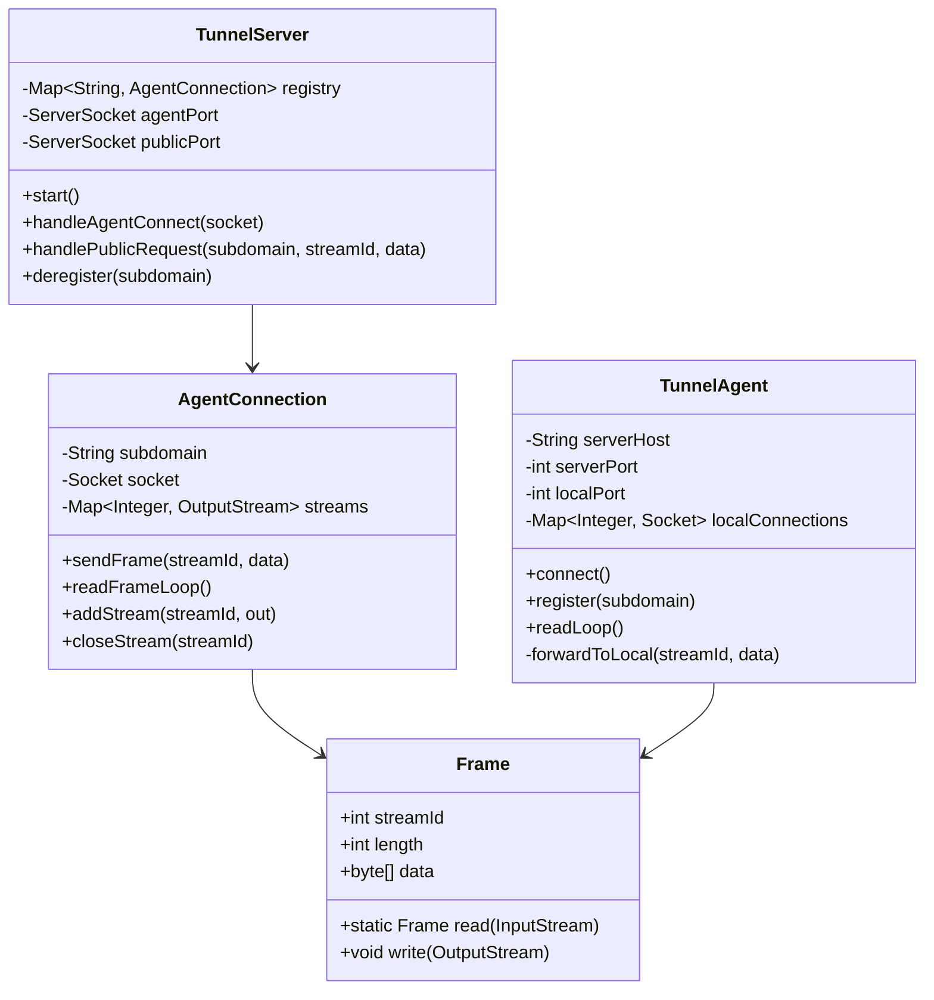

# Design Tunneling Service (Ngrok)

> **Difficulty**: Hard
> **Topics**: Networking, TCP Multiplexing, Reverse Proxy, NAT Traversal
> **Key Concepts**: Outbound-initiated persistent socket, subdomain-to-socket registry, frame-based multiplexing.

---

## Real-Life Analogy

Imagine a **telephone operator at a switchboard**. You call the operator from your desk phone (outbound call — always allowed, no firewall). You say: "I'm at extension 42, please patch any incoming calls for me through." The operator records your extension and keeps the line open. When someone calls from outside asking for extension 42, the operator bridges the two calls — the outside caller never dials your desk directly. They just talk to the operator, and the operator relays everything to you in real time.

That is exactly how ngrok works. The **Agent** (your machine) calls the **TunnelServer** (the operator) via an outbound TCP connection — this crosses any NAT or firewall because outbound connections are typically unrestricted. The Agent registers a subdomain ("extension 42"). When a public user hits `abc123.tunnel.com`, the TunnelServer finds the persistent socket for that subdomain and bridges the request through it.

The hardest engineering problem: **one TCP socket, many concurrent requests**. If request B arrives while request A is still streaming, naively writing both to the same pipe garbles them. Solution: **frame-based multiplexing** — prefix every chunk with a stream ID and length so the Agent knows which local connection each byte belongs to.

---

## Phase 1: Requirements

### Functional Requirements
- **Agent registration**: Agent initiates an outbound TCP connection to TunnelServer and claims a subdomain.
- **Public request forwarding**: Incoming HTTP request on `<subdomain>.tunnel.com` is forwarded through the Agent's persistent socket to localhost.
- **Multiplexing**: Multiple concurrent requests over a single Agent–Server socket, identified by stream ID.
- **Heartbeat / keepalive**: Detect dead Agent connections and clean up the registry.
- **Subdomain assignment**: Server assigns a random subdomain or accepts a requested one (if available).

### Non-Functional Requirements
- **Latency**: Forwarding overhead must be <10ms (one extra round-trip through the socket).
- **Reliability**: If the Agent socket drops, active streams should fail fast with a 502 response to the public user.
- **Security**: mTLS between Agent and TunnelServer; all traffic inside the tunnel is encrypted.

### Concurrency Constraints
- `ConcurrentHashMap<String, AgentConnection>` for the subdomain registry — multiple public requests may arrive for the same Agent simultaneously.
- Each public request is assigned a unique stream ID; the Agent demultiplexes by stream ID to route responses back.
- Heartbeat thread runs independently; on timeout, the Agent's socket is closed and its subdomain entry removed.

---

## Phase 2: Use Cases

### Actors
- **Agent**: Runs on developer's machine; registers with TunnelServer and forwards traffic to localhost.
- **TunnelServer**: Cloud-side process; accepts Agent connections, routes public requests.
- **Public User**: Hits the public URL; has no knowledge of localhost.

### UC1: Agent Registers
**Actor**: Agent
**Flow**:
1. Agent dials `TunnelServer:4443` (outbound TCP — crosses NAT/firewall).
2. Agent sends registration frame: `REGISTER <subdomain>`.
3. TunnelServer validates subdomain is available; stores `subdomain → socket` in registry.
4. TunnelServer replies `OK abc123.tunnel.com`.
5. Agent enters read loop, awaiting forwarded frames.

### UC2: Public Request Arrives
**Actor**: Public User
**Flow**:
1. User sends `GET / HTTP/1.1 Host: abc123.tunnel.com`.
2. TunnelServer resolves `abc123` → Agent socket from registry.
3. Server allocates a new `streamId`; writes frame: `[streamId][length][HTTP bytes]` to Agent socket.
4. Agent reads frame, demultiplexes by `streamId`, opens `localhost:8080`, forwards raw bytes.
5. Local server responds; Agent writes response frame back: `[streamId][length][response bytes]`.
6. TunnelServer reads response frame, writes HTTP response to public user's socket.

### UC3: Agent Disconnects
**Actor**: Agent (unintentional disconnect or `Ctrl-C`)
**Flow**:
1. Heartbeat thread detects no ping from Agent within 30 seconds.
2. TunnelServer removes `subdomain` entry from registry.
3. Any in-flight public requests for that subdomain receive `502 Bad Gateway`.

---

## Phase 3: Class Diagram

### Core Entities
- **TunnelServer**: Registry + public request acceptor. Routes public traffic to the correct `AgentConnection`.
- **AgentConnection**: Wraps the persistent Agent socket; multiplexes frames; tracks active streams.
- **TunnelAgent**: Client-side; dials TunnelServer; demultiplexes inbound frames; spawns local proxy connections.
- **Frame**: Lightweight value object — `[streamId: int][length: int][data: byte[]]`. Wire protocol.
- **StreamRegistry**: Per-`AgentConnection` map from `streamId → OutputStream` (the public user's socket writer).

### Key Design Decisions
- **Registry keyed by subdomain, not IP** — the Agent may reconnect from a different IP; the subdomain is the stable identity.
- **Frame protocol over raw bytes** — prevents head-of-line blocking; each `[streamId][length][data]` chunk is self-describing. The Agent reads exactly `length` bytes for that stream, processes, then reads the next frame.
- **Agent initiates connection** — this is the entire NAT-traversal trick. The resulting socket is bidirectional; TunnelServer writes to it, Agent reads. No inbound port required on the developer's machine.



---

## Phase 4: Design Patterns Applied

### 1. Registry Pattern (Subdomain → Socket Map)
**What**: `TunnelServer` maintains `ConcurrentHashMap<String, AgentConnection>` as a live registry. Public requests look up the Agent connection in O(1) and write frames directly.
**Why**: The subdomain is the only stable identifier linking a public DNS name to a transient socket. Without this registry, the server would have no way to route `abc123.tunnel.com` to the correct Agent among potentially thousands.

### 2. Frame Protocol / Multiplexing (Structural Pattern)
**What**: Every chunk of data written to the shared Agent socket is prefixed with `[streamId: 4 bytes][length: 4 bytes]` followed by `length` bytes of payload.
**Why**: A single TCP socket is a byte stream with no message boundaries. Without framing, two concurrent requests would interleave their bytes unpredictably. The frame header lets the receiver reconstruct independent streams. This is identical to how HTTP/2 multiplexes requests over one TLS connection.

### 3. Proxy Pattern (TunnelServer as Reverse Proxy)
**What**: `TunnelServer` sits between the public internet and `localhost`. The public user sees only `tunnel.com`; they have no knowledge of the origin server's address.
**Why**: The purpose of the entire service is to mask the origin. The Proxy pattern explicitly describes this structural role — TunnelServer forwards requests and responses without transforming them, but controls access and routing.

---

## Phase 5: Key Java Implementation

The interesting parts: (a) the **frame wire protocol** — binary `[streamId][length][data]` over a shared socket, and (b) the **Agent read loop** that demultiplexes frames and dispatches each to its local connection.

```java
import java.io.*;
import java.net.*;
import java.util.*;
import java.util.concurrent.*;

// --- Frame: the unit of multiplexed communication ---
class Frame {
    static final int HEADER_SIZE = 8; // 4 bytes streamId + 4 bytes length

    final int streamId;
    final byte[] data;

    Frame(int streamId, byte[] data) {
        this.streamId = streamId;
        this.data = data;
    }

    // Write frame to stream: [streamId: 4B][length: 4B][data: N bytes]
    void write(OutputStream out) throws IOException {
        DataOutputStream dos = new DataOutputStream(out);
        dos.writeInt(streamId);
        dos.writeInt(data.length);
        dos.write(data);
        dos.flush();
    }

    // Read exactly one frame from stream (blocks until complete)
    static Frame read(InputStream in) throws IOException {
        DataInputStream dis = new DataInputStream(in);
        int streamId = dis.readInt();
        int length   = dis.readInt();
        byte[] data  = dis.readNBytes(length); // Reads exactly length bytes
        return new Frame(streamId, data);
    }
}

// --- TunnelServer: registry + public-request router ---
class TunnelServer {
    // subdomain → persistent Agent socket wrapper
    private final ConcurrentHashMap<String, AgentConnection> registry = new ConcurrentHashMap<>();
    private final int agentPort;
    private final int publicPort;

    TunnelServer(int agentPort, int publicPort) {
        this.agentPort = agentPort;
        this.publicPort = publicPort;
    }

    void start() throws IOException {
        // Accept Agent registrations on one port
        new Thread(this::acceptAgents, "agent-acceptor").start();
        // Accept public HTTP requests on another
        new Thread(this::acceptPublic, "public-acceptor").start();
        System.out.println("TunnelServer running. Agent port=" + agentPort + " Public port=" + publicPort);
    }

    private void acceptAgents() {
        try (ServerSocket ss = new ServerSocket(agentPort)) {
            while (true) {
                Socket socket = ss.accept();
                new Thread(() -> handshakeAgent(socket)).start();
            }
        } catch (IOException e) { e.printStackTrace(); }
    }

    private void handshakeAgent(Socket socket) {
        try {
            DataInputStream in = new DataInputStream(socket.getInputStream());
            DataOutputStream out = new DataOutputStream(socket.getOutputStream());

            // Protocol: agent sends "REGISTER <subdomain>\n"
            String line = new BufferedReader(new InputStreamReader(socket.getInputStream())).readLine();
            if (line == null || !line.startsWith("REGISTER ")) { socket.close(); return; }

            String subdomain = line.split(" ", 2)[1].trim();
            AgentConnection conn = new AgentConnection(subdomain, socket);
            registry.put(subdomain, conn);

            out.writeBytes("OK " + subdomain + ".tunnel.com\n");
            System.out.println("Agent registered: " + subdomain);

            // Agent read loop: responses from Agent come back as frames
            conn.startResponseLoop(streamId -> {
                // When Agent sends a response frame, write it to the waiting public socket
                // (In a full impl, the public socket's OutputStream is stored by streamId)
                System.out.println("Response frame for stream " + streamId);
            });

        } catch (IOException e) {
            System.err.println("Agent handshake failed: " + e.getMessage());
        }
    }

    private void acceptPublic() {
        try (ServerSocket ss = new ServerSocket(publicPort)) {
            while (true) {
                Socket publicSocket = ss.accept();
                new Thread(() -> handlePublicRequest(publicSocket)).start();
            }
        } catch (IOException e) { e.printStackTrace(); }
    }

    private void handlePublicRequest(Socket publicSocket) {
        try {
            // Read HTTP request to determine Host header → subdomain
            BufferedReader reader = new BufferedReader(new InputStreamReader(publicSocket.getInputStream()));
            StringBuilder rawRequest = new StringBuilder();
            String host = null;
            String line;
            while ((line = reader.readLine()) != null && !line.isEmpty()) {
                rawRequest.append(line).append("\r\n");
                if (line.toLowerCase().startsWith("host:")) {
                    host = line.split(":", 2)[1].trim(); // e.g. "abc123.tunnel.com"
                }
            }
            rawRequest.append("\r\n");

            if (host == null) { publicSocket.close(); return; }
            String subdomain = host.split("\\.")[0]; // "abc123"

            AgentConnection agent = registry.get(subdomain);
            if (agent == null) {
                // No agent registered — 502
                publicSocket.getOutputStream().write("HTTP/1.1 502 Bad Gateway\r\n\r\nNo tunnel".getBytes());
                publicSocket.close();
                return;
            }

            // Assign a stream ID, forward request as a frame
            int streamId = agent.nextStreamId();
            agent.registerPublicSocket(streamId, publicSocket.getOutputStream());
            agent.sendFrame(new Frame(streamId, rawRequest.toString().getBytes()));
            System.out.println("Forwarded request to agent " + subdomain + " on stream " + streamId);

        } catch (IOException e) {
            e.printStackTrace();
        }
    }
}

// --- AgentConnection: wraps persistent socket, multiplexes frames ---
class AgentConnection {
    final String subdomain;
    private final Socket socket;
    private final OutputStream out;
    private final InputStream in;
    // streamId → public user's OutputStream (to write the response back)
    private final ConcurrentHashMap<Integer, OutputStream> streams = new ConcurrentHashMap<>();
    private int streamCounter = 0;

    AgentConnection(String subdomain, Socket socket) throws IOException {
        this.subdomain = subdomain;
        this.socket = socket;
        this.out = socket.getOutputStream();
        this.in  = socket.getInputStream();
    }

    int nextStreamId() { return ++streamCounter; }

    void registerPublicSocket(int streamId, OutputStream publicOut) {
        streams.put(streamId, publicOut);
    }

    synchronized void sendFrame(Frame frame) throws IOException {
        frame.write(out); // Synchronized: only one writer at a time to the shared socket
    }

    // Loop reading response frames from Agent, dispatching to the correct public socket
    void startResponseLoop(java.util.function.IntConsumer onFrame) {
        new Thread(() -> {
            try {
                while (!socket.isClosed()) {
                    Frame frame = Frame.read(in);
                    OutputStream publicOut = streams.get(frame.streamId);
                    if (publicOut != null) {
                        publicOut.write(frame.data);
                        publicOut.flush();
                        // In a real impl: detect end-of-response, then close + remove stream
                    }
                    onFrame.accept(frame.streamId);
                }
            } catch (IOException e) {
                System.err.println("Agent " + subdomain + " disconnected: " + e.getMessage());
            }
        }, "agent-response-" + subdomain).start();
    }
}

// --- TunnelAgent: client side, runs on developer machine ---
class TunnelAgent {
    private final String serverHost;
    private final int serverPort;
    private final int localPort;
    private final String subdomain;
    // streamId → local socket to localhost service
    private final ConcurrentHashMap<Integer, Socket> localSockets = new ConcurrentHashMap<>();

    TunnelAgent(String serverHost, int serverPort, int localPort, String subdomain) {
        this.serverHost = serverHost;
        this.serverPort = serverPort;
        this.localPort = localPort;
        this.subdomain = subdomain;
    }

    void connect() throws IOException {
        Socket tunnel = new Socket(serverHost, serverPort); // Outbound — crosses NAT
        DataOutputStream out = new DataOutputStream(tunnel.getOutputStream());

        // Register subdomain
        out.writeBytes("REGISTER " + subdomain + "\n");
        String ack = new BufferedReader(new InputStreamReader(tunnel.getInputStream())).readLine();
        System.out.println("Agent registered: " + ack);

        // Read loop: server forwards public request frames to us
        InputStream in = tunnel.getInputStream();
        while (!tunnel.isClosed()) {
            Frame frame = Frame.read(in);
            int streamId = frame.streamId;

            // Forward to localhost in a separate thread; send response back as a frame
            new Thread(() -> {
                try {
                    Socket local = new Socket("localhost", localPort);
                    localSockets.put(streamId, local);

                    // Send the raw HTTP request to local server
                    local.getOutputStream().write(frame.data);
                    local.getOutputStream().flush();

                    // Read local server's response
                    byte[] response = local.getInputStream().readAllBytes();
                    local.close();

                    // Send response back through tunnel as a frame
                    synchronized (out) {
                        new Frame(streamId, response).write(out);
                    }
                } catch (IOException e) {
                    System.err.println("Local forward failed for stream " + streamId + ": " + e.getMessage());
                }
            }).start();
        }
    }

    // --- Demo ---
    public static void main(String[] args) throws Exception {
        // Start server
        TunnelServer server = new TunnelServer(4443, 8080);
        server.start();

        Thread.sleep(500); // Wait for server to bind

        // Start agent (would normally run on a different machine)
        new Thread(() -> {
            try {
                new TunnelAgent("localhost", 4443, 3000, "demo").connect();
            } catch (IOException e) { e.printStackTrace(); }
        }).start();

        Thread.sleep(1000);
        System.out.println("Tunnel ready: http://demo.tunnel.com:8080");
        // Public users now hit :8080 → server routes through agent → localhost:3000
    }
}
```

---

## Phase 6: Trade-offs and Extensions

### Trade-off: Single shared socket vs. per-request socket
| Approach | Pros | Cons |
|---|---|---|
| Single persistent socket + frames | Low connection overhead, crosses NAT once | Head-of-line blocking if framing is missing; complex demux logic |
| Per-request socket | Simple — no multiplexing needed | Each request requires a new outbound connection; N connections per N concurrent requests; reconnection under load |

The single-socket approach is correct for production. The framing protocol is the cost — it's essentially HTTP/2 semantics built on raw TCP.

### Extension: HTTP/2 or WebSocket as the tunnel transport
Instead of a raw TCP socket with a custom binary frame protocol, the Agent could upgrade the connection to a WebSocket. The server can then use WebSocket frames (which have built-in framing) as the multiplexing layer. This also works through corporate HTTP proxies that block raw TCP but allow WebSocket upgrades on port 443.

### Extension: mTLS Security
The TunnelServer issues per-Agent client certificates. The Agent presents its certificate on connect; the server verifies it against a CA. This prevents unauthorized clients from registering subdomains. All data inside the tunnel (already encrypted at the TLS layer) cannot be intercepted even by the tunnel operator.

### Extension: Wildcard DNS + Dynamic Subdomains
- DNS: `*.tunnel.com` → `TunnelServer IP` (one record covers all subdomains).
- On Agent registration, TunnelServer issues a random subdomain (UUID prefix) or accepts a requested one if not taken.
- The registry maps subdomains to Agent sockets — this lookup happens on every public request.

---

## SOLID Principles
- **S**: `TunnelServer` routes public traffic; `AgentConnection` manages per-agent socket and stream registry; `Frame` is a pure data structure for the wire protocol.
- **O**: Add UDP tunnel support by extending `AgentConnection` with a `UdpAgentConnection` variant — no changes to `TunnelServer`'s registry logic.
- **L**: Any `AgentConnection` implementation (TCP, WebSocket-backed) can be stored in the registry map.
- **I**: `Frame.read()` and `Frame.write()` are the only interface points between agent and server — minimal coupling.
- **D**: `TunnelServer` stores `AgentConnection` objects; if `AgentConnection` were an interface, the server would depend on the abstraction rather than the concrete class.
