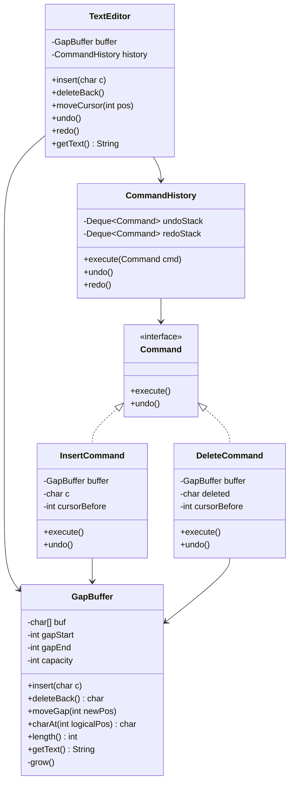

# Design Text Editor (Sublime Text / VS Code)

> **Difficulty**: Hard
> **Topics**: Data Structures (Gap Buffer), Command Pattern, Undo/Redo
> **Key Concepts**: Gap Buffer for O(1) insert/delete at cursor, Command pattern for unlimited undo, Piece Table for large files.

---

## Real-Life Analogy

Imagine typing on a typewriter with a **movable carriage**. The carriage sits at your current cursor position. When you type a character, it slots right into the spot where the carriage sits — zero shifting required, because the blank space in the paper is already there at the carriage. When you move the carriage to a different position, all that blank space travels with it.

That blank space is the **gap** in a Gap Buffer. Internally, the editor holds a fixed array of characters with an intentional empty stretch (the gap) located exactly where your cursor is. Insert at cursor? Write into the gap, shrink it by one. Delete at cursor? Expand the gap by one. Both are O(1). Move the cursor across the document? The gap physically slides to the new position by copying characters over it — O(distance) but rare compared to typing. For everyday editing where you mostly type in one place, a Gap Buffer beats a plain array dramatically.

The second insight: **every edit is an object**, not a raw mutation. Insert('A') and Delete('B') are both `Command` objects stored on a stack. Undo means popping the stack and calling `command.undo()`. Redo means replaying it. This decouples "what happened" from "how to reverse it" — a clean separation that makes unlimited history trivial.

---

## Phase 1: Requirements

### Functional Requirements
- **Insert**: Add a character or string at the current cursor position.
- **Delete**: Remove the character before the cursor (Backspace).
- **Move cursor**: Left, right, home, end, go-to-line.
- **Undo**: Reverse the last edit command.
- **Redo**: Re-apply an undone command.
- **Get content**: Return the current document text.

### Non-Functional Requirements
- **Latency**: Every keystroke must complete in <1ms for documents up to 10 MB.
- **Memory**: The Gap Buffer stores the document as a single char array — no extra allocations per character.
- **Large file support** (extension): Piece Table for multi-GB files where Gap Buffer's gap-move cost becomes prohibitive.

### Concurrency Constraints
- Single-threaded model — the UI event loop serializes all edits. Undo/redo stacks require no locking.
- Background threads (syntax highlighting, auto-save) read the document snapshot and must not mutate the buffer directly — they work on a copy or an immutable view.

---

## Phase 2: Use Cases

### Actors
- **User**: Presses keys; triggers insert, delete, move, undo, redo.
- **Text Editor**: Translates keystrokes into Command objects; delegates to GapBuffer.

### UC1: User Types a Character
**Actor**: User
**Flow**:
1. User presses 'A'.
2. `TextEditor` creates `InsertCommand('A', cursor)`.
3. Command calls `buffer.insert('A')` → character written into gap; gap pointer advances.
4. Command is pushed onto the undo stack; redo stack is cleared.
5. Cursor moves right by one.

### UC2: User Presses Backspace
**Actor**: User
**Flow**:
1. User presses Backspace.
2. `TextEditor` creates `DeleteCommand(buffer.charBeforeCursor(), cursor)`.
3. Command calls `buffer.deleteBack()` → gap expands left; character is overwritten.
4. Command pushed onto undo stack.

### UC3: User Presses Ctrl+Z (Undo)
**Actor**: User
**Flow**:
1. Pop top command from undo stack.
2. Call `command.undo()` — reverses the operation (insert undo = delete; delete undo = insert).
3. Push command to redo stack.

### UC4: User Moves Cursor to Position K
**Actor**: User
**Flow**:
1. User clicks a different position or presses an arrow key.
2. `buffer.moveCursor(k)` slides the gap to position k — O(|k - cursor|) copy operations.
3. Subsequent inserts/deletes are again O(1).

---

## Phase 3: Class Diagram

### Core Entities
- **TextEditor**: Facade. Translates keystrokes into commands; owns the undo/redo stacks.
- **GapBuffer**: The document store. A single `char[]` with a gap at the cursor position.
- **Command**: Interface with `execute()` and `undo()`.
- **InsertCommand / DeleteCommand**: Concrete commands that capture enough state to reverse themselves.
- **CommandHistory**: Manages undo and redo stacks.

### Key Design Decisions
- `GapBuffer` stores the logical cursor as `gapStart` — inserting is `buf[gapStart++] = c` (one array write). No shifting of any subsequent characters.
- `InsertCommand` captures the character and cursor position at time of execution so `undo()` can precisely reverse it, even if many other edits have occurred.
- `CommandHistory.execute()` clears the redo stack — once you type after an undo, the alternative future is discarded (same behavior as every real editor).



---

## Phase 4: Design Patterns Applied

### 1. Gap Buffer (Core Data Structure)
**What**: A char array with a movable "gap" (empty space) always positioned at the cursor. Insert = write at `gapStart`, advance `gapStart`. Delete = retreat `gapStart`. Move cursor = copy characters across the gap boundary.
**Why**: Most edits happen near the cursor (sequential typing). The gap makes those O(1). A plain `ArrayList<Character>` is O(N) per insert because it shifts every subsequent character one position. For a 100 KB file, that's 100,000 array moves per keystroke.

### 2. Command Pattern (Undo / Redo)
**What**: Every edit is encapsulated as a `Command` object with `execute()` and `undo()` methods. `CommandHistory` maintains two stacks.
**Why**: Without Command, undo requires storing a complete document snapshot before every edit — O(N) memory per operation. Command stores only the delta (one character + position), making undo O(1) in time and space. The stacks also make redo trivial — no special logic needed.

### 3. Facade Pattern (TextEditor)
**What**: `TextEditor` presents four clean methods (`insert`, `deleteBack`, `undo`, `redo`) that hide `GapBuffer` manipulation and stack management.
**Why**: A UI layer should not know about gap positions or command stacks. The facade enforces the correct sequencing: always create and execute a command through history, never mutate the buffer directly.

---

## Phase 5: Key Java Implementation

The interesting part is the **Gap Buffer** — the internal mechanics of insert, delete, and gap movement — plus the Command pattern wired on top of it.

```java
import java.util.*;

// --- Gap Buffer: the document store ---
class GapBuffer {
    private char[] buf;
    private int gapStart;  // first index of the gap (next insert goes here)
    private int gapEnd;    // first index after the gap (exclusive)

    // The logical cursor position equals gapStart (gap is at the cursor).
    // Logical length = buf.length - gapSize

    GapBuffer(int initialCapacity) {
        buf = new char[initialCapacity];
        gapStart = 0;
        gapEnd   = initialCapacity; // Entire buffer starts as one big gap
    }

    // --- Core operations ---

    // O(1) insert at cursor
    void insert(char c) {
        if (gapStart == gapEnd) grow(); // Gap is full — expand
        buf[gapStart++] = c;
    }

    // O(1) delete character before cursor (Backspace)
    char deleteBack() {
        if (gapStart == 0) throw new IllegalStateException("Nothing to delete");
        char deleted = buf[gapStart - 1];
        gapStart--; // Expand gap left — deleted character is now inside the gap
        return deleted;
    }

    // O(|newPos - cursor|) — move gap to new logical position
    // Called when the user clicks a different location or uses arrow keys
    void moveGap(int logicalPos) {
        int currentPos = gapStart;
        if (logicalPos == currentPos) return;

        int gapSize = gapEnd - gapStart;

        if (logicalPos < currentPos) {
            // Moving left: shift characters from before gap to after gap
            // [... A B C | gap | D E ...]  cursor moves left by 2
            // [... | gap | A B C D E ...]  → shift A,B into positions after gap
            int count = currentPos - logicalPos;
            System.arraycopy(buf, logicalPos, buf, gapEnd - count, count);
            gapStart = logicalPos;
            gapEnd   = logicalPos + gapSize;
        } else {
            // Moving right: shift characters from after gap to before gap
            int count = logicalPos - currentPos;
            System.arraycopy(buf, gapEnd, buf, gapStart, count);
            gapStart = logicalPos;
            gapEnd   = logicalPos + gapSize;
        }
    }

    // Cursor position = gapStart (logical)
    int cursor() { return gapStart; }

    // Logical document length
    int length() { return buf.length - (gapEnd - gapStart); }

    // Retrieve the full document as a String
    String getText() {
        char[] result = new char[length()];
        System.arraycopy(buf, 0, result, 0, gapStart);
        System.arraycopy(buf, gapEnd, result, gapStart, buf.length - gapEnd);
        return new String(result);
    }

    // Double the buffer when the gap is exhausted
    private void grow() {
        int newCapacity = buf.length * 2;
        char[] newBuf   = new char[newCapacity];
        int gapSize     = gapEnd - gapStart;

        // Copy content before gap, leave space for a bigger gap, copy content after gap
        System.arraycopy(buf, 0, newBuf, 0, gapStart);
        int newGapEnd = newCapacity - (buf.length - gapEnd);
        System.arraycopy(buf, gapEnd, newBuf, newGapEnd, buf.length - gapEnd);

        buf      = newBuf;
        gapEnd   = newGapEnd;
        // gapStart unchanged
        System.out.println("  [GapBuffer grew to capacity " + newCapacity + "]");
    }
}

// --- Command interface ---
interface Command {
    void execute();
    void undo();
}

// --- Insert: captures character + cursor position before insert ---
class InsertCommand implements Command {
    private final GapBuffer buf;
    private final char c;
    private final int cursorBefore;

    InsertCommand(GapBuffer buf, char c) {
        this.buf          = buf;
        this.c            = c;
        this.cursorBefore = buf.cursor();
    }

    @Override
    public void execute() {
        buf.moveGap(cursorBefore);
        buf.insert(c);
    }

    @Override
    public void undo() {
        // Cursor is now after the inserted char; move back and delete it
        buf.moveGap(cursorBefore + 1);
        buf.deleteBack();
    }
}

// --- Delete (Backspace): captures deleted char + cursor position ---
class DeleteCommand implements Command {
    private final GapBuffer buf;
    private final int cursorBefore;
    private char deleted; // Filled in during execute()

    DeleteCommand(GapBuffer buf) {
        this.buf          = buf;
        this.cursorBefore = buf.cursor();
    }

    @Override
    public void execute() {
        buf.moveGap(cursorBefore);
        deleted = buf.deleteBack(); // Records what was deleted for undo
    }

    @Override
    public void undo() {
        // Re-insert the deleted character at the position it came from
        buf.moveGap(cursorBefore - 1);
        buf.insert(deleted);
    }
}

// --- Command history: undo/redo stacks ---
class CommandHistory {
    private final Deque<Command> undoStack = new ArrayDeque<>();
    private final Deque<Command> redoStack = new ArrayDeque<>();

    void execute(Command cmd) {
        cmd.execute();
        undoStack.push(cmd);
        redoStack.clear(); // New edit discards the redo future
    }

    void undo() {
        if (undoStack.isEmpty()) { System.out.println("  Nothing to undo."); return; }
        Command cmd = undoStack.pop();
        cmd.undo();
        redoStack.push(cmd);
        System.out.println("  Undone.");
    }

    void redo() {
        if (redoStack.isEmpty()) { System.out.println("  Nothing to redo."); return; }
        Command cmd = redoStack.pop();
        cmd.execute();
        undoStack.push(cmd);
        System.out.println("  Redone.");
    }
}

// --- TextEditor: facade ---
public class TextEditor {
    private final GapBuffer buffer = new GapBuffer(16);
    private final CommandHistory history = new CommandHistory();

    public void insert(char c) {
        history.execute(new InsertCommand(buffer, c));
    }

    public void deleteBack() {
        if (buffer.cursor() == 0) return;
        history.execute(new DeleteCommand(buffer));
    }

    public void moveCursor(int logicalPos) {
        buffer.moveGap(logicalPos); // Not a command — navigation is not undoable
    }

    public void undo() { history.undo(); }
    public void redo() { history.redo(); }

    public String getText() { return buffer.getText(); }

    // --- Demo ---
    public static void main(String[] args) {
        TextEditor editor = new TextEditor();

        // Type "Hello"
        for (char c : "Hello".toCharArray()) editor.insert(c);
        System.out.println("After typing 'Hello': '" + editor.getText() + "'");

        // Move cursor back 3, insert 'X'
        editor.moveCursor(2); // Move to after 'He'
        editor.insert('X');
        System.out.println("After insert 'X' at pos 2: '" + editor.getText() + "'"); // HeXllo

        // Undo the X insertion
        editor.undo();
        System.out.println("After undo: '" + editor.getText() + "'"); // Hello

        // Redo it
        editor.redo();
        System.out.println("After redo: '" + editor.getText() + "'"); // HeXllo

        // Backspace twice
        editor.moveCursor(editor.buffer.cursor()); // Stay at current position
        editor.deleteBack();
        editor.deleteBack();
        System.out.println("After 2x backspace: '" + editor.getText() + "'"); // Hello (X and e removed)
    }
}
```

---

## Phase 6: Trade-offs and Extensions

### Trade-off: Gap Buffer vs. Piece Table vs. Rope
| Data Structure | Insert/Delete at Cursor | Cursor Jump | Memory | Used By |
|---|---|---|---|---|
| Gap Buffer | O(1) | O(distance) | Low (single array) | Emacs, older editors |
| Piece Table | O(1) amortized | O(log N) | Low (two buffers + index) | VS Code, Word |
| Rope | O(log N) | O(log N) | Higher (tree nodes) | Large-file editors |

Gap Buffer is ideal for interactive typing (locality of reference — you mostly type near the cursor). Piece Table wins for large files with random-access edits because it never moves data — it only updates a linked list of spans into two immutable buffers (original + append-only additions).

### Extension: Batch Undo (Word-level grouping)
Real editors group adjacent character insertions into one undoable batch. Store a `CompoundCommand` that holds a list of `InsertCommand` objects. When the user presses Space or Enter, close the current compound command. Ctrl+Z undoes the entire word at once, not letter by letter.

### Extension: Piece Table (VS Code approach)
VS Code uses a Piece Table: the document is represented as a sequence of (buffer, offset, length) triples, where `buffer` is either "original" or "added". Insertions append to the "added" buffer (no copying) and add a new triple. Deletions split or shrink existing triples. No data is ever moved — the tree of triples is the document.

### Extension: Syntax Highlighting
A background thread reads `buffer.getText()` periodically (or receives delta events via an observer). It tokenizes the snapshot and produces a `List<ColoredSpan>` for the renderer. The buffer itself has no knowledge of syntax — separation of concerns.

---

## SOLID Principles
- **S**: `GapBuffer` owns character storage; `CommandHistory` owns undo/redo stacks; `TextEditor` owns the user-facing API.
- **O**: New commands (`PasteCommand`, `SelectAllCommand`) extend `Command` interface — no changes to `CommandHistory` or `GapBuffer`.
- **L**: `InsertCommand` and `DeleteCommand` are interchangeable anywhere `Command` is expected.
- **I**: `Command` interface has only two methods (`execute`, `undo`) — every implementation uses both.
- **D**: `TextEditor` depends on the `Command` interface, not on concrete command classes. `CommandHistory` similarly only knows `Command`.
