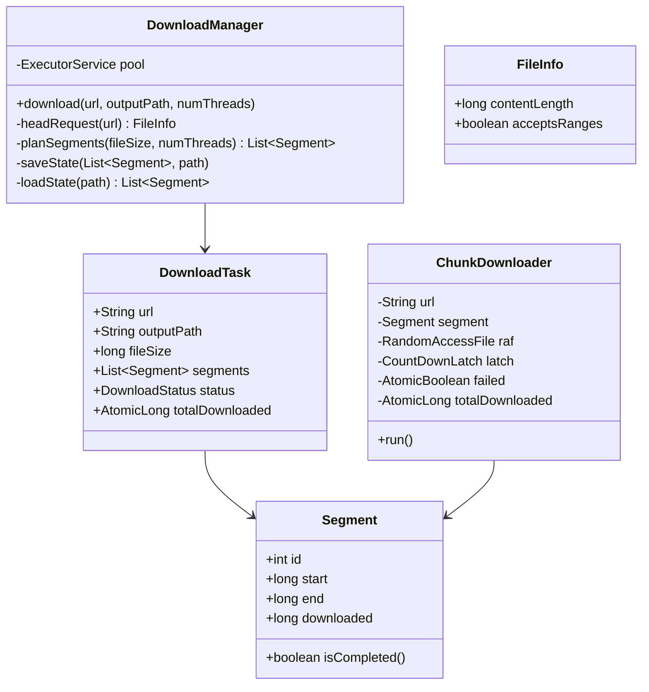

# Design Internet Download Manager (IDM)

> **Difficulty**: Hard
> **Topics**: Concurrency, HTTP Range Requests, File I/O, Crash Recovery
> **Key Concepts**: Parallel chunk downloading, HTTP Range headers, RandomAccessFile for concurrent writes, serialized state for resume.

---

## Real-Life Analogy

Imagine downloading a huge file is like a moving company packing a truck. One person carrying boxes one at a time (single-threaded download) takes all day. Instead, the moving company sends **four workers simultaneously**, each responsible for a different floor of the building. Worker 1 handles floors 1–10, worker 2 handles 11–20, and so on. All four pack in parallel, then the truck leaves when everyone finishes.

The HTTP equivalent: the manager sends a `HEAD` request to learn the total file size, divides it into N equal segments, and gives each `ChunkDownloader` thread a `Range: bytes=start-end` header. The server sends only that slice — `206 Partial Content`. All N threads write their bytes into the correct position of the output file simultaneously using `RandomAccessFile`, which supports seeking to any offset without holding a global lock.

The harder challenge: **crash recovery**. If the program dies at 60%, you don't restart from zero. Each segment serializes its `downloaded` byte offset to disk. On restart, the manager reads those offsets and each worker resumes with `Range: bytes=(start+downloaded)-end`.

---

## Phase 1: Requirements

### Functional Requirements
- **Start download**: Accept a URL and output path; split the file into N parallel segments.
- **Parallel chunk download**: Each segment downloads independently via HTTP `Range` requests.
- **Assemble**: Merge all segment temp files (or offset writes) into the final output file.
- **Pause / Resume**: Serialize segment state; resume from the last committed byte offset.
- **Progress reporting**: Expose downloaded bytes per segment for a UI progress bar.

### Non-Functional Requirements
- **Throughput**: Saturate the network connection by using 4–8 parallel threads.
- **Correctness**: No byte gaps or overlaps; final file must match the server's content byte-for-byte (verified by MD5/SHA-256).
- **Crash safety**: Segment state persisted to disk after every 64 KB chunk written.

### Concurrency Constraints
- Each `ChunkDownloader` writes to a different, non-overlapping offset range in the output file — `RandomAccessFile.seek(offset)` enables this without a global lock.
- A `CountDownLatch` synchronizes the manager thread: it blocks until all N workers signal completion.
- `AtomicLong totalDownloaded` aggregates bytes across threads for live progress display.

---

## Phase 2: Use Cases

### Actors
- **User**: Provides URL; triggers start, pause, resume.
- **DownloadManager**: Coordinates segments and threads; assembles output.
- **ChunkDownloader (Worker)**: Downloads one byte range; writes to file; updates progress.
- **HTTP Server**: Must support `Accept-Ranges: bytes` (otherwise falls back to single-thread).

### UC1: Start Download
**Actor**: User
**Flow**:
1. User calls `manager.download(url, outputPath, threads=4)`.
2. Manager sends `HEAD` request → reads `Content-Length` and `Accept-Ranges` headers.
3. Manager splits total size into 4 segments: `[0, size/4-1]`, `[size/4, size/2-1]`, etc.
4. Creates 4 `ChunkDownloader` threads, submits to `ExecutorService`.
5. Waits on `CountDownLatch(4)`.
6. All threads finish → merge temp files in order → delete temps.

### UC2: Worker Downloads Chunk
**Actor**: ChunkDownloader
**Flow**:
1. Sends `GET` with `Range: bytes=start-end`.
2. Server responds `206 Partial Content` with exactly `(end - start + 1)` bytes.
3. Worker writes bytes to `RandomAccessFile` at logical offset `start`.
4. Every 64 KB, serializes `segment.downloaded` to disk.
5. Calls `latch.countDown()` when complete.

### UC3: Resume After Crash
**Actor**: User
**Flow**:
1. Manager reads `.state` file from disk: `[segmentId, start, end, downloaded]` for each segment.
2. For segment i: if `downloaded > 0`, resume with `Range: bytes=(start+downloaded)-end`.
3. `RandomAccessFile.seek(start + downloaded)` to resume writing at the correct offset.
4. Segments already fully completed (`downloaded == end - start + 1`) are skipped.

---

## Phase 3: Class Diagram

### Core Entities
- **DownloadManager**: Facade. Handles HEAD request, segment planning, thread pool, merge, and state persistence.
- **DownloadTask**: Per-URL download. Holds list of `Segment` objects and overall status.
- **Segment**: Metadata for one byte range — `start`, `end`, `downloaded` (bytes received so far).
- **ChunkDownloader**: `Runnable`. Downloads one `Segment` via an HTTP Range request.

### Key Design Decisions
- Writing all segments to **one `RandomAccessFile`** using `seek(start + downloaded)` is simpler than temp files — no merge step needed. Each segment owns a distinct offset range, so concurrent writes don't collide.
- `Segment` is the unit of state persistence. Serializing just `downloaded` per segment is sufficient for crash recovery — the `start` and `end` bounds are fixed at planning time.
- `CountDownLatch` rather than `Future.get()` in a loop: latch is simpler for "wait for all N" and supports partial failure detection via `AtomicBoolean failed`.



---

## Phase 4: Design Patterns Applied

### 1. Master-Worker Pattern
**What**: `DownloadManager` (master) plans segments and submits `ChunkDownloader` (worker) tasks to an `ExecutorService`. It blocks on a `CountDownLatch` until all workers finish, then performs the sequential merge.
**Why**: Parallel chunk downloading saturates network bandwidth. A single-threaded download leaves most bandwidth idle because the bottleneck is round-trip latency, not raw transfer speed. N=4 parallel streams typically achieves 3–4x throughput improvement over a single connection.

### 2. State Pattern (Download Task Status)
**What**: `DownloadTask` tracks status transitions: `PENDING → DOWNLOADING → PAUSED / FAILED / COMPLETED`. Operations check the current state — `resume()` is a no-op unless status is `PAUSED`.
**Why**: The download lifecycle has several states with different valid transitions. The State pattern prevents invalid operations (e.g., calling `resume()` on a completed task) without scattering `if-else` checks across every method.

### 3. Template Method Pattern (Segment Resume)
**What**: `ChunkDownloader.run()` defines the skeleton: compute effective start → open HTTP connection with Range header → stream bytes → update progress → signal latch. The resume logic (adjusting start by `segment.downloaded`) is the hook that changes between a fresh download and a resumed one.
**Why**: Both fresh download and resume follow the same flow; only the initial byte offset differs. Template method keeps the common flow in one place.

---

## Phase 5: Key Java Implementation

The interesting parts: (a) the **HTTP Range request** with correct `start + downloaded` offset, (b) **`RandomAccessFile` with `seek`** for concurrent offset writes, and (c) **serialized segment state** for crash recovery.

```java
import java.io.*;
import java.net.*;
import java.nio.file.*;
import java.util.*;
import java.util.concurrent.*;
import java.util.concurrent.atomic.*;

// --- Segment: one byte range's metadata ---
class Segment implements Serializable {
    final int id;
    final long start;
    final long end;
    volatile long downloaded; // Bytes successfully written so far

    Segment(int id, long start, long end) {
        this.id = id;
        this.start = start;
        this.end = end;
        this.downloaded = 0;
    }

    boolean isCompleted() { return downloaded >= (end - start + 1); }

    long effectiveStart() { return start + downloaded; } // For resume

    @Override
    public String toString() {
        return String.format("Seg[%d] %d-%d downloaded=%d/%d",
            id, start, end, downloaded, end - start + 1);
    }
}

// --- ChunkDownloader: downloads one segment via Range request ---
class ChunkDownloader implements Runnable {
    private static final int BUFFER_SIZE = 64 * 1024; // 64 KB
    private final String url;
    private final Segment segment;
    private final RandomAccessFile raf;   // Shared file, each segment seeks to its own offset
    private final CountDownLatch latch;
    private final AtomicBoolean failed;
    private final AtomicLong totalDownloaded;

    ChunkDownloader(String url, Segment segment, RandomAccessFile raf,
                    CountDownLatch latch, AtomicBoolean failed, AtomicLong totalDownloaded) {
        this.url = url;
        this.segment = segment;
        this.raf = raf;
        this.latch = latch;
        this.failed = failed;
        this.totalDownloaded = totalDownloaded;
    }

    @Override
    public void run() {
        if (segment.isCompleted()) {
            System.out.printf("  Seg[%d]: already complete, skipping.%n", segment.id);
            latch.countDown();
            return;
        }

        try {
            long resumeFrom = segment.effectiveStart(); // Handles fresh start and crash resume
            System.out.printf("  Seg[%d]: Range bytes=%d-%d (resume from %d)%n",
                segment.id, resumeFrom, segment.end, resumeFrom);

            HttpURLConnection conn = (HttpURLConnection) new URL(url).openConnection();
            conn.setRequestProperty("Range", "bytes=" + resumeFrom + "-" + segment.end);
            conn.connect();

            int responseCode = conn.getResponseCode();
            if (responseCode != 206 && responseCode != 200) {
                throw new IOException("Unexpected response: " + responseCode);
            }

            byte[] buffer = new byte[BUFFER_SIZE];
            try (InputStream in = conn.getInputStream()) {
                int bytesRead;
                while ((bytesRead = in.read(buffer)) != -1) {
                    synchronized (raf) {
                        // Each segment seeks to its current write position
                        // Concurrent segments write to non-overlapping regions — no data races
                        raf.seek(segment.start + segment.downloaded);
                        raf.write(buffer, 0, bytesRead);
                    }
                    segment.downloaded += bytesRead;
                    totalDownloaded.addAndGet(bytesRead);
                }
            }

            segment.downloaded = segment.end - segment.start + 1; // Mark fully complete
            System.out.printf("  Seg[%d]: complete.%n", segment.id);

        } catch (IOException e) {
            System.err.printf("  Seg[%d] FAILED: %s%n", segment.id, e.getMessage());
            failed.set(true);
        } finally {
            latch.countDown();
        }
    }
}

// --- DownloadManager: facade and coordinator ---
public class DownloadManager {
    private static final int DEFAULT_THREADS = 4;

    // Main entry point
    public void download(String url, String outputPath, int numThreads) throws Exception {
        // 1. HEAD request: get file size and check Range support
        HttpURLConnection head = (HttpURLConnection) new URL(url).openConnection();
        head.setRequestMethod("HEAD");
        head.connect();

        long fileSize = head.getContentLengthLong();
        String acceptRanges = head.getHeaderField("Accept-Ranges");
        head.disconnect();

        System.out.printf("File: %s, size=%d bytes, rangesSupported=%s%n",
            url, fileSize, "bytes".equals(acceptRanges));

        // If server doesn't support ranges, fall back to single thread
        int threads = ("bytes".equals(acceptRanges) && fileSize > 0) ? numThreads : 1;

        // 2. Plan segments (or load from state file for resume)
        String stateFile = outputPath + ".state";
        List<Segment> segments = loadOrCreateSegments(stateFile, fileSize, threads);

        // 3. Pre-allocate output file
        RandomAccessFile raf = new RandomAccessFile(outputPath, "rw");
        if (raf.length() < fileSize) raf.setLength(fileSize); // Allocate disk space

        // 4. Launch workers
        ExecutorService pool = Executors.newFixedThreadPool(threads);
        CountDownLatch latch = new CountDownLatch(segments.size());
        AtomicBoolean failed = new AtomicBoolean(false);
        AtomicLong totalDownloaded = new AtomicLong(alreadyDownloaded(segments));

        // Progress reporter thread
        Thread progress = new Thread(() -> {
            while (!Thread.currentThread().isInterrupted()) {
                double pct = 100.0 * totalDownloaded.get() / fileSize;
                System.out.printf("\rProgress: %.1f%% (%d / %d bytes)   ",
                    pct, totalDownloaded.get(), fileSize);
                try { Thread.sleep(500); } catch (InterruptedException e) { break; }
            }
        });
        progress.setDaemon(true);
        progress.start();

        for (Segment seg : segments) {
            pool.submit(new ChunkDownloader(url, seg, raf, latch, failed, totalDownloaded));
        }

        // 5. Wait for all workers to finish
        latch.await();
        progress.interrupt();
        pool.shutdown();
        raf.close();

        if (failed.get()) {
            // Persist state so next run can resume
            saveState(stateFile, segments);
            throw new IOException("Download failed — partial progress saved. Re-run to resume.");
        }

        // 6. Success: delete state file
        Files.deleteIfExists(Paths.get(stateFile));
        System.out.printf("%nDownload complete: %s%n", outputPath);
    }

    // Create fresh segments OR reload interrupted state from disk
    private List<Segment> loadOrCreateSegments(String stateFile, long fileSize, int threads)
            throws IOException, ClassNotFoundException {
        File sf = new File(stateFile);
        if (sf.exists()) {
            System.out.println("Resuming from state file: " + stateFile);
            try (ObjectInputStream ois = new ObjectInputStream(new FileInputStream(sf))) {
                @SuppressWarnings("unchecked")
                List<Segment> saved = (List<Segment>) ois.readObject();
                return saved;
            }
        }

        // Fresh download: divide file into equal segments
        List<Segment> segments = new ArrayList<>();
        long chunkSize = fileSize / threads;
        for (int i = 0; i < threads; i++) {
            long start = i * chunkSize;
            long end   = (i == threads - 1) ? fileSize - 1 : start + chunkSize - 1;
            segments.add(new Segment(i, start, end));
        }
        System.out.println("Created " + threads + " segments.");
        return segments;
    }

    private void saveState(String stateFile, List<Segment> segments) throws IOException {
        try (ObjectOutputStream oos = new ObjectOutputStream(new FileOutputStream(stateFile))) {
            oos.writeObject(segments);
        }
        System.out.println("State saved to " + stateFile);
    }

    private long alreadyDownloaded(List<Segment> segments) {
        return segments.stream().mapToLong(s -> s.downloaded).sum();
    }

    // --- Demo ---
    public static void main(String[] args) throws Exception {
        DownloadManager manager = new DownloadManager();
        // This URL supports Range requests (Hetzner speed test server)
        manager.download(
            "https://speed.hetzner.de/100MB.bin",
            "/tmp/test_100mb.bin",
            4
        );
    }
}
```

---

## Phase 6: Trade-offs and Extensions

### Trade-off: Single output file with `RandomAccessFile.seek` vs. separate temp files per segment
| Approach | Pros | Cons |
|---|---|---|
| Single file + `seek` | No merge step; final file ready immediately | Synchronized `seek+write` on shared `RandomAccessFile`; OS-level locking may still occur |
| Separate temp files per segment | Zero contention — each thread writes its own file | Sequential merge required at the end; double disk usage during download |

For most cases, separate temp files are simpler and avoid the sync overhead. The single-file approach is appropriate when disk space is scarce or the file is very large (merge would double peak disk usage).

### Extension: Pause and Resume
The `ChunkDownloader` checks an `AtomicBoolean paused` flag in its write loop. When `paused` is set, the worker calls `LockSupport.park()`. The manager calls `saveState()` and `LockSupport.unpark()` when the user resumes. On a cold resume (program restart), the manager reads the `.state` file and resumes exactly where each segment left off.

### Extension: Download Verification (Checksum)
After merge, compute `SHA-256` of the output file and compare against the server-provided `Digest` header (or a sidecar checksum file). If they differ, delete the output and restart. This catches bit flips, corrupted partial files from network errors, or server-side CDN inconsistencies.

### Extension: Adaptive Thread Count
Monitor per-segment throughput in the progress reporter. If a segment's throughput drops below a threshold (slow connection or server throttling), split the remaining range of that segment and spawn an additional worker. This adapts to network variability at runtime.

---

## Concurrency Depth

### Why RandomAccessFile + seek Is Safe for Concurrent Writes

This is the subtle insight in the download manager. Each `ChunkDownloader` calls:

```java
synchronized (raf) {
    raf.seek(segment.start + segment.downloaded);
    raf.write(buffer, 0, bytesRead);
}
```

**Why the synchronized block is necessary:** `seek` + `write` is NOT atomic on `RandomAccessFile`. Without synchronization: thread A calls `seek(1000)`, thread B calls `seek(2000)`, then thread A calls `write()` — it writes at offset 2000 (B's position), corrupting both segments.

**Why it's still safe despite synchronized:** each thread holds the lock only for the duration of one `write` call (a few microseconds). Threads block each other at the I/O level, but since they write to non-overlapping byte ranges, the ORDER of writes doesn't matter — the result is always correct. The `synchronized` prevents seek/write interleaving, not the writes themselves.

### Semaphore for Concurrent Download Limit (Multi-File)

When the manager handles multiple simultaneous file downloads, cap total concurrent HTTP connections:

```java
public class DownloadManager {
    // Total HTTP connections across all downloads: bounded by OS socket limit and server rate limits
    private final Semaphore connectionPermits = new Semaphore(200, true);

    private ChunkDownloader createWorker(Segment segment, RandomAccessFile raf, CountDownLatch latch) {
        return new ChunkDownloader(segment, raf, latch, connectionPermits);
    }
}

class ChunkDownloader implements Runnable {
    private final Semaphore permits;

    public void run() {
        permits.acquire(); // wait for a connection slot
        try {
            // open HTTP connection, download chunk
        } finally {
            permits.release();
        }
    }
}
```

**Why:** without a bound, downloading 50 files × 8 threads = 400 concurrent HTTP connections. Most servers rate-limit by IP; 400 connections triggers throttling. The Semaphore enforces a system-wide connection budget.

### Thread-Pool Sizing for Download Workers

```java
// Chunk downloading is pure I/O: waiting on network (RTT ~50-200ms), compute is negligible
// N_threads = N_cpu × (1 + wait_time / compute_time)
// Network I/O: wait = 200ms, compute = 0.5ms → multiplier = 401
// In practice: bound by bandwidth / per-connection throughput
// Rule: numThreads = min(numSegments, bandwidth_mbps / expected_throughput_per_thread_mbps)

// For most users: 8 threads per file is empirically optimal (HTTP server concurrency limit)
// For LAN/local network: more threads help → dynamically pick based on RTT measurement
int threads = detectOptimalThreadCount(url);
ExecutorService pool = Executors.newFixedThreadPool(threads);
```

**Key interview point:** for download managers, the right thread count is NOT derived purely from Little's Law — it's bounded by server-side concurrency limits and network bandwidth saturation. Profile, then cap.

### ReentrantReadWriteLock for Shared Segment State

The progress reporter thread reads segment progress while workers write it:

```java
class Segment {
    private final ReentrantReadWriteLock rwLock = new ReentrantReadWriteLock();
    private long downloaded = 0;

    public void incrementDownloaded(int bytes) {
        rwLock.writeLock().lock();
        try { downloaded += bytes; }
        finally { rwLock.writeLock().unlock(); }
    }

    public long getDownloaded() {
        rwLock.readLock().lock();
        try { return downloaded; }
        finally { rwLock.readLock().unlock(); }
    }
}
```

(Alternatively: use `AtomicLong` — simpler for a single `long` value. Use `ReentrantReadWriteLock` when guarding a struct with multiple fields that must be read/written atomically together.)

---

## SOLID Principles
- **S**: `ChunkDownloader` downloads bytes; `DownloadManager` coordinates segments and state; `Segment` holds progress metadata.
- **O**: Add `FTPChunkDownloader` or `TorrentChunkDownloader` by implementing the same `Runnable` interface — manager submits them identically.
- **L**: Any `Runnable` submitted to the pool can substitute for `ChunkDownloader` from the manager's perspective.
- **I**: `ChunkDownloader` depends only on `Segment`, `RandomAccessFile`, and `CountDownLatch` — no fat interfaces.
- **D**: `DownloadManager` could depend on a `SegmentDownloader` interface injected at construction, enabling protocol-agnostic downloads (HTTP, FTP, SFTP).
