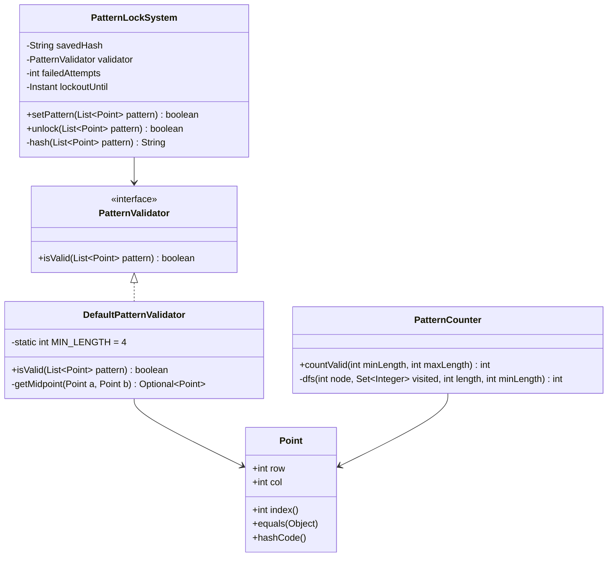

# Design Android Unlock Pattern

> **Difficulty**: Medium
> **Topics**: Graph Theory, DFS/Backtracking, Constraint Validation
> **Key Concepts**: Midpoint formula for skip detection, DFS for counting valid patterns, no-revisit constraint.

---

## Real-Life Analogy

Imagine a **3×3 grid of 9 light switches** on your wall, numbered 1–9 in reading order. You draw a path by flipping switches in sequence. The rules: each switch can only be flipped once (no revisit), you need to flip at least 4 in a row, and — the tricky rule — if two switches are directly across from each other with another switch exactly in between, you must have flipped the middle one first.

For example, switches 1 and 3 are in the same row with switch 2 between them. You cannot jump from 1 directly to 3 unless you've already flipped switch 2. Same for switches 1, 5, 9 along the diagonal — going from 1 to 9 requires that 5 has already been visited. But going from 1 to 6 (a knight's-move-style jump) has nothing in between on the grid, so it's always valid.

The engineering insight: you don't need a hardcoded adjacency table. The **midpoint formula** detects whether an integer grid node lies exactly between two nodes. If `(r1+r2)` is even AND `(c1+c2)` is even, then the midpoint `((r1+r2)/2, (c1+c2)/2)` is an integer grid coordinate — it must already be visited. Otherwise the path between the two nodes passes through no grid point, so the move is unconditionally valid.

---

## Phase 1: Requirements

### Functional Requirements
- **Validate a pattern**: Accept a sequence of grid points; return true if it satisfies all constraints.
  - Minimum 4 dots.
  - No dot visited more than once.
  - Skip rule: if a grid node lies exactly on the line segment between two consecutive dots, that node must already have been visited.
- **Set a saved pattern**: Hash and store a valid pattern as the device's lock.
- **Unlock**: Accept an input pattern; compare its hash against the saved pattern.
- **Count valid patterns**: DFS to enumerate all valid patterns of length k (for security analysis).

### Non-Functional Requirements
- **Correctness**: The midpoint formula must correctly identify all skip-requiring nodes.
- **Latency**: Validation of a 9-dot pattern must complete in <1ms (trivially, since N=9).
- **Security**: Store hashed pattern (not the raw sequence); apply exponential backoff after failed attempts.

### Concurrency Constraints
- Single-user, single-thread validation. No concurrency needed.
- Attempt throttling (for security) uses a timestamp stored alongside the hash; the check is atomic if protected by a file lock or DB transaction.

---

## Phase 2: Use Cases

### Actors
- **User**: Draws a pattern on the touchscreen.
- **PatternLockSystem**: Validates the pattern; stores or compares the hash.

### UC1: Set a Lock Pattern
**Actor**: User
**Flow**:
1. User draws a sequence of dots: `[0,0] → [1,0] → [2,0] → [2,1]`.
2. System calls `validator.isValid(pattern)`.
3. Validator checks: length ≥ 4, no duplicates, skip rule for each consecutive pair.
4. If valid: hash the sequence, store as `savedHash`.
5. Confirm: "Pattern set."

### UC2: Unlock
**Actor**: User
**Flow**:
1. User draws pattern.
2. System hashes the input sequence.
3. Compares with `savedHash`. If equal, unlock. If not, increment attempt counter; apply backoff after 5 failures.

### UC3: Invalid Skip
**Actor**: User
**Flow**:
1. User draws `[0,0] → [0,2]` (row 0, col 0 to row 0, col 2).
2. Midpoint: row=(0+0)/2=0, col=(0+2)/2=1 → grid node `[0,1]`.
3. `[0,1]` not in visited set → move is invalid → pattern rejected.

---

## Phase 3: Class Diagram

### Core Entities
- **PatternLockSystem**: Facade. Stores the hashed pattern; delegates validation; tracks attempt count.
- **PatternValidator**: Strategy interface for validation rules. `DefaultValidator` implements the 3×3 rules.
- **Point**: Value object — `(row, col)` on the 3×3 grid; index = `row*3 + col`.
- **PatternCounter**: Utility that uses DFS to count all valid patterns of a given minimum length (useful for security audits).

### Key Design Decisions
- **Midpoint formula, not a hardcoded skip table**: `if ((r1+r2)%2==0 && (c1+c2)%2==0)` → there is a grid node at `((r1+r2)/2, (c1+c2)/2)` that must be visited. This correctly handles all 8 "skippable" pairs (horizontal, vertical, and two diagonals) without any magic arrays.
- **`PatternValidator` as a Strategy interface**: The lock system accepts any validator — a 4×4 grid variant or a "repeats allowed" variant can be injected without changing `PatternLockSystem`.
- **Hash the sequence, not the path**: The stored value is a string hash of the index sequence. The raw sequence is discarded — smudge attacks can see which nodes were touched, but not the order.



---

## Phase 4: Design Patterns Applied

### 1. Strategy Pattern (PatternValidator)
**What**: `PatternValidator` is an interface injected into `PatternLockSystem`. `DefaultPatternValidator` implements 3×3 rules; a `LenientValidator` could allow revisits or shorter patterns.
**Why**: Android devices ship with different security policies (some enterprise builds allow 3-dot patterns; some grids are 4×4). Making the validator pluggable isolates the rule logic from the system's storage and hashing concerns — changing the rules means swapping the strategy, not editing the lock system.

### 2. DFS / Backtracking (Pattern Counting)
**What**: `PatternCounter` uses DFS from each starting node, tracking the visited set, and recursively extending the path while the skip rule is satisfied. It accumulates a count of all paths of length ≥ `minLength`.
**Why**: The total number of valid patterns (389,112 for 3×3 with min length 4) cannot be computed analytically without exhaustive enumeration. DFS with backtracking is the canonical way to explore this combinatorial space — it's correct, and O(9!) is only ~362,880 total paths, completing in microseconds.

### 3. Facade Pattern (PatternLockSystem)
**What**: `PatternLockSystem` provides three simple methods (`setPattern`, `unlock`, `isLockedOut`) that hide the validator, hashing, and attempt-throttling internals.
**Why**: The caller (the Android UI layer) should not know about skip rules, SHA-256 hashing, or backoff timers. The facade makes the contract simple: draw a pattern, get a boolean.

---

## Phase 5: Key Java Implementation

The interesting parts: (a) the **midpoint formula** for skip detection, (b) the **`isValid` loop** that uses it, and (c) the **DFS counter** for computing total valid pattern count.

```java
import java.util.*;
import java.security.*;

// --- Point: grid position on a 3x3 board ---
class Point {
    final int row, col;

    Point(int row, int col) {
        this.row = row;
        this.col = col;
    }

    // Unique integer index: 0..8
    int index() { return row * 3 + col; }

    @Override
    public boolean equals(Object o) {
        if (!(o instanceof Point)) return false;
        Point p = (Point) o;
        return row == p.row && col == p.col;
    }

    @Override
    public int hashCode() { return Objects.hash(row, col); }

    @Override
    public String toString() { return "(" + row + "," + col + ")"; }
}

// --- PatternValidator interface (Strategy) ---
interface PatternValidator {
    boolean isValid(List<Point> pattern);
}

// --- DefaultPatternValidator: implements 3x3 Android rules ---
class DefaultPatternValidator implements PatternValidator {
    private static final int MIN_LENGTH = 4;
    private static final int GRID_SIZE  = 3;

    @Override
    public boolean isValid(List<Point> pattern) {
        if (pattern == null || pattern.size() < MIN_LENGTH) return false;

        Set<Point> visited = new HashSet<>();
        visited.add(pattern.get(0));

        for (int i = 0; i < pattern.size() - 1; i++) {
            Point curr = pattern.get(i);
            Point next = pattern.get(i + 1);

            // Constraint 1: no dot visited twice
            if (visited.contains(next)) return false;

            // Constraint 2: bounds check
            if (next.row < 0 || next.row >= GRID_SIZE ||
                next.col < 0 || next.col >= GRID_SIZE) return false;

            // Constraint 3: skip rule — check if an integer grid node lies exactly
            // on the straight line between curr and next.
            Optional<Point> mid = getMidpoint(curr, next);
            if (mid.isPresent() && !visited.contains(mid.get())) {
                // There IS a grid node between them, and it hasn't been visited yet
                return false;
            }

            visited.add(next);
        }
        return true;
    }

    // Returns the integer grid node exactly between a and b, if one exists.
    //
    // Key insight: if (a.row + b.row) is EVEN and (a.col + b.col) is EVEN,
    // the midpoint ((a.row+b.row)/2, (a.col+b.col)/2) is an integer coordinate.
    // On a 3x3 grid, any integer coordinate in [0,2]x[0,2] is a real dot.
    //
    // Examples:
    //   (0,0)→(0,2): rowSum=0 (even), colSum=2 (even) → mid=(0,1)  [must be visited]
    //   (0,0)→(2,2): rowSum=2 (even), colSum=2 (even) → mid=(1,1)  [must be visited]
    //   (0,0)→(1,2): rowSum=1 (odd)                   → no mid     [always valid]
    //   (0,0)→(2,1): rowSum=2 (even), colSum=1 (odd)  → no mid     [always valid]
    private Optional<Point> getMidpoint(Point a, Point b) {
        int rowSum = a.row + b.row;
        int colSum = a.col + b.col;

        if (rowSum % 2 != 0 || colSum % 2 != 0) {
            return Optional.empty(); // Fractional midpoint — no grid node between them
        }

        return Optional.of(new Point(rowSum / 2, colSum / 2));
    }
}

// --- PatternLockSystem: facade ---
class PatternLockSystem {
    private String savedHash;
    private final PatternValidator validator;
    private int failedAttempts = 0;
    private static final int MAX_ATTEMPTS = 5;

    PatternLockSystem(PatternValidator validator) {
        this.validator = validator;
    }

    boolean setPattern(List<Point> pattern) {
        if (!validator.isValid(pattern)) {
            System.out.println("Invalid pattern — not saved.");
            return false;
        }
        savedHash = hash(pattern);
        System.out.println("Pattern saved (hash=" + savedHash.substring(0, 8) + "...)");
        return true;
    }

    boolean unlock(List<Point> pattern) {
        if (failedAttempts >= MAX_ATTEMPTS) {
            System.out.println("Account locked. Too many failed attempts.");
            return false;
        }
        if (!validator.isValid(pattern) || savedHash == null) {
            failedAttempts++;
            System.out.println("Unlock failed (" + failedAttempts + "/" + MAX_ATTEMPTS + " attempts).");
            return false;
        }
        if (hash(pattern).equals(savedHash)) {
            failedAttempts = 0;
            System.out.println("Unlocked!");
            return true;
        }
        failedAttempts++;
        System.out.println("Wrong pattern (" + failedAttempts + "/" + MAX_ATTEMPTS + " attempts).");
        return false;
    }

    private String hash(List<Point> pattern) {
        try {
            StringBuilder sb = new StringBuilder();
            for (Point p : pattern) sb.append(p.index()).append(",");
            MessageDigest md = MessageDigest.getInstance("SHA-256");
            byte[] digest = md.digest(sb.toString().getBytes());
            StringBuilder hex = new StringBuilder();
            for (byte b : digest) hex.append(String.format("%02x", b));
            return hex.toString();
        } catch (NoSuchAlgorithmException e) { throw new RuntimeException(e); }
    }
}

// --- PatternCounter: DFS to count all valid patterns ---
// Uses indices 0-8 (index = row*3+col) and the same skip rule.
class PatternCounter {
    // skip[i][j] = the index of the node that must be visited before moving i→j,
    // or -1 if no skip constraint exists.
    // Computed once from the midpoint formula.
    private final int[][] skip = new int[9][9];

    PatternCounter() {
        Arrays.stream(skip).forEach(row -> Arrays.fill(row, -1)); // Default: no skip

        for (int i = 0; i < 9; i++) {
            for (int j = 0; j < 9; j++) {
                int r1 = i / 3, c1 = i % 3;
                int r2 = j / 3, c2 = j % 3;
                int rowSum = r1 + r2, colSum = c1 + c2;
                if (rowSum % 2 == 0 && colSum % 2 == 0) {
                    // Integer midpoint exists at (rowSum/2, colSum/2)
                    skip[i][j] = (rowSum / 2) * 3 + (colSum / 2);
                }
            }
        }
    }

    // Count all valid patterns with length in [minLen, maxLen]
    int countValid(int minLen, int maxLen) {
        int total = 0;
        boolean[] visited = new boolean[9];
        for (int start = 0; start < 9; start++) {
            visited[start] = true;
            total += dfs(start, visited, 1, minLen, maxLen);
            visited[start] = false;
        }
        return total;
    }

    private int dfs(int curr, boolean[] visited, int pathLen, int minLen, int maxLen) {
        int count = (pathLen >= minLen) ? 1 : 0; // Count this path if long enough

        if (pathLen == maxLen) return count; // Reached max depth

        for (int next = 0; next < 9; next++) {
            if (visited[next]) continue; // Already in path

            // Skip rule: if there's a required intermediate node, it must be visited
            int mid = skip[curr][next];
            if (mid != -1 && !visited[mid]) continue; // Skip node not yet visited

            visited[next] = true;
            count += dfs(next, visited, pathLen + 1, minLen, maxLen);
            visited[next] = false;
        }

        return count;
    }

    // --- Demo ---
    public static void main(String[] args) {
        // Validate patterns
        PatternLockSystem system = new PatternLockSystem(new DefaultPatternValidator());

        // Valid L-shape: (0,0)→(1,0)→(2,0)→(2,1) — all adjacent, no skips
        List<Point> valid = Arrays.asList(
            new Point(0,0), new Point(1,0), new Point(2,0), new Point(2,1)
        );
        system.setPattern(valid);
        system.unlock(valid);   // Should unlock

        // Invalid skip: (0,0)→(0,2) skips (0,1) which hasn't been visited
        List<Point> invalidSkip = Arrays.asList(
            new Point(0,0), new Point(0,2), new Point(1,1), new Point(2,0)
        );
        system.setPattern(invalidSkip); // Should print "Invalid pattern"

        // Valid: (0,0)→(0,1)→(0,2) — visited (0,1) first, so (0,0)→(0,2) would be ok later
        List<Point> validSkip = Arrays.asList(
            new Point(0,0), new Point(0,1), new Point(0,2), new Point(1,1)
        );
        system.setPattern(validSkip);

        // Count all valid patterns
        PatternCounter counter = new PatternCounter();
        int total = counter.countValid(4, 9);
        System.out.println("\nTotal valid patterns (length 4-9): " + total);
        // Expected: 389,112
    }
}
```

---

## Phase 6: Trade-offs and Extensions

### Trade-off: Midpoint formula vs. hardcoded skip table
| Approach | Pros | Cons |
|---|---|---|
| Midpoint formula | Generalizes to any NxN grid; no magic arrays | Requires understanding of the math |
| Hardcoded skip table | Explicit, easy to read for 3×3 | Breaks on 4×4 or non-square grids; error-prone to write |

The midpoint formula is strictly superior for any production implementation. The 3×3 skip table has exactly 8 pairs that require a midpoint: (0,2), (2,0), (6,8), (8,6) — horizontal/vertical — and (0,8), (8,0), (2,6), (6,2) — diagonal. The formula derives all 8 without enumeration.

### Extension: 4×4 Grid
Replace `GRID_SIZE = 3` with `GRID_SIZE = 4` and adjust `index() = row * 4 + col`. The midpoint formula works identically — no other code changes needed. On a 4×4 grid, many more pairs have a skip requirement (e.g., (0,0)→(0,2) has midpoint (0,1); (0,0)→(0,3) has midpoint (0,1.5) — not an integer, so no skip needed).

### Extension: Security Throttling
After `MAX_ATTEMPTS` failures, set `lockoutUntil = Instant.now().plus(duration)` with exponential backoff: first lockout = 30s, second = 60s, third = 5 min, fourth = 30 min, fifth = wipe. Check `Instant.now().isAfter(lockoutUntil)` on each unlock attempt.

### Extension: Pattern Strength Meter
Use `PatternCounter.dfs` logic inversely — count how many other patterns share the same starting node, same length, and same first segment direction. A pattern that starts with a common move (e.g., horizontal) is statistically weaker. Assign a "strength score" based on directional uniqueness and path length.

---

## SOLID Principles
- **S**: `DefaultPatternValidator` owns the skip logic; `PatternLockSystem` owns auth state and throttling; `PatternCounter` owns the DFS enumeration.
- **O**: New validation rules (allow revisits, 4×4 grid) extend `PatternValidator` without changing `PatternLockSystem`.
- **L**: `DefaultPatternValidator` and any future `LenientValidator` are interchangeable anywhere `PatternValidator` is expected.
- **I**: `PatternValidator` has a single method (`isValid`) — no fat interface.
- **D**: `PatternLockSystem` depends on the `PatternValidator` abstraction injected at construction, not on `DefaultPatternValidator` directly.
