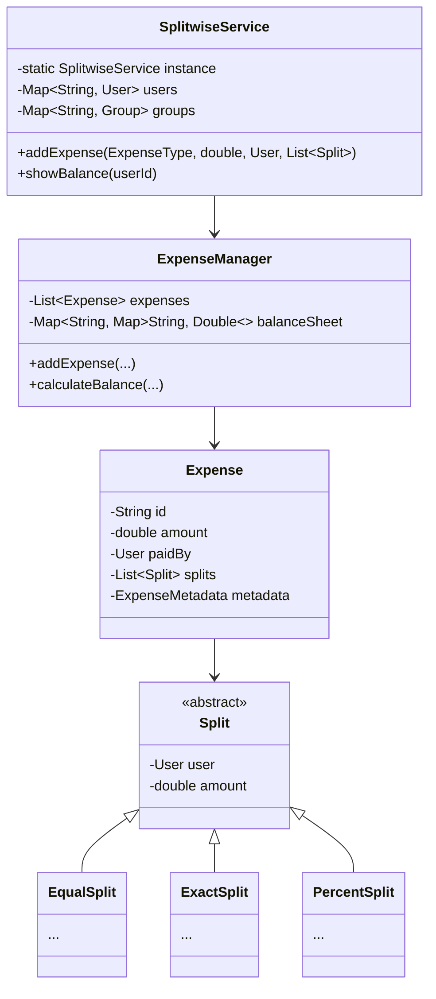

# Design Splitwise

> **Difficulty**: Medium
> **Topics**: Strategy Pattern, Graph Simplification, Observer Pattern
> **Key Concepts**: Managing debts, different split types (Equal, Exact, Percent).

---

## What Breaks Without This Design?

```python
class Splitwise:
    # One God class with all data and logic
    def __init__(self) -> None:
        self._balances: dict[str, dict[str, float]] = {}
        # balances[user_a][user_b] = amount a owes b

    def add_expense(self, payer: str, participants: list[str],
                    amount: float, split_type: str, values: list[float]) -> None:
        if split_type == "EQUAL":
            share = amount / len(participants)
            for p in participants:
                if p != payer:
                    # update nested dict
                    self._balances.setdefault(p, {})
                    self._balances[p][payer] = self._balances[p].get(payer, 0) + share
        elif split_type == "EXACT":
            for i, p in enumerate(participants):
                if p != payer:
                    self._balances.setdefault(p, {})
                    self._balances[p][payer] = self._balances[p].get(payer, 0) + values[i]
        elif split_type == "PERCENT":
            # validate sum of percentages == 100 inline in this method
            if abs(sum(values) - 100) > 0.01:
                raise ValueError("Bad %")
            # split logic inline...
        # Adding a 4th split type requires editing this method
```

**Concrete failures**:
1. **OCP violation**: Every new split type (e.g., shares-based) requires editing `addExpense()`. The validation and distribution logic for every type lives in one method.
2. **Validation is inline**: The "percentages must sum to 100" check is buried inside `addExpense`. It cannot be tested independently or reused.
3. **No `Expense` entity**: There is no record of what was paid, by whom, when. Balance simplification and audit trail are impossible.
4. **Circular debt not handled**: `balances[A][B] = 30` and `balances[B][A] = 50` are two separate entries. Net balance is not computed — you need to scan both directions to find "B owes A $20 net."

---

## Derive the Class Structure

**Force 1 — Split calculation varies by type**: Equal, Exact, and Percent require different algorithms to compute each participant's share. Extract `SplitStrategy` interface with `calculateShares(amount, participants, values)`. Each split type is its own strategy class. Validation moves into the strategy (percent strategy validates sum == 100 in its own `validate()` method).

**Force 2 — Expenses need an audit trail**: Without an `Expense` entity, you cannot show "who paid what when." Introduce `Expense` (payer, amount, participants, strategy, timestamp).

**Force 3 — Balance is a derived view, not primary data**: The nested `Map<String, Map<String, Double>>` stores redundant data. A cleaner model: store `Expense` objects; derive balances by summing over expenses. Or store a single `balances[userA][userB]` updated on each expense (simpler for real-time reads).

**Force 4 — Simplify debts is a separate algorithm**: The graph simplification (min transactions to settle) is complex enough to be its own class. It reads the balance map and produces a payment plan. If it lives in `Splitwise`, that class grows unboundedly.

**Result** — the class split these forces produce:
```
God class → SplitwiseService (orchestration: add expense, update balances)
          → Expense (entity: payer, amount, split, timestamp)
          → SplitStrategy (interface: validate + calculateShares)
             → EqualSplit, ExactSplit, PercentSplit
          → BalanceSheet (per-user balance map, net balance query)
          → DebtSimplifier (graph algorithm: min transactions)
          → Group (collection of users + their shared expenses)
```

---

## Real-Life Analogy

**A group of friends on a trip who take turns paying for things.**

Alice pays for dinner ($120 for 4 people). Bob pays for the hotel ($200 for 4 people). Charlie pays for the car rental ($160 for 4 people). At the end of the trip, nobody wants to do 6 separate wire transfers.

Key observations:
- There is a **balance sheet** (a graph): for each pair of users, one person owes the other some net amount.
- When Alice pays $120 split equally: Bob, Charlie, and Diana each owe Alice $30.
- When Bob pays $200: Alice, Charlie, Diana each owe Bob $50. But Alice already has Bob owing her $30 from before — the net is Alice owes Bob $20.
- The balance sheet is **bidirectional**: if Alice owes Bob $20, then Bob is owed $20 by Alice. They're the same edge.
- The smart feature is **"Simplify Debts"**: instead of N*(N-1) transactions, find the minimum number of payments that clears all debts. This is a graph problem solved with a Min-Heap/Max-Heap.

---

## Phase 1: Requirements Gathering

### Goals
- Design an expense sharing application.
- Identify users, groups, and expense types.
- Define how debts are recorded and settled.

### 1. Who are the actors?
- **User**: Adds expenses, views balances, settles debts.
- **Group**: A collection of users sharing expenses.
- **System**: Calculates splits and updates balances.

### 2. What are the must-have features? (Core)
- **Add Expense**: User pays, others owe.
- **Split Types**: Support Equal, Exact, and Percentage splits.
- **Balance Sheet**: Show net balance per user.
- **Settle Up**: Record payments to clear debts.

### 3. What are the constraints?
- **Validation**: Percentages must add to 100%. Exact amounts must equal total.
- **Precision**: Handle currency rounding (2 decimal places).

---

## Phase 2: Use Cases

### UC1: Add Expense
**Actor**: User
**Flow**:
1. User selects a group or friends.
2. User enters total amount and selects split type (e.g., Equal).
3. System validates the split.
4. System calculates individual shares.
5. System updates the Balance Sheet (Graph).
6. System notifies involved users.

### UC2: Settle Up
**Actor**: User
**Flow**:
1. User A pays User B X amount.
2. System records a "Payment" transaction.
3. System updates the debt graph (A owes B reduced by X).

---

## Phase 3: Class Diagram

### Step 1: Core Entities
- **SplitwiseService**: Facade for operations.
- **ExpenseManager**: Manages expenses and balances.
- **Expense**: Stores details (amount, payer, splits).
- **Split**: Abstract class for split logic.
- **User**: Participant.

### Step 2: Relationships
- `Expense` **has-many** `Split`.
- `Split` **references** `User`.
- `ExpenseManager` **has-many** `Expense`.

### UML Diagram



---

## Phase 4: Design Patterns

### 1. Strategy Pattern
- **Description**: Defines a family of algorithms, encapsulates each one, and makes them interchangeable.
- **Why used**: Different split types (`EqualSplit`, `ExactSplit`, `PercentSplit`) require different validation and calculation logic. Strategy allows adding new split types easily.

### 2. Observer Pattern
- **Description**: Defines a one-to-many dependency between objects so that when one object changes state, all its dependents are notified and updated automatically.
- **Why used**: To notify group members when an expense is added, modified, or settled, ensuring all users have up-to-date balance information.

---

## Phase 5: Code Key Methods

### Python Implementation

```python
from __future__ import annotations
from dataclasses import dataclass, field
from abc import ABC

# 1. Core Entities
@dataclass
class User:
    user_id: str
    name: str

class Split(ABC):
    def __init__(self, user: User) -> None:
        self.user = user
        self.amount: float = 0.0

class EqualSplit(Split):
    def __init__(self, user: User) -> None:
        super().__init__(user)

class ExactSplit(Split):
    def __init__(self, user: User, amount: float) -> None:
        super().__init__(user)
        self.amount = amount

# 2. Expense Model
@dataclass
class Expense:
    amount: float
    paid_by: User
    splits: list[Split]

# 3. Manager
class ExpenseManager:
    def __init__(self) -> None:
        self._expenses: list[Expense] = []
        self._balance_sheet: dict[str, dict[str, float]] = {}  # user_id → (owed_user_id → amount)

    def add_expense(self, amount: float, paid_by: User, splits: list[Split]) -> None:
        expense = Expense(amount=amount, paid_by=paid_by, splits=splits)
        self._expenses.append(expense)

        for split in splits:
            paid_to = split.user.user_id
            payer_id = paid_by.user_id

            # payer receives (+amount) from split user
            payer_row = self._balance_sheet.setdefault(payer_id, {})
            payer_row[paid_to] = payer_row.get(paid_to, 0.0) + split.amount

            # split user owes (-amount) to payer
            debtor_row = self._balance_sheet.setdefault(paid_to, {})
            debtor_row[payer_id] = debtor_row.get(payer_id, 0.0) - split.amount

    def show_balance(self, user_id: str) -> None:
        print(f"Balance for {user_id}:")
        balances = self._balance_sheet.get(user_id)
        if not balances:
            print("No balances.")
            return
        for other_id, amount in balances.items():
            if amount != 0:
                self._print_balance(user_id, other_id, amount)

    def _print_balance(self, user1: str, user2: str, amount: float) -> None:
        if amount < 0:
            print(f"{user1} owes {user2}: {abs(amount)}")
        elif amount > 0:
            print(f"{user2} owes {user1}: {amount}")

# 4. Client
if __name__ == "__main__":
    u1 = User("u1", "Alice")
    u2 = User("u2", "Bob")
    u3 = User("u3", "Charlie")

    manager = ExpenseManager()

    # Equal Split: Alice paid 300 for Alice, Bob, Charlie (100 each)
    # Note: The logic to divide 300 by 3 would be in the Service layer before creating EqualSplit objects

    # Alice pays 300 total.
    # Bob owes Alice 100; Charlie owes Alice 100.
    s2 = EqualSplit(u2); s2.amount = 100
    s3 = EqualSplit(u3); s3.amount = 100

    manager.add_expense(300, u1, [s2, s3])

    manager.show_balance("u2")  # Bob owes ...
    manager.show_balance("u1")  # Alice is owed ...
```

---

## Phase 6: Discussion

### Debt Simplification — The Core Algorithm

**Q: How to minimize the number of transactions needed to settle all debts?**

The naive approach (pay each debt individually) results in up to N*(N-1) transactions for N users. The optimized approach uses net balances and a greedy Min-Heap/Max-Heap strategy to find the minimum number of transactions.

**Intuition**: If Alice owes Bob $30 and Charlie owes Bob $20, instead of two transactions, Bob just needs to receive $50. We don't care *who* pays it — we just match creditors against debtors by net balance.

**Algorithm**:
1. Compute each user's net balance: `netBalance[user] = (total paid by user) - (total owed by user)`.
   - Positive net = creditor (others owe them).
   - Negative net = debtor (they owe others).
2. Push all creditors (net > 0) into a **Max-Heap** (largest creditor first).
3. Push all debtors (net < 0) into a **Min-Heap** (largest debtor first, by absolute value).
4. While both heaps are non-empty:
   - Pop the largest creditor `C` (owed the most) and largest debtor `D` (owes the most).
   - Settle `amount = min(|D.net|, C.net)`.
   - Record transaction: `D pays C amount`.
   - Update: `C.net -= amount`, `D.net += amount`.
   - Push back to respective heap if remaining balance ≠ 0.
5. Stop when both heaps are empty. Total transactions = number of settlements recorded.

**Why this minimizes transactions**: Greedy matching of the largest debtor against the largest creditor ensures each transaction either fully clears one party (removing them from the heap) or both parties. In the worst case, N-1 transactions settle N users.

```python
import heapq

class DebtSimplifier:
    """
    Given a balance_sheet: user_id -> (other_user_id -> net_amount)
    Positive amount means "other_user owes user_id".
    Negative amount means "user_id owes other_user".

    Returns the minimum list of transactions to settle all debts.
    """

    def simplify_debts(self, balance_sheet: dict[str, dict[str, float]]) -> list[str]:
        # Step 1: Compute net balance per user
        net_balance: dict[str, float] = {}
        for user, others in balance_sheet.items():
            for amount in others.values():
                # positive = user is owed, negative = user owes
                net_balance[user] = net_balance.get(user, 0.0) + amount

        # Step 2: Separate into creditors (positive) and debtors (negative)
        # Max-heap via negation (Python only has min-heap)
        creditors: list[tuple[float, str]] = []  # (-net, user_id) — largest creditor first
        debtors: list[tuple[float, str]] = []    # (-abs_debt, user_id) — largest debtor first

        for user, net in net_balance.items():
            if abs(net) < 0.01:
                continue  # skip zero balances
            if net > 0:
                heapq.heappush(creditors, (-net, user))
            else:
                heapq.heappush(debtors, (net, user))  # already negative → min-heap = most negative first

        # Step 3: Greedy matching
        transactions: list[str] = []
        while creditors and debtors:
            neg_credit, creditor = heapq.heappop(creditors)
            debt, debtor = heapq.heappop(debtors)

            credit = -neg_credit       # positive amount creditor is owed
            abs_debt = -debt           # positive amount debtor owes

            settle = min(credit, abs_debt)
            transactions.append(f"{debtor} pays {creditor}: ${settle:.2f}")

            remaining_credit = credit - settle
            remaining_debt = abs_debt - settle

            if remaining_credit > 0.01:
                heapq.heappush(creditors, (-remaining_credit, creditor))
            if remaining_debt > 0.01:
                heapq.heappush(debtors, (-remaining_debt, debtor))

        return transactions


if __name__ == "__main__":
    # Example: Alice paid for Bob ($100) and Charlie ($50)
    # Bob paid for Charlie ($80)
    # Net: Alice +150, Bob -100+80 = -20, Charlie -50-80 = -130...
    # (simplified manual example)

    sheet: dict[str, dict[str, float]] = {
        "Alice":   {"Bob": 100.0, "Charlie": 50.0},
        "Bob":     {"Alice": -100.0, "Charlie": 80.0},
        "Charlie": {"Alice": -50.0, "Bob": -80.0},
    }

    simplifier = DebtSimplifier()
    for tx in simplifier.simplify_debts(sheet):
        print(tx)
```

**Complexity**:
- Time: O(N log N) — heap operations, where N = number of users with non-zero balance.
- Space: O(N) — for the heaps.

### Scalability
**Q: How to handle millions of users in different groups?**
- A: "Use **Consistent Hashing** to shard the database. Since most expenses are within a `Group`, shard by `GroupID` and ensure all group data resides on the same DB shard to avoid expensive cross-shard transactions when adding expenses or settling up."

### Concurrency
**Q: Handling race conditions (two people editing same expense)?**
- A: "Use **Optimistic Locking** (versioning) on the Expense object. If version mismatch during save, prompt user to refresh. If high contention is expected, queue updates per group in Kafka and process them sequentially via a dedicated worker."

### Financial Precision (SDE-3 Concept)
**Q: How do you handle $100 split 3 ways ($33.33)? Who pays the extra $0.01?**
- A: "Use `BigDecimal` for all calculations to prevent floating-point errors. For rounding remainders: calculate exact shares (`amount / participants`). Distribute the integer pennies evenly. If there's a remainder (e.g., $100 / 3 = $33.33 with $0.01 left over), distribute the remaining pennies randomly or give them to the payer."

---

## SOLID Principles Checklist

- **S (Single Responsibility)**: `Expense` stores data, `ExpenseManager` calculates logic, `Split` defines type.
- **O (Open/Closed)**: New `Split` types (e.g., specific share) can be added by extending `Split`.
- **L (Liskov Substitution)**: `EqualSplit` works wherever `Split` is needed.
- **I (Interface Segregation)**: Not heavily used, but interfaces are clean.
- **D (Dependency Inversion)**: `ExpenseManager` depends on `Split` abstraction.

---

## Interview Questions Asked

### Amazon
1. **"Design an expense sharing app like Splitwise"** → Probe: data model for splits, debt simplification, concurrency on group expenses. Hint: `Expense` owns list of `Split` objects (EqualSplit, ExactSplit, PercentSplit); net balance per user computed as sum of all splits; simplify debts by reducing N*(N-1) edges to at most N-1 transactions using net balance + max-heap/min-heap.

### Common Follow-ups
1. **"Walk me through the debt simplification (graph reduction) algorithm"** → Compute net balance per user (positive = owed money, negative = owes money); use two heaps (max creditor, max debtor); repeatedly match largest creditor with largest debtor, settle min(credit, debt), push remainder back — produces minimum number of transactions in O(N log N).
2. **"How do you handle currency conversion in a multi-currency group?"** → Store all amounts in a base currency (USD) using exchange rate at time of expense creation; display in user's preferred currency using stored rate; avoid re-converting at settlement time (rate may have changed); record exchange_rate and original_currency on each `Expense` for transparency.
3. **"What happens if a payment fails mid-settlement?"** → Use database transactions: debit payer and credit payee atomically; on failure, roll back — both balances unchanged; surface error to user with retry option; for external payment (UPI/Stripe), use idempotency key so retrying the same settlement doesn't double-charge; record payment status (`PENDING`, `COMPLETED`, `FAILED`).
4. **"How do you handle a group expense with unequal splits — percentage vs exact amount?"** → Strategy Pattern: `Split` interface with `calculateShare(totalAmount, participants)`; `PercentSplit` stores percentage per user; `ExactSplit` stores fixed amount per user; `EqualSplit` divides evenly; validation: sum of percentages must equal 100%, sum of exact amounts must equal total — enforce at `Expense` creation time.
