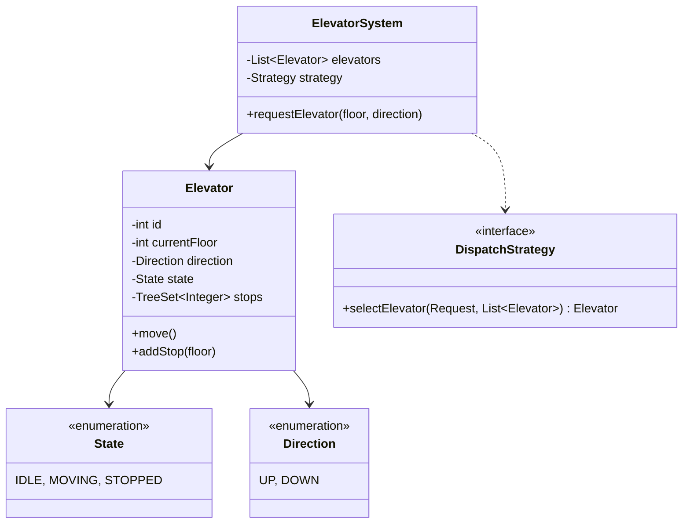

# Design Elevator System

> **Difficulty**: Medium
> **Topics**: State Design Pattern, Strategy Pattern, Scheduling Algorithm (SCAN)
> **Key Concepts**: Concurrency, Request Optimization, State Management.

---

## What Breaks Without This Design?

```java
class ElevatorSystem {
    private int[] elevatorFloors;  // current floor of each elevator
    private String[] elevatorStates; // "IDLE", "UP", "DOWN"
    private List<int[]> requests = new ArrayList<>(); // [floor, direction]

    public void requestElevator(int floor, String direction) {
        requests.add(new int[]{floor, 1});
        // Which elevator do we assign? Pick the first idle one:
        for (int i = 0; i < elevatorFloors.length; i++) {
            if (elevatorStates[i].equals("IDLE")) {
                elevatorStates[i] = elevatorFloors[i] < floor ? "UP" : "DOWN";
                // move elevator:
                while (elevatorFloors[i] != floor) {
                    elevatorFloors[i] += elevatorStates[i].equals("UP") ? 1 : -1;
                    // check all requests at this floor inline
                    for (int[] req : requests) {
                        if (req[0] == elevatorFloors[i]) {
                            openDoors(i); // string-based state, no state machine
                        }
                    }
                }
                break;
            }
        }
    }
}
```

**Concrete failures**:
1. **No SCAN/LOOK scheduling**: The code assigns the first idle elevator without checking proximity or direction. An elevator at floor 20 heading down gets assigned a floor-1 request, while a floor-2 elevator is idle — inefficient dispatching.
2. **String-based state**: `elevatorStates[i].equals("IDLE")` has no compile-time safety. Typo "IDEL" compiles and silently fails. State transitions (moving → doors open → idle) are scattered across methods.
3. **Illegal transitions compile**: Nothing prevents `openDoors()` while the elevator is moving — the string check can be bypassed.
4. **Single-threaded assumption**: Multiple concurrent requests from different floors corrupt `requests` and `elevatorFloors` arrays with no synchronization.
5. **Dispatch logic in the God class**: The algorithm for "which elevator to assign" (SCAN, nearest-car) is inline in `requestElevator()`, making it impossible to swap.

---

## Derive the Class Structure

**Force 1 — Elevator behavior is state-dependent**: An elevator behaves completely differently when IDLE, MOVING_UP, MOVING_DOWN, or DOORS_OPEN. The same action (e.g., "add stop request") is valid in MOVING_UP but illegal in DOORS_OPEN. Extract a `State` interface with per-action methods. Each state is a class that handles actions appropriate to it and rejects invalid ones.

**Force 2 — Each elevator is an independent entity**: An elevator has its own floor, state, and stop queue. It is not a row in an array. Extract `Elevator` class with its own `currentFloor`, `state`, and `TreeSet<Integer> stops` (sorted so SCAN works naturally).

**Force 3 — Dispatch algorithm must be swappable**: The rule "pick the closest elevator moving in the right direction" is one scheduling strategy. A simpler rule (round-robin) is another. Extract `DispatchStrategy` interface; `SCANDispatcher` is one implementation.

**Force 4 — External and internal requests are different**: Pressing floor 5 from a hallway (external request) and pressing floor 5 inside the car (internal request) have different semantics. External requests go to the dispatcher; internal requests go directly to the assigned elevator's stop queue.

**Force 5 — Concurrent requests need thread safety**: Multiple passengers press buttons simultaneously. The elevator's stop queue must be thread-safe (`Collections.synchronizedSortedSet` or `ConcurrentSkipListSet`).

**Result** — the class split these forces produce:
```
God class → ElevatorController (Singleton dispatcher, holds elevators + strategy)
          → Elevator (floor, state, stop queue, door control)
          → ElevatorState (interface: handleExternalRequest, handleInternalRequest, move)
             → IdleState, MovingUpState, MovingDownState, DoorsOpenState
          → DispatchStrategy (interface: selectElevator(floor, direction))
             → SCANDispatcher, NearestCarDispatcher
          → Request (floor + direction, immutable)
```

---

## Real-Life Analogy

**An elevator in a tall office building during morning rush hour.**

Imagine 20 floors, 3 elevators. At 9 AM, everyone is arriving. Floor 1 has 10 people pressing UP. Floors 3, 7, 12 also have people waiting.

Key observations:
- An elevator does not run back and forth randomly — it sweeps in one direction (UP), stopping at every floor that was requested, then reverses and sweeps DOWN. This is the **SCAN / LOOK algorithm**, also called the "elevator algorithm."
- Each elevator has its own internal stop list. When you press a button inside the car, your floor is added to that elevator's stop set.
- When you press a button on a floor, a **dispatcher** decides which elevator to send. It does not assign randomly — it picks the closest one moving in the right direction.
- The elevator has distinct states: IDLE (waiting), MOVING_UP, MOVING_DOWN, DOORS_OPEN. Its behavior is different in each state — e.g., you cannot open doors while moving.

---

## Phase 1: Requirements Gathering

### Goals
- Design a smart elevator system for a building (M floors, N elevators).
- Efficiently schedule elevators to minimize wait time.
- Handle concurrent requests safely.

### 1. Who are the actors?
- **Passenger**: Presses buttons inside or outside the elevator.
- **System**: Dispatches elevators and manages their state.

### 2. What are the must-have features? (Core)
- **External Request**: User presses Up/Down button on a floor.
- **Internal Request**: User presses a specific floor button inside the elevator.
- **Scheduling**: Algorithm to decide which elevator services a request.
- **Door Control**: Open/Close logic based on state.
- **Safety**: Don't change direction mid-flight unless idle; respect capacity (optional).

### 3. What are the constraints?
- **Real-time**: Decisions must be made instantly.
- **Optimization**: Prefer minimizing wait time vs. minimizing power (usually wait time).

---

## Phase 2: Use Cases

### UC1: Request Elevator (External)
**Actor**: Passenger
**Flow**:
1. Passenger on Floor X presses 'UP'.
2. System receives `ExternalRequest(Floor X, UP)`.
3. Dispatcher selects the best elevator (e.g., closest moving UP or Idle).
4. Elevator adds Floor X to its stop list.
5. Elevator arrives at Floor X, opens doors.

### UC2: Select Destination (Internal)
**Actor**: Passenger
**Flow**:
1. Passenger enters elevator and presses 'Floor Y'.
2. System receives `InternalRequest(ElevatorID, Floor Y)`.
3. Elevator adds Floor Y to its stop list.
4. Elevator moves to Floor Y.

---

## Phase 3: Class Diagram

### Step 1: Core Entities
- **ElevatorSystem**: Singleton controller.
- **Elevator**: The physical car.
- **Request**: External (Floor, Direction) or Internal (Floor).
- **Dispatcher**: Implementation of scheduling logic.
- **State**: Enum (IDLE, MOVING_UP, MOVING_DOWN).

### UML Diagram



---

## Phase 4: Design Patterns

### 1. Strategy Pattern
- **Description**: Defines a family of algorithms, encapsulates each one, and makes them interchangeable.
- **Why used**: The elevator dispatching logic (`DispatchStrategy`) can vary (First-Come-First-Serve, Shortest Seek Time First, SCAN/Elevator Algorithm). Strategy allows hot-swapping these algorithms based on traffic patterns (e.g., Morning Rush vs. Idle time).

### 2. State Pattern
- **Description**: Allows an object to alter its behavior when its internal state changes.
- **Why used**: An Elevator has different valid actions depending on its state (e.g., cannot `move()` if `DoorsOpen`, cannot `openDoors()` if `Moving`). State pattern encapsulates this logic, preventing invalid transitions.

---

## Phase 5: Code Key Methods

### Java Implementation

```java
import java.util.*;

// 1. Enums
enum Direction { UP, DOWN }
enum State { IDLE, MOVING_UP, MOVING_DOWN }

// 2. Request Wrapper
class Request {
    int floor;
    Direction direction; // null for internal requests if needed, or separate class
    public Request(int floor, Direction direction) {
        this.floor = floor;
        this.direction = direction;
    }
}

// 3. Elevator (The Worker)
class Elevator {
    int id;
    int currentFloor;
    State state;
    
    // Using TreeSet to keep stops sorted. 
    // Two sets: one for floors above (processing UP), one for floors below (processing DOWN).
    // This simplifies the LOOK algorithm logic.
    TreeSet<Integer> upStops = new TreeSet<>();
    TreeSet<Integer> downStops = new TreeSet<>((a, b) -> b - a); // Reverse order

    public Elevator(int id) {
        this.id = id;
        this.currentFloor = 0; // Ground floor
        this.state = State.IDLE;
    }

    public synchronized void addStop(int floor) {
        if (floor > currentFloor) {
            upStops.add(floor);
            if (state == State.IDLE) state = State.MOVING_UP;
        } else if (floor < currentFloor) {
            downStops.add(floor);
            if (state == State.IDLE) state = State.MOVING_DOWN;
        } else {
            // Already here, open doors (omitted)
        }
        System.out.println("Elevator " + id + " added floor: " + floor);
    }

    // Simulate movement step (e.g., called every second by a scheduler loop)
    public void move() {
        if (state == State.IDLE) return;

        if (state == State.MOVING_UP) {
            if (!upStops.isEmpty()) {
                int next = upStops.higher(currentFloor) != null ? upStops.higher(currentFloor) : upStops.first();
                // Simulation jump (in reality, currentFloor++)
                if (next > currentFloor) currentFloor++; 
                
                if (upStops.contains(currentFloor)) {
                    System.out.println("Elevator " + id + " stopping at " + currentFloor);
                    upStops.remove(currentFloor);
                }
            }
            if (upStops.isEmpty()) {
                state = downStops.isEmpty() ? State.IDLE : State.MOVING_DOWN;
            }
        } else if (state == State.MOVING_DOWN) {
            if (!downStops.isEmpty()) {
                int next = downStops.higher(currentFloor) != null ? downStops.higher(currentFloor) : downStops.first(); // 'higher' in reverse set is logically lower
                if (next < currentFloor) currentFloor--;
                
                if (downStops.contains(currentFloor)) {
                    System.out.println("Elevator " + id + " stopping at " + currentFloor);
                    downStops.remove(currentFloor);
                }
            }
            if (downStops.isEmpty()) {
                state = upStops.isEmpty() ? State.IDLE : State.MOVING_UP;
            }
        }
    }
}

// 4. Dispatcher Strategy
class ElevatorController {
    List<Elevator> elevators;

    public ElevatorController(int numElevators) {
        elevators = new ArrayList<>();
        for (int i = 0; i < numElevators; i++) {
            elevators.add(new Elevator(i + 1));
        }
    }

    public void requestElevator(int floor, Direction dir) {
        // Strategy: Find nearest elevator moving in same direction or IDLE
        // This is a simplified dispatch logic.
        Elevator best = null;
        int minDistance = Integer.MAX_VALUE;

        for (Elevator e : elevators) {
            int dist = Math.abs(e.currentFloor - floor);
            // In a real interview, elaborate on this logic:
            // If e is moving UP and floor > current, it's a candidate.
            // If e is moving UP and floor < current, it's NOT a candidate (unless it wraps around).
            
            if (dist < minDistance) {
                minDistance = dist;
                best = e;
            }
        }
        
        if (best != null) {
            best.addStop(floor);
        }
    }
    
    // Simulate time passing
    public void step() {
        for(Elevator e : elevators) e.move();
    }
}

// 5. Client
public class ElevatorDemo {
    public static void main(String[] args) {
        ElevatorController system = new ElevatorController(1);
        
        System.out.println("-- Person at Floor 5 presses UP --");
        system.requestElevator(5, Direction.UP);
        
        // Simulating ticks
        system.step(); // 0 -> 1
        system.step(); // 1 -> 2
        system.step(); // 2 -> 3
        system.step(); // 3 -> 4
        system.step(); // 4 -> 5 (Stop)
    }
}
```

---

## Phase 6: Discussion

### SCAN Algorithm — Detailed Explanation

The SCAN (and its variant LOOK) algorithm is the core of how a real elevator works. Understanding it is essential for this design.

**SCAN Algorithm**:
The elevator moves in one direction (say UP), servicing all stop requests in that direction until it reaches the top floor (or the highest requested floor in LOOK). Then it reverses direction and sweeps DOWN, servicing all stops in that direction. It keeps oscillating like a pendulum.

```
SCAN pseudocode:
  direction = UP
  loop:
    move one floor in current direction
    if current floor is in stops:
        open doors, service request, remove from stops
    if no more stops in current direction OR reached boundary:
        reverse direction
    if no stops at all:
        become IDLE
```

**LOOK (Preferred over SCAN)**:
LOOK is like SCAN, but the elevator does NOT go all the way to the top/bottom floor — it only goes as far as the highest/lowest pending request. This saves unnecessary travel.

```
LOOK pseudocode:
  direction = UP
  loop:
    if direction == UP:
        next = upStops.first()  // smallest floor above current
        move toward next
        if arrived at next: service it, remove from upStops
        if upStops is empty: direction = DOWN (or IDLE)
    
    if direction == DOWN:
        next = downStops.first()  // largest floor below current (sorted descending)
        move toward next
        if arrived at next: service it, remove from downStops
        if downStops is empty: direction = UP (or IDLE)
```

**Why TreeSet?**: `TreeSet<Integer>` keeps floors sorted automatically. For UP travel, `upStops.higher(currentFloor)` returns the next floor above current in O(log n). For DOWN travel, a reverse-sorted `downStops` with `downStops.first()` gives the largest floor below current in O(1). Removals are O(log n). This is the natural fit for the LOOK algorithm.

**Trace Example**:
```
Elevator at Floor 3. Stops requested: 1, 5, 7, 9 (UP), and 2 (DOWN).

upStops   = {5, 7, 9}   (floors above 3)
downStops = {2, 1}      (floors below 3, sorted descending)

Direction: MOVING_UP
  → Stop at 5 (service)
  → Stop at 7 (service)
  → Stop at 9 (service, upStops now empty)
Direction: MOVING_DOWN
  → Stop at 2 (service)
  → Stop at 1 (service, downStops now empty)
Direction: IDLE
```

Total floors traveled: 3→9→1 = 6+8 = 14 floors.
Compare to FCFS order (3→1→2→5→7→9): 2+1+3+2+2 = 10 floors but with 5 direction reversals — more door-opens, more mechanical wear, more wait time for floor 9.

### Algorithms Comparison

| Algorithm | Description | Pros | Cons |
|---|---|---|---|
| **FCFS** | First Come First Serve | Simple | Inefficient, high wait time |
| **SSTF** | Shortest Seek Time First — go to nearest request | Better average wait | Starvation for distant floors |
| **SCAN** | Sweep to boundary, reverse | No starvation | Wastes travel at boundaries |
| **LOOK** | Sweep to last request, reverse | Best balance, preferred | Slightly complex implementation |

### Capacity & Safety (SDE-3 Concept)
**Q: How to handle max weight realistically?**
- A: "In real life, elevators don't track the *number* of people, algorithms track weight. Add a `WeightSensor` class (Observer pattern) that publishes `WeightExceededEvent`. When triggered, transition to an `OVERLOADED` state, trigger an alarm, and disable door close mechanisms until the event resolves. Software should fail-safe."

### Thread Management (SDE-3 Concept)
**Q: How do you handle multiple elevators moving concurrently?**
- A: "Each `Elevator` should implement `Runnable` and run in its own thread, managed by a `ScheduledExecutorService`. The `Dispatcher` calculates the route, while the `Elevator` thread independently checks its `StopSet` and `State`, sleeping between floors to simulate travel time safely."

### Optimization
**Q: How to handle Peak Hours (Morning Rush)?**
- A: "Use **Zoning**. Dedicate specific elevators to serve only Ground -> Even Floors or Ground -> Odd Floors, or specific High/Low rise banks to reduce stops."

---

## SOLID Principles Checklist

- **S (Single Responsibility)**: `Elevator` moves/stops, `Controller` dispatches.
- **O (Open/Closed)**: Can implement new `DispatchStrategy` (e.g., `PeakHourStrategy`) without changing Controller code.
- **L (Liskov Substitution)**: `Elevator` behaviors are consistent.
- **I (Interface Segregation)**: `DispatchStrategy` is focused.
- **D (Dependency Inversion)**: `ElevatorSystem` should depend on `DispatchStrategy` interface.

---

## Interview Questions Asked

### Microsoft
1. **"Design an elevator system for a 100-floor building"** → Probe: scheduling algorithm, state machine, multiple elevators, extensibility. Hint: LOOK algorithm (sweep to last request, reverse direction) for each elevator; `ElevatorState` (IDLE, MOVING_UP, MOVING_DOWN); `Dispatcher` assigns requests to best elevator using cost function (direction alignment + distance).

### Amazon
1. **"Walk me through your scheduling algorithm choice"** → Probe: algorithm trade-offs, justification. Hint: FCFS = simple but high wait time; SSTF = low average wait but starvation; SCAN = no starvation but wastes travel at boundaries; LOOK = best balance (reverse at last request, not floor boundary) — preferred for production; justify with floor-travel count example.

### Common Follow-ups
1. **"What's the difference between SCAN and LOOK?"** → SCAN travels to the physical floor boundary (floor 1 or floor N) before reversing even if no requests exist beyond the last one; LOOK reverses at the last pending request — less wasted travel; LOOK is strictly better for elevator scheduling.
2. **"How do you handle a fire alarm emergency?"** → Transition all elevators to `EMERGENCY` state overriding current schedule; cancel all pending requests; move every elevator to ground floor (floor 1) without stopping; open doors and hold; only `FireAlarmSystem` (privileged component) can trigger this state transition.
3. **"How do you implement VIP floor access control?"** → `AccessControl` service validates `userId` against `allowedFloors` before adding request to elevator queue; elevator panel sends `AccessRequest(userId, floor)` → service returns permit/deny; restricted floors never appear in non-authorized users' `StopSet`.
4. **"How do you coordinate multiple elevators to minimize total wait time?"** → `Dispatcher` computes cost for each elevator per incoming request: cost = distance_to_pickup + direction_penalty (penalty if elevator moving away); assign to minimum-cost elevator; zoning during peak hours (even floors / odd floors) reduces per-elevator scope.
5. **"How would you extend this for a hospital with priority patients?"** → Add `RequestPriority` (EMERGENCY, HIGH, NORMAL); EMERGENCY requests preempt current stop — elevator halts at nearest floor, reverses to service emergency; use `PriorityQueue<Request>` in `Elevator.stopSet` ordered by priority then direction-distance; dedicated elevator always reserved for emergency use.
