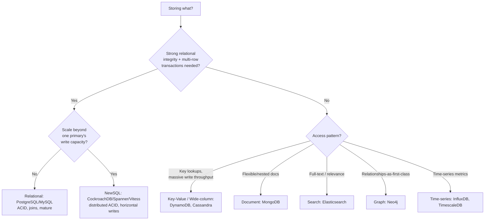
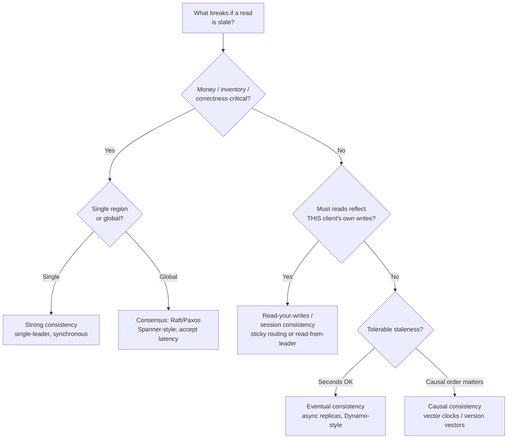
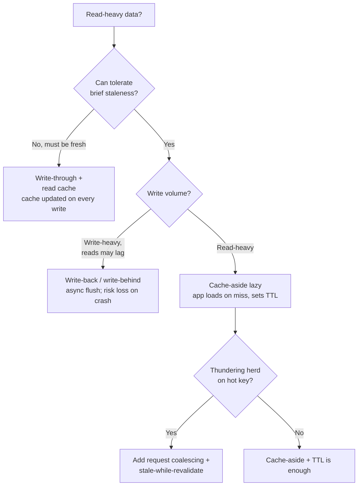
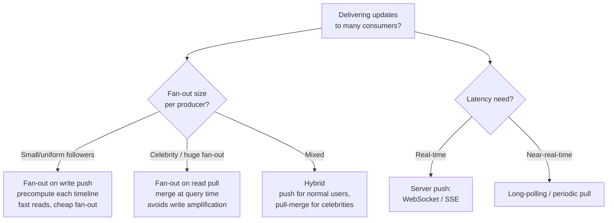
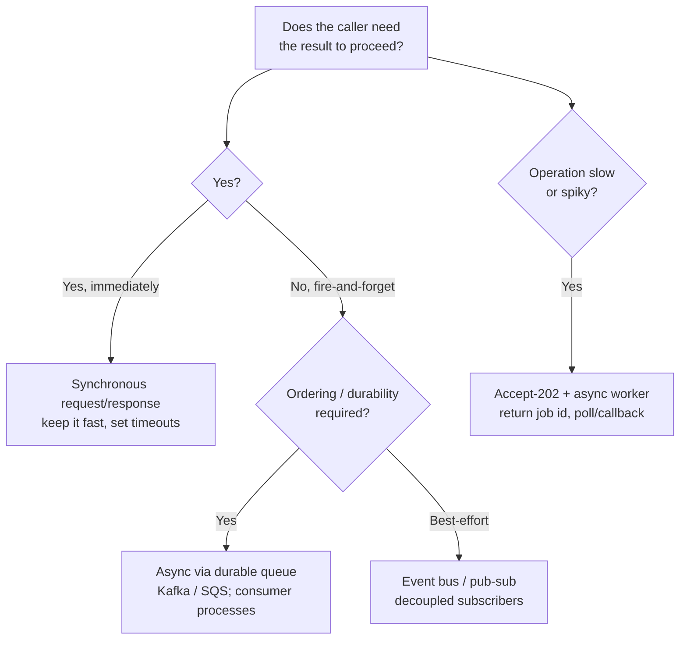
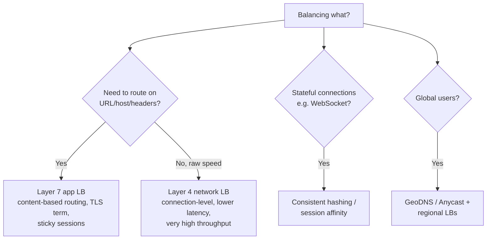
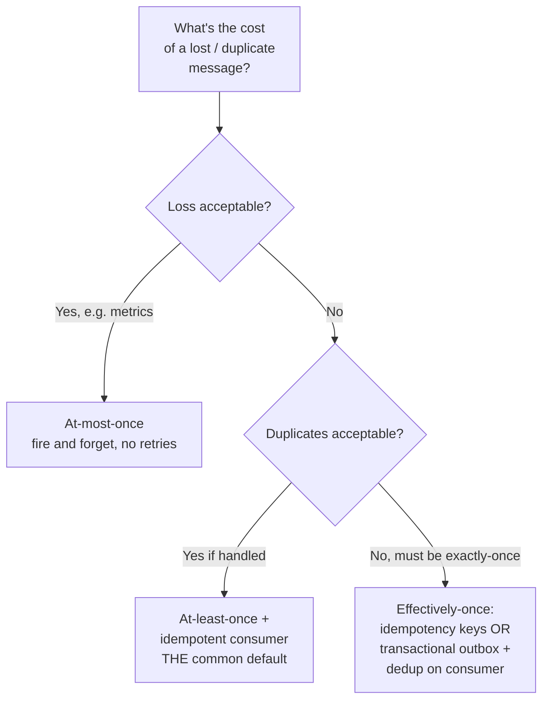
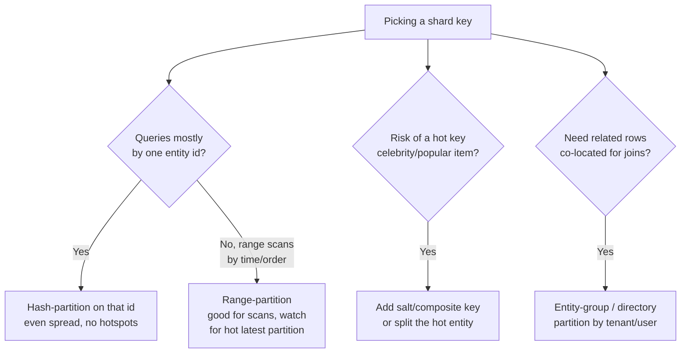
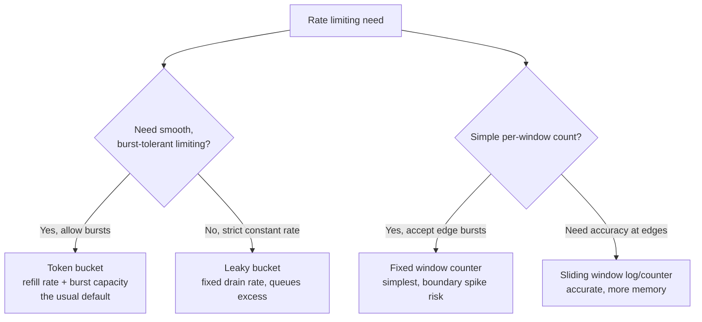
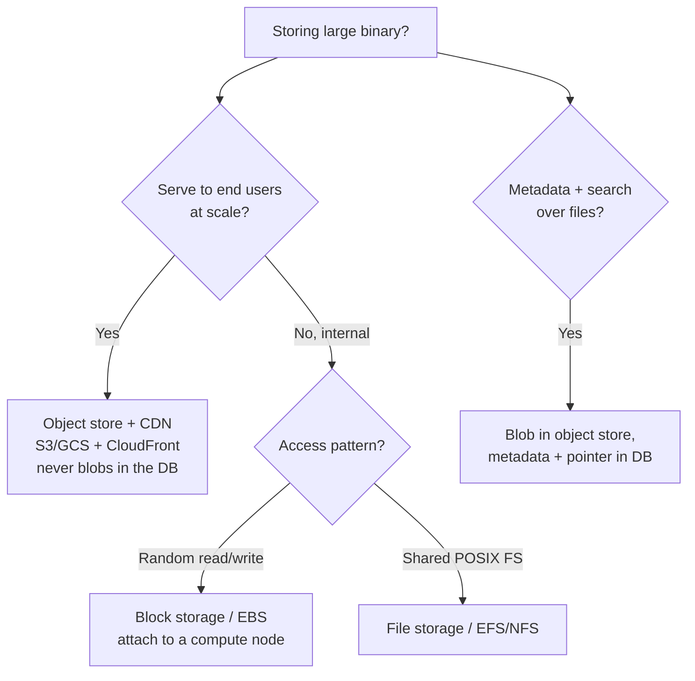

# Decision Trees — "Which One Do I Pick?"

> [!NOTE]
> **📋 5-Minute Summary**
>
> **What this covers:** Technology-selection decision trees for the moments in an interview where you must *choose* — SQL vs NoSQL, which consistency model, which cache strategy, push vs pull, sync vs async, and more. Each tree ends at a concrete choice with the one-line justification you'd say out loud.
>
> **Key concepts:**
> - These are *selection* trees (pick a technology/approach), not concept-recall maps — for topic recall see [../FLOWCHARTS.md](../FLOWCHARTS.md).
> - Every leaf names a default and the trigger that would change it — interviewers reward "I'd pick X, but switch to Y if Z."
> - Read a leaf as a starting position, not dogma; state your assumption, then commit.
>
> **Key takeaway:** In an interview, don't enumerate options — traverse the tree out loud to a decision, then justify. Indecision reads as junior; a defended default reads as senior.

---

## How to use these

Interviewers don't want a survey of every database. They want you to **pick one and defend it**. Each tree below encodes the discriminating questions in the order that actually matters, so you converge fast and can say *why*. The pattern to voice: **"Default X because [property]; I'd switch to Y if [trigger]."**

---

## 1. SQL vs NoSQL

**Say it:** "Start relational — ACID, joins, and it scales further than people think with read replicas + partitioning. Only leave SQL when a *specific* pressure forces it: write throughput past one primary (→ Cassandra/DynamoDB), schema flexibility (→ document), or a query shape SQL is bad at (full-text → ES, traversals → graph)."

---

## 2. Consistency model

**Say it:** "Consistency is per-operation, not per-system. Checkout and balance reads need strong/linearizable; a like-count or feed can be eventually consistent. The common middle ground is session consistency — a user must see their own writes even if others see them a beat later."

---

## 3. Caching strategy (read path)

**Say it:** "Default cache-aside with a TTL — simplest, app controls it, cache failure just means a slower read not a wrong one. Add write-through only when staleness is unacceptable, and guard hot keys with request coalescing so a cache miss doesn't stampede the DB."

---

## 4. Push vs Pull (feeds, notifications, fan-out)

**Say it:** "Push (fan-out on write) makes reads O(1) but explodes for celebrities — one write becomes 100M inserts. So the real answer is hybrid: push for the median user, pull-and-merge for high-fan-out accounts, decided by a follower-count threshold."

---

## 5. Sync vs Async (request handling)

**Say it:** "If the user is blocked on the answer, sync. If it's slow (email, video encode, ML scoring) or spiky, return 202 Accepted with a job id and process on a durable queue — this decouples the burst from the workers and lets you retry."

---

## 6. Load balancing layer

**Say it:** "L7 when I need to route by path/host or terminate TLS; L4 when I just need to spray connections at max throughput with minimal latency. Globally, GeoDNS or Anycast picks the nearest region, then a regional LB fans out."

---

## 7. Message delivery guarantee

**Say it:** "There's no free exactly-once over a network. The practical answer is at-least-once delivery plus an idempotent consumer — dedup on a message/idempotency key — which *behaves* exactly-once. True transactional exactly-once (Kafka transactions) exists but costs throughput and scope."

---

## 8. Which partitioning / sharding key

**Say it:** "Hash-partition on the id you filter by most — it spreads load evenly. Range-partitioning helps time-ordered scans but concentrates writes on the newest partition. The failure mode to preempt is a hot key: a celebrity or viral item, fixed by salting or splitting that entity."

---

## 9. Rate limiting algorithm

**Say it:** "Token bucket is the default — it enforces an average rate while permitting short bursts, which matches real traffic. Fixed-window is simplest but lets 2× the limit through at the window boundary; sliding window fixes that at the cost of more state."

---

## 10. Storage for a blob / file

**Say it:** "Blobs go in object storage fronted by a CDN; the database holds only metadata and the object key. Putting large binaries in the DB bloats it, wrecks backups, and blows the cache — the classic anti-pattern."

---

## Related

- Concept-recall flowcharts for every topic: [../FLOWCHARTS.md](../FLOWCHARTS.md)
- The numbers behind these tradeoffs: [numbers-to-know.md](numbers-to-know.md)
- Cloud-service equivalents for each leaf: [cloud-services-cheat-sheet.md](cloud-services-cheat-sheet.md)
