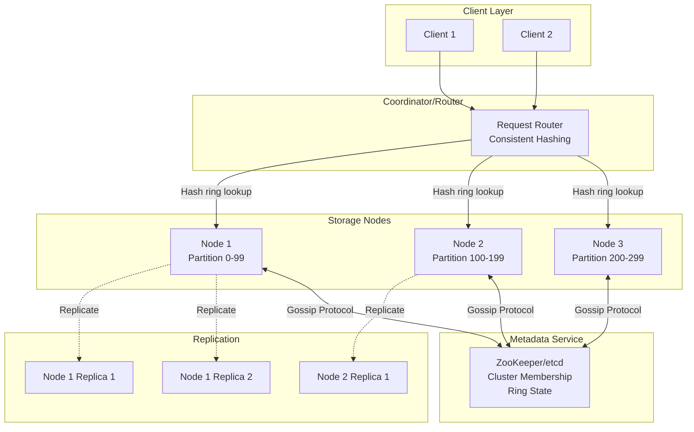
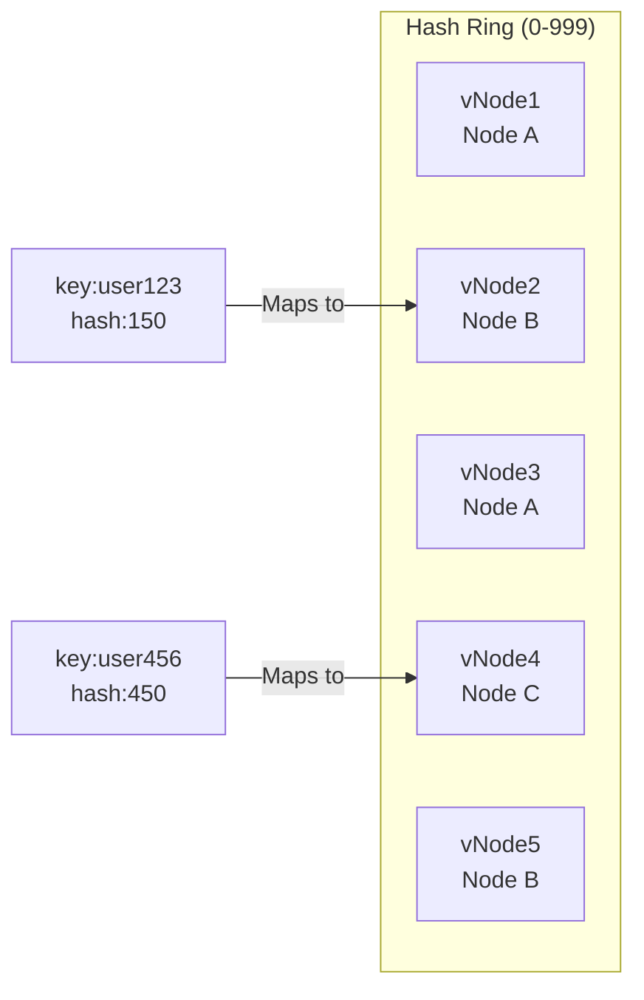
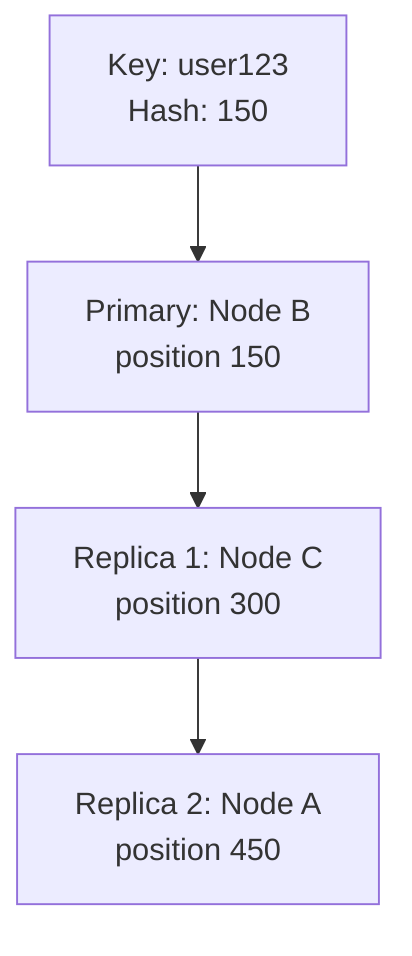
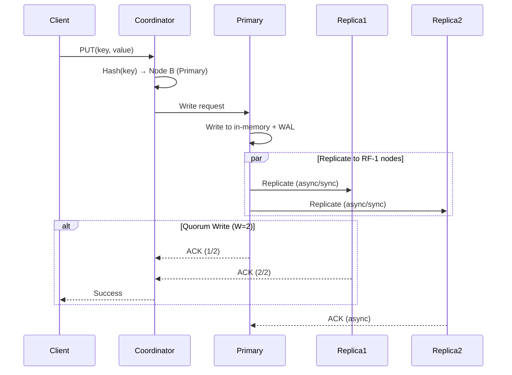
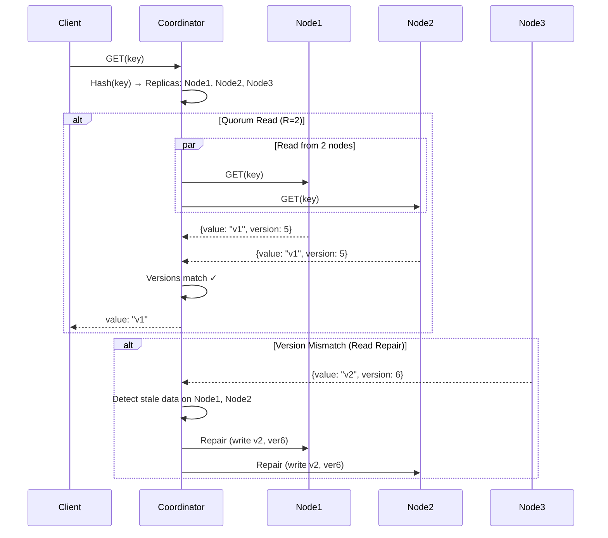
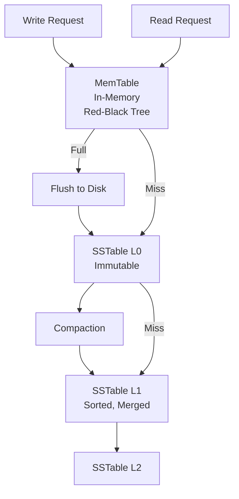
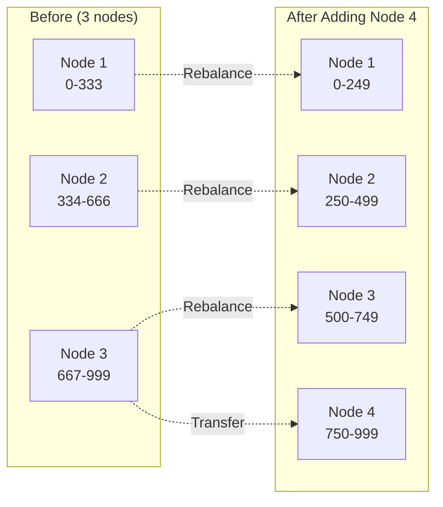

# Design a Key-Value Store

## Problem Statement
Design a distributed key-value store like Redis or DynamoDB that supports basic operations (GET, PUT, DELETE) with high availability, partition tolerance, and tunable consistency.

---

## Requirements

### Functional Requirements
1. **PUT(key, value)**: Store key-value pair
2. **GET(key)**: Retrieve value for a key
3. **DELETE(key)**: Remove a key-value pair
4. Support for configurable TTL (Time-To-Live)
5. Support for atomic operations (compare-and-swap)

### Non-Functional Requirements
1. **High availability**: 99.99% uptime
2. **Partition tolerance**: Continue operating during network partitions
3. **Low latency**: < 10ms for GET, < 50ms for PUT
4. **Scalability**: Store petabytes of data, handle millions of QPS
5. **Tunable consistency**: Support both strong and eventual consistency

---

## Capacity Estimation

### Traffic Estimates
- **Peak QPS**: 10 million requests/sec
- **Read:Write ratio**: 9:1 (90% reads, 10% writes)
- **Reads**: 9M/sec
- **Writes**: 1M/sec

### Storage Estimates
- **Average key size**: 20 bytes
- **Average value size**: 200 bytes
- **Total entries**: 1 billion keys
- **Storage needed**: 1B × (20 + 200 bytes) = **220 GB**
- **With replication (3x)**: 660 GB
- **With overhead (2x)**: **1.32 TB**

### Memory Estimates (Cache)
- **Cache 20% hot data**: 220 GB × 0.2 = **44 GB per node**
- **For 10 nodes**: 440 GB total cache

---

## API Design

### 1. Basic Operations
```http
PUT /v1/kv/{key}
Content-Type: application/json
{
  "value": "data",
  "ttl": 3600  // seconds, optional
}

GET /v1/kv/{key}
Response: {"value": "data", "version": 5}

DELETE /v1/kv/{key}
```

### 2. Atomic Operations
```http
POST /v1/kv/{key}/cas
{
  "expectedVersion": 5,
  "newValue": "updated_data"
}
```

### 3. Batch Operations
```http
POST /v1/kv/batch
{
  "operations": [
    {"op": "PUT", "key": "k1", "value": "v1"},
    {"op": "GET", "key": "k2"},
    {"op": "DELETE", "key": "k3"}
  ]
}
```

---

## High-Level Architecture



---

## Core Components

### 1. Consistent Hashing & Virtual Nodes



**Why Virtual Nodes?**
- Each physical node owns multiple virtual nodes (vnodes)
- **Better load distribution** when nodes join/leave
- Typical: 256 vnodes per physical node

**Consistent Hashing Algorithm:**
```java
public PhysicalNode getNode(String key) {
    int hashValue = hash(key) % RING_SIZE;  // 0-999
    
    // Find next vnode on ring
    for (VirtualNode vnode : sortedVnodes) {
        if (vnode.getPosition() >= hashValue) {
            return vnode.getPhysicalNode();
        }
    }
    
    // Wrap around to first vnode
    return sortedVnodes.get(0).getPhysicalNode();
}
```

### 2. Replication Strategy

**Replication Factor (RF) = 3**
- Primary node + 2 replicas
- Replicas stored on **next N-1 nodes** in ring (clockwise)



**Replication Types:**
1. **Synchronous**: Wait for all replicas to ACK (strong consistency)
2. **Asynchronous**: Write to primary, replicate in background (eventual consistency)
3. **Quorum**: Write to W nodes, read from R nodes where `W + R > RF`

### 3. Quorum Consistency

**Tunable Consistency Levels:**

| Level | Reads (R) | Writes (W) | Consistency | Use Case |
|-------|-----------|------------|-------------|----------|
| **Strong** | 3 | 3 | Linearizable | Banking, critical data |
| **Quorum** | 2 | 2 | Strong if R+W>RF | Balanced |
| **Eventual** | 1 | 1 | Eventual | High throughput |

**Quorum Formula:**
```
R + W > RF  → Strong consistency
R = 2, W = 2, RF = 3  → 2 + 2 > 3 ✓
```

---

## Detailed Workflows

### Write Path (PUT)



**Optimization: Hinted Handoff**
- If replica node down, store hint on another node
- Replay when original node recovers

### Read Path (GET)



---

## Conflict Resolution

### Version Vectors (Dotted Version Vectors)
When concurrent writes occur, track causality:

```
Node A writes: key="user" → {value: "Alice", vector: {A:1}}
Node B writes: key="user" → {value: "Bob", vector: {B:1}}

Read returns both:
[
  {value: "Alice", vector: {A:1}},
  {value: "Bob", vector: {B:1}}
]
```

**Resolution Strategies:**
1. **Last Write Wins (LWW)**: Use timestamp (simple, but loses data)
2. **Client-side merge**: Return conflicts, let client decide
3. **Application-defined**: Custom merge logic

**Dynamo-style Vector Clocks:**
```java
public class VectorClock {
    private String value;
    private Map<String, Integer> vectorClock;
    
    // Example:
    // {
    //   "value": "Alice",
    //   "vectorClock": {
    //     "node_a": 5,
    //     "node_b": 3,
    //     "node_c": 7
    //   }
    // }
}
```

---

## Failure Handling

### 1. Node Failure
- **Detection**: Gossip protocol (heartbeat every 1s)
- **Recovery**: Hinted handoff replays missed writes
- **Permanent failure**: Anti-entropy repair (Merkle trees)

### 2. Network Partition
- **Sloppy Quorum**: Accept writes even if primary replicas unreachable
- Write to next healthy nodes (temporary replicas)
- **Eventual reconciliation** when partition heals

### 3. Data Corruption
- **Checksum verification** on reads
- **Merkle trees** for anti-entropy (compare subtrees)

---

## Storage Engine

### LSM-Tree (Log-Structured Merge-Tree)



**Why LSM-Tree?**
- **Write-optimized**: Sequential writes (append-only)
- **Compaction**: Periodically merge SSTables
- Used by: RocksDB, LevelDB, Cassandra

**Read Path Optimization:**
- **Bloom filters**: Skip SSTables unlikely to have key
- **Index blocks**: Binary search within SSTable
- **Block cache**: Cache hot SSTable blocks in memory

---

## Advanced Features

### 1. TTL (Time-To-Live)
```java
// Store with expiration timestamp
public class Entry {
    private String key;
    private String value;
    private Timestamp expiresAt;
    
    public Entry(String key, String value, long ttl) {
        this.key = "session:123";
        this.value = "token";
        this.expiresAt = new Timestamp(System.currentTimeMillis() + ttl);
    }
}

// Lazy deletion on read
if (entry.getExpiresAt().before(new Timestamp(System.currentTimeMillis()))) {
    return null;
}

// Active deletion via compaction
// Remove expired entries during SSTable merge
```

### 2. Atomic Compare-And-Swap (CAS)
```java
public boolean cas(String key, int expectedVersion, String newValue) {
    Entry current = db.get(key);
    
    if (current.getVersion() == expectedVersion) {
        db.put(key, newValue, current.getVersion() + 1);
        return true;
    } else {
        return false;  // Version mismatch
    }
}
```

**Use Case:** Distributed counters, locks

---

## Scalability

### Horizontal Scaling


**Auto-rebalancing:**
- Virtual nodes migrate to new physical node
- Minimal data movement (only affected vnodes)

### Partitioning Strategies
1. **Hash-based**: Consistent hashing (default)
2. **Range-based**: Keys sorted, split into ranges (ZooKeeper)
3. **Hybrid**: Combine both (Bigtable)

---

## Monitoring & Operations

### Metrics
- **Latency**: p50, p99, p999 for GET/PUT
- **Throughput**: QPS per node
- **Storage**: Disk usage, compaction lag
- **Replication lag**: Time delta between primary and replicas

### Anti-Entropy Repair
```java
// Merkle tree per partition
public MerkleTree buildMerkleTree(List<Entry> partitionData) {
    List<String> leaves = partitionData.stream()
        .map(entry -> hash(entry.getKey() + entry.getValue()))
        .collect(Collectors.toList());
    
    return buildTree(leaves);
}

// Compare with replica
if (!localMerkleRoot.equals(replicaMerkleRoot)) {
    // Recursively find differing subtrees
    syncDiff(localTree, replicaTree);
}
```

---

## Trade-offs

| Aspect | Choice | Trade-off |
|--------|--------|-----------|
| **Consistency** | Tunable (Quorum) | Latency vs correctness |
| **Replication** | Async by default | Speed vs durability |
| **Storage Engine** | LSM-tree | Write-optimized, read amplification |
| **Partitioning** | Consistent hashing | Complexity vs load balance |
| **Conflict Resolution** | Last-Write-Wins | Simplicity vs data loss |

---

## Real-World Examples

- **Amazon DynamoDB**: Multi-master, eventual consistency
- **Apache Cassandra**: Wide-column, tunable consistency
- **etcd**: Raft consensus, strong consistency (CP system)
- **Redis Cluster**: Hash slots, master-slave replication

---

## Interview Discussion Points

**Q: CAP Theorem - What does your design prioritize?**
- **AP (Availability + Partition tolerance)** in default config
- Can configure for CP with `R=ALL, W=ALL` (sacrifices availability)
- Trade-off: During partition, accept stale reads vs reject requests

**Q: How to handle hot keys?**
- **Read hotspots**: Cache aggressively, add read replicas
- **Write hotspots**: Shard hot key (e.g., `counter:global` → `counter:global:shard1`, `counter:global:shard2`)

**Q: Why LSM-tree over B-tree?**
- **Writes**: LSM sequential (faster), B-tree random I/O
- **Reads**: B-tree faster (direct lookup), LSM checks multiple levels
- **Use case**: Write-heavy workloads favor LSM
