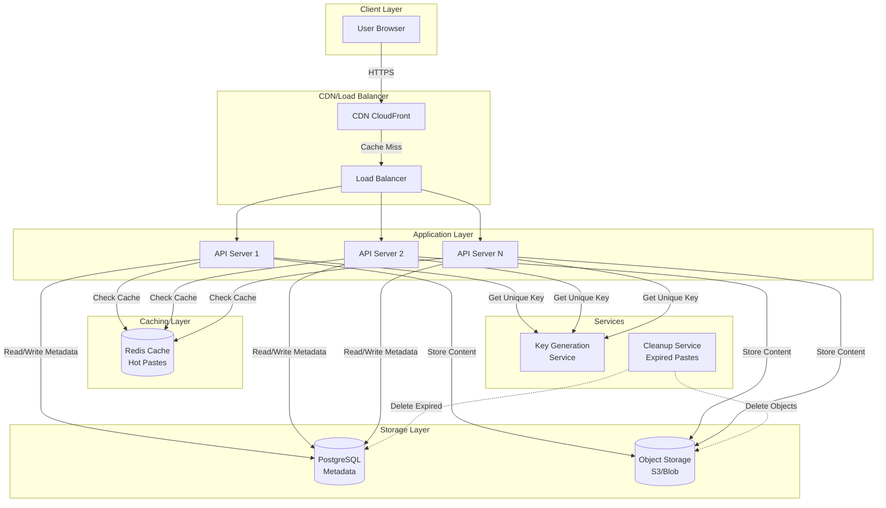
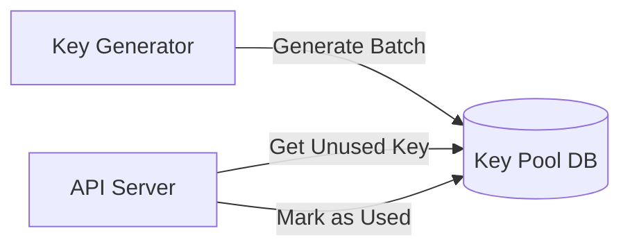
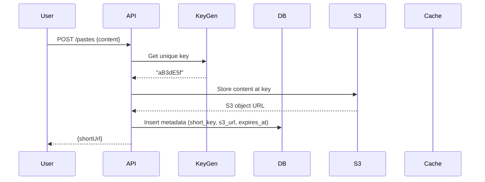
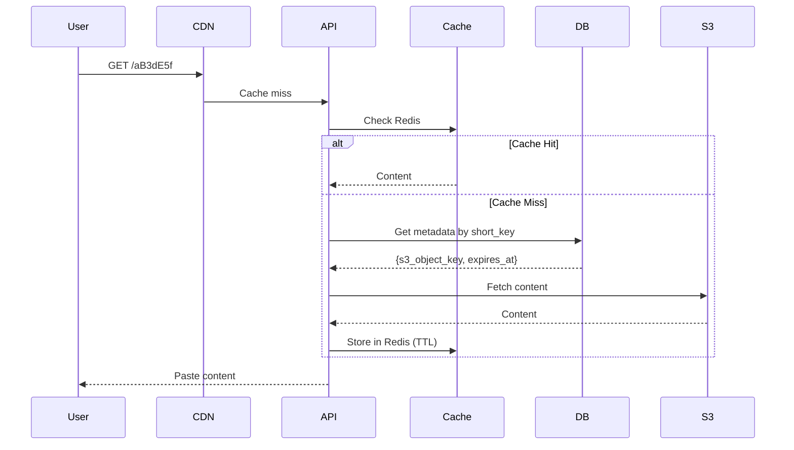

# Design Pastebin

## Problem Statement
Design a service like Pastebin where users can store plain text and share it via a unique URL. The service should support temporary pastes that expire after a certain time.

---

## Requirements

### Functional Requirements
1. Users can paste text and get a unique shareable URL
2. Users can retrieve paste content via URL
3. Pastes can have expiration time (1 hour, 1 day, 1 month, never)
4. Support for custom short URLs (optional)
5. Basic analytics (view count)

### Non-Functional Requirements
1. **High availability**: 99.9% uptime
2. **Low latency**: < 100ms for read operations
3. **Scalability**: Handle millions of pastes per day
4. **Durability**: Pastes should not be lost
5. **Security**: Private pastes should be accessible only via URL

---

## Capacity Estimation

### Traffic Estimates
- **Writes**: 1M new pastes/day = ~12 pastes/sec
- **Reads**: 10:1 read-to-write ratio = 120 reads/sec
- **Peak traffic**: 5x average = 60 writes/sec, 600 reads/sec

### Storage Estimates
- **Average paste size**: 10 KB (text)
- **Daily storage**: 1M × 10 KB = 10 GB/day
- **5-year storage** (assuming 80% pastes expire):
  - Total generated: 1M × 365 × 5 = 1.825 billion pastes
  - Retained (20%): 365 million pastes
  - Storage needed: 365M × 10 KB = **3.65 TB**

### Bandwidth Estimates
- **Write bandwidth**: 12 pastes/sec × 10 KB = 120 KB/sec
- **Read bandwidth**: 120 reads/sec × 10 KB = 1.2 MB/sec

### URL Key Size
- **Unique URLs needed**: ~2 billion (with buffer)
- **Character set**: [a-z, A-Z, 0-9] = 62 characters
- **Key length**: 62^7 = 3.5 trillion unique URLs (7 characters sufficient)

---

## API Design

### 1. Create Paste
```http
POST /api/v1/pastes
Content-Type: application/json

{
  "content": "Hello, World!",
  "expiration": "1d",  // 1h, 1d, 1m, never
  "customUrl": "my-paste",  // optional
  "isPrivate": false
}

Response:
{
  "shortUrl": "https://paste.in/aB3dE5f",
  "expiresAt": "2024-02-10T12:00:00Z"
}
```

### 2. Retrieve Paste
```http
GET /api/v1/pastes/{shortKey}

Response:
{
  "content": "Hello, World!",
  "createdAt": "2024-02-09T12:00:00Z",
  "expiresAt": "2024-02-10T12:00:00Z",
  "viewCount": 42
}
```

### 3. Delete Paste (Owner Only)
```http
DELETE /api/v1/pastes/{shortKey}
Authorization: Bearer <token>
```

---

## High-Level Design

### Architecture Diagram



---

## Detailed Component Design

### 1. Key Generation Service

#### Option A: Pre-generate Keys (Recommended)


**Algorithm:**
- Pre-generate 1M keys in batches
- Store in database with `used` flag
- API servers fetch and mark as used
- **Pros**: Fast, no collision
- **Cons**: Extra storage for key pool

#### Option B: Hash-based Generation
```
MD5(content + timestamp) → Base62 encode → Take first 7 chars
```
**Check for collision** (rare, but handle via retry)

### 2. Database Schema

#### Metadata Table (PostgreSQL)
```sql
CREATE TABLE pastes (
    id BIGSERIAL PRIMARY KEY,
    short_key VARCHAR(10) UNIQUE NOT NULL,
    s3_object_key VARCHAR(255) NOT NULL,
    created_at TIMESTAMP DEFAULT NOW(),
    expires_at TIMESTAMP,
    view_count BIGINT DEFAULT 0,
    is_private BOOLEAN DEFAULT false,
    owner_id BIGINT,
    INDEX idx_short_key (short_key),
    INDEX idx_expires_at (expires_at)
);
```

#### Why S3 for Content, Not DB?
- **Cost**: S3 cheaper for large blobs
- **Scalability**: DB optimized for metadata, S3 for objects
- **CDN integration**: Direct CloudFront integration with S3

### 3. Caching Strategy

**Redis Cache:**
```java
// Cache popular pastes (top 20%)
public String getPasteContent(String shortKey, Timestamp expiresAt) {
    String cacheKey = "paste:" + shortKey;
    long ttl = Math.min(
        Duration.between(Instant.now(), expiresAt.toInstant()).toSeconds(),
        3600  // 1 hour max
    );
    
    if (cache.exists(cacheKey)) {
        return cache.get(cacheKey);
    } else {
        String content = s3Client.getObject(s3Key);
        cache.setex(cacheKey, ttl, content);
        return content;
    }
}
```

**Cache Eviction**: LRU (Least Recently Used)

### 4. Expiration & Cleanup

#### Lazy Deletion
```java
// On read request
if (paste.getExpiresAt().before(new Timestamp(System.currentTimeMillis()))) {
    throw new NotFoundException("Paste expired");
}
```

#### Active Cleanup (Batch Job)
```java
// Cron job runs daily
String query = """
    SELECT short_key, s3_object_key 
    FROM pastes 
    WHERE expires_at < NOW() - INTERVAL '1 day'
    LIMIT 10000
    """;

List<Paste> expiredPastes = db.executeQuery(query);

// Delete from S3 and DB
for (Paste paste : expiredPastes) {
    s3Client.deleteObject(paste.getS3ObjectKey());
    db.delete(paste.getId());
}
```

---

## Read/Write Flow

### Write Flow


### Read Flow


---

## Scalability & Optimization

### 1. Database Sharding
- **Shard key**: `hash(short_key) % num_shards`
- Distributes load evenly

### 2. Read Replicas
- Master for writes
- Read replicas for GET requests (view count can be eventually consistent)

### 3. CDN for Static Content
- Serve popular pastes from edge locations
- Cache-Control headers: `max-age=3600`

### 4. Rate Limiting
- Prevent abuse: 10 pastes/hour per IP
- Use Redis for counters

---

## Security Considerations

### 1. Private Pastes
- Generate cryptographically strong keys (16+ chars)
- No indexing or listing endpoints

### 2. Input Validation
- Limit paste size: Max 1 MB
- Sanitize HTML to prevent XSS

### 3. DDoS Protection
- CloudFlare or AWS Shield
- Rate limiting at LB level

---

## Trade-offs & Alternatives

| Aspect | Choice | Alternative | Trade-off |
|--------|--------|-------------|-----------|
| **Content Storage** | S3 | Database | Cost vs simplicity |
| **Key Generation** | Pre-generated pool | Hash-based | Storage vs collision risk |
| **Caching** | Redis | No cache | Cost vs latency |
| **Expiration** | Lazy + Batch cleanup | Active TTL in DB | Complexity vs storage waste |

---

## Extensions

### 1. Syntax Highlighting
- Detect language, store metadata
- Client-side rendering with libraries

### 2. Paste History (User Accounts)
```sql
ALTER TABLE pastes ADD COLUMN owner_id BIGINT;
CREATE INDEX idx_owner_id ON pastes(owner_id);
```

### 3. Analytics Dashboard
- Track views over time (TimescaleDB or InfluxDB)
- Geographic distribution (from CDN logs)

---

## Interview Discussion Points

**Q: Why not store everything in database?**
- S3 is **cheaper** for blob storage ($0.023/GB vs $0.10+/GB for DB)
- DB performance degrades with large rows
- S3 integrates with CDN (CloudFront)

**Q: How to handle 1M pastes/sec?**
- Horizontal scaling of API servers
- Database sharding (by short_key hash)
- Aggressive caching (Redis cluster)
- CDN for read-heavy workload

**Q: What if key generation service goes down?**
- **Pre-generated pool**: API servers cache locally (1000 keys)
- **Failover**: Multiple key generation services (standby)
- **Fallback**: Hash-based generation with collision check
