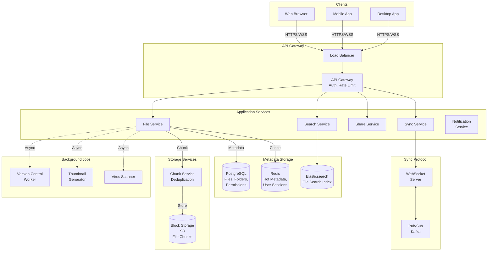
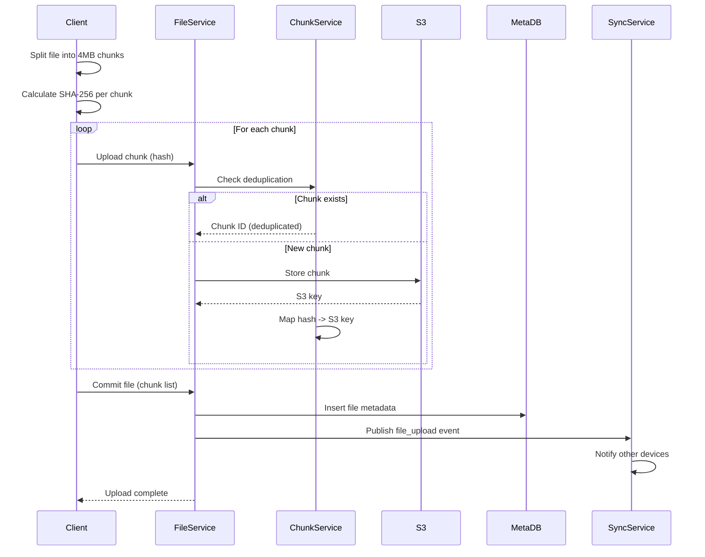
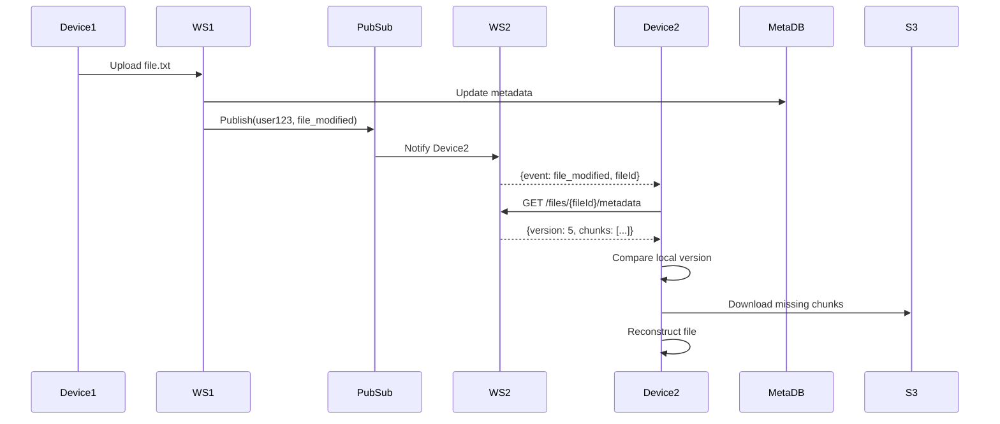
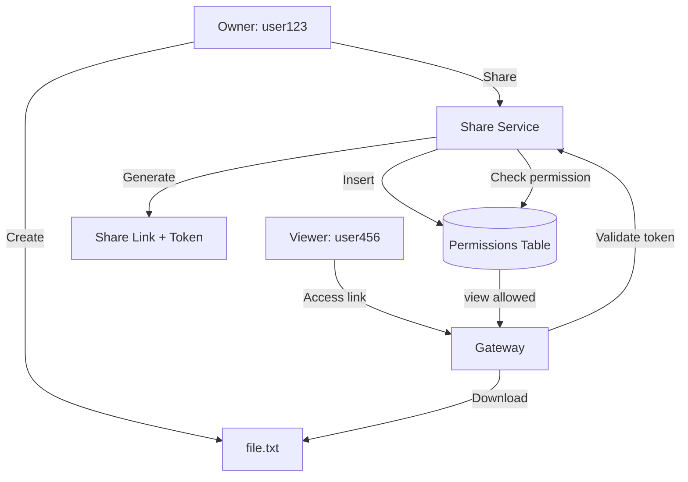
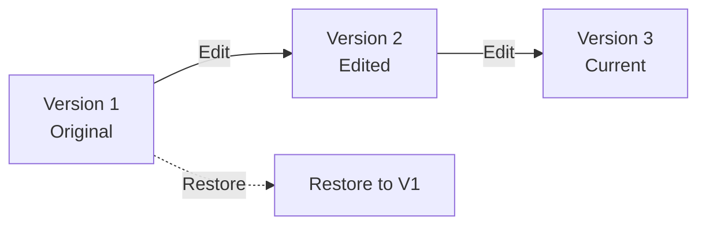
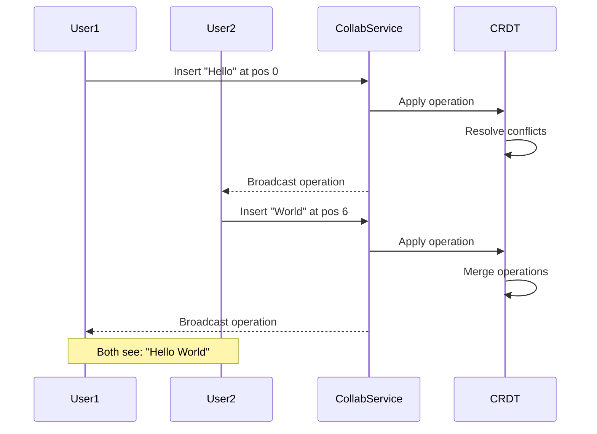

# Design Google Drive

## Problem Statement
Design a cloud storage and file synchronization service like Google Drive that allows users to upload, store, share files and folders, with real-time synchronization across multiple devices.

---

## Requirements

### Functional Requirements
1. **Upload/Download files** (up to 15 GB per file)
2. **Create folders** and organize files
3. **Share files/folders** with permissions (view, edit)
4. **Real-time sync** across devices
5. **Version history** (restore previous versions)
6. **Collaborative editing** (Google Docs-style)
7. **Search** files by name, content, type
8. **Trash** with 30-day retention

### Non-Functional Requirements
1. **High availability**: 99.9% uptime
2. **Strong consistency**: Same view across devices
3. **Scalability**: 1 billion users, exabytes of data
4. **Reliability**: No data loss (11 nines durability)
5. **Low latency**: < 100ms for metadata operations
6. **Bandwidth efficiency**: Delta sync, compression

---

## Capacity Estimation

### User & Storage Estimates
- **Total users**: 1 billion
- **Free tier**: 15 GB/user
- **Paid tier** (10%): 100 GB/user average
- **Total storage**: 
  - Free: 900M × 15 GB = 13.5 EB
  - Paid: 100M × 100 GB = 10 EB
  - **Total**: 23.5 exabytes

### Traffic Estimates
- **DAU**: 200 million
- **Files uploaded per user/day**: 5 files
- **Average file size**: 2 MB
- **Daily uploads**: 200M × 5 × 2 MB = **2 PB/day**
- **Upload QPS** (peak): 200M × 5 / 86400 × 3 = **35K uploads/sec**

### Metadata Estimates
- **Files per user**: 10,000 files
- **Metadata size**: 1 KB per file
- **Total metadata**: 1B users × 10K files × 1 KB = **10 PB**

---

## High-Level Architecture



---

## Core Components

### 1. File Upload Flow with Chunking



**Chunking Benefits:**
- **Resume uploads**: Re-upload only failed chunks
- **Bandwidth efficiency**: Skip unchanged chunks
- **Deduplication**: Same chunk across files stored once
- **Parallelization**: Upload chunks in parallel

**Chunk Schema (PostgreSQL):**
```sql
CREATE TABLE chunks (
    chunk_hash BYTEA PRIMARY KEY,  -- SHA-256
    s3_key VARCHAR(500) NOT NULL,
    size_bytes BIGINT,
    ref_count INT DEFAULT 1        -- For deduplication
);

CREATE TABLE file_chunks (
    file_id UUID,
    chunk_index INT,
    chunk_hash BYTEA REFERENCES chunks(chunk_hash),
    PRIMARY KEY (file_id, chunk_index)
);
```

### 2. Metadata Database Schema

```sql
CREATE TABLE users (
    user_id BIGINT PRIMARY KEY,
    email VARCHAR(255) UNIQUE,
    storage_quota_gb INT DEFAULT 15,
    storage_used_bytes BIGINT DEFAULT 0
);

CREATE TABLE files (
    file_id UUID PRIMARY KEY,
    owner_id BIGINT REFERENCES users(user_id),
    parent_folder_id UUID REFERENCES files(file_id),
    name VARCHAR(255) NOT NULL,
    file_type VARCHAR(50),
    size_bytes BIGINT,
    is_directory BOOLEAN DEFAULT FALSE,
    created_at TIMESTAMP DEFAULT NOW(),
    modified_at TIMESTAMP DEFAULT NOW(),
    is_deleted BOOLEAN DEFAULT FALSE,
    version INT DEFAULT 1,
    INDEX idx_parent_owner (parent_folder_id, owner_id),
    INDEX idx_modified (modified_at)
);

CREATE TABLE file_versions (
    version_id UUID PRIMARY KEY,
    file_id UUID REFERENCES files(file_id),
    version_number INT,
    chunk_list JSONB,              -- [{chunk_hash, chunk_index}]
    size_bytes BIGINT,
    created_at TIMESTAMP DEFAULT NOW()
);

CREATE TABLE permissions (
    permission_id UUID PRIMARY KEY,
    file_id UUID REFERENCES files(file_id),
    user_id BIGINT REFERENCES users(user_id),
    permission_type ENUM('view', 'edit', 'owner'),
    granted_by BIGINT,
    granted_at TIMESTAMP DEFAULT NOW(),
    UNIQUE(file_id, user_id)
);
```

### 3. Real-Time Sync Protocol



**WebSocket Events:**
```json
{
  "type": "file_modified",
  "fileId": "abc123",
  "version": 5,
  "timestamp": 1644444444,
  "modifiedBy": "user456"
}
```

**Conflict Resolution:**
```python
if local_version < remote_version:
    # Remote is newer, pull changes
    download_file()
elif local_version > remote_version:
    # Local is newer, push changes
    upload_file()
else:
    # Version match, check timestamp
    if local_modified > remote_modified:
        create_conflict_copy()  # file.txt (conflict copy)
```

### 4. Delta Sync (Bandwidth Optimization)

**rsync-style algorithm:**
```python
def delta_sync(file):
    # Client sends rolling hash signatures
    client_signatures = [
        {"chunk_index": 0, "weak_hash": "a1b2", "strong_hash": "sha256..."},
        {"chunk_index": 1, "weak_hash": "c3d4", "strong_hash": "sha256..."}
    ]
    
    # Server compares against remote version
    delta = []
    for i, chunk in enumerate(remote_file.chunks):
        if chunk.hash not in client_signatures:
            delta.append({"index": i, "data": chunk.data})
    
    return delta  # Client applies delta
```

**Reduces bandwidth by 80%+ for small edits**

### 5. File Sharing & Permissions



**Share Link Schema:**
```sql
CREATE TABLE share_links (
    link_id UUID PRIMARY KEY,
    file_id UUID REFERENCES files(file_id),
    created_by BIGINT,
    token VARCHAR(64) UNIQUE,      -- Random secure token
    permission ENUM('view', 'edit'),
    expires_at TIMESTAMP,
    password_hash VARCHAR(255),     -- Optional password protection
    created_at TIMESTAMP DEFAULT NOW()
);
```

**Access Control:**
```python
def check_access(user_id, file_id, action):
    # Check direct permission
    perm = db.query("""
        SELECT permission_type FROM permissions 
        WHERE user_id = %s AND file_id = %s
    """, (user_id, file_id))
    
    if perm and perm.can(action):
        return True
    
    # Check inherited folder permission
    parent = get_parent_folder(file_id)
    if parent:
        return check_access(user_id, parent, action)
    
    return False
```

### 6. Version Control



**Version Retention:**
- **Last 30 days**: Keep all versions
- **30-90 days**: Keep weekly versions
- **90+ days**: Keep monthly versions
- **Manual versions**: Kept indefinitely

**Storage Optimization:**
- **Copy-on-write**: Only changed chunks stored
- **Garbage collection**: Delete unreferenced chunks

---

## Advanced Features

### 1. Collaborative Editing (Google Docs)



**Operational Transformation (OT) or CRDT:**
- **OT**: Transform operations based on concurrent changes
- **CRDT**: Conflict-free Replicated Data Type (Yjs library)

### 2. Full-Text Search (Elasticsearch)

**Index Schema:**
```json
{
  "mappings": {
    "properties": {
      "file_id": {"type": "keyword"},
      "name": {"type": "text"},
      "content": {"type": "text"},     // Extracted from PDF, DOCX
      "file_type": {"type": "keyword"},
      "owner_id": {"type": "keyword"},
      "modified_at": {"type": "date"}
    }
  }
}
```

**Content Extraction:**
- **PDF**: Apache Tika
- **DOCX/XLSX**: Apache POI
- **Images**: OCR (Tesseract)

### 3. Trash & Recovery

```sql
CREATE TABLE trash (
    trash_id UUID PRIMARY KEY,
    file_id UUID,
    original_parent_id UUID,
    deleted_by BIGINT,
    deleted_at TIMESTAMP DEFAULT NOW(),
    auto_delete_at TIMESTAMP DEFAULT (NOW() + INTERVAL '30 days')
);

-- Cron job: Permanently delete after 30 days
DELETE FROM trash WHERE auto_delete_at < NOW();
```

---

## Scalability Strategies

### 1. Database Sharding

**Metadata sharding by user_id:**
```
Shard 0: user_id % 10 = 0
Shard 1: user_id % 10 = 1
...
```

**Benefit:** User's files co-located

### 2. CDN for Downloads

- **Popular files** cached at edge
- **Signed URLs**: Time-limited S3 URLs via CloudFront
- **Cache-Control**: `max-age=3600, private`

### 3. S3 Storage Classes

- **Hot files** (< 30 days): S3 Standard
- **Warm files** (30-90 days): S3 Intelligent-Tiering
- **Cold files** (90+ days): S3 Glacier

---

## Security & Compliance

### 1. Encryption
- **At rest**: S3-SSE (AES-256)
- **In transit**: TLS 1.3
- **Client-side** (enterprise): E2EE before upload

### 2. Virus Scanning
- **ClamAV** on upload
- Quarantine infected files

### 3. Audit Logs
```sql
CREATE TABLE audit_log (
    log_id UUID PRIMARY KEY,
    user_id BIGINT,
    action VARCHAR(50),        -- upload, download, share, delete
    file_id UUID,
    ip_address INET,
    timestamp TIMESTAMP DEFAULT NOW()
);
```

---

## Trade-offs

| Aspect | Choice | Trade-off |
|--------|--------|-----------|
| **Chunking** | 4MB chunks | Deduplication vs overhead |
| **Consistency** | Strong (PostgreSQL) | Latency vs correctness |
| **Sync** | WebSocket | Persistent connection vs latency |
| **Deduplication** | Hash-based | Privacy vs storage savings |

---

## Interview Discussion Points

**Q: How to handle large files (100 GB+)?**
- **Multipart upload**: Parallel upload of chunks
- **Resumable uploads**: Store uploaded chunk IDs
- **Bandwidth throttling**: Prevent single user from saturating network

**Q: Preventing data loss?**
- **Replication**: S3 (99.999999999% durability)
- **Versioning**: Accidental deletion recovery
- **Cross-region**: Multi-region S3 replication

**Q: Optimizing for mobile devices?**
- **Selective sync**: Only sync important folders
- **Photo backup**: Upload in background over WiFi
- **Thumbnail generation**: 200KB thumbnail vs 5MB photo
