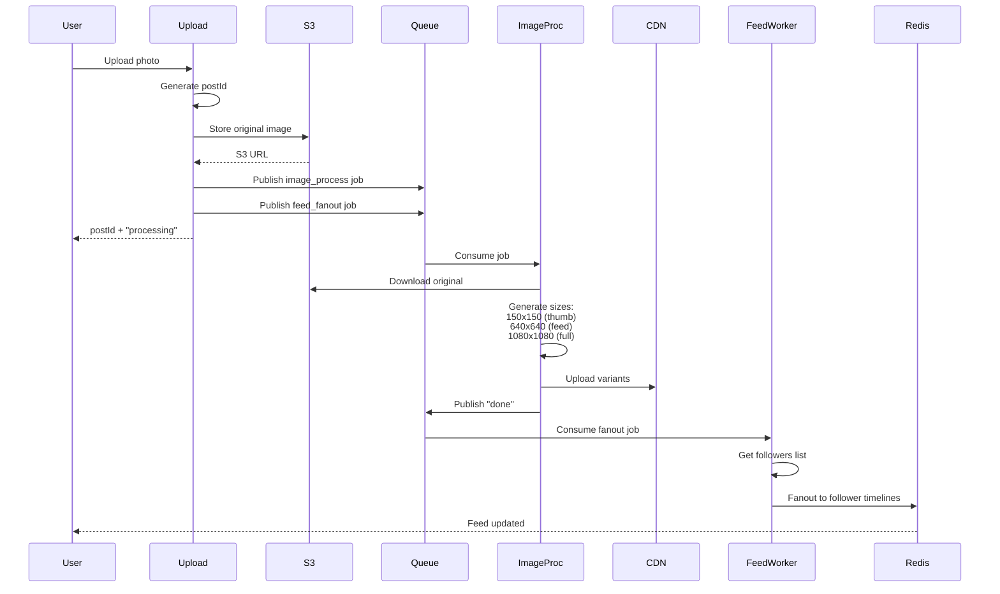
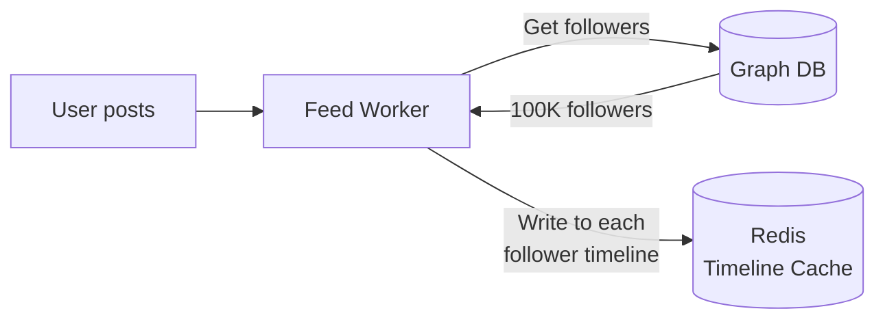
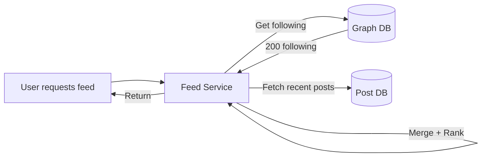
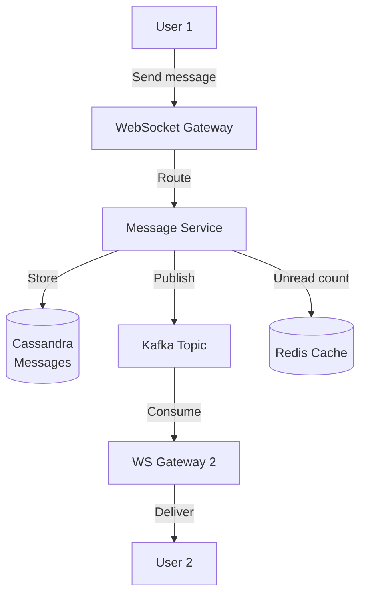

# Design Instagram

## Problem Statement
Design a photo and video sharing social media platform like Instagram that allows users to upload media, follow other users, view feeds, like/comment on posts, and discover content through explore and hashtags.

---

## Requirements

### Functional Requirements
1. **Upload photos/videos** (max 10 photos per post, 60s video)
2. **Follow/Unfollow** users
3. **News Feed** showing posts from followed users (chronological + algorithmic)
4. **Like, Comment, Share** posts
5. **Stories** (24-hour temporary posts)
6. **Direct Messaging** (text, photos, videos)
7. **Search** users and hashtags
8. **Explore page** with personalized recommendations

### Non-Functional Requirements
1. **High availability**: 99.95% uptime
2. **Low latency**: < 200ms for feed load
3. **Scalability**: 1 billion users, 100M DAU
4. **Eventual consistency** acceptable for likes/comments
5. **Global distribution**: Multi-region deployment

---

## Capacity Estimation

### Traffic Estimates
- **Daily Active Users (DAU)**: 100 million
- **Posts uploaded/day**: 50 million (0.5 posts per DAU)
- **Photos per post**: Average 3 photos
- **Total photos/day**: 150 million
- **Feed requests/user/day**: 10
- **Total feed requests/day**: 1 billion

### Storage Estimates
- **Average photo size**: 2 MB (compressed)
- **Average video size**: 20 MB (60s at 3 Mbps)
- **Daily storage**: 
  - Photos: 150M × 2 MB = 300 TB/day
  - Videos (10% of posts): 5M × 20 MB = 100 TB/day
  - **Total**: 400 TB/day
- **5-year storage**: 400 TB × 365 × 5 = **730 PB**

### Bandwidth Estimates
- **Upload**: 400 TB / 86400s = **4.6 GB/sec**
- **Feed views**: 1B requests/day × 3 photos × 2 MB = 6 PB/day = **70 GB/sec**
- **With CDN caching** (80% cache hit): **14 GB/sec** from origin

---

## API Design

### 1. Upload Post
```http
POST /api/v1/posts
Authorization: Bearer <token>
Content-Type: multipart/form-data

{
  "caption": "Sunset at the beach",
  "images": [<binary1>, <binary2>],
  "location": {"lat": 37.7749, "lon": -122.4194},
  "tags": ["#sunset", "#beach"]
}

Response:
{
  "postId": "abc123",
  "imageUrls": [
    "https://cdn.instagram.com/abc123_1.jpg",
    "https://cdn.instagram.com/abc123_2.jpg"
  ]
}
```

### 2. Get Feed
```http
GET /api/v1/feed?limit=20&cursor=xyz

Response:
{
  "posts": [
    {
      "postId": "...",
      "userId": "...",
      "username": "john_doe",
      "imageUrls": ["..."],
      "caption": "...",
      "likes": 1250,
      "comments": 45,
      "timestamp": "2024-02-09T10:00:00Z"
    }
  ],
  "nextCursor": "abc"
}
```

### 3. Like/Unlike Post
```http
POST /api/v1/posts/{postId}/like
DELETE /api/v1/posts/{postId}/like
```

### 4. Post Comment
```http
POST /api/v1/posts/{postId}/comments
{
  "text": "Beautiful shot!",
  "mentionedUsers": ["@jane_doe"]
}
```

---

## High-Level Architecture

```mermaid
graph TB
    subgraph "Client Apps"
        iOS[iOS App]
        Android[Android App]
        Web[Web App]
    end
    
    subgraph "CDN"
        CDN[CloudFront<br/>Images & Videos]
    end
    
    subgraph "Load Balancers"
        LB[Application LB]
    end
    
    subgraph "API Services"
        Upload[Upload Service]
        Feed[Feed Service]
        Graph[Social Graph<br/>Service]
        Timeline[Timeline<br/>Generator]
        Search[Search Service]
        Messaging[DM Service]
    end
    
    subgraph "Async Processing"
        ImageProc[Image Processor<br/>Resize, Filter,<br/>Thumbnail]
        FeedWorker[Feed Fanout<br/>Worker]
        Queue[Kafka/SQS]
    end
    
    subgraph "Storage - Hot Data"
        UserDB[(PostgreSQL<br/>Users, Posts)]
        GraphDB[(Graph DB<br/>Followers,<br/>Following)]
        FeedCache[(Redis<br/>Timeline Cache)]
        CountsDB[(Cassandra<br/>Likes, Comments)]
    end
    
    subgraph "Storage - Media"
        S3[(S3<br/>Original Images)]
        CDNOrigin[(CDN Origin<br/>Processed Images)]
    end
    
    subgraph "Storage - Cold Data"
        Analytics[(Data Warehouse<br/>BigQuery/Redshift)]
    end
    
    iOS & Android & Web -->|HTTPS| LB
    LB --> Upload & Feed & Graph & Search & Messaging
    
    Upload -->|Store| S3
    Upload -->|Enqueue| Queue
    Queue --> ImageProc & FeedWorker
    ImageProc -->|Store variants| CDNOrigin
    FeedWorker -->|Fanout| FeedCache
    
    Feed -->|Read timeline| FeedCache
    Feed -->|Fallback| UserDB
    Graph -->|Follow/Unfollow| GraphDB
    
    CDN -->|Cache| CDNOrigin
    
    Timeline -.->|ETL| Analytics
```

---

## Detailed Component Design

### 1. Image Upload & Processing Pipeline



**Image Variants:**
- **Thumbnail**: 150×150 (profile grid)
- **Feed**: 640×640 (mobile feed)
- **Full**: 1080×1080 (detail view)
- **Story**: 1080×1920 (9:16 aspect ratio)

**Compression:**
- **JPEG**: 85% quality (balance size/quality)
- **WebP**: For modern browsers (30% smaller)

### 2. Feed Generation Strategy

**Two Approaches:**

#### A. Fanout-on-Write (Push Model)


**Pros:**
- Fast read (pre-computed)
- Low read latency

**Cons:**
- Slow write for celebrity users (millions of followers)
- Hotkey problem in Redis

#### B. Fanout-on-Read (Pull Model)


**Pros:**
- Handles celebrity users
- No fanout overhead

**Cons:**
- Slow read (compute on-the-fly)
- High CPU usage

#### Hybrid Approach (Instagram's Strategy)
```python
def generate_feed(user_id):
    # Check if celebrity
    follower_count = graph_db.get_follower_count(user_id)
    
    if follower_count > 1_000_000:
        # Pull model for celebrities
        return pull_feed(user_id)
    else:
        # Push model for regular users
        return redis.get(f"feed:{user_id}")

def pull_feed(user_id):
    following = graph_db.get_following(user_id, limit=200)
    posts = []
    for followed_user in following:
        posts.extend(post_db.get_recent_posts(followed_user, limit=10))
    
    # Rank by ML model
    ranked_posts = ranking_service.rank(posts, user_id)
    return ranked_posts[:50]
```

### 3. Database Schema

#### Users Table (PostgreSQL)
```sql
CREATE TABLE users (
    user_id BIGSERIAL PRIMARY KEY,
    username VARCHAR(30) UNIQUE NOT NULL,
    email VARCHAR(255) UNIQUE NOT NULL,
    full_name VARCHAR(100),
    bio TEXT,
    profile_pic_url VARCHAR(500),
    created_at TIMESTAMP DEFAULT NOW(),
    INDEX idx_username (username)
);
```

#### Posts Table (Sharded by user_id)
```sql
CREATE TABLE posts (
    post_id VARCHAR(20) PRIMARY KEY,
    user_id BIGINT NOT NULL,
    caption TEXT,
    location JSON,  -- {lat, lon, name}
    created_at TIMESTAMP DEFAULT NOW(),
    INDEX idx_user_created (user_id, created_at)
);

CREATE TABLE post_images (
    image_id BIGSERIAL PRIMARY KEY,
    post_id VARCHAR(20) REFERENCES posts(post_id),
    s3_key VARCHAR(500),
    cdn_url VARCHAR(500),
    width INT,
    height INT
);
```

#### Social Graph (Neo4j or Dedicated Service)
```cypher
// Nodes
CREATE (u:User {userId: 12345, username: "john_doe"})

// Relationships
CREATE (u1:User)-[:FOLLOWS {since: timestamp()}]->(u2:User)

// Query followers
MATCH (u:User {userId: 12345})<-[:FOLLOWS]-(follower)
RETURN follower
LIMIT 100
```

**Alternative: PostgreSQL with Adjacency List**
```sql
CREATE TABLE followers (
    follower_id BIGINT NOT NULL,
    followee_id BIGINT NOT NULL,
    created_at TIMESTAMP DEFAULT NOW(),
    PRIMARY KEY (follower_id, followee_id),
    INDEX idx_followee (followee_id)
);
```

#### Likes (Cassandra - Write-Heavy)
```sql
CREATE TABLE likes (
    post_id TEXT,
    user_id BIGINT,
    created_at TIMESTAMP,
    PRIMARY KEY (post_id, user_id)
);

-- Like count (separate table for aggregation)
CREATE TABLE like_counts (
    post_id TEXT PRIMARY KEY,
    count COUNTER
);

-- Increment count
UPDATE like_counts SET count = count + 1 WHERE post_id = 'abc123';
```

### 4. Timeline Cache (Redis)

**Data Structure:**
```python
# Sorted set: score = timestamp
redis.zadd(f"feed:{user_id}", {
    "post:abc123": 1644444444,
    "post:def456": 1644444500,
    "post:ghi789": 1644444600
})

# Retrieve feed (most recent first)
posts = redis.zrevrange(f"feed:{user_id}", 0, 19)  # Top 20

# TTL: 7 days
redis.expire(f"feed:{user_id}", 604800)
```

**Memory Optimization:**
- Store only post IDs in Redis
- Fetch full post details from DB in batch
- Cache hot post metadata (JSON) separately

### 5. Direct Messaging



**Message Schema (Cassandra):**
```sql
CREATE TABLE messages (
    conversation_id UUID,
    message_id TIMEUUID,
    sender_id BIGINT,
    content TEXT,
    created_at TIMESTAMP,
    PRIMARY KEY (conversation_id, message_id)
) WITH CLUSTERING ORDER BY (message_id DESC);
```

**WebSocket Connection:**
- **Sticky sessions**: User always connects to same gateway
- **Heartbeat**: Ping every 30s to detect disconnects
- **Fallback**: HTTP long-polling for poor connections

---

## Scalability Strategies

### 1. Database Sharding
**Posts Sharding:**
```
Shard key: user_id
Shard 0: user_id % 16 = 0
Shard 1: user_id % 16 = 1
...
Shard 15: user_id % 16 = 15
```

**Benefit:** User's posts co-located on same shard → efficient queries

### 2. CDN Strategy
- **Edge locations**: 200+ PoPs globally
- **Cache control**: `Cache-Control: max-age=86400, immutable`
- **Image optimization**: Serve WebP to modern browsers, JPEG fallback

### 3. Hot Post Handling
**Problem:** Viral post overwhelms like_counts table

**Solution: Write-Behind Cache**
```python
# Buffer likes in Redis
redis.incr(f"likes:{post_id}")
redis.sadd(f"likers:{post_id}", user_id)

# Batch flush every 10 seconds
for post_id in redis.scan_iter("likes:*"):
    count = redis.get(f"likes:{post_id}")
    cassandra.execute("UPDATE like_counts SET count = count + ? WHERE post_id = ?", (count, post_id))
    redis.delete(f"likes:{post_id}")
```

---

## Advanced Features

### 1. Ranking Algorithm (Explore Page)
**Features:**
- User interests (from past interactions)
- Post engagement rate (likes/followers ratio)
- Recency (decay function)
- Creator authority (follower count)

**Model:**
```python
score = (
    0.3 * text_similarity(post.caption, user.interests) +
    0.4 * engagement_rate(post) +
    0.2 * recency_score(post.created_at) +
    0.1 * creator_authority(post.user_id)
)
```

### 2. Stories (24-hour Expiry)
**Storage:**
- **S3** with lifecycle policy (delete after 24h)
- **Redis** for active stories list

```python
# Store story
s3.put_object("stories/user123/story456.mp4", video_data,\n    expires_at=now + 24h)

# Add to active stories
redis.zadd("stories:user123", {story_id: timestamp})
redis.expire("stories:user123", 86400)
```

### 3. Hashtag Search
**Elasticsearch Index:**
```json
{
  "mappings": {
    "properties": {
      "hashtag": {"type": "keyword"},
      "post_id": {"type": "keyword"},
      "created_at": {"type": "date"},
      "likes": {"type": "integer"}
    }
  }
}
```

---

## Trade-offs

| Aspect | Choice | Trade-off |
|--------|--------|-----------|
| **Feed Generation** | Hybrid (push + pull) | Complexity vs performance |
| **Graph Storage** | PostgreSQL adjacency list | Simplicity vs query efficiency |
| **Likes Storage** | Cassandra counters | Eventual consistency vs throughput |
| **Image Storage** | S3 + CDN | Cost vs latency |

---

## Interview Discussion Points

**Q: How to handle celebrity users with 100M followers?**
- **Pull-based feed**: Don't fanout to all followers
- **Separate queue**: Prioritize celebrity posts
- **Eventual consistency**: Followers see post within minutes (acceptable)

**Q: Preventing duplicate photo uploads?**
- **Perceptual hashing** (pHash): Generate hash of image content
- Compare with existing hashes in bloom filter
- **Trade-off**: Some duplicates missed vs 100% accuracy

**Q: Optimizing feed load time?**
- **Prefetch**: Load next page while user scrolls
- **Async rendering**: Render text first, lazy load images
- **Pagination**: Cursor-based (not offset) to avoid deep pagination
