# Design WhatsApp

## Problem Statement
Design a real-time messaging application like WhatsApp that supports one-on-one and group chats, media sharing, end-to-end encryption, message delivery status, and voice/video calls.

---

## Requirements

### Functional Requirements
1. **One-on-one messaging** (text, images, videos, documents)
2. **Group chats** (up to 256 members)
3. **Message delivery status** (sent, delivered, read)
4. **End-to-end encryption** (E2EE)
5. **Voice and video calls** (peer-to-peer)
6. **Last seen** and **online status**
7. **Message persistence** (offline delivery)
8. **Push notifications**

### Non-Functional Requirements
1. **Low latency**: < 100ms message delivery
2. **High availability**: 99.99% uptime
3. **Scalability**: 2 billion users, 100 billion messages/day
4. **Security**: E2EE, no server access to message content
5. **Reliability**: Messages must not be lost

---

## Capacity Estimation

### Traffic Estimates
- **Daily Active Users (DAU)**: 500 million
- **Messages per user/day**: 40
- **Total messages/day**: 20 billion
- **Peak QPS**: 20B / 86400 × 3 = **694,000 messages/sec**
- **Media messages**: 20% of total = 4 billion/day

### Storage Estimates
- **Text message**: 100 bytes
- **Media average**: 1 MB (photos), 10 MB (videos)
- **Daily storage**:
  - Text: 16B × 100 bytes = 1.6 TB
  - Media: 4B × 2 MB (avg) = 8 PB
  - **Total**: 8 PB/day
- **With 90-day retention** (older messages compressed/archived): 8 PB × 90 = **720 PB**

### Bandwidth Estimates
- **Ingress**: 694K msg/sec × 100 bytes = **69 MB/sec** (text only)
- **Media ingress**: 4B media/day / 86400 = 46K/sec × 2 MB = **92 GB/sec**
- **Egress**: Same as ingress (message delivery)

---

## High-Level Architecture


---

## Core Components

### 1. WebSocket Connection Management


**Session Manager:**
- Maps `userId` → `gatewayId` (which WebSocket server user connected to)
- **Redis** for fast lookup
- **TTL**: 5 minutes (refreshed by heartbeat)

**Sticky Sessions:**
- User always connects to same gateway (via load balancer affinity)
- Reduces session renegotiation overhead

### 2. Message Delivery Flow

```mermaid
sequenceDiagram
    participant Sender
    participant WS1
    participant MsgService
    participant Kafka
    participant WS2
    participant Receiver
    participant Push
    
    Sender->>WS1: Send message
    WS1->>MsgService: {from, to, content, timestamp}
    MsgService->>MsgService: Generate messageId
    MsgService->>Kafka: Publish to topic
    MsgService->>Cassandra: Store message
    MsgService-->>WS1: ACK (sent ✓)
    WS1-->>Sender: Message sent
    
    Kafka->>WS2: Consume message
    WS2->>WS2: Check if receiver online
    
    alt Receiver Online
        WS2-->>Receiver: Deliver message
        Receiver-->>WS2: ACK (delivered ✓✓)
        WS2->>MsgService: Update status
        MsgService-->>WS1: Delivery receipt
        WS1-->>Sender: Message delivered ✓✓
    else Receiver Offline
        Kafka->>Redis: Queue undelivered message
        WS2->>Push: Send push notification
    end
    
    Receiver->>WS2: Mark as read
    WS2->>MsgService: Read receipt
    MsgService-->>WS1: Read receipt ✓✓ (blue)
```



**Message Status:**
1. **Sent** (one checkmark): Server received
2. **Delivered** (two checkmarks): Delivered to recipient's device
3. **Read** (two blue checkmarks): Recipient opened chat

### 3. Group Messaging


**Group Schema (PostgreSQL):**
```sql
CREATE TABLE groups (
    group_id UUID PRIMARY KEY,
    name VARCHAR(100),
    created_by BIGINT,
    created_at TIMESTAMP DEFAULT NOW()
);

CREATE TABLE group_members (
    group_id UUID REFERENCES groups(group_id),
    user_id BIGINT,
    role ENUM('admin', 'member'),
    joined_at TIMESTAMP DEFAULT NOW(),
    PRIMARY KEY (group_id, user_id)
);
```

**Optimization: Group Message Storage**
- **Single copy**: Store message once, reference from each member's inbox
- **Denormalize**: Each member gets copy (faster reads, more storage)

### 4. End-to-End Encryption


**Signal Protocol:**
- **Double Ratchet Algorithm**: Forward secrecy
- Server stores **encrypted messages** only
- Keys stored locally on device

**Key Storage:**
```sql
CREATE TABLE user_keys (
    user_id BIGINT PRIMARY KEY,
    identity_key BYTEA,        -- Long-term key
    signed_prekey BYTEA,        -- Rotated periodically
    one_time_prekeys BYTEA[]    -- Consumable keys
);
```

### 5. Media Handling


**Media Encryption:**
- Generate random AES-256 key for each media file
- Encrypt media client-side
- Share decryption key in message (E2EE)
- Server stores encrypted blob only

### 6. Voice/Video Calls


**WebRTC Flow:**
1. **Offer/Answer**: SDP exchange via signaling server
2. **ICE**: Establish peer-to-peer connection
3. **STUN**: Discover public IP/port
4. **TURN**: Relay if P2P fails (10-20% of calls)

---

## Database Design

### Message Storage (Cassandra)

**Schema:**
```sql
CREATE TABLE messages (
    user_id BIGINT,              -- Partition key
    conversation_id UUID,         -- Clustering key
    message_id TIMEUUID,          -- Clustering key
    sender_id BIGINT,
    content BLOB,                 -- Encrypted
    media_id UUID,
    timestamp TIMESTAMP,
    status ENUM('sent', 'delivered', 'read'),
    PRIMARY KEY ((user_id, conversation_id), message_id)
) WITH CLUSTERING ORDER BY (message_id DESC);
```

**Why Cassandra?**
- **Write-heavy**: Billions of messages/day
- **Time-series**: Natural ordering by `message_id`
- **Scalability**: Horizontal scaling

**Query Patterns:**
```sql
-- Get latest messages for a conversation
SELECT * FROM messages 
WHERE user_id = 123 AND conversation_id = 'abc' 
LIMIT 50;

-- Pagination
SELECT * FROM messages 
WHERE user_id = 123 AND conversation_id = 'abc' 
AND message_id < 'last_message_id' 
LIMIT 50;
```

### Undelivered Messages (Redis)

```python
# Queue messages for offline users
redis.lpush(f"inbox:{user_id}", message_json)

# On user reconnect
messages = redis.lrange(f"inbox:{user_id}", 0, -1)
for msg in messages:
    deliver(msg)
redis.delete(f"inbox:{user_id}")
```

---

## Scalability Strategies

### 1. Sharding Strategy

**User-based sharding:**
```
Shard 0: user_id % 16 = 0
Shard 1: user_id % 16 = 1
...
```

**Benefit:** User's conversations co-located

### 2. Connection Pooling

**Problem:** Millions of WebSocket connections

**Solution:**
- **Per-server limit**: 50K connections/server
- **For 500M DAU**: 10,000 WebSocket servers
- **Auto-scaling**: Based on connection count

### 3. Read Replicas

- **Read-heavy for old messages** (chat history)
- Cassandra replicas for read scaling

---

## Advanced Features

### 1. Status Updates (Stories)
- Similar to Instagram Stories
- **24-hour TTL**, S3 lifecycle policy
- **View count** tracking in Redis

### 2. Message Reactions
```sql
CREATE TABLE reactions (
    message_id TIMEUUID,
    user_id BIGINT,
    reaction ENUM('❤️', '👍', '😂', '😮', '😢', '🙌'),
    PRIMARY KEY (message_id, user_id)
);
```

### 3. Typing Indicators
```python
# Ephemeral, not stored
redis.setex(f"typing:{conversation_id}:{user_id}", 5, "true")

# Broadcast to conversation members
websocket.broadcast(conversation_id, {
    "type": "typing",
    "userId": user_id
})
```

---

## Monitoring & Reliability

### Metrics
- **Message delivery latency**: p50, p99, p999
- **WebSocket connection count**: Per server
- **Message delivery success rate**: %
- **Push notification delivery rate**

### Failure Handling

**WebSocket disconnect:**
```python
on_disconnect(user_id):
    session_manager.unregister(user_id)
    presence_service.update_last_seen(user_id, now())
    # Messages queued in Redis for redelivery
```

**Message delivery retry:**
```python
max_retries = 3
for attempt in range(max_retries):
    if deliver_message(msg):
        break
    sleep(exponential_backoff(attempt))
else:
    # Send push notification
    fcm.send(user_id, msg)
```

---

## Trade-offs

| Aspect | Choice | Trade-off |
|--------|--------|-----------|
| **Protocol** | WebSocket | Persistent connection vs HTTP overhead |
| **E2EE** | Signal Protocol | Privacy vs searchability |
| **Message Storage** | Cassandra | Write speed vs complex queries |
| **Group Fanout** | Async (Kafka) | Eventual delivery vs instant |

---

## Interview Discussion Points

**Q: How to ensure message ordering in group chats?**
- **Lamport timestamps**: Each message tagged with logical clock
- **Server-assigned sequence**: Central sequencer per conversation
- **Trade-off**: Strict ordering vs throughput

**Q: Handling message floods (spam)?**
- **Rate limiting**: Max 100 msg/min per user
- **Bloom filter**: Detect duplicate hash (copy-paste spam)
- **ML model**: Detect spam patterns

**Q: Disaster recovery?**
- **Multi-region Cassandra**: 3 replicas across regions
- **WAL (Write-Ahead Log)**: Replay on failure
- **Backup**: Daily snapshots to S3
