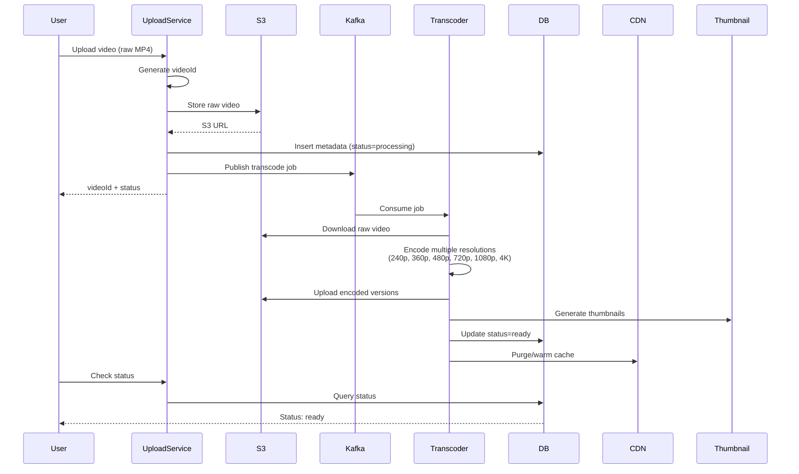
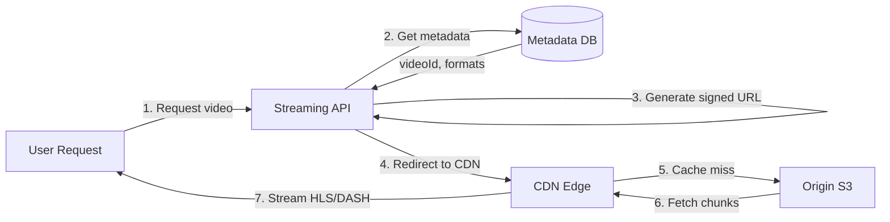
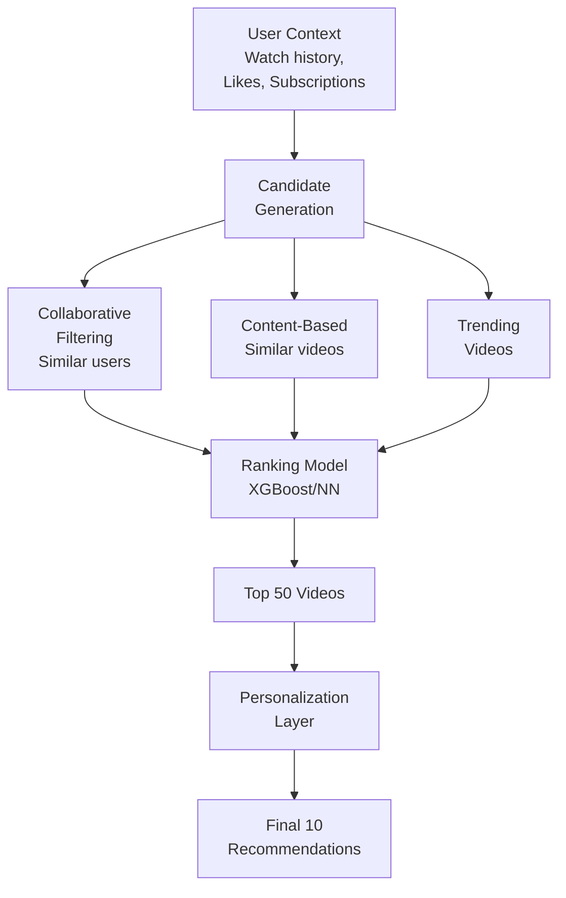

# Design YouTube

## Problem Statement
Design a video sharing platform like YouTube that allows users to upload, view, search, and comment on videos. The system must handle billions of users watching millions of videos concurrently.

---

## Requirements

### Functional Requirements
1. **Upload videos** (various formats: MP4, AVI, MOV)
2. **Stream videos** with adaptive bitrate
3. **Search videos** by title, tags, channel
4. **Like/Dislike** and comment on videos
5. **Subscribe** to channels
6. **Recommendations** based on watch history
7. **View count** and analytics

### Non-Functional Requirements
1. **High availability**: 99.99% uptime
2. **Low latency**: < 200ms to start streaming
3. **Scalability**: Handle 1 billion DAU, 500 hours of video uploaded/min
4. **Global distribution**: CDN for low-latency streaming worldwide
5. **Reliability**: No video loss during upload/encoding

---

## Capacity Estimation

### Traffic Estimates
- **Daily Active Users (DAU)**: 1 billion
- **Videos watched per user/day**: 5 videos
- **Total video views/day**: 5 billion
- **Peak QPS**: 5B / 86400 × 3 (peak factor) = **174,000 views/sec**

### Upload Estimates
- **Video uploads**: 500 hours/min = 30,000 hours/hour
- **Average video length**: 10 minutes
- **Upload rate**: 30,000 × 6 videos/hour = **180,000 videos/hour**

### Storage Estimates
- **Average raw video size**: 1 GB for 10-min 1080p video
- **Videos uploaded/day**: 180K × 24 = 4.32M videos/day
- **Daily storage (raw)**: 4.32M × 1 GB = **4.32 PB/day**
- **With transcoding** (multiple resolutions): 4.32 PB × 3 = **13 PB/day**
- **5-year storage**: 13 PB × 365 × 5 = **23.7 exabytes**

### Bandwidth Estimates
- **Average bitrate**: 4 Mbps (1080p)
- **Concurrent viewers** (peak): 174K streams
- **Egress bandwidth**: 174K × 4 Mbps = **696 Gbps**

---

## API Design

### 1. Upload Video
```http
POST /api/v1/videos
Content-Type: multipart/form-data
Authorization: Bearer <token>

{
  "title": "My Video",
  "description": "...",
  "tags": ["tech", "tutorial"],
  "category": "Education",
  "privacy": "public",  // public, unlisted, private
  "file": <binary>
}

Response:
{
  "videoId": "dQw4w9WgXcQ",
  "status": "processing",
  "uploadUrl": "https://upload.youtube.com/..."
}
```

### 2. Stream Video
```http
GET /api/v1/videos/{videoId}/stream?quality=1080p

Response: 302 Redirect to CDN
Location: https://cdn.youtube.com/dQw4w9WgXcQ/1080p.m3u8
```

### 3. Search Videos
```http
GET /api/v1/search?q=python+tutorial&limit=20&offset=0

Response:
{
  "results": [
    {
      "videoId": "...",
      "title": "...",
      "thumbnail": "https://...",
      "views": 1000000,
      "uploadDate": "2024-01-01"
    }
  ],
  "total": 5000
}
```

### 4. Like/Comment
```http
POST /api/v1/videos/{videoId}/like
POST /api/v1/videos/{videoId}/comments
{
  "text": "Great video!",
  "timestamp": 120  // seconds into video
}
```

---

## High-Level Architecture

```mermaid
graph TB
    subgraph "Client Layer"
        Web[Web Browser]
        Mobile[Mobile App]
        SmartTV[Smart TV]
    end
    
    subgraph "CDN"
        CDN[CloudFront/Akamai<br/>Video Streaming]
    end
    
    subgraph "API Gateway"
        Gateway[API Gateway<br/>Rate Limiting, Auth]
    end
    
    subgraph "Application Services"
        Upload[Upload Service]
        Stream[Streaming Service]
        Search[Search Service]
        Recommend[Recommendation<br/>Service]
        Analytics[Analytics Service]
    end
    
    subgraph "Processing Pipeline"
        Transcoder[Video Transcoder<br/>FFmpeg Cluster]
        Thumbnail[Thumbnail<br/>Generator]
        Queue[Task Queue<br/>Kafka]
    end
    
    subgraph "Storage"
        ObjectStore[(Object Storage<br/>S3/GCS<br/>Raw + Encoded Videos)]
        MetaDB[(PostgreSQL<br/>Metadata, Users,<br/>Comments)]
        SearchDB[(Elasticsearch<br/>Video Search Index)]
        CacheDB[(Redis<br/>Hot Metadata,<br/>View Counts)]
    end
    
    subgraph "Analytics & ML"
        Warehouse[(BigQuery/Redshift<br/>Analytics)]
        MLPipeline[ML Models<br/>Recommendations]
    end
    
    Web & Mobile & SmartTV -->|HTTPS| Gateway
    Gateway --> Upload & Stream & Search & Recommend
    
    CDN -->|Cache video chunks| ObjectStore
    Stream -->|Redirect to CDN| CDN
    
    Upload -->|Enqueue| Queue
    Queue --> Transcoder & Thumbnail
    Transcoder -->|Store encoded| ObjectStore
    
    Search --> SearchDB
    Upload & Stream --> MetaDB
    Stream --> CacheDB
    
    Analytics -.->|ETL| Warehouse
    Warehouse -.->|Train| MLPipeline
    MLPipeline --> Recommend
```

---

## Detailed Component Design

### 1. Video Upload & Processing Pipeline



#### Video Transcoding
**Formats:**
- **HLS (HTTP Live Streaming)**: Apple, widely supported
- **DASH (Dynamic Adaptive Streaming)**: Industry standard
- **Resolutions**: 144p, 240p, 360p, 480p, 720p, 1080p, 1440p, 2160p (4K)
- **Codecs**: H.264 (compatibility), H.265/HEVC (efficiency), AV1 (future)

**Adaptive Bitrate Streaming (ABR):**
```
video.m3u8 (master playlist)
├─ 1080p/video.m3u8 (5 Mbps)
├─ 720p/video.m3u8 (2.5 Mbps)
├─ 480p/video.m3u8 (1 Mbps)
└─ 360p/video.m3u8 (500 Kbps)
```

Client switches quality based on bandwidth

#### Distributed Transcoding
- **Horizontal scaling**: 1000+ transcoding nodes
- **Job queue**: Kafka partitioned by priority (high for verified creators)
- **Optimization**: GPU-accelerated encoding (NVIDIA NVENC)

### 2. Video Streaming Architecture



**CDN Strategy:**
- **Multi-CDN**: CloudFront + Akamai (redundancy)
- **Cache hierarchy**: Edge PoP → Regional cache → Origin
- **TTL**: Hot videos cached for hours, cold videos on-demand
- **Prefetching**: First 10 seconds cached aggressively

### 3. Database Schema

#### Videos Table (PostgreSQL)
```sql
CREATE TABLE videos (
    video_id VARCHAR(20) PRIMARY KEY,
    title VARCHAR(255) NOT NULL,
    description TEXT,
    channel_id BIGINT NOT NULL,
    upload_date TIMESTAMP DEFAULT NOW(),
    duration_seconds INT,
    privacy ENUM('public', 'unlisted', 'private'),
    status ENUM('processing', 'ready', 'failed'),
    raw_s3_key VARCHAR(500),
    INDEX idx_channel_id (channel_id),
    INDEX idx_upload_date (upload_date)
);

CREATE TABLE video_formats (
    id BIGSERIAL PRIMARY KEY,
    video_id VARCHAR(20) REFERENCES videos(video_id),
    resolution VARCHAR(10),  -- 1080p, 720p, etc.
    codec VARCHAR(20),
    s3_key VARCHAR(500),
    bitrate_kbps INT
);
```

#### Comments Table (Sharded by video_id)
```sql
CREATE TABLE comments (
    comment_id BIGINT PRIMARY KEY,
    video_id VARCHAR(20) NOT NULL,
    user_id BIGINT NOT NULL,
    text TEXT,
    timestamp_seconds INT,  -- Position in video
    created_at TIMESTAMP DEFAULT NOW(),
    likes INT DEFAULT 0,
    INDEX idx_video_id (video_id),
    INDEX idx_created_at (created_at)
);
```

#### View Counts (Redis + Batch Processing)
```python
# Real-time counter in Redis
redis.incr(f"views:{video_id}")

# Batch update to DB every 5 minutes
for video_id, count in redis.scan_iter("views:*"):
    db.execute("UPDATE videos SET view_count = view_count + %s WHERE video_id = %s", (count, video_id))
    redis.delete(f"views:{video_id}")
```

### 4. Search Service (Elasticsearch)

**Index Schema:**
```json
{
  "mappings": {
    "properties": {
      "video_id": {"type": "keyword"},
      "title": {"type": "text", "analyzer": "standard"},
      "description": {"type": "text"},
      "tags": {"type": "keyword"},
      "channel_name": {"type": "text"},
      "upload_date": {"type": "date"},
      "view_count": {"type": "long"},
      "duration": {"type": "integer"}
    }
  }
}
```

**Ranking Factors:**
1. **Text relevance** (BM25 score)
2. **View count** (popularity boost)
3. **Recency** (decay function)
4. **User engagement** (CTR, watch time)

**Autocomplete:**
```json
GET /videos/_search
{
  "suggest": {
    "title-suggest": {
      "prefix": "python tut",
      "completion": {"field": "title.suggest"}
    }
  }
}
```

### 5. Recommendation Engine



**Two-Tower Model:**
- **User Tower**: Embeddings from watch history, demographics
- **Video Tower**: Embeddings from title, tags, engagement
- **Dot product** for similarity score

**Features for Ranking:**
- Video metadata (duration, upload date, category)
- User engagement (CTR, watch time, likes)
- Freshness (recent uploads get boost)
- Channel authority (subscriber count)

---

## Scalability Strategies

### 1. Database Sharding
**Comments Sharding:**
```
Shard key: video_id
Shard 0: video_id hash % 100 = 0-9
Shard 1: video_id hash % 100 = 10-19
...
Shard 9: video_id hash % 100 = 90-99
```

**Hot Shard Problem:**
- Viral video gets all comments on one shard
- **Solution**: Further partition by time buckets

### 2. Caching Strategy
**Multi-layer cache:**
1. **CDN**: Video chunks (30-day TTL for popular)
2. **Redis**: Video metadata (1-hour TTL)
3. **Application cache**: Search results (5-min TTL)

### 3. Write-Heavy Optimization (Likes/Views)
**Problem:** Updating counters creates DB hotspot

**Solution: Batch Writes**
```python
# Buffer in Redis
redis.incr(f"likes:{video_id}")

# Flush to DB periodically
cron.schedule("*/5 * * * *", flush_counters)
```

---

## Advanced Features

### 1. Live Streaming
- **Protocol**: RTMP (ingest) → HLS (delivery)
- **Low latency**: LL-HLS or WebRTC
- **Chat**: WebSocket connections

### 2. Content Moderation
- **Upload-time**: ML model checks for policy violations
- **User reports**: Queue for human review
- **Copyright**: Content ID system (audio fingerprinting)

### 3. Monetization
- **Ad insertion**: SSAI (Server-Side Ad Insertion) in HLS stream
- **Analytics**: Track impressions, clicks (Kafka → BigQuery)

---

## Trade-offs & Optimizations

| Aspect | Choice | Trade-off |
|--------|--------|-----------|
| **Storage** | S3 + CDN | Cost ($millions/month) vs latency |
| **Transcoding** | Multi-resolution | Storage (3x) vs user experience |
| **View counts** | Eventual consistency | Accuracy vs DB load |
| **Recommendations** | Batch updates | Freshness vs compute cost |

---

## Interview Discussion Points

**Q: How to handle viral videos?**
- **CDN prefetching**: Warm cache proactively
- **Read replicas**: Metadata DB scaled horizontally
- **Rate limiting**: Prevent single video from overwhelming system
- **Graceful degradation**: Serve lower quality if needed

**Q: How to prevent duplicate uploads?**
- **Perceptual hashing** (pHash or dHash) of video frames
- Compare hash against existing videos
- **Trade-off**: False positives vs compute cost

**Q: Optimizing for mobile users on slow networks?**
- **ABR**: Start at 144p, upgrade as bandwidth allows
- **Prefetch next video**: Start downloading while watching current
- **Thumbnail previews**: Low-res sprite sheets instead of full video scrubbing

**Q: Disaster recovery?**
- **Multi-region S3 replication**: Cross-region backups
- **Database snapshots**: Daily automated backups
- **CDN failover**: Multi-CDN strategy (CloudFront → Akamai)
