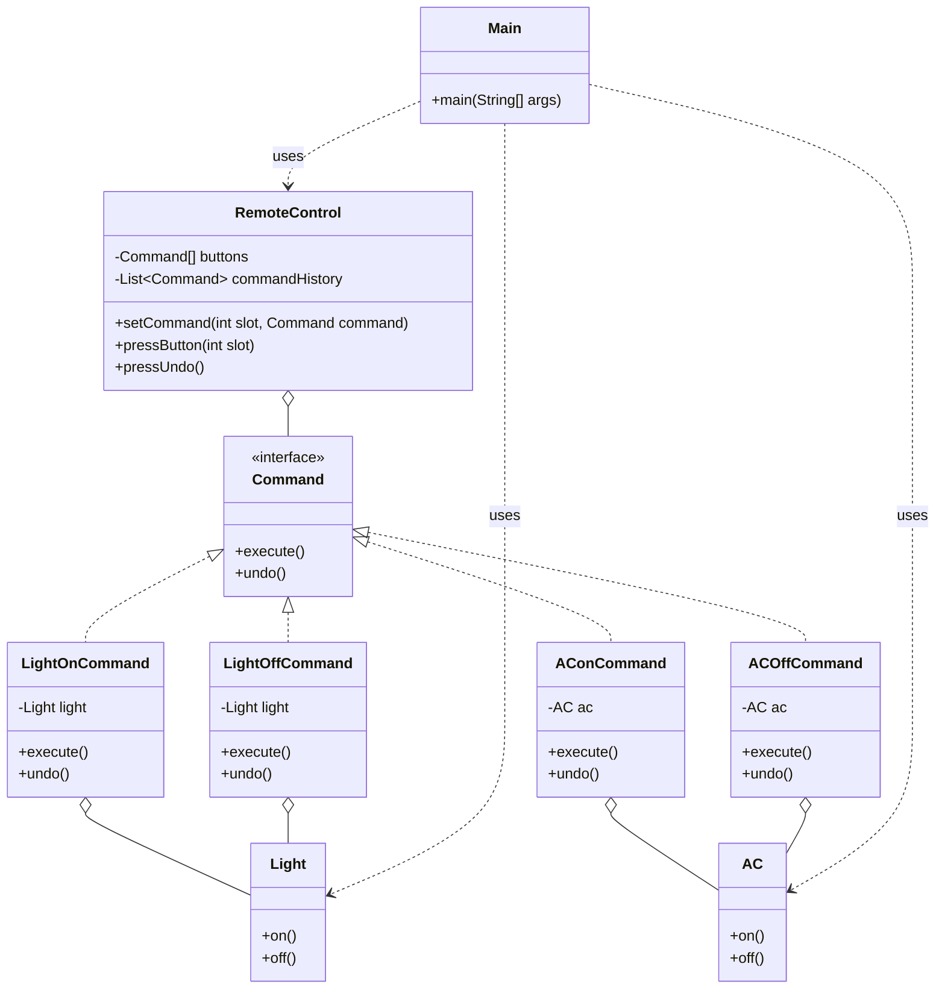

# Command Pattern

* Command Pattern encapsulates a request as an object, allowing for more flexible and dynamic command handling. In the upcoming sections, we’ll dive deeper into how the Command Pattern works and how it can be applied in real-world scenarios.
* turns a request into a separate object, allowing you to decouple the code that issues the request from the code that performs it.
* **Formal Definition**
  * encapsulates a request as an object, allowing for parameterization of clients with different requests, queuing of requests, and logging of the requests.&#x20;
  * It lets you add features like undo, redo, logging, and dynamic command execution without changing the core business logic.
  * This allows you to execute commands at a later time, in a flexible manner, without having to interact directly with the request's execution details.
* **Real-Life Analogy**
  * Think of a remote control used to turn on or off the lights or an air conditioner (AC). When you press a button to turn on the lights or adjust the temperature, you don’t need to understand how the internal circuits work or how the AC receives the signal.&#x20;
  * You just press the "On" or "Off" button, and the remote control takes care of sending the command.
  * Similarly, the Command Pattern decouples the sender of a request (the remote control) from the receiver (the light or AC), providing flexibility and simplicity in handling commands.
  * **Four Key Components**
    * Client – Initiates the request and sets up the command object.
    * Invoker – Asks the command to execute the request.
    * Command – Defines a binding between a receiver object and an action.
    * Receiver – Knows how to perform the actions to satisfy a request.
* ### Understanding the Problem
  * Let's say we're building a simple remote control system where devices like lights and air conditioner can be turned on and off. Here's a naive implementation of the code:

```java
// Receiver classes - Light and AC with basic on/off methods
class Light {
    public void on() {
        System.out.println("Light turned ON");
    }
    
    public void off() {
        System.out.println("Light turned OFF");
    }
}

class AC {
    public void on() {
        System.out.println("AC turned ON");
    }
    
    public void off() {
        System.out.println("AC turned OFF");
    }
}

// Invoker - NaiveRemoteControl class to control devices
class NaiveRemoteControl {
    private Light light;
    private AC ac;
    private String lastAction;
    
    public NaiveRemoteControl(Light light, AC ac) {
        this.light = light;
        this.ac = ac;
        this.lastAction = "";
    }
    
    // Command methods
    public void pressLightOn() {
        this.light.on();
        this.lastAction = "LIGHT_ON";
    }
    
    public void pressLightOff() {
        this.light.off();
        this.lastAction = "LIGHT_OFF";
    }
    
    public void pressACOn() {
        this.ac.on();
        this.lastAction = "AC_ON";
    }
    
    public void pressACOff() {
        this.ac.off();
        this.lastAction = "AC_OFF";
    }
    
    // Undo last action
    public void pressUndo() {
        if (this.lastAction.equals("LIGHT_ON")) {
            this.light.off();
            this.lastAction = "LIGHT_OFF";
        } else if (this.lastAction.equals("LIGHT_OFF")) {
            this.light.on();
            this.lastAction = "LIGHT_ON";
        } else if (this.lastAction.equals("AC_ON")) {
            this.ac.off();
            this.lastAction = "AC_OFF";
        } else if (this.lastAction.equals("AC_OFF")) {
            this.ac.on();
            this.lastAction = "AC_ON";
        } else {
            System.out.println("No action to undo.");
        }
    }
}

// Client Code
public class Main {
    public static void main(String[] args) {
        Light light = new Light();
        AC ac = new AC();
        NaiveRemoteControl remote = new NaiveRemoteControl(light, ac);
        
        remote.pressLightOn();
        remote.pressACOn();
        remote.pressLightOff();
        remote.pressUndo();  // Should undo LIGHT_OFF -> Light ON
        remote.pressUndo();  // Should undo AC_ON -> AC OFF
    }
}
```


While the implementation works, it suffers from some significant issues.

* **Issues in the Code**
  * 1\. Tight Coupling:
    * The `NaiveRemoteControl` class directly calls methods on the `Light` and `AC` classes.&#x20;
    * If additional devices need to be added in the future, changes will be required in the remote control class.&#x20;
    * This violates the open/closed principle, where classes should be open for extension but closed for modification.
  * 2\. Lack of Flexibility:
    * The commands are hardcoded in the remote control class.&#x20;
    * If new actions or different command sequences are required, modifying the remote control code is necessary, leading to potential maintenance challenges.
  * 3\. Undo Functionality:
    * The `pressUndo` method is tightly coupled with the commands.&#x20;
    * This makes it difficult to add more complex undo functionality, especially when dealing with multiple actions or a variety of devices.
  * 4\. Hardcoded Commands:
    * The remote control class directly defines commands like `pressLightOn`, `pressACOn`, etc.
    * This makes the system rigid and difficult to modify.&#x20;
    * Adding new actions or commands would require changing the remote control code, leading to challenges in maintaining or extending the system.
  * 5\. Maintaining Command History:
    * The original approach doesn’t have a centralized mechanism to track previously executed commands.&#x20;
    * This leads to difficulties in implementing features like undo, where the last action needs to be reversed efficiently.
* The Solution
  * The issues in the previous implementation can be addressed by using the Command Pattern.&#x20;
  * By applying this pattern, it becomes easier to encapsulate requests as objects, allowing for flexible and reusable command handling.&#x20;
  * The command pattern decouples the request sender (Invoker) from the receiver (Light/AC) and provides a unified way to handle multiple commands and actions.

```java
// ========= Receiver classes ===========
// Light and AC with basic on/off methods
class Light {
    public void on() {
        System.out.println("Light turned ON");
    }
    
    public void off() {
        System.out.println("Light turned OFF");
    }
}

class AC {
    public void on() {
        System.out.println("AC turned ON");
    }
    
    public void off() {
        System.out.println("AC turned OFF");
    }
}

// ========= Command interface ===========
// defines the command structure
interface Command {
    void execute();
    void undo();
}

// Concrete commands for Light ON and OFF
class LightOnCommand implements Command {
    private Light light;
    
    public LightOnCommand(Light light) {
        this.light = light;
    }
    
    @Override
    public void execute() {
        this.light.on();
    }
    
    @Override
    public void undo() {
        this.light.off();
    }
}

class LightOffCommand implements Command {
    private Light light;
    
    public LightOffCommand(Light light) {
        this.light = light;
    }
    
    @Override
    public void execute() {
        this.light.off();
    }
    
    @Override
    public void undo() {
        this.light.on();
    }
}

// Concrete commands for AC ON and OFF
class AConCommand implements Command {
    private AC ac;
    
    public AConCommand(AC ac) {
        this.ac = ac;
    }
    
    @Override
    public void execute() {
        this.ac.on();
    }
    
    @Override
    public void undo() {
        this.ac.off();
    }
}

class ACOffCommand implements Command {
    private AC ac;
    
    public ACOffCommand(AC ac) {
        this.ac = ac;
    }
    
    @Override
    public void execute() {
        this.ac.off();
    }
    
    @Override
    public void undo() {
        this.ac.on();
    }
}

// ========== Remote control class (Invoker) ==========
class RemoteControl {
    private Command[] buttons;
    private List<Command> commandHistory;
    
    public RemoteControl() {
        this.buttons = new Command[4];  // Assigning 4 slots for commands
        this.commandHistory = new ArrayList<>();
    }
    
    // Assign command to slot
    public void setCommand(int slot, Command command) {
        this.buttons[slot] = command;
    }
    
    // Press the button to execute the command
    public void pressButton(int slot) {
        if (this.buttons[slot] != null) {
            this.buttons[slot].execute();
            this.commandHistory.add(this.buttons[slot]);
        } else {
            System.out.println("No command assigned to slot " + slot);
        }
    }
    
    // Undo the last action
    public void pressUndo() {
        if (!this.commandHistory.isEmpty()) {
            Command lastCommand = this.commandHistory.remove(this.commandHistory.size() - 1);
            lastCommand.undo();
        } else {
            System.out.println("No commands to undo.");
        }
    }
}

// ========= Client code ===========
public class Main {
    public static void main(String[] args) {
        Light light = new Light();
        AC ac = new AC();
        
        Command lightOn = new LightOnCommand(light);
        Command lightOff = new LightOffCommand(light);
        Command acOn = new AConCommand(ac);
        Command acOff = new ACOffCommand(ac);
        
        RemoteControl remote = new RemoteControl();
        remote.setCommand(0, lightOn);
        remote.setCommand(1, lightOff);
        remote.setCommand(2, acOn);
        remote.setCommand(3, acOff);
        
        remote.pressButton(0);  // Light ON
        remote.pressButton(2);  // AC ON
        remote.pressButton(1);  // Light OFF
        remote.pressUndo();     // Undo Light OFF -> Light ON
        remote.pressUndo();     // Undo AC ON -> AC OFF
    }
}
```

### Class Diagram



* how the Command Pattern resolves the above discussed issues:

| Issue                           | How Command Pattern Resolves the Issue                                                                                                                                                                            |
| ------------------------------- | ----------------------------------------------------------------------------------------------------------------------------------------------------------------------------------------------------------------- |
| **Tight Coupling**              | By using the Command Pattern, the `RemoteControl` class no longer directly interacts with the devices. It now interacts with command objects (e.g., `LightOnCommand`, `ACOffCommand`), which decouples the logic. |
| **Lack of Flexibility**         | With the Command Pattern, new commands (e.g., for new devices or actions) can be created as new `Command` implementations without changing the `RemoteControl` class. This allows for easy extension.             |
| **Undo Functionality**          | The Command Pattern provides a consistent structure for undoing commands. Each concrete command (e.g., `LightOnCommand`, `ACOffCommand`) has its own `undo()` method, which allows easy reversal of actions.      |
| **Hardcoded Commands**          | The Command Pattern uses an interface for commands, which allows dynamic assignment of different commands to slots in the remote. This makes the command assignments flexible and customizable.                   |
| **Maintaining Command History** | The Command Pattern introduces a stack (`commandHistory`) in the `RemoteControl` class, which tracks previously executed commands. This makes the undo functionality centralized and easier to manage.            |

#### Impact Without the Command Pattern

* Tight Coupling Between Invoker and Receiver\
  The invoker and receiver are directly linked, making future changes or additions to the system difficult without modifying both components.
* Lack of Reusability\
  No abstraction for actions limits the ability to reuse code for different functionalities or scenarios across various parts of the application.
* Undo/Redo Operations Not Supported\
  Implementing undo or redo functionality becomes complex and error-prone when operations are directly tied to specific actions.
* Difficulty in Implementing Batch Actions\
  Implementing batch operations, like night mode changes, becomes cumbersome as each action needs to be handled individually.
* No Plug-and-Play Flexibility\
  The system lacks the flexibility to add or modify commands dynamically without impacting other parts of the application.
* Scalability Issues\
  As the system grows, managing commands and handling new features becomes increasingly difficult without a structured approach like the Command Pattern.

***

#### When to Use the Command Pattern

* Decoupling Sender from Receiver\
  Use the Command Pattern when there is a need to decouple the sender (Invoker) from the receiver (the object performing the action).
* Undo/Redo Support\
  The Command Pattern is useful when you require built-in support for undoing or redoing actions.
* Batch Operations\
  When multiple actions need to be executed as part of a batch (e.g., applying night mode), the Command Pattern allows easy implementation.
* Plug-in Architecture\
  It facilitates the creation of flexible, extensible systems where new commands can be added without affecting the core system.
* Creating Macros or Composite Commands\
  Use the pattern to group multiple commands together, enabling complex actions to be executed in sequence as a single macro.

***

### Pros and Cons of the Command Pattern

**Pros**

* Decouples Sender and Receiver\
  The sender (Invoker) and receiver (the device or action) are decoupled, allowing for flexibility and easier maintenance.
* Supports Undo/Redo Functionality\
  The Command Pattern inherently supports undo and redo actions, allowing for easier management of state reversals.
* Easily Extensible and Reusable\
  New commands can be added without modifying existing code, and commands can be reused across different parts of the application.

***

**Cons**

* Increases the Number of Classes\
  Implementing the Command Pattern can result in a large number of small classes for each command, potentially increasing the complexity.
* Can Add Unnecessary Complexity for Simple Tasks\
  For simple applications, the Command Pattern may introduce unnecessary complexity, making it harder to manage than simpler alternatives.
* Requires Careful Design for Undo/Redo\
  Implementing undo/redo functionality correctly requires careful design and additional effort, especially for complex command chains.

<figure><figcaption></figcaption></figure>
