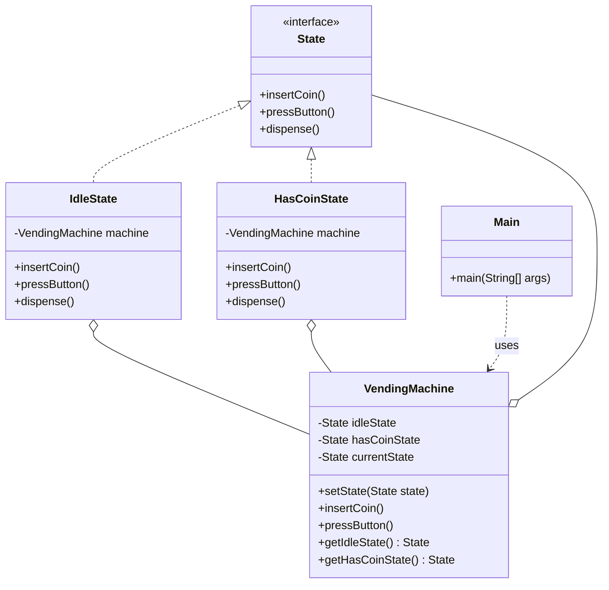

# State Pattern

> **Type**: Behavioral  
> **Purpose**: Allows an object to alter its behavior when its internal state changes. The object will appear to change its class.

## Problem Statement
**Vending Machine**.  
Behavior of "Insert Coin" or "Press Button" depends on current state (`Idle`, `HasCoin`, `Dispensing`, `OutOfStock`).

## Bad Code (If-Else)
```java
public void insertCoin() {
    if (state.equals("Idle")) accept();
    else if (state.equals("HasCoin")) reject();
    else if (state.equals("OutOfStock")) reject();
}
```
*Problem*: Adding a new state requires changing all methods.

## Implementation (State Pattern)

```java
// 1. State Interface
interface State {
    void insertCoin();
    void pressButton();
    void dispense();
}

// 2. Context (The Machine)
class VendingMachine {
    private State idleState;
    private State hasCoinState;
    private State currentState;
    
    public VendingMachine() {
        this.idleState = new IdleState(this);
        this.hasCoinState = new HasCoinState(this);
        this.currentState = this.idleState;
    }
    
    public void setState(State state) {
        this.currentState = state;
    }
    
    public void insertCoin() {
        currentState.insertCoin();
    }
    
    public void pressButton() {
        currentState.pressButton();
    }
   
    public State getIdleState() { return idleState; }
    public State getHasCoinState() { return hasCoinState; }
}

// 3. Concrete States
class IdleState implements State {
    private VendingMachine machine;
    
    public IdleState(VendingMachine machine) {
        this.machine = machine;
    }
    
    @Override
    public void insertCoin() {
        System.out.println("Coin inserted");
        machine.setState(machine.getHasCoinState());
    }
    
    @Override
    public void pressButton() {
        System.out.println("Insert coin first");
    }
    
    @Override
    public void dispense() {
        System.out.println("Insert coin first");
    }
}

class HasCoinState implements State {
    private VendingMachine machine;
    
    public HasCoinState(VendingMachine machine) {
        this.machine = machine;
    }
    
    @Override
    public void insertCoin() {
        System.out.println("Coin already inserted");
    }
    
    @Override
    public void pressButton() {
        System.out.println("Button pressed...");
        machine. setState(machine.getIdleState()); // Transition logic
    }
    
    @Override
    public void dispense() {
        System.out.println("Dispensing...");
    }
}

// Client
public class Main {
    public static void main(String[] args) {
        VendingMachine vm = new VendingMachine();
        vm.insertCoin();   // State changes to HasCoin
        vm.pressButton();  // Action allowed
    }
}
```

### Class Diagram


