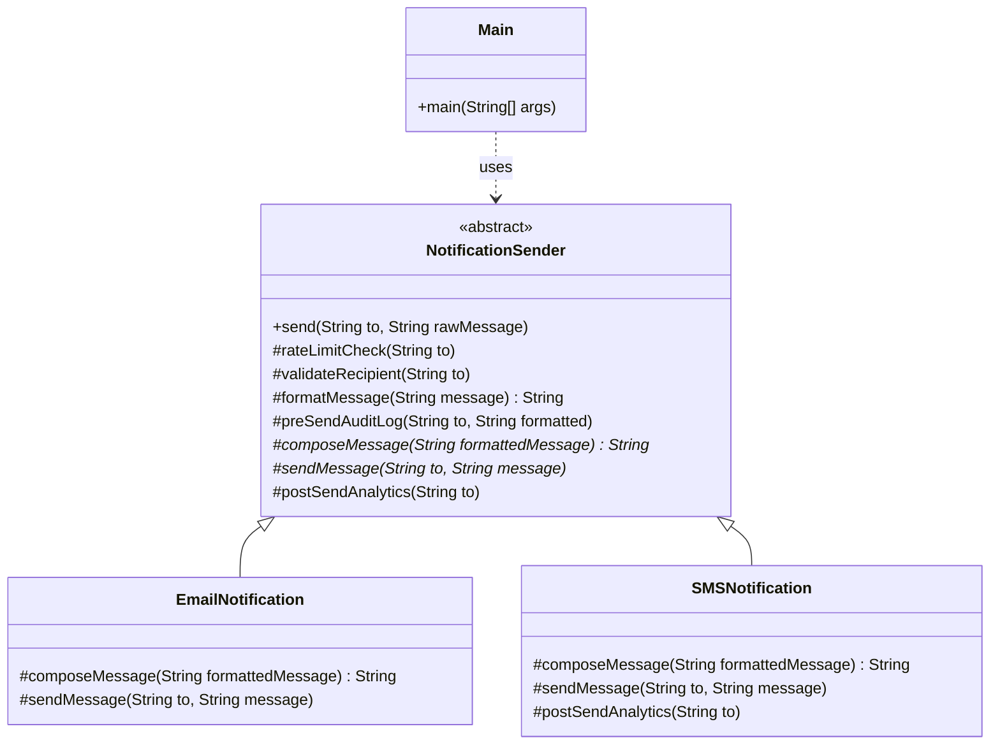

# Template Pattern

* **Formal Definition**
  * provides a blueprint for executing an algorithm. It allows subclasses to override specific steps of the algorithm, but the overall structure remains the same.&#x20;
  * This ensures that the invariant parts of the algorithm are not changed, while enabling customization in the variable parts.
* **Real Life Analogy**
  * Imagine you are following a recipe to bake a cake.&#x20;
  * The overall process of baking a cake (preheat oven, mix ingredients, bake, and cool) is fixed, but the specific ingredients or flavors may vary (chocolate, vanilla, etc.).
  * The Template Pattern is like the recipe: it defines the basic structure of the process (steps), while allowing the specific ingredients (or steps) to be varied depending on the cake type.
* **Key Steps in Template Pattern**
  * The Template Pattern generally consists of four key steps:
    * Template Method (Final Method in Base Class)
      * This method defines the skeleton of the algorithm.&#x20;
      * It calls the various steps and determines their sequence.&#x20;
      * This method is final to prevent overriding in subclasses, ensuring that the algorithm’s structure stays consistent.
    * Primitive Operations (Abstract Methods)
      * These are abstract methods that subclasses must implement.&#x20;
      * These methods represent the variable parts of the algorithm that may change based on the subclass’s specific requirements.
    * Concrete Operations (Final or Concrete Methods)
      * These are methods that contain behavior common to all subclasses.&#x20;
      * They are defined in the base class and are shared by all subclasses.
    * Hooks (Optional Methods with Default Behavior)
      * Hooks are optional methods in the base class that provide default behavior.
      * Subclasses can override these methods to modify the behavior when needed, but they are not mandatory for all subclasses to implement.
  * By using the Template Pattern, one can ensure that the common steps of an algorithm remain unchanged while allowing subclasses to modify the specific details of the algorithm.
*   Understanding the Problem

    *   Let’s assume we are building a Notification Service where we need to send notifications via multiple channels, such as Email and SMS. Below is a simple way of how it might be implemented:


```java
// EmailNotification handles sending emails
class EmailNotification {
    public void send(String to, String message) {
        System.out.println("Checking rate limits for: " + to);
        System.out.println("Validating email recipient: " + to);
        String formatted = message.strip();  // String trimming
        System.out.println("Logging before send: " + formatted + " to " + to);
        
        // Compose Email
        String composedMessage = "<html><body><p>" + formatted + "</p></body></html>";
        
        // Send Email
        System.out.println("Sending EMAIL to " + to + " with content:\n" + composedMessage);
        
        // Analytics
        System.out.println("Analytics updated for: " + to);
    }
}

// SMSNotification handles sending SMS messages
class SMSNotification {
    public void send(String to, String message) {
        System.out.println("Checking rate limits for: " + to);
        System.out.println("Validating phone number: " + to);
        String formatted = message.strip();  // String trimming
        System.out.println("Logging before send: " + formatted + " to " + to);
        
        // Compose SMS
        String composedMessage = "[SMS] " + formatted;
        
        // Send SMS
        System.out.println("Sending SMS to " + to + " with message: " + composedMessage);
        
        // Analytics (custom)
        System.out.println("Custom SMS analytics for: " + to);
    }
}

// Main function to test sending notifications
public class Main {
    public static void main(String[] args) {
        // Create objects for both notification services
        EmailNotification emailNotification = new EmailNotification();
        SMSNotification smsNotification = new SMSNotification();
        
        // Sending email notification
        emailNotification.send("example@example.com", "Your order has been placed!");
        
        System.out.println();
        
        // Sending SMS notification
        smsNotification.send("1234567890", "Your OTP is 1234.");
    }
}
```

* **Issues In This Code**
  * Code Duplication:
    * Both `EmailNotification` and `SMSNotification` contain nearly identical logic for rate limit checking, message formatting, logging, and analytics.&#x20;
    * This violates the DRY (Don't Repeat Yourself) principle, making the code harder to maintain.
  * Hardcoded Behavior:
    * The behavior for sending emails and SMS is tightly coupled with the `send()` method.&#x20;
    * If we need to add a new notification type (e.g., Push Notification), we would need to duplicate the entire logic and modify each notification class.
  * Lack of Extensibility:
    * If we need to change the logic for rate limit checks, logging, or analytics, we will have to modify it across all notification classes, leading to potential errors and inconsistencies.
  * Maintenance Overhead:&#x20;
    * With each new notification type, you are adding more classes with similar code, making the system increasingly difficult to manage as it grows.

***

* The Solution
  * The Template Pattern can be used to improve the structure of the previous code.&#x20;
  * By using the Template Pattern, we can eliminate duplicated logic (e.g., rate limit checks, recipient validation, logging, etc.) and define a skeleton method in a base class, while allowing the subclasses to define the specific steps such as message composition and sending.

```java
// Abstract class defining the template method and common steps
abstract class NotificationSender {
    // Template method (final to prevent overriding)
    public final void send(String to, String rawMessage) {
        // Common Logic
        rateLimitCheck(to);
        validateRecipient(to);
        String formatted = formatMessage(rawMessage);
        preSendAuditLog(to, formatted);
        
        // Specific Logic: defined by subclasses
        String composedMessage = composeMessage(formatted);
        sendMessage(to, composedMessage);
        
        // Optional Hook
        postSendAnalytics(to);
    }
    
    // Common step 1: Check rate limits
    protected void rateLimitCheck(String to) {
        System.out.println("Checking rate limits for: " + to);
    }
    
    // Common step 2: Validate recipient
    protected void validateRecipient(String to) {
        System.out.println("Validating recipient: " + to);
    }
    
    // Common step 3: Format the message (can be customized)
    protected String formatMessage(String message) {
        return message.strip();  // Trim spaces
    }
    
    // Common step 4: Pre-send audit log
    protected void preSendAuditLog(String to, String formatted) {
        System.out.println("Logging before send: " + formatted + " to " + to);
    }
    
    // Hook: Subclasses must implement custom message composition
    protected abstract String composeMessage(String formattedMessage);
    
    // Hook: Subclasses must implement custom message sending
    protected abstract void sendMessage(String to, String message);
    
    // Optional hook for analytics (can be overridden)
    protected void postSendAnalytics(String to) {
        System.out.println("Analytics updated for: " + to);
    }
}

// Concrete class for email notifications
class EmailNotification extends NotificationSender {
    // Implement message composition for email
    @Override
    protected String composeMessage(String formattedMessage) {
        return "<html><body><p>" + formattedMessage + "</p></body></html>";
    }
    
    // Implement email sending logic
    @Override
    protected void sendMessage(String to, String message) {
        System.out.println("Sending EMAIL to " + to + " with content:\n" + message);
    }
}

// Concrete class for SMS notifications
class SMSNotification extends NotificationSender {
    // Implement message composition for SMS
    @Override
    protected String composeMessage(String formattedMessage) {
        return "[SMS] " + formattedMessage;
    }
    
    // Implement SMS sending logic
    @Override
    protected void sendMessage(String to, String message) {
        System.out.println("Sending SMS to " + to + " with message: " + message);
    }
    
    // Override optional hook for custom SMS analytics
    @Override
    protected void postSendAnalytics(String to) {
        System.out.println("Custom SMS analytics for: " + to);
    }
}

// Client code
public class Main {
    public static void main(String[] args) {
        EmailNotification emailSender = new EmailNotification();
        emailSender.send("john@example.com", "Welcome to TUF+!");
        
        System.out.println();
        
        SMSNotification smsSender = new SMSNotification();
        smsSender.send("9876543210", "Your OTP is 4567.");
    }
}
```

### Class Diagram



* **Key Steps of Template Pattern Used in Above Code**
  * Template Method (Final Method in Base Class)
    * The `send()` method is the template method that defines the skeleton of the algorithm.&#x20;
    * It calls common steps such as rateLimitCheck, validateRecipient, preSendAuditLog, etc., and delegates customizable actions like composeMessage and sendMessage to subclasses.
  * Primitive Operations (Abstract Methods)
    * The methods `composeMessage()` and `sendMessage()` are abstract, meaning they must be implemented by subclasses (EmailNotification and SMSNotification) to define specific behaviors for each notification type.
  * Concrete Operations (Final or Concrete Methods)
    * Methods like rateLimitCheck, validateRecipient, preSendAuditLog, and postSendAnalytics are defined in the base class as concrete operations because they contain common logic shared by both email and SMS notifications.
  * Hooks (Optional Methods with Default Behavior)
    * The postSendAnalytics method is an optional hook that can be overridden by subclasses (e.g., SMSNotification overrides this method to provide custom analytics behavior).
    * Subclasses can choose to use or skip this method based on specific requirements.


*   **How This Approach Solves the Issues**

    | Issue                 | Solution with Template Pattern                                                                                                                            |
    | --------------------- | --------------------------------------------------------------------------------------------------------------------------------------------------------- |
    | Code Duplication      | The common steps (rate limit checks, recipient validation, logging, etc.) are now centralized in the base class, reducing duplication.                    |
    | Hardcoded Behavior    | The specific behaviors (email vs SMS) are handled by subclasses, making the code more flexible and extensible.                                            |
    | Lack of Extensibility | New types of notifications (e.g., PushNotification) can be added by subclassing NotificationSender and implementing the abstract methods.                 |
    | Maintenance Overhead  | Common logic is handled in one place (the base class), so updating behaviors (like rate limit checks or logging) only requires changes in the base class. |

    <br>
* When to Use the Template Pattern
  *   The Template Pattern is best suited in the following scenarios:

      * When multiple classes follow the same algorithm but differ in a few steps.When multiple classes follow the same algorithm but differ in a few steps. This pattern allows the core structure to remain the same while enabling flexibility in specific steps of the algorithm.
        * When you want to avoid code duplication of common steps. The Template Pattern centralizes shared logic in the base class, promoting code reusability.
        * When you need to enforce a fixed order of steps. This pattern ensures that the steps of an algorithm follow a specific sequence, which can be crucial in certain operations.
        * When you want to provide optional customizations. Subclasses can override specific steps to customize the behavior while still maintaining the overall algorithm.
        * When you need a structured flow. The Template Pattern ensures that subclasses follow a certain framework, with the flexibility to implement specific details.


* #### Advantages and Disadvantages of Template Method
  * #### **Pros**
    * Promotes code reusability by sharing the same steps\
      The Template Pattern helps in sharing common steps across different classes, ensuring that they follow the same algorithm without duplicating code.
      * Supports OCP (Open/Closed Principle)\
        New behaviors (custom steps) can be added by extending the base class without modifying its existing code, supporting the Open/Closed Principle.
      * Enforces a consistent flow\
        The pattern ensures a fixed sequence of steps, making the flow predictable and consistent across all subclasses.
      * Allows optional customization via hook methods\
        The use of hooks allows subclasses to modify or extend behavior when needed without changing the base structure.
  *   **Cons**

      * Inheritance-based, limits flexibility\
        The Template Pattern uses inheritance, which can reduce flexibility as the behavior is tightly coupled with the base class.
      * Subclasses are tightly coupled with the base class\
        Any changes in the base class may affect all subclasses, making it harder to modify or extend certain features independently.
      * Not ideal if the algorithm varies, switch to Strategy Pattern\
        If the algorithm changes significantly, the Template Pattern becomes less suitable, and using the Strategy Pattern may be a better choice.
      * May result in too many subclasses\
        If the number of steps to be customized grows, you might end up creating too many subclasses, making the codebase harder to maintain.

      ####
*   #### Real World Products where Template Pattern is Used


    * The Template Pattern is commonly used in real-world applications where the overall structure of an operation is fixed, but specific steps need to be customisable. Here are some examples:
      * **1. TUF+ Payment Flow**
        * In TUF+, the payment flow for both Indian and International transactions follows a predefined sequence.&#x20;
        * This sequence includes steps like validating the payment method, processing the payment, and updating the account.&#x20;
        * While these steps remain the same, the specifics (such as validating a UPI ID for Indian payments or a credit card for international payments) can vary between subclasses, providing flexibility and customisation.
      * **2. Game Engines**
        * Game engines like Unity or Unreal Engine use the Template Pattern in their game loop and rendering process.&#x20;
        *   The framework for rendering a frame is common (input handling, physics update, rendering), but specific actions (e.g., rendering techniques or AI decision-making) can be customized in different games through subclassing.


      * **3. Frameworks**
        * Many web frameworks, like Spring or Django, use the Template Pattern for handling requests.&#x20;
        * These frameworks define the common flow for handling HTTP requests (e.g., URL mapping, request handling, response formatting), but allow developers to override certain steps like request validation, database queries, or rendering logic.<br>

<figure><figcaption></figcaption></figure>
