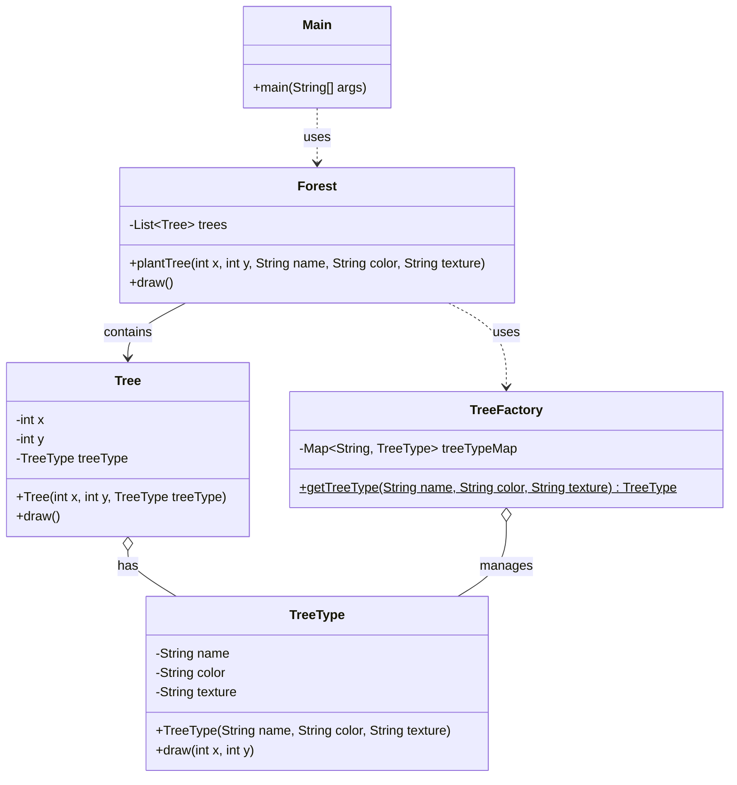

# Flyweight Pattern

* **Flyweight Pattern** is a **structural design pattern** used to minimize memory usage by sharing as much data as possible with similar objects.
* It separates the **intrinsic (shared)** state from the **extrinsic (unique)** state, so that shared parts of objects are stored **only** once and reused wherever needed.
* **Real-Life Analogy**
  * Think of trees in a video game. In an open-world video game, you might see thousands of trees:
  * All oak trees have the same texture, shape, and behavior (shared/intrinsic).
  * But their **location**, **size**, or **health status** may differ (extrinsic)
* Rather than loading the same tree model thousands of times, the game engine uses a single shared tree model and passes different parameters when rendering.
* **Problem It Solves**
  * It solves the problem of **high memory usage** when a large number of similar objects are created. **For example, imagine a system rendering:**
    * Thousands of tree objects in a forest
    * Each with the same shape and texture but a different location
  * Instead of creating thousands of identical objects, the Flyweight Pattern lets you **share the common parts** (shape, texture) and **store the unique parts** (location) externally, dramatically reducing memory consumption.
  * **Core Concepts**
    * **Intrinsic State:** The **immutable**, **shared** data stored inside the flyweight. It is independent of context.
    * **Extrinsic State:** The **context-specific data** passed from the client and not stored in the flyweight.\
      <br>
* #### Real-Life Coding Example
  * Imagine you're building a feature like Google Maps where you need to **visually represent trees** across the globe. Now, even though millions of trees are shown, most of them belong to only a few common types like “Oak”, “Pine”, or “Birch”.&#x20;
  * However, if we were to create a separate object for each individual tree — storing the same data repeatedly for tree type, color, and texture — it would lead to massive memory consumption.<br>

```java
// ================ Tree Class =================
class Tree {
    // Attributes that keep on changing 
    private int x;
    private int y;
    
    // Attributes that remain constant
    private String name;
    private String color;
    private String texture;
    
    public Tree(int x, int y, String name, String color, String texture) {
        this.x = x;
        this.y = y;
        this.name = name;
        this.color = color;
        this.texture = texture;
    }
    
    public void draw() {
        System.out.println("Drawing tree at (" + this.x + ", " + this.y + ") with type " + this.name);
    }
}

// ================ Forest Class =================
class Forest {
    private List<Tree> trees;
    
    public Forest() {
        this.trees = new ArrayList<>();
    }
    
    public void plantTree(int x, int y, String name, String color, String texture) {
        Tree tree = new Tree(x, y, name, color, texture);
        this.trees.add(tree);
    }
    
    public void draw() {
        for (Tree tree : this.trees) {
            tree.draw();
        }
    }
}

// =============== Client Code ==================
public class Main {
    public static void main(String[] args) {
        Forest forest = new Forest();
        
        // Planting 1 million trees
        for (int i = 0; i < 1000000; i++) {
            forest.plantTree(i, i, "Oak", "Green", "Rough");
        }
        
        System.out.println("Planted 1 million trees.");
    }
}
```

*   **Understanding the Issues**

    *   Although the above codes works absolutely fine but there are a few problems associated with it:

        * **Redundant memory usage:** Same tree data duplicated a million times.
        * **Inefficient:** Slower rendering, higher GC overhead.


    * The previous implementation created **a new Tree object for each of the 1 million trees**, even when most of them had identical properties like name, color, and texture. This led to unnecessary duplication of memory for the shared attributes.
    * To solve this, we use the **Flyweight Design Pattern** — a structural pattern focused on minimizing memory usage by **sharing as much data as possible between similar objects**.<br>


```java
// ============= TreeType Class ================
class TreeType {
    // Properties that are common among all trees of this type
    private String name;
    private String color;
    private String texture;
    
    public TreeType(String name, String color, String texture) {
        this.name = name;
        this.color = color;
        this.texture = texture;
    }
    
    public void draw(int x, int y) {
        System.out.println("Drawing " + this.name + " tree at (" + x + ", " + y + ")");
    }
}

// ================ Tree Class =================
class Tree {
    // Attributes that keep on changing 
    private int x;
    private int y;
    
    // Attributes that remain constant
    private TreeType treeType;
    
    public Tree(int x, int y, TreeType treeType) {
        this.x = x;
        this.y = y;
        this.treeType = treeType;
    }
    
    public void draw() {
        this.treeType.draw(this.x, this.y);
    }
}

// ============ TreeFactory Class ==============
class TreeFactory {
    private static Map<String, TreeType> treeTypeMap = new HashMap<>();
    
    public static TreeType getTreeType(String name, String color, String texture) {
        String key = name + " - " + color + " - " + texture;
        if (!treeTypeMap.containsKey(key)) {
            treeTypeMap.put(key, new TreeType(name, color, texture));
        }
        return treeTypeMap.get(key);
    }
}

// ================ Forest Class =================
class Forest {
    private List<Tree> trees;
    
    public Forest() {
        this.trees = new ArrayList<>();
    }
    
    public void plantTree(int x, int y, String name, String color, String texture) {
        TreeType treeType = TreeFactory.getTreeType(name, color, texture);
        Tree tree = new Tree(x, y, treeType);
        this.trees.add(tree);
    }
    
    public void draw() {
        for (Tree tree : this.trees) {
            tree.draw();
        }
    }
}

// =============== Client Code ==================
public class Main {
    public static void main(String[] args) {
        Forest forest = new Forest();
        
        // Planting 1 million trees
        for (int i = 0; i < 1000000; i++) {
            forest.plantTree(i, i, "Oak", "Green", "Rough");
        }
        
        System.out.println("Planted 1 million trees.");
    }
}
```

### Class Diagram




* **How Flyweight Pattern Solves the Issue**
  * Let’s break it down:
    * **`TreeType` Class:** This acts as the **flyweight** object. It stores data **common** to all trees of a given type—like name, color, and texture. Instead of duplicating this data, we create **only one instance per unique combination**.
    * **`Tree` Class:** This now only stores:
      * **Intrinsic data:** x, y (unique to each tree)
      * **Reference to shared data:** A TreeType instance
    * **`TreeFactory` Class:** This is the **central factory** that ensures **TreeType** instances are reused:
    * **Memory Efficiency:** Even with **1 million trees**, if they all share the same TreeType ("Oak", "Green", "Rough"), **only one TreeType object is created** and shared across all trees, reducing memory usage **dramatically**.

***

* When to Use Flyweight Pattern?
  * The flyweight pattern can be used when:
    * When you need to create a large number of similar objects.
    * When memory and performance optimization is crucial.
    * When the object's **intrinsic properties** could be shared independently of its **extrinsic properties**.

***

* Advantages
  * Greatly reduces memory usage when there are a lot of similar objects.
  * Improves performance in resource-constrained environments.
  * Enables faster object creation.

***

* Disadvantages
  * Adds complexity (especially around factory and object management).
  * Harder to debug due to shared state.
  * Can lead to **tight coupling** between flyweight and client code if not designed carefully.

***

* Real-World Applications of Flyweight Pattern
  * The Flyweight pattern is widely used in large-scale applications where rendering or managing **many similar objects** efficiently is essential. Here are some real-world examples:
    * **Google Maps**
      * When displaying **millions of trees** or similar visual landmarks, Google Maps avoids creating separate objects for each tree.&#x20;
      * Instead, it shares the same data (like tree type, color, texture) across all trees and only varies extrinsic properties like position — a classic use of the Flyweight pattern.
    * **Uber App**
      * Uber renders **many nearby cars** on the map, but most of them are visually identical (same icon, color, etc.).&#x20;
      * Instead of creating a new object for each car from scratch, Uber reuses a common flyweight object and just changes the coordinates — reducing memory and improving performance.
    * **Web Browsers (Chrome, Firefox, etc.)**
      * When rendering complex webpages with **thousands of similar DOM elements** (like repeated icons, buttons, text styles), modern browsers **internally use the Flyweight pattern** to optimize memory.&#x20;
      * For instance:
        * A webpage might have hundreds of **\<div>** or **\<button> elements** styled identically.
        * Instead of allocating separate memory for each element’s styling and behavior, browsers reuse the **same shared style object (like CSS rules or rendering data)** across all similar components.
        * This allows browsers to load and display large webpages **faster and with less RAM usage**.


<figure><figcaption></figcaption></figure>

