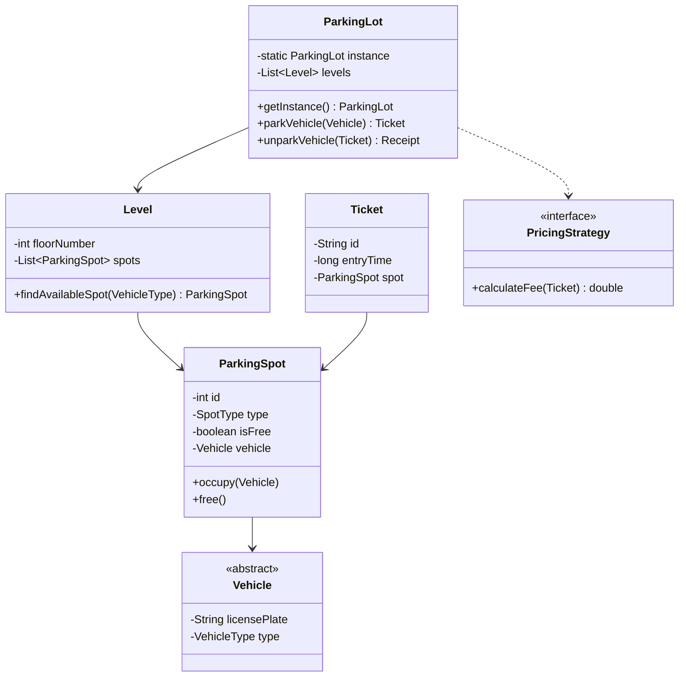

# Design Parking Lot

> **Difficulty**: Medium
> **Topics**: Object-Oriented Design, Singleton, Factory Pattern, Strategy Pattern
> **Key Concepts**: Managing shared resources, pricing logic, concurrency.

## Phase 1: Requirements Gathering

### Goals
- Understand the scope: A multi-level parking lot for different vehicle types.
- Identify users: Customers, Parking Attendant/System, Admin.
- Define core features (Must-have vs Should-have).

### 1. Who are the actors?
- **Customer**: Arrives with a vehicle, parks, and pays the fee.
- **System/Attendant**: Issues tickets, assigns spots, calculates fees.
- **Admin**: Manages parking lot capacity, rates, and maintenance (optional).

### 2. What are the must-have features? (Core)
- **Multi-Level Parking**: Support multiple floors.
- **Spot Assignment**: Find the nearest available spot for a specific vehicle type.
- **Ticket Generation**: Issue a ticket with entry time upon arrival.
- **Fee Calculation**: Calculate parking fee upon exit based on duration.
- **Payment**: Process payment and release the spot.

### 3. What are the constraints?
- **Concurrency**: Multiple vehicles arriving/exiting simultaneously.
- **Capacity**: Limited spots per floor and type (Compact, Large, Motorcycle).
- **Scalability**: Extensible for new vehicle types or pricing strategies.

---

## Phase 2: Use Cases

### UC1: Park Vehicle
**Actor**: Customer / System
**Flow**:
1. Vehicle arrives at the entry gate.
2. System identifies vehicle type (Car, Truck, Motorcycle).
3. System checks for the nearest available spot of that type.
4. If full, display "Full".
5. If available, system occupies the spot and generates a `Ticket` with `ticketId` and `entryTime`.
6. Gate opens.

### UC2: Exit & Pay
**Actor**: Customer / System
**Flow**:
1. Customer arrives at the exit gate with `Ticket`.
2. System reads the ticket and calculates duration (Current Time - Entry Time).
3. System calculates fee using the current `PricingStrategy`.
4. Customer pays the amount.
5. System releases the spot (marks it free).
6. Gate opens.

---

## Phase 3: Class Diagram

### Step 1: Core Entities
- **ParkingLot**: Singleton manager.
- **Level**: Represents a floor.
- **ParkingSpot**: An individual slot.
- **Vehicle**: Abstract base class (Car, Truck, Motorcycle).
- **Ticket**: Proof of entry.
- **PricingStrategy**: Logic for fee calculation.

### Step 2: Relationships
- `ParkingLot` **has-many** `Level` (Composition).
- `Level` **has-many** `ParkingSpot` (Composition).
- `ParkingSpot` **has-a** `Vehicle` (Association/Aggregation).
- `Ticket` **references** `ParkingSpot` and `Vehicle`.
- `Vehicle` is a **base class** for `Car`, `Truck`, `Motorcycle` (Inheritance).

### UML Diagram



---

## Phase 4: Design Patterns

### 1. Singleton Pattern
- **Description**: Ensures a class has only one instance and provides a global point of access to it.
- **Why used**: The `ParkingLot` system needs a central point of control for managing shared resources (spots, levels) to prevent conflicting assignments and ensure consistent state across the system.

### 2. Factory Pattern
- **Description**: A creational pattern that provides an interface for creating objects in a superclass, but allows subclasses to alter the type of objects that will be created.
- **Why used**: Encapsulates the logic of creating different `Vehicle` types (`Car`, `Truck`, `Motorcycle`). Allows adding new vehicle types without modifying client code.

### 3. Strategy Pattern
- **Description**: Defines a family of algorithms, encapsulates each one, and makes them interchangeable. Strategy lets the algorithm vary independently from clients that use it.
- **Why used**: Pricing logic matches this perfectly (`HourlyStrategy`, `FlatRateStrategy`). We can swap pricing models dynamically (e.g., weekend rates) without changing the `ParkingLot` class.

---

## Phase 5: Code Key Methods

### Java Implementation

```java
import java.util.*;
import java.util.concurrent.*;
import java.time.Instant;

// 1. Enums
enum VehicleType { MOTORCYCLE, CAR, TRUCK }
enum SpotType { MOTORCYCLE, COMPACT, LARGE }

// 2. Vehicle Hierarchy
abstract class Vehicle {
    private String licensePlate;
    private VehicleType type;

    public Vehicle(String licensePlate, VehicleType type) {
        this.licensePlate = licensePlate;
        this.type = type;
    }

    public VehicleType getType() { return type; }
}

class Car extends Vehicle {
    public Car(String licensePlate) { super(licensePlate, VehicleType.CAR); }
}

class Motorcycle extends Vehicle {
    public Motorcycle(String licensePlate) { super(licensePlate, VehicleType.MOTORCYCLE); }
}

class Truck extends Vehicle {
    public Truck(String licensePlate) { super(licensePlate, VehicleType.TRUCK); }
}

// 3. Parking Spot
class ParkingSpot {
    private int id;
    private SpotType type;
    private boolean isFree;
    private Vehicle vehicle;
    private final ReadWriteLock lock = new ReentrantReadWriteLock();

    public ParkingSpot(int id, SpotType type) {
        this.id = id;
        this.type = type;
        this.isFree = true;
    }

    public boolean isFree() { 
        lock.readLock().lock();
        try {
            return isFree; 
        } finally {
            lock.readLock().unlock();
        }
    }
    
    public SpotType getType() { return type; }

    public void occupy(Vehicle v) {
        lock.writeLock().lock();
        try {
            if (!this.isFree) throw new IllegalStateException("Spot already occupied");
            this.vehicle = v;
            this.isFree = false;
        } finally {
            lock.writeLock().unlock();
        }
    }

    public void free() {
        lock.writeLock().lock();
        try {
            this.vehicle = null;
            this.isFree = true;
        } finally {
            lock.writeLock().unlock();
        }
    }
}

// 4. Ticket
class Ticket {
    String id;
    long entryTime;
    ParkingSpot spot;

    public Ticket(ParkingSpot spot) {
        this.id = UUID.randomUUID().toString();
        this.entryTime = System.currentTimeMillis();
        this.spot = spot;
    }
}

// 5. Level
class Level {
    private int floor;
    private List<ParkingSpot> spots;

    public Level(int floor, int numSpots) {
        this.floor = floor;
        this.spots = new ArrayList<>(numSpots);
        // Simplified: Split spots equally for demo
        for (int i = 0; i < numSpots; i++) {
            SpotType type = (i < numSpots/3) ? SpotType.MOTORCYCLE : 
                            (i < 2*numSpots/3) ? SpotType.COMPACT : SpotType.LARGE;
            spots.add(new ParkingSpot(i, type));
        }
    }

    public ParkingSpot findAvailableSpot(VehicleType vType) {
        SpotType needed = getSpotTypeForVehicle(vType);
        for (ParkingSpot s : spots) {
            if (s.isFree() && s.getType() == needed) {
                return s;
            }
        }
        return null;
    }

    private SpotType getSpotTypeForVehicle(VehicleType vType) {
        switch (vType) {
            case MOTORCYCLE: return SpotType.MOTORCYCLE;
            case CAR: return SpotType.COMPACT;
            default: return SpotType.LARGE;
        }
    }
}

// 6. ParkingLot (Singleton)
class ParkingLot {
    private static ParkingLot instance;
    private List<Level> levels;
    
    private ParkingLot() {
        levels = new ArrayList<>();
    }

    public static synchronized ParkingLot getInstance() {
        if (instance == null) instance = new ParkingLot();
        return instance;
    }

    public void addLevel(Level level) {
        levels.add(level);
    }

    public Ticket parkVehicle(Vehicle v) {
        for (Level l : levels) {
            ParkingSpot spot = l.findAvailableSpot(v.getType());
            if (spot != null) {
                spot.occupy(v);
                return new Ticket(spot);
            }
        }
        throw new RuntimeException("Gridlock! No spot available.");
    }

    public double unparkVehicle(Ticket ticket) {
        ticket.spot.free();
        long duration = System.currentTimeMillis() - ticket.entryTime;
        // Simple pricing: $1 per second (for demo speed)
        return (duration / 1000.0) * 1.0;
    }
}

// 7. Client Code
public class ParkingSystem {
    public static void main(String[] args) throws InterruptedException {
        ParkingLot lot = ParkingLot.getInstance();
        lot.addLevel(new Level(1, 10)); // 10 spots

        Vehicle car = new Car("ABC-123");
        System.out.println("Parking car...");
        Ticket ticket = lot.parkVehicle(car);
        System.out.println("Ticket issued: " + ticket.id);

        Thread.sleep(2000); // Wait 2 sec

        double fee = lot.unparkVehicle(ticket);
        System.out.println("Unparked. Fee: $" + fee);
    }
}
```

---

## Phase 6: Discussion

### Concurrency
**Q: How do we handle multiple entrances simultaneously (SDE-3 Concept)?**
- **Single Node**: Instead of using global `synchronized` blocks which create a bottleneck, use **`ReentrantReadWriteLock`**. Finding an available spot involves many READ operations, while actually parking involves a single WRITE operation. ReadWrite locks allow multiple concurrent readers but exclusive writers. For even higher throughput, use `ConcurrentHashMap` to track `freeSpots` per `SpotType`.
- **Distributed System**: If the parking lot spans multiple nodes (e.g., massive airport parking managed by microservices), use **Distributed Locking** (e.g., Redis Redlock or ZooKeeper) on a specific spot before occupying it to prevent double-booking across servers.

### Extensibility
**Q: How to add electric vehicle charging?**
- Create a `ElectricSpot` extending `ParkingSpot`.
- Add `Chargeable` interface to `ElectricCar`.

### Pricing Flexibility
**Q: How to implement dynamic pricing?**
- Use the **Strategy Pattern**. Pass a `PricingStrategy` (e.g., `WeekendStrategy`, `HourlyStrategy`) to the calculator method.

---

## SOLID Principles Checklist

- **S (Single Responsibility)**: `ParkingSpot` manages state, `Ticket` manages session, `Level` finds spots. Separation is clear.
- **O (Open/Closed)**: New `Vehicle` types can be added by extending `Vehicle` class without modifying existing logic significantly.
- **L (Liskov Substitution)**: `Car`, `Truck` can be substituted for `Vehicle`.
- **I (Interface Segregation)**: Interfaces (like `PricingStrategy` if implemented) should be focused.
- **D (Dependency Inversion)**: High-level modules should depend on abstractions (e.g., `Vehicle`) rather than concrete classes.
