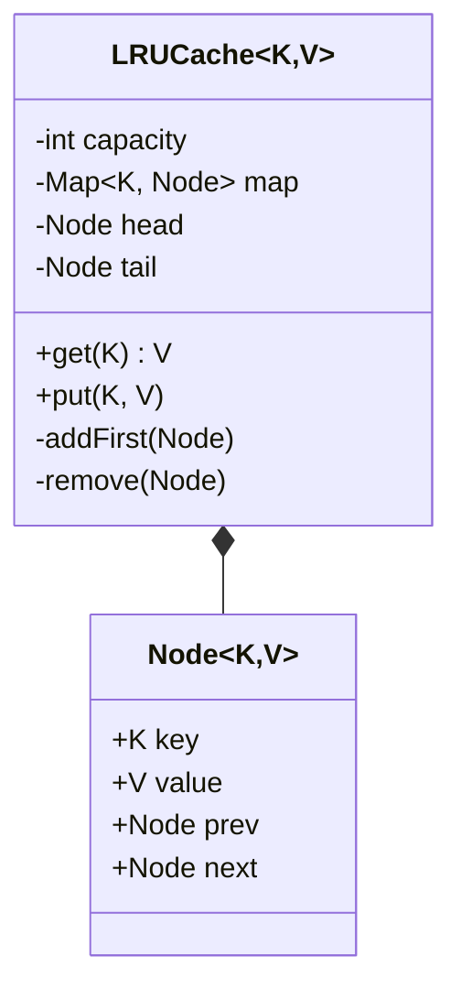

# Design LRU Cache

> **Difficulty**: Hard
> **Topics**: Data Structures, Doubly Linked List, HashMap
> **Key Concepts**: O(1) Get/Put, Eviction Policy, Generics.

## Problem Statement

Design a Least Recently Used (LRU) Cache that:
1.  **Capacity**: Has a fixed size.
2.  **Get(key)**: Returns value if exists, else -1. Moves key to MRU (Most Recently Used).
3.  **Put(key, value)**: Inserts/Updates value. If full, evicts LRU item.
4.  **Constraint**: All operations must be **O(1)**.

## Class Diagram



## Flow Chart: Put Operation

```mermaid
flowchart TD
    A[Put(Key, Value)] --> B{Key Exists?}
    B -- Yes --> C[Update Value]
    C --> D[Move Node to Head (MRU)]
    B -- No --> E{Is Full?}
    E -- Yes --> F[Remove Tail (LRU)]
    F --> G[Remove from Map]
    E -- No --> H
    G --> H[Create New Node]
    H --> I[Add to Head]
    I --> J[Add to Map]
```

## Java Implementation

```java
import java.util.*;

// 1. Double Linked List Node
class Node<K, V> {
    K key;
    V value;
    Node<K, V> prev;
    Node<K, V> next;

    public Node(K key, V value) {
        this.key = key;
        this.value = value;
    }
}

// 2. LRU Cache
public class LRUCache<K, V> {
    private final int capacity;
    private final Map<K, Node<K, V>> map;
    private final Node<K, V> head;
    private final Node<K, V> tail;

    public LRUCache(int capacity) {
        this.capacity = capacity;
        this.map = new HashMap<>();
        
        // Dummy head/tail to avoid null checks
        this.head = new Node<>(null, null);
        this.tail = new Node<>(null, null);
        head.next = tail;
        tail.prev = head;
    }

    public synchronized V get(K key) {
        if (!map.containsKey(key)) return null;

        Node<K, V> node = map.get(key);
        remove(node);
        addFirst(node);
        return node.value;
    }

    public synchronized void put(K key, V value) {
        if (map.containsKey(key)) {
            Node<K, V> node = map.get(key);
            node.value = value;
            remove(node);
            addFirst(node);
        } else {
            if (map.size() >= capacity) {
                Node<K, V> lru = tail.prev;
                remove(lru);
                map.remove(lru.key);
            }
            Node<K, V> newNode = new Node<>(key, value);
            addFirst(newNode);
            map.put(key, newNode);
        }
    }

    // Helper: Add node right after head
    private void addFirst(Node<K, V> node) {
        node.prev = head;
        node.next = head.next;
        head.next.prev = node;
        head.next = node;
    }

    // Helper: Remove node from list
    private void remove(Node<K, V> node) {
        node.prev.next = node.next;
        node.next.prev = node.prev;
    }

    // Demo
    public static void main(String[] args) {
        LRUCache<Integer, String> cache = new LRUCache<>(2);
        
        cache.put(1, "Data1");
        cache.put(2, "Data2");
        System.out.println("Get 1: " + cache.get(1)); // "Data1", 1 is now MRU
        
        cache.put(3, "Data3"); // Evicts 2 (LRU)
        System.out.println("Get 2: " + cache.get(2)); // null
        System.out.println("Get 3: " + cache.get(3)); // "Data3"
    }
}
```

## Interview Q&A

**Q: "Why not use `LinkedHashMap`?"**
- A: "In an interview, the goal is often to implement the internal logic (DLL + HashMap) yourself. Using `LinkedHashMap` is trivial unless explicitly allowed."

**Q: "Concurrency?"**
- A: "This implementation uses `synchronized`. For better concurrency, use `ConcurrentHashMap` and lock striping (Lock individual segments), or just `Collections.synchronizedMap()`."

**Q: "Expiration time (TTL)?"**
- A: "Store `timestamp` in `Node`. On `get()`, check if `now - node.timestamp > ttl`. If yes, remove and return null."
