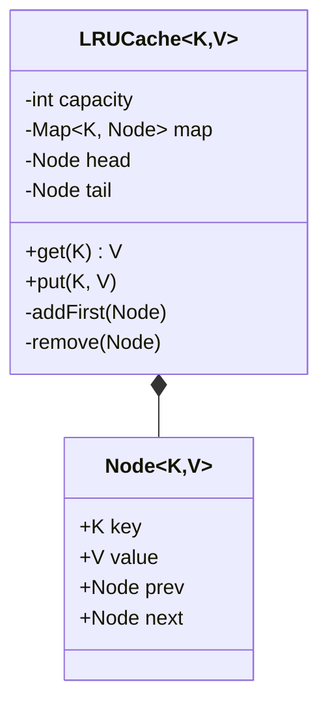

# Design LRU Cache

> **Difficulty**: Medium
> **Topics**: Data Structures, Doubly Linked List, HashMap
> **Key Concepts**: O(1) Get/Put, Eviction Policy, Generics.

## Phase 1: Requirements Gathering

### Goals
- Design a data structure that follows Least Recently Used (LRU) eviction policy.
- Support `Get` and `Put` operations in **O(1)** time complexity.

### 1. Who are the actors?
- **Client**: Application or System accessing the cache.
- **Cache**: Stores key-value pairs and manages eviction.

### 2. What are the must-have features? (Core)
- **Capacity**: Fixed size limit.
- **Get(key)**: Return value if exists (and update usage history), else -1 (or null).
- **Put(key, value)**: Insert or Update value. If full, remove the least recently used item.

### 3. What are the constraints?
- **Performance**: All operations must be O(1) on average.
- **Thread Safety**: Optional, but good to discuss (Synchronized vs Concurrent).

---

## Phase 2: Use Cases

### UC1: Get Key
**Actor**: Client
**Flow**:
1. Client requests `Get(Key)`.
2. Cache checks HashMap.
3. **If Hit**:
    - Move corresponding Node to Head (Generic "Recently Used" position).
    - Return Value.
4. **If Miss**:
    - Return -1/Null.

### UC2: Put Key-Value
**Actor**: Client
**Flow**:
1. Client requests `Put(Key, Value)`.
2. Cache checks HashMap.
3. **If Exists**:
    - Update Node value.
    - Move Node to Head.
4. **If New**:
    - If Capacity is full:
        - Remove Tail (Least Recently Used).
        - Remove from HashMap.
    - Create New Node.
    - Add to Head.
    - Add to HashMap.

---

## Phase 3: Class Diagram

### Step 1: Core Entities
- **LRUCache**: Main container.
- **Node**: Doubly Linked List node (stores Key, Value, Prev, Next).
- **HashMap**: Maps Key -> Node for O(1) access.

### UML Diagram


```mermaid
classDiagram
    class LRUCache~K,V~ {
        -int capacity
        -Map~K, Node~ map
        -Node head
        -Node tail
        +get(K) V
        +put(K, V)
        -addFirst(Node)
        -remove(Node)
    }

    class Node~K,V~ {
        +K key
        +V value
        +Node prev
        +Node next
    }

    LRUCache *-- Node
```

---

## Phase 4: Design Patterns

### 1. Composition
- **Description**: A design principle where a class is composed of one or more objects of other classes, rather than inheriting from them.
- **Why used**: The `LRUCache` combines a `HashMap` (for O(1) lookup) and a `DoublyLinkedList` (for O(1) updates to ordering). By composing these two structures, we get the benefits of both to satisfy the LRU constraints.

### 2. Decorator Pattern
- **Description**: Attaches additional responsibilities to an object dynamically.
- **Why used**: (Optional) One could decorate a standard `Map` interface to add eviction policies (LRU, LFU) transparently, allowing the client to use it just like a regular Map.

---

## Phase 5: Code Key Methods

### Java Implementation

```java
import java.util.*;

// 1. Double Linked List Node
class Node<K, V> {
    K key;
    V value;
    Node<K, V> prev;
    Node<K, V> next;

    public Node(K key, V value) {
        this.key = key;
        this.value = value;
    }
}

// 2. LRU Cache
public class LRUCache<K, V> {
    private final int capacity;
    private final Map<K, Node<K, V>> map;
    private final Node<K, V> head;
    private final Node<K, V> tail;

    public LRUCache(int capacity) {
        this.capacity = capacity;
        this.map = new HashMap<>();
        
        // Dummy head/tail to avoid null checks
        this.head = new Node<>(null, null);
        this.tail = new Node<>(null, null);
        head.next = tail;
        tail.prev = head;
    }

    public synchronized V get(K key) {
        if (!map.containsKey(key)) return null;

        Node<K, V> node = map.get(key);
        // Move to head (Mark as recently used)
        remove(node);
        addFirst(node);
        return node.value;
    }

    public synchronized void put(K key, V value) {
        if (map.containsKey(key)) {
            Node<K, V> node = map.get(key);
            node.value = value;
            remove(node);
            addFirst(node);
        } else {
            if (map.size() >= capacity) {
                // Evict LRU (node before tail)
                Node<K, V> lru = tail.prev;
                remove(lru);
                map.remove(lru.key);
            }
            Node<K, V> newNode = new Node<>(key, value);
            addFirst(newNode);
            map.put(key, newNode);
        }
    }

    // Helper: Add node right after head
    private void addFirst(Node<K, V> node) {
        node.prev = head;
        node.next = head.next;
        head.next.prev = node;
        head.next = node;
    }

    // Helper: Remove node from list
    private void remove(Node<K, V> node) {
        node.prev.next = node.next;
        node.next.prev = node.prev;
    }

    // Demo
    public static void main(String[] args) {
        LRUCache<Integer, String> cache = new LRUCache<>(2);
        
        cache.put(1, "Data1");
        cache.put(2, "Data2");
        System.out.println("Get 1: " + cache.get(1)); // "Data1", 1 is now MRU
        
        cache.put(3, "Data3"); // Evicts 2 (LRU)
        System.out.println("Get 2: " + cache.get(2)); // null
        System.out.println("Get 3: " + cache.get(3)); // "Data3"
    }
}
```

---

## Phase 6: Discussion

### Concurrency
**Q: How to make this thread-safe?**
- A: "The simple approach is `synchronized` methods (Coarse-grained locking). fast enough for many cases. For high concurrency, use `ConcurrentHashMap` for storage and a `ConcurrentLinkedQueue` or Striped Locking for the list, though maintaining strict LRU with concurrent updates is hard without global lock."

### Built-in Alternatives
**Q: Does Java have this?**
- A: "Yes, `LinkedHashMap` with `accessOrder = true`. You can override `removeEldestEntry` to enforce capacity."

### Expiration
**Q: How to add Time-To-Live (TTL)?**
- A: "Add a `timestamp` field to `Node`. On `get(K)`, check `if (now - node.time > TTL)`. If expired, remove node and return null. Also need a background cleaner thread for passive expiration."

---

## SOLID Principles Checklist

- **S (Single Responsibility)**: `LRUCache` manages mapping and eviction.
- **O (Open/Closed)**: Hard to extend eviction policy with this specific implementation (it's tightly coupled to LRU logic). Strategy pattern could allow swapping policies (LFU, FIFO).
- **L (Liskov Substitution)**: Generic K, V allows substitution of types.
- **I (Interface Segregation)**: `Cache` interface could expose `get/put`.
- **D (Dependency Inversion)**: Not heavily used, but could depend on `Map` interface.
