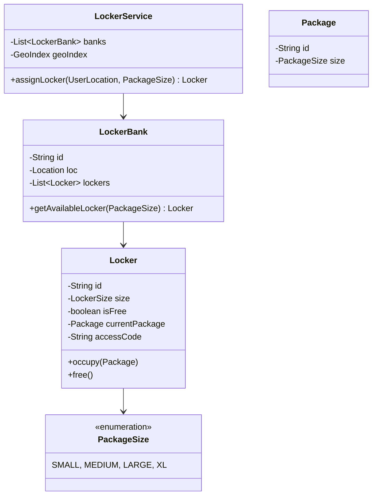
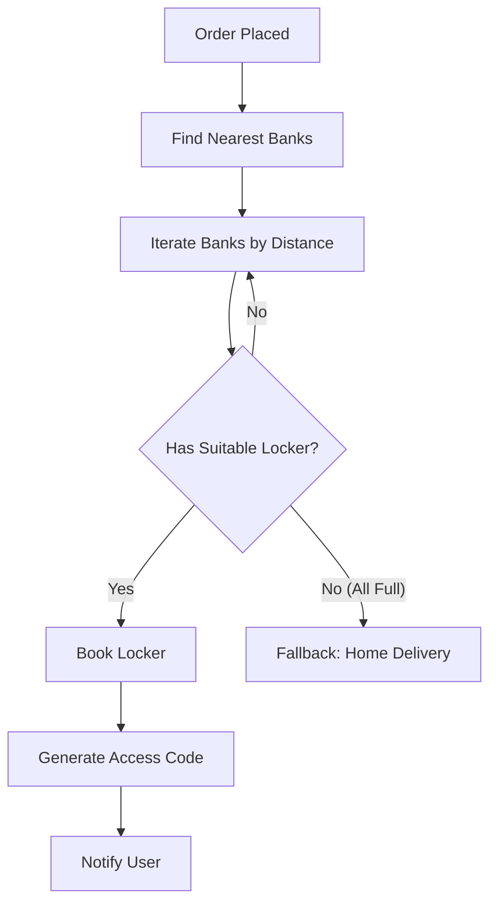

# Design Locker Service (Amazon Locker)

> **Difficulty**: Medium
> **Topics**: Geo-hashing, Object-Oriented Design, Locker Allocation Strategy
> **Key Concepts**: Matching package size to locker size, finding nearest locker bank.

## Problem Statement

Design a Locker system where:
1.  **Locker Banks**: Have multiple lockers of different sizes (Small, Medium, Large).
2.  **Assignment**: Assign a locker to a package based on size and user location.
3.  **Code/Access**: Generate a 6-digit code for pickup.
4.  **Expiration**: Packages not picked up in 3 days are returned.

## Class Diagram



## Flow Chart: Assign Locker



## Java Implementation

```java
import java.util.*;
import java.time.LocalDateTime;

// 1. Enums
enum Size { SMALL, MEDIUM, LARGE, XL }

// 2. Core Entities
class Package {
    String id;
    Size size;
    public Package(String id, Size size) { this.id = id; this.size = size; }
}

class Location {
    double lat, lng;
    public Location(double lat, double lng) { this.lat = lat; this.lng = lng; }
    
    // Simple Euclidean distance (for small distances)
    public double distanceTo(Location other) {
        return Math.sqrt(Math.pow(lat - other.lat, 2) + Math.pow(lng - other.lng, 2));
    }
}

class Locker {
    String id;
    Size size;
    String accessCode;
    Package currentPackage;
    LocalDateTime expiryTime;

    public Locker(String id, Size size) {
        this.id = id;
        this.size = size;
    }

    public synchronized boolean isFree() { return currentPackage == null; }
    
    public boolean canFit(Size packageSize) {
        return this.size.ordinal() >= packageSize.ordinal();
    }

    public synchronized void occupy(Package p) {
        this.currentPackage = p;
        this.accessCode = generateCode();
        this.expiryTime = LocalDateTime.now().plusDays(3);
    }
    
    public synchronized void free() {
        this.currentPackage = null;
        this.accessCode = null;
    }

    private String generateCode() { return String.valueOf((int)(Math.random() * 900000) + 100000); }
}

class LockerBank {
    String id;
    Location location;
    List<Locker> lockers;

    public LockerBank(String id, Location location) {
        this.id = id;
        this.location = location;
        this.lockers = new ArrayList<>();
    }

    public void addLocker(Locker l) { lockers.add(l); }

    public synchronized Locker findAndBookLocker(Size packageSize) {
        // Strategy: Best Fit (Smallest locker that fits)
        Locker bestMatch = null;
        for (Locker l : lockers) {
            if (l.isFree() && l.canFit(packageSize)) {
                if (bestMatch == null || l.size.ordinal() < bestMatch.size.ordinal()) {
                    bestMatch = l;
                }
            }
        }
        
        if (bestMatch != null) {
            // Note: In real world, pass package here to occupy immediately
            return bestMatch; 
        }
        return null;
    }
}

// 3. Service
class LockerService {
    List<LockerBank> banks = new ArrayList<>();

    public void addBank(LockerBank bank) { banks.add(bank); }

    public Locker assignLocker(Location userLoc, Size packageSize) {
        // 1. Sort banks by distance
        banks.sort(Comparator.comparingDouble(b -> b.location.distanceTo(userLoc)));
        
        // 2. Find first bank with availability
        for (LockerBank bank : banks) {
            Locker locker = bank.findAndBookLocker(packageSize);
            if (locker != null) {
                // Occupy logic would be here
                // locker.occupy(package);
                System.out.println("Assigned Locker " + locker.id + " at Bank " + bank.id);
                return locker;
            }
        }
        System.out.println("No locker available nearby.");
        return null;
    }
}

// 4. Client
public class LockerDemo {
    public static void main(String[] args) {
        LockerService service = new LockerService();
        
        LockerBank bank1 = new LockerBank("Downtown", new Location(0, 0));
        bank1.addLocker(new Locker("L1", Size.SMALL));
        bank1.addLocker(new Locker("L2", Size.LARGE));
        
        service.addBank(bank1);
        
        // User at (0.1, 0.1) needs MEDIUM locker
        // Should get L2 (LARGE fits MEDIUM, SMALL does not)
        service.assignLocker(new Location(0.1, 0.1), Size.MEDIUM);
    }
}
```

## Interview Q&A

**Q: "How to handle returns (expired packages)?"**
- A: "A cron job runs nightly: `SELECT * FROM Lockers WHERE expiry < NOW()`. Notify delivery agent to pick up. Once verified pickup, free the locker."

**Q: "What if locker door is broken?"**
- A: "Locker has `Status (ACTIVE, MAINTAINANCE)`. Filter out broken lockers during assignment."

**Q: "Concurrency (Two users booking same locker)?"**
- A: "Database `SELECT FOR UPDATE SKIP LOCKED`. This finds the first available row, locks it, and skips rows locked by other transactions. Very efficient for allocation queues."
