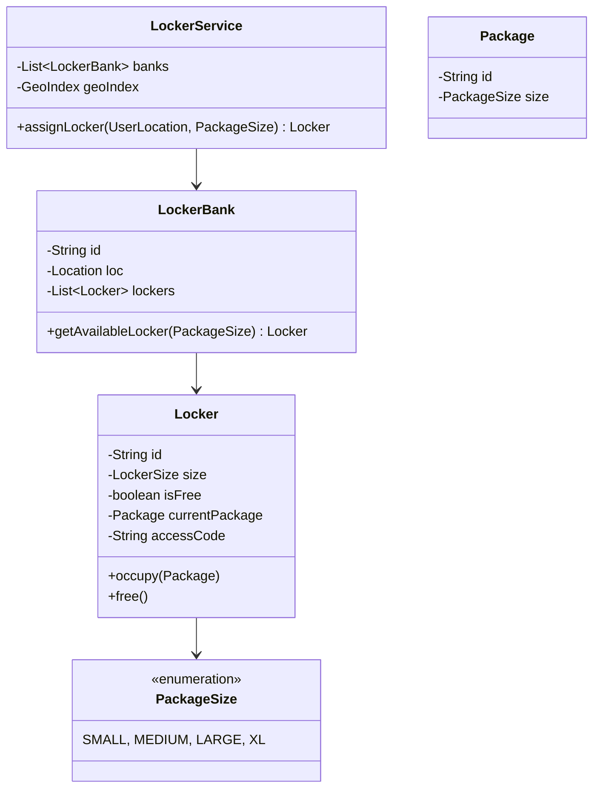

# Design Locker Service (Amazon Locker)

> **Difficulty**: Medium
> **Topics**: Geo-hashing, Object-Oriented Design, Locker Allocation Strategy
> **Key Concepts**: Matching package size to locker size, finding nearest locker bank.

## Phase 1: Requirements Gathering

### Goals
- Design a system to manage locker banks (like Amazon Hub/Locker).
- Assign lockers to packages based on size and location.
- Securely manage pickup via access codes.

### 1. Who are the actors?
- **User (Customer)**: Orders package, picks up from locker.
- **Delivery Agent**: Deposits package into assigned locker.
- **System**: Assigns locker, generates code, handles expiration.

### 2. What are the must-have features? (Core)
- **Assignment**: Find closest available locker that fits the package.
- **OTP Generation**: Secure 6-digit code for pickup.
- **Expiration**: Auto-return packages not picked up in X days.
- **Sizes**: Handle Small, Medium, Large, XL.

### 3. What are the constraints?
- **Optimization**: Minimize distance for user.
- **Efficiency**: Don't put a Small package in an XL locker if a Small locker is available (Best Fit).

---

## Phase 2: Use Cases

### UC1: Assign Locker (Order Placement)
**Actor**: System
**Flow**:
1. User selects "Pick up from Locker" and provides Location.
2. System identifies Package Size.
3. System searches for nearest Locker Bank with available slot.
4. System reserves the slot.
5. System returns Locker Bank ID to User.

### UC2: Deposit Package
**Actor**: Delivery Agent
**Flow**:
1. Agent scans package at Locker Bank.
2. System opens the assigned locker door.
3. Agent places package and closes door.
4. System notifies User with OTP.

### UC3: Pickup Package
**Actor**: Customer
**Flow**:
1. Customer enters OTP at Locker Bank console.
2. System validates OTP.
3. System opens specific locker door.
4. System marks locker as "Free" upon door close.

---

## Phase 3: Class Diagram

### Step 1: Core Entities
- **LockerService**: Facade for assignment.
- **LockerBank**: Physical location containing lockers.
- **Locker**: Individual slot.
- **Package**: Item to be stored.
- **NotificationService**: Sends OTP.

### UML Diagram


```mermaid
classDiagram
    class LockerService {
        -List~LockerBank~ banks
        -GeoIndex geoIndex
        +assignLocker(UserLocation, PackageSize) Locker
    }

    class LockerBank {
        -String id
        -Location loc
        -List~Locker~ lockers
        +getAvailableLocker(PackageSize) Locker
    }

    class Locker {
        -String id
        -LockerSize size
        -boolean isFree
        -Package currentPackage
        -String accessCode
        +occupy(Package)
        +free()
    }

    class Package {
        -String id
        -PackageSize size
    }

    class PackageSize {
        <<enumeration>>
        SMALL, MEDIUM, LARGE, XL
    }

    LockerService --> LockerBank
    LockerBank --> Locker
    Locker --> PackageSize
```

---

## Phase 4: Design Patterns

### 1. Strategy Pattern
- **Description**: Defines a family of algorithms, encapsulates each one, and makes them interchangeable.
- **Why used**: The locker allocation logic can vary (Random, Best Fit, Nearest Location). Strategy allows us to plug in different algorithms (e.g., `BestFitStrategy` to minimize wasted space) without modifying the core `LockerService`.

### 2. Repository Pattern
- **Description**: Abstraction of the data layer, mediating between the domain and data mapping layers.
- **Why used**: To de-couple the business logic (`assignLocker`) from the underlying data access details (SQL, NoSQL, or In-Memory).

---

## Phase 5: Code Key Methods

### Java Implementation

```java
import java.util.*;
import java.time.LocalDateTime;

// 1. Enums & Helpers
enum Size { SMALL, MEDIUM, LARGE, XL }

class Location {
    double lat, lng;
    public Location(double lat, double lng) { this.lat = lat; this.lng = lng; }
    
    // Simple Euclidean distance (for small distances)
    public double distanceTo(Location other) {
        return Math.sqrt(Math.pow(lat - other.lat, 2) + Math.pow(lng - other.lng, 2));
    }
}

// 2. Core Entities
class Package {
    String id;
    Size size;
    public Package(String id, Size size) { this.id = id; this.size = size; }
}

class Locker {
    String id;
    Size size;
    String accessCode;
    Package currentPackage;
    LocalDateTime expiryTime;

    public Locker(String id, Size size) {
        this.id = id;
        this.size = size;
    }

    public synchronized boolean isFree() { return currentPackage == null; }
    
    public boolean canFit(Size packageSize) {
        return this.size.ordinal() >= packageSize.ordinal();
    }

    public synchronized void occupy(Package p) {
        this.currentPackage = p;
        this.accessCode = generateCode();
        this.expiryTime = LocalDateTime.now().plusDays(3);
    }
    
    public synchronized void free() {
        this.currentPackage = null;
        this.accessCode = null;
        this.expiryTime = null;
    }

    private String generateCode() { return String.valueOf((int)(Math.random() * 900000) + 100000); }
}

class LockerBank {
    String id;
    Location location;
    List<Locker> lockers;

    public LockerBank(String id, Location location) {
        this.id = id;
        this.location = location;
        this.lockers = new ArrayList<>();
    }

    public void addLocker(Locker l) { lockers.add(l); }

    // Strategy: Best Fit (Smallest locker that fits)
    public synchronized Locker findBestFitLocker(Size packageSize) {
        Locker bestMatch = null;
        for (Locker l : lockers) {
            if (l.isFree() && l.canFit(packageSize)) {
                if (bestMatch == null || l.size.ordinal() < bestMatch.size.ordinal()) {
                    bestMatch = l;
                }
            }
        }
        return bestMatch;
    }
}

// 3. Service
class LockerService {
    List<LockerBank> banks = new ArrayList<>();

    public void addBank(LockerBank bank) { banks.add(bank); }

    public Locker assignLocker(Location userLoc, Size packageSize) {
        // 1. Filter Banks within range (omitted) and Sort by distance
        // In real world, use GeoSpatial Index (e.g., QuadTree, Google S2)
        List<LockerBank> sortedBanks = new ArrayList<>(banks);
        sortedBanks.sort(Comparator.comparingDouble(b -> b.location.distanceTo(userLoc)));
        
        // 2. Find first bank with suitable availability
        for (LockerBank bank : sortedBanks) {
            Locker locker = bank.findBestFitLocker(packageSize);
            if (locker != null) {
                // In a real system, we'd reserve it here briefly
                // locker.occupy(package); // Done at deposit time, or reserved now?
                // Usually reserved now:
                System.out.println("Assigned Locker " + locker.id + " at Bank " + bank.id);
                return locker;
            }
        }
        System.out.println("No locker available nearby.");
        return null;
    }
}

// 4. Client
public class LockerDemo {
    public static void main(String[] args) {
        LockerService service = new LockerService();
        
        LockerBank bank1 = new LockerBank("Downtown", new Location(0, 0));
        bank1.addLocker(new Locker("L1", Size.SMALL));
        bank1.addLocker(new Locker("L2", Size.LARGE));
        
        service.addBank(bank1);
        
        // User at (0.1, 0.1) needs MEDIUM locker
        // Should get L2 (LARGE fits MEDIUM, SMALL does not)
        service.assignLocker(new Location(0.1, 0.1), Size.MEDIUM);
    }
}
```

---

## Phase 6: Discussion

### Concurrency
**Q: Handling race conditions (Two users booking same locker)?**
- A: "Use **Optimistic Locking** (versioning) on the Locker row via DB. Or `SELECT ... FOR UPDATE SKIP LOCKED` which is standard for queue/allocation systems to grab the next available item without blocking others."

### Extensions
**Q: How to handle returns (expired packages)?**
- A: "Run a cron job nightly: `SELECT * FROM Lockers WHERE expiry < NOW()`. Mark status as `RETURNING`. Notify delivery agent to pick up. Once verified pickup, free the locker."

**Q: What if locker door is broken?**
- A: "Locker needs a `State` (ACTIVE, BROKEN). Filter out BROKEN lockers during assignment."

---

## SOLID Principles Checklist

- **S (Single Responsibility)**: `Locker` manages its state, `Bank` manages collection, `Service` manages allocation.
- **O (Open/Closed)**: New `FittingStrategy` (e.g., First Fit) can be added without changing Bank logic.
- **L (Liskov Substitution)**: `Locker` subtypes (e.g., `RefrigeratedLocker`) could be used.
- **I (Interface Segregation)**: Not heavily used.
- **D (Dependency Inversion)**: Service could depend on `ILockerRepository` instead of in-memory list.
