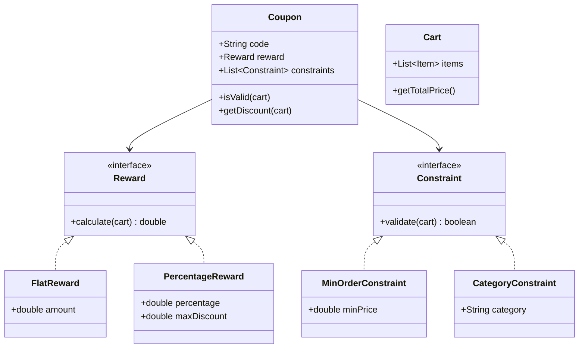

# Design Coupon & Discount System

> **Difficulty**: Medium
> **Topics**: Strategy Pattern, Chain of Responsibility, Composite Pattern
> **Key Concepts**: Decoupling validation logic from calculation logic.

## Phase 1: Requirements Gathering

### Goals
- Design a flexible coupon system for an e-commerce platform.
- Support various discount types (Percentage, Flat, Free Initial).
- Support complex validation rules (Min Cart Value, Specific Category, Expiry).

### 1. Who are the actors?
- **User**: Applies coupons to their cart.
- **Admin**: Creates new coupons and rules.
- **System**: Validates and calculates final price.

### 2. What are the must-have features? (Core)
- **Discount Types**: 
    - Percentage Off (e.g., "10% off up to $50").
    - Flat Amount Off (e.g., "$10 off").
- **Constraints**: 
    - Minimum Order Value.
    - Category restricted (e.g., "Electronics only").
    - Usage limits (e.g., "Once per user").

### 3. What are the constraints?
- **Extensibility**: Marketing team needs to add new rules without code changes (ideally) or with minimal changes.
- **Performance**: Coupon application should be instant (< 100ms).

---

## Phase 2: Use Cases

### UC1: Apply Coupon
**Actor**: User
**Flow**:
1. User enters Coupon Code (e.g., "SUMMER10").
2. System fetches Coupon configuration.
3. System runs all Validation Rules (Constraints).
4. If valid, System calculates Discount amount using Reward Strategy.
5. System returns Discounted Total.

### UC2: Admin Creates Coupon
**Actor**: Admin
**Flow**:
1. Admin defines Code ("SAVE20").
2. Admin selects Reward Type (Percentage: 20%).
3. Admin attaches Constraints (MinCart: 100, Expiry: 2025-12-31).
4. System saves Coupon structure.

---

## Phase 3: Class Diagram

### Step 1: Core Entities
- **Coupon**: The main entity containing Code, Reward, and Constraints.
- **Reward**: Strategy for calculating discount.
- **Constraint**: Condition that must be met.
- **Cart**: Context object containing Items.

### UML Diagram



---

## Phase 4: Design Patterns

### 1. Strategy Pattern
- **Description**: Defines a family of algorithms, encapsulates each one, and makes them interchangeable.
- **Why used**: Discounts can be calculated in many ways (Flat off, Percentage off, BOGO). Strategy encapsulates this calculation logic in separate classes (`FlatReward`, `PercentageReward`), making it easy to add new reward types.

### 2. Composite Pattern
- **Description**: Composes objects into tree structures to represent part-whole hierarchies.
- **Why used**: A Coupon is valid only if *all* its constraints are met. We can treat a list of constraints as a single "Composite Constraint" that passes only if all children pass.

---

## Phase 5: Code Key Methods

### Java Implementation

```java
import java.util.*;

// 1. Context (Cart & Items)
class Item {
    String name;
    double price;
    String category;

    public Item(String name, double price, String category) {
        this.name = name;
        this.price = price;
        this.category = category;
    }
}

class Cart {
    List<Item> items = new ArrayList<>();

    public void addItem(Item item) {
        items.add(item);
    }

    public double getTotalPrice() {
        return items.stream().mapToDouble(i -> i.price).sum();
    }
}

// 2. Constraints (Validation Logic)
interface Constraint {
    boolean validate(Cart cart);
}

class MinOrderConstraint implements Constraint {
    double minPrice;
    public MinOrderConstraint(double minPrice) { this.minPrice = minPrice; }

    public boolean validate(Cart cart) {
        return cart.getTotalPrice() >= minPrice;
    }
}

class CategoryConstraint implements Constraint {
    String requiredCategory;
    public CategoryConstraint(String requiredCategory) { this.requiredCategory = requiredCategory; }

    public boolean validate(Cart cart) {
        return cart.items.stream().anyMatch(i -> i.category.equals(requiredCategory));
    }
}

// 3. Rewards (Calculation Strategy)
interface Reward {
    double calculate(Cart cart);
}

class FlatReward implements Reward {
    double amount;
    public FlatReward(double amount) { this.amount = amount; }

    public double calculate(Cart cart) { return amount; }
}

class PercentageReward implements Reward {
    double percentage;
    double maxDiscount;

    public PercentageReward(double percentage, double maxDiscount) {
        this.percentage = percentage;
        this.maxDiscount = maxDiscount;
    }

    public double calculate(Cart cart) {
        double discount = cart.getTotalPrice() * (percentage / 100);
        return Math.min(discount, maxDiscount); // Cap the discount
    }
}

// 4. Coupon (Composite Root)
class Coupon {
    String code;
    Reward reward;
    List<Constraint> constraints = new ArrayList<>();

    public Coupon(String code, Reward reward) {
        this.code = code;
        this.reward = reward;
    }

    public void addConstraint(Constraint constraint) {
        constraints.add(constraint);
    }

    public boolean isValid(Cart cart) {
        for (Constraint c : constraints) {
            if (!c.validate(cart)) return false;
        }
        return true;
    }

    public double getDiscount(Cart cart) {
        if (isValid(cart)) {
            double discount = reward.calculate(cart);
            // Ensure discount doesn't exceed total price (no negative validation here, just logic)
            return Math.min(discount, cart.getTotalPrice());
        }
        return 0.0;
    }
}

// 5. Client / Demo
public class CouponSystem {
    public static void main(String[] args) {
        Cart cart = new Cart();
        cart.addItem(new Item("MacBook", 2000, "Electronics"));

        // Coupon: "ELECTRO10" (10% off up to $100 if cart > $500 & contains Electronics)
        Coupon coupon = new Coupon("ELECTRO10", new PercentageReward(10, 100));
        coupon.addConstraint(new MinOrderConstraint(500));
        coupon.addConstraint(new CategoryConstraint("Electronics"));

        System.out.println("Cart Total: " + cart.getTotalPrice());
        if (coupon.isValid(cart)) {
            System.out.println("Discount: $" + coupon.getDiscount(cart)); // Output: 100.0
            System.out.println("Final Price: $" + (cart.getTotalPrice() - coupon.getDiscount(cart)));
        } else {
            System.out.println("Coupon Invalid");
        }
    }
}
```

---

## Phase 6: Discussion

### Extensibility
**Q: How to add "Buy One Get One" (BOGO)?**
- A: "Create a `BogoReward` class implementing `Reward`. The `calculate(Cart)` method would iterate items to find pairs and deduct the price of the cheapest item."

### Concurrency
**Q: How to handle 'First 100 Users Only'?**
- A: "This requires a `GlobalCountConstraint`. It would need to interact with a centralized counter (like Redis `INCR`).
    - `validate()` checks `Redis.get(coupon_code) < limit`.
    - However, strictly enforcing *exactly* 100 concurrent requests is hard. We might allow slight overbooking or use `Lua scripts` in Redis for atomic check-and-increment."

### Stacking
**Q: Can we apply multiple coupons?**
- A: "Yes. The `Cart` manager could hold a list of Coupons. We can apply them sequentially. Order matters (Percentage after Flat vs Flat after Percentage)."

---

## SOLID Principles Checklist

- **S (Single Responsibility)**: Constraint validates, Reward calculates, Coupon holds structure.
- **O (Open/Closed)**: New Rewards or Constraints can be added without modifying Coupon.
- **L (Liskov Substitution)**: All Constraints work interchangeably.
- **D (Dependency Inversion)**: Coupon depends on `Reward` interface, not specific implementation.
