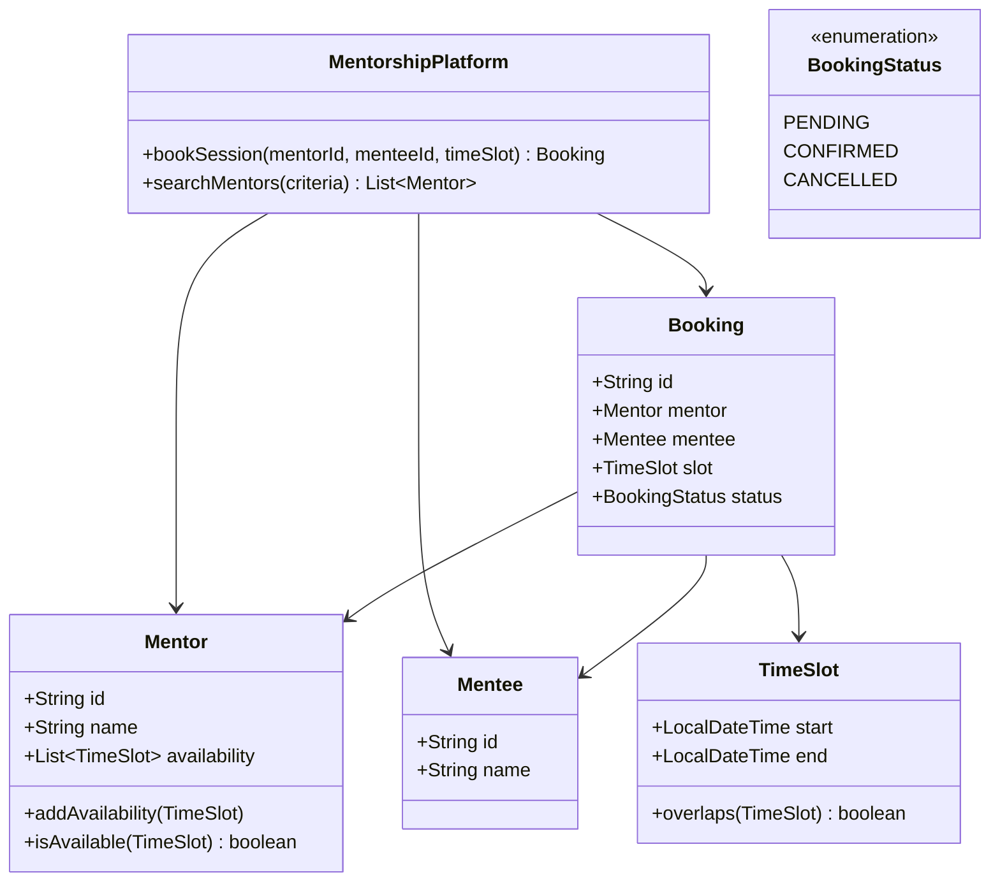

# Design Mentorship Platform (Preplaced/Topmate)

> **Difficulty**: Medium
> **Topics**: Marketplace Dynamics, Availability Management, State Machine
> **Key Concepts**: Managing TimeSlots, Handling Booking Concurrency.

## Phase 1: Requirements Gathering

### Goals
- Design a platform where Mentees can book sessions with Mentors.
- Manage Mentor availability efficiently.
- Handle concurrent booking requests for the same slot.

### 1. Who are the actors?
- **Mentor**: Sets availability, conducts sessions.
- **Mentee**: Searches mentors, books sessions.
- **System**: Manages bookings, notifications, and payments.

### 2. What are the must-have features? (Core)
- **Availability Management**: Mentors define when they are free.
- **Booking**: Mentees reserve a slot.
- **Search**: Mentees find Mentors by skill/domain.
- **Notification**: Email/SMS confirmation.

### 3. What are the constraints?
- **No Overlap**: A mentor cannot have two bookings at the same time.
- **Locking**: If two mentees try to book the same slot, only one succeeds.

---

## Phase 2: Use Cases

### UC1: Mentor Sets Availability
**Actor**: Mentor
**Flow**:
1. Mentor selects Date and Time Range (e.g., "Mon 9-11 AM").
2. System validates no conflicts with existing bookings.
3. System saves `TimeSlot`s.

### UC2: Mentee Books Session
**Actor**: Mentee
**Flow**:
1. Mentee views Mentor's calendar.
2. Mentee selects an available slot.
3. System attempts to lock the slot.
4. If successful, System creates `Booking` (status: PENDING/CONFIRMED).
5. System sends confirmation.

---

## Phase 3: Class Diagram

### Step 1: Core Entities
- **MentorshipPlatform**: Main controller.
- **Mentor/Mentee**: Users.
- **Booking**: The core transaction.
- **TimeSlot**: Value object for time ranges.

### UML Diagram



---

## Phase 4: Design Patterns

### 1. Observer Pattern
- **Description**: Defines a one-to-many dependency between objects so that when one object changes state, all its dependents are notified and updated automatically.
- **Why used**: When a Booking is confirmed or cancelled, multiple notifications (Email, SMS, Dashboard Update) need to be triggered. Observers allow decoupling the booking logic from the notification logic.

### 2. State Pattern
- **Description**: Allows an object to alter its behavior when its internal state changes.
- **Why used**: A Booking goes through various states (`PENDING`, `CONFIRMED`, `COMPLETED`, `CANCELLED`). The State pattern manages the allowed transitions (e.g., you can't cancel a `COMPLETED` session) and behaviors associated with each state.

---

## Phase 5: Code Key Methods

### Java Implementation

```java
import java.time.LocalDateTime;
import java.util.*;
import java.util.concurrent.ConcurrentHashMap;
import java.util.concurrent.locks.Lock;
import java.util.concurrent.locks.ReentrantLock;

// 1. TimeSlot Entity
class TimeSlot {
    LocalDateTime start;
    LocalDateTime end;

    public TimeSlot(LocalDateTime start, LocalDateTime end) {
        this.start = start;
        this.end = end;
    }

    public boolean overlaps(TimeSlot other) {
        return this.start.isBefore(other.end) && other.start.isBefore(this.end);
    }
}

// 2. Mentor Entity
class Mentor {
    String id;
    String name;
    List<TimeSlot> availability;

    public Mentor(String id, String name) {
        this.id = id;
        this.name = name;
        this.availability = new ArrayList<>();
    }

    public void addAvailability(TimeSlot slot) {
        this.availability.add(slot);
    }

    // Check if mentor is available for a requested slot
    public boolean isAvailable(TimeSlot requestedSlot) {
        for (TimeSlot slot : availability) {
            // Simplified check: exact match. Real world would check 'contained within'
            if (slot.start.isEqual(requestedSlot.start) && slot.end.isEqual(requestedSlot.end)) {
                return true; 
            }
        }
        return false;
    }
    
    public void removeAvailability(TimeSlot slot) {
        availability.removeIf(s -> s.start.isEqual(slot.start) && s.end.isEqual(slot.end));
    }
}

// 3. Mentee Entity
class Mentee {
    String id;
    String name;

    public Mentee(String id, String name) {
        this.id = id;
        this.name = name;
    }
}

// 4. Booking Entity
class Booking {
    String id;
    Mentor mentor;
    Mentee mentee;
    TimeSlot slot;

    public Booking(Mentor mentor, Mentee mentee, TimeSlot slot) {
        this.id = UUID.randomUUID().toString();
        this.mentor = mentor;
        this.mentee = mentee;
        this.slot = slot;
    }
}

// 5. Booking System (Service)
public class BookingSystem {
    Map<String, Booking> bookings = new ConcurrentHashMap<>();
    // A simple lock map for demonstration. In production, use Redis Distributed Lock.
    Map<String, Lock> mentorLocks = new ConcurrentHashMap<>();

    public Booking bookSession(Mentor mentor, Mentee mentee, TimeSlot slot) {
        // 1. Get lock for the mentor to handle concurrency
        // We lock on the Mentor ID because a Mentor can't have two simultaneous bookings
        Lock lock = mentorLocks.computeIfAbsent(mentor.id, k -> new ReentrantLock());
        lock.lock();
        
        try {
            // 2. Double check availability under lock
            if (!mentor.isAvailable(slot)) {
                System.out.println("Booking Failed: Slot unavailable for " + mentor.name);
                return null;
            }

            // 3. Create Booking
            Booking booking = new Booking(mentor, mentee, slot);
            bookings.put(booking.id, booking);

            // 4. Remove slot from availability (Consistency)
            mentor.removeAvailability(slot);
            
            System.out.println("Booking Confirmed: " + booking.id);
            return booking;
            
        } finally {
            lock.unlock();
        }
    }
    
    public static void main(String[] args) {
        BookingSystem system = new BookingSystem();
        Mentor mentor = new Mentor("m1", "Alice");
        Mentee mentee = new Mentee("u1", "Bob");
        
        TimeSlot slot = new TimeSlot(LocalDateTime.of(2023, 10, 10, 10, 0), LocalDateTime.of(2023, 10, 10, 11, 0));
        mentor.addAvailability(slot);
        
        system.bookSession(mentor, mentee, slot);
        system.bookSession(mentor, new Mentee("u2", "Charlie"), slot); // Should fail
    }
}
```

---

## Phase 6: Discussion

### Concurrency
**Q: How to handle 1000 users trying to book the same slot?**
- A: "Using Java locks only works on one server. For a distributed system, use **Database Row Locking** (`SELECT ... FOR UPDATE` on the Slot row) or **Redis Distributed Locks** (`Redlock`)."

### Calendar Sync
**Q: How to sync with Google Calendar?**
- A: "Two-way sync. 
    1.  **Pull**: Webhook from Google notifies our system of new events -> blocked slots in our DB.
    2.  **Push**: When booking created on our platform, use Google Calendar API to insert event."

### Search
**Q: Optimizing Mentor Search?**
- A: "Use an Inverted Index (Elasticsearch). Index mentors by `Skills`, `Company`, `Role`. For availability search, store slots as nested objects or range types."

---

## SOLID Principles Checklist

- **S (Single Responsibility)**: `BookingSystem` handles coordination, `Mentor` handles availability logic.
- **O (Open/Closed)**: New Booking Types (e.g., Webinar) could extend `Booking`.
- **L (Liskov Substitution)**: N/A.
- **I (Interface Segregation)**: `NotificationService` could be an interface.
- **D (Dependency Inversion)**: Service depends on abstractions (Entities).
