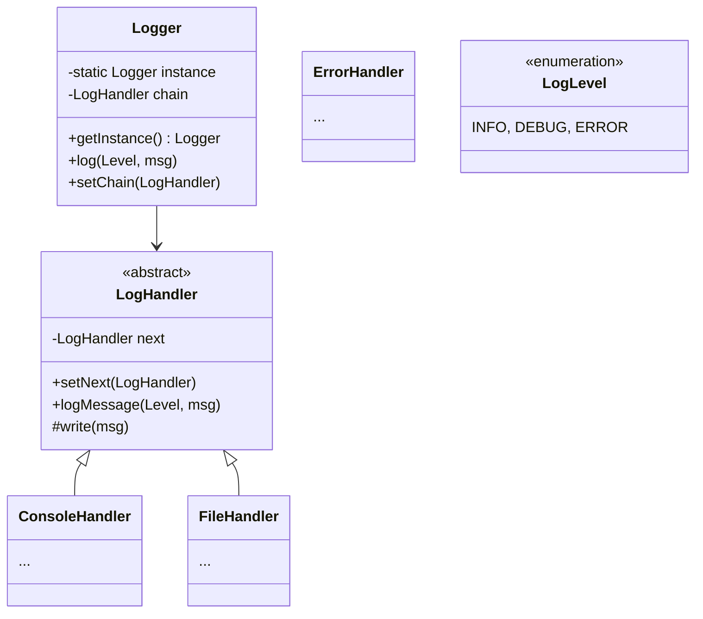

# Design Logger Library

> **Difficulty**: Easy/Medium
> **Topics**: Chain of Responsibility, Singleton, Observer
> **Key Concepts**: Log Levels, Log Sinks (File, Console, Database), Async Logging.

## Problem Statement

Design a Logger Library that:
1.  **Log Levels**: Supports INFO, DEBUG, ERROR.
2.  **Sinks**: Sends logs to different destinations (Console, File, DB) based on configuration.
3.  **Chain of Responsibility**: A log message flows through a chain of handlers.
4.  **Singleton**: Only one logger instance per application.

## Class Diagram



## Flow Chart: Log Propagation

```mermaid
flowchart TD
    A[Logger.log(Level, Msg)] --> B[Handler 1: Check Level?]
    B -- Yes --> C[Write to Sink]
    B -- No --> D
    C --> D{Has Next Handler?}
    D -- Yes --> E[Handler 2: Check Level?]
    D -- No --> F[End]
    E --> ...
```

## Java Implementation

```java
import java.util.*;

// 1. Enums
enum LogLevel {
    INFO(1), DEBUG(2), ERROR(3);
    public int val;
    LogLevel(int val) { this.val = val; }
}

// 2. Abstract Handler (Chain of Responsibility)
abstract class LogHandler {
    public static int INFO = 1;
    public static int DEBUG = 2;
    public static int ERROR = 3; 

    protected int level;
    protected LogHandler nextHandler;

    public void setNext(LogHandler nextHandler) {
        this.nextHandler = nextHandler;
    }

    public void logMessage(int level, String message) {
        if (this.level <= level) {
            write(message);
        }
        if (nextHandler != null) {
            nextHandler.logMessage(level, message);
        }
    }

    abstract protected void write(String message);
}

// 3. Concrete Handlers
class ConsoleLogger extends LogHandler {
    public ConsoleLogger(int level) { this.level = level; }
    
    @Override
    protected void write(String message) {
        System.out.println("[CONSOLE] " + message);
    }
}

class FileLogger extends LogHandler {
    public FileLogger(int level) { this.level = level; }
    
    @Override
    protected void write(String message) {
        System.out.println("[FILE] Writing to log.txt: " + message);
    }
}

class ErrorLogger extends LogHandler {
    public ErrorLogger(int level) { this.level = level; }
    
    @Override
    protected void write(String message) {
        System.out.println("[ERROR-DB] Inserting to DB: " + message);
    }
}

// 4. Logger (Singleton)
class Logger {
    private static Logger instance;
    private LogHandler chain;

    private Logger() {
        buildChain();
    }

    public static synchronized Logger getInstance() {
        if (instance == null) instance = new Logger();
        return instance;
    }

    private void buildChain() {
        // Chain: Error -> File -> Console
        LogHandler errorLogger = new ErrorLogger(LogHandler.ERROR);
        LogHandler fileLogger = new FileLogger(LogHandler.DEBUG);
        LogHandler consoleLogger = new ConsoleLogger(LogHandler.INFO);

        errorLogger.setNext(fileLogger);
        fileLogger.setNext(consoleLogger);

        this.chain = errorLogger; // Start of chain
    }

    public void log(int level, String message) {
        chain.logMessage(level, message);
    }
}

// 5. Client
public class LoggerDemo {
    public static void main(String[] args) {
        Logger logger = Logger.getInstance();

        System.out.println("--- Log INFO ---");
        logger.log(LogHandler.INFO, "System started.");
        
        System.out.println("\n--- Log ERROR ---");
        logger.log(LogHandler.ERROR, "NullPointerException!");
    }
}
```

## Interview Q&A

**Q: "How to handle Async logging (High throughput)?"**
- A: "Use a BlockingQueue. The `log()` method puts the message into the queue (Producer). A separate background thread (Consumer) polls the queue and writes to the sink. This unblocks the main thread."


**Q: "How to add new sinks (e.g. Splunk)?"**
- A: "Just extend `LogHandler` to create `SplunkHandler` and add it to the chain setup."
