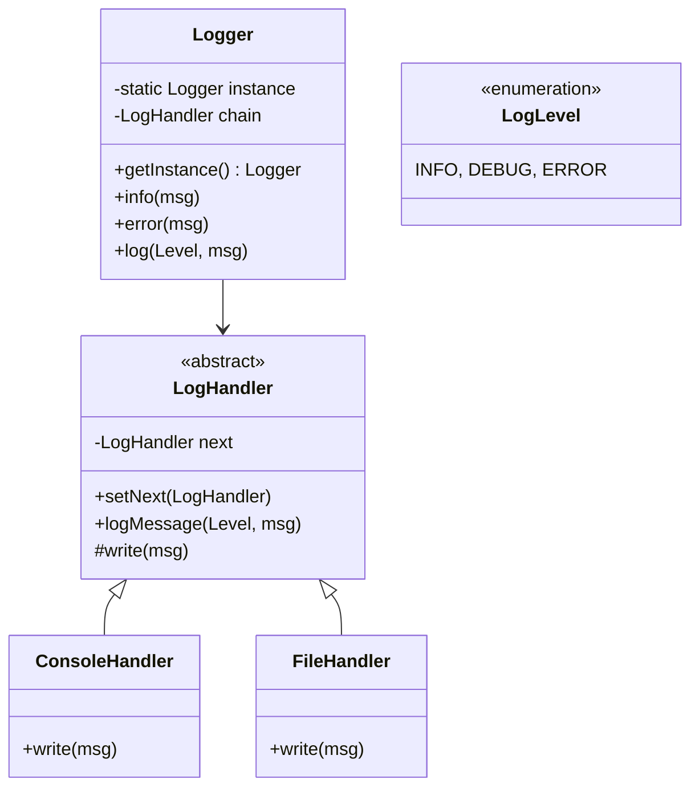

# Design Logger Library

> **Difficulty**: Easy/Medium
> **Topics**: Chain of Responsibility, Singleton, Observer
> **Key Concepts**: Log Levels, Log Sinks (File, Console, Database), Async Logging.

## Phase 1: Requirements Gathering

### Goals
- Design a generic Logging Library to be used by applications.
- Support different Log Levels (INFO, DEBUG, ERROR).
- Support different Log Sinks (Console, File, Database).
- Allow flexible configuration of where logs go based on their level.

### 1. Who are the actors?
- **Client Application**: The code calling `logger.info()`.
- **Logger System**: The library processing the log.
- **Log Sinks**: The destination (File System, StdOut, External Service).

### 2. What are the must-have features? (Core)
- **Levels**: INFO < DEBUG < ERROR (or reversed depending on verbosity).
- **Routing**: INFO goes to Console, ERROR goes to File & DB.
- **Singleton**: Global access point (`Logger.getInstance()`).

### 3. What are the constraints?
- **Performance**: Logging should not slow down the main application (Blocking vs Async).
- **Reliability**: Critical ERROR logs must not be lost.

---

## Phase 2: Use Cases

### UC1: Log a Simple Message
**Actor**: Client App
**Flow**:
1. Client calls `logger.log(INFO, "User Logged In")`.
2. Logger checks if INFO level is enabled.
3. Logger passes message to configured Handlers.
4. Handlers write message to destinations.

### UC2: Log an Critical Error
**Actor**: Client App
**Flow**:
1. Client calls `logger.log(ERROR, "DB Connection Failed")`.
2. Logger passes message to Chain of Handlers.
3. **ConsoleHandler** prints it.
4. **FileHandler** writes to `error.log`.
5. **EmailHandler** alerts the Admin.

---

## Phase 3: Class Diagram

### Step 1: Core Entities
- **Logger**: Singleton Facade.
- **LogHandler (Abstract)**: Defines the interface and holds reference to `next` handler.
- **Console/File/DB Handler**: Concrete implementations.
- **LogMessage**: Encapsulates content, timestamp, level.

### UML Diagram


```mermaid
classDiagram
    class Logger {
        -static Logger instance
        -LogHandler chain
        +getInstance() Logger
        +info(msg)
        +error(msg)
        +log(Level, msg)
    }

    class LogHandler {
        <<abstract>>
        -LogHandler next
        +setNext(LogHandler)
        +logMessage(Level, msg)
        #write(msg)
    }

    class ConsoleHandler { 
        +write(msg)
    }
    class FileHandler { 
        +write(msg)
    }
    
    class LogLevel {
        <<enumeration>>
        INFO, DEBUG, ERROR
    }

    Logger --> LogHandler
    LogHandler <|-- ConsoleHandler
    LogHandler <|-- FileHandler
```

---

## Phase 4: Design Patterns

### 1. Chain of Responsibility
- **Description**: Avoids coupling the sender of a request to its receiver by giving more than one object a chance to handle the request. Chain the receiving objects and pass the request along the chain.
- **Why used**: Logging requests often need to pass through multiple handlers (Console, File, API) based on severity. The chain allows a log message to optionally be processed by multiple handlers or filtered out at any stage.

### 2. Singleton Pattern
- **Description**: Ensures a class has only one instance and provides a global point of access to it.
- **Why used**: A Logger typically needs to be globally accessible to avoid passing it around every method. It also aggregates configuration (log levels, sinks) in a central place.

---

## Phase 5: Code Key Methods

### Java Implementation

```java
import java.util.*;

// 1. Enums
enum LogLevel {
    INFO(1), DEBUG(2), ERROR(3);
    public int val;
    LogLevel(int val) { this.val = val; }
}

// 2. Abstract Handler (Chain of Responsibility)
abstract class LogHandler {
    public static int INFO = 1;
    public static int DEBUG = 2;
    public static int ERROR = 3; 

    protected int level;
    protected LogHandler nextHandler;

    public void setNext(LogHandler nextHandler) {
        this.nextHandler = nextHandler;
    }

    // Template method pattern for handling flow
    public void logMessage(int level, String message) {
        if (this.level <= level) {
            write(message);
        }
        if (nextHandler != null) {
            nextHandler.logMessage(level, message);
        }
    }

    abstract protected void write(String message);
}

// 3. Concrete Handlers
class ConsoleLogger extends LogHandler {
    public ConsoleLogger(int level) { this.level = level; }
    
    @Override
    protected void write(String message) {
        System.out.println("[CONSOLE] " + message);
    }
}

class FileLogger extends LogHandler {
    public FileLogger(int level) { this.level = level; }
    
    @Override
    protected void write(String message) {
        System.out.println("[FILE] Writing to log.txt: " + message);
    }
}

class ErrorLogger extends LogHandler {
    public ErrorLogger(int level) { this.level = level; }
    
    @Override
    protected void write(String message) {
        System.out.println("[DB] Inserting to DB: " + message);
    }
}

// 4. Logger (Singleton)
class Logger {
    private static Logger instance;
    private LogHandler chain;

    private Logger() {
        buildChain();
    }

    public static synchronized Logger getInstance() {
        if (instance == null) instance = new Logger();
        return instance;
    }

    private void buildChain() {
        // Build the Chain: ErrorLogger -> FileLogger -> ConsoleLogger
        // The chain order and levels determine who gets what.
        
        LogHandler errorLogger = new ErrorLogger(LogHandler.ERROR);
        LogHandler fileLogger = new FileLogger(LogHandler.DEBUG);
        LogHandler consoleLogger = new ConsoleLogger(LogHandler.INFO);

        errorLogger.setNext(fileLogger);
        fileLogger.setNext(consoleLogger);

        this.chain = errorLogger; // Entry point is ErrorLogger (checks highest priority first? or order depends on logic)
        // Actually, usually you chained them such that msg flows down. available to all who qualify.
    }

    public void log(int level, String message) {
        chain.logMessage(level, message);
    }
}

// 5. Client
public class LoggerDemo {
    public static void main(String[] args) {
        Logger logger = Logger.getInstance();

        System.out.println("--- Log INFO ---");
        // Only ConsoleLogger (Level 1) should pick this up if chained correctly?
        // In this impl: Error(3) checks 1<=3? NO. Next. File(2) checks 1<=2? NO. Next. Console(1) checks 1<=1? YES.
        logger.log(LogHandler.INFO, "System started.");
        
        System.out.println("\n--- Log ERROR ---");
        // Error(3) checks 3<=3? YES (Write DB). Next. File(2) checks 3<=2? YES (Write File). Next. Console(1) checks 3<=1? YES (Write Console).
        // This 'cascading' behavior is typical in logging (Errors also appear in console).
        logger.log(LogHandler.ERROR, "NullPointerException!");
    }
}
```

---

## Phase 6: Discussion

### Async Logging
**Q: "How to handle High Throughput logging?"**
- A: "Use a **BlockingQueue**. The `log()` method puts the message into the queue (Producer). A separate background thread (Consumer) polls the queue and calls `chain.logMessage()`. This decouples the Main Thread from I/O operations."

### Extensibility
**Q: "How to add new sinks (e.g. Splunk)?"**
- A: "Open/Closed Principle. Just extend `LogHandler` to create `SplunkHandler` and add it to the chain setup code. No existing handler code needs to change."

### Factory Pattern
**Q: "How to manage creating loggers?"**
- A: "A `LoggerFactory.getLogger(Class)` is common. It might return the same Singleton or different named loggers with specific configs."

---

## SOLID Principles Checklist

- **S (Single Responsibility)**: `LogHandler` does only handling. `Logger` manages the instance.
- **O (Open/Closed)**: Add new Handlers without modifying existing ones.
- **L (Liskov Substitution)**: All Handlers are interchangeable in the chain.
- **I (Interface Segregation)**: N/A.
- **D (Dependency Inversion)**: Logger depends on `LogHandler` abstraction.
