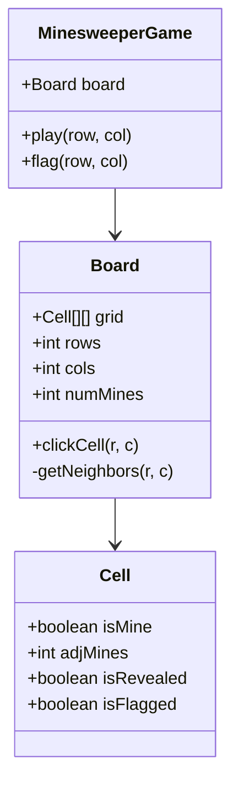

# Design Minesweeper

> **Difficulty**: Medium
> **Topics**: Flood Fill (DFS/BFS), 2D Grid, Recursion
> **Key Concepts**: Game Loop, Recursion, Object States.

## Phase 1: Requirements Gathering

### Goals
- Design the classic Minesweeper game.
- Support core gameplay: Reveal cells, flag mines, win/loss conditions.
- Handle "Flood Fill" for empty areas.

### 1. Who are the actors?
- **Player**: Interacts with the grid.
- **Game Engine**: Manages rules and board state.

### 2. What are the must-have features? (Core)
- **Grid Setup**: Initialize N*N grid with M mines.
- **Click (Reveal)**: Reveal a cell.
  - If Mine -> Game Over.
  - If Empty (0 adj) -> Reveal all adjacent empty cells (Recursive).
  - If Number -> Show number.
- **Flag**: Mark a cell as a potential mine.
- **Win Condition**: All non-mine cells are revealed.

### 3. What are the constraints?
- **Efficiency**: First click should never be a mine (Optional "fairness" rule).
- **Recursion**: Ensure no stack overflow for large grids (or use BFS).

---

## Phase 2: Use Cases

### UC1: Start Game
**Actor**: Player
**Flow**:
1. Player selects difficulty (e.g., 10x10, 10 mines).
2. System places mines randomly.
3. System pre-calculates adjacency numbers (optional, or calculate on fly).
4. System displays masked grid.

### UC2: Click Cell
**Actor**: Player
**Flow**:
1. Player clicks `(r, c)`.
2. System checks state:
    - If `Flagged` or `Revealed` -> Ignore.
    - If `Mine` -> **LOSE**.
    - If `Number` -> Reveal number.
    - If `Empty (0)` -> Trigger Flood Fill to reveal cluster.
3. System checks Win Condition (TotalCells - RevealedCount == NumMines).
4. System updates UI.

---

## Phase 3: Class Diagram

### Step 1: Core Entities
- **MinesweeperGame**: Controller.
- **Board**: The Grid.
- **Cell**: Individual square.

### UML Diagram



---

## Phase 4: Design Patterns

### 1. Composite Pattern (Grid Structure)
- **Description**: Treats individual objects and compositions of objects uniformly.
- **Why used**: The Board manages a grid of Cells. Operations like "Reveal" can propagate from the Board to a Cell, and recursively to neighbor Cells (Flood Fill), treating the grid structure as a unified whole.

### 2. State Pattern
- **Description**: Allows an object to alter its behavior when its internal state changes.
- **Why used**: The Game has distinct states (`PLAYING`, `WON`, `LOST`). The response to a user click depends entirely on the current state (e.g., clicks are ignored if the game is `LOST`).

---

## Phase 5: Code Key Methods

### Java Implementation

```java
import java.util.*;

// 1. Cell Entity
class Cell {
    boolean isMine;
    int adjMines;
    boolean isRevealed;
    boolean isFlagged;

    public Cell() {
        this.isMine = false;
        this.adjMines = 0;
        this.isRevealed = false;
        this.isFlagged = false;
    }
}

// 2. Board with Flood Fill Algorithm
class Board {
    Cell[][] grid;
    int rows;
    int cols;
    int numMines;
    
    // For win condition tracking
    int totalCells;
    int revealedCount;
    boolean gameOver;

    public Board(int rows, int cols, int numMines) {
        this.rows = rows;
        this.cols = cols;
        this.totalCells = rows * cols;
        this.numMines = numMines;
        this.grid = new Cell[rows][cols];
        this.gameOver = false;
        
        initializeBoard();
    }

    private void initializeBoard() {
        // Init Cells
        for(int i=0; i<rows; i++) {
            for(int j=0; j<cols; j++) {
                grid[i][j] = new Cell();
            }
        }
        
        // Place Mines
        placeMines();
        
        // Calculate Adjacent Mines
        calculateNumbers();
    }

    private void placeMines() {
        Random rand = new Random();
        int minesPlaced = 0;
        while(minesPlaced < numMines) {
            int r = rand.nextInt(rows);
            int c = rand.nextInt(cols);
            if(!grid[r][c].isMine) {
                grid[r][c].isMine = true;
                minesPlaced++;
            }
        }
    }
    
    // Pre-calculate adjacent mine counts for O(1) lookups during play
    private void calculateNumbers() {
        for(int r=0; r<rows; r++) {
            for(int c=0; c<cols; c++) {
                if(grid[r][c].isMine) continue;
                
                int count = 0;
                for(int[] n : getNeighbors(r, c)) {
                    if(grid[n[0]][n[1]].isMine) count++;
                }
                grid[r][c].adjMines = count;
            }
        }
    }

    public void clickCell(int r, int c) {
        if (gameOver || r < 0 || r >= rows || c < 0 || c >= cols) return;
        
        Cell cell = grid[r][c];
        if (cell.isRevealed || cell.isFlagged) return;

        // Reveal
        cell.isRevealed = true;
        revealedCount++;

        if (cell.isMine) {
            gameOver = true;
            System.out.println("BOOM! Game Over.");
            return;
        }

        // Win check
        if (totalCells - revealedCount == numMines) {
            System.out.println("Congratulations! You Won.");
            gameOver = true;
            return;
        }

        // Flood Fill Logic (DFS) if empty
        if (cell.adjMines == 0) {
            for (int[] n : getNeighbors(r, c)) {
                clickCell(n[0], n[1]);
            }
        }
    }
    
    private List<int[]> getNeighbors(int r, int c) {
        List<int[]> neighbors = new ArrayList<>();
        // All 8 directions
        int[] dr = {-1, -1, -1, 0, 0, 1, 1, 1};
        int[] dc = {-1, 0, 1, -1, 1, -1, 0, 1};
        
        for(int i=0; i<8; i++) {
            int nr = r + dr[i];
            int nc = c + dc[i];
            if(nr >= 0 && nr < rows && nc >= 0 && nc < cols) {
                neighbors.add(new int[]{nr, nc});
            }
        }
        return neighbors;
    }
    
    public void flagCell(int r, int c) {
         if(!grid[r][c].isRevealed) {
             grid[r][c].isFlagged = !grid[r][c].isFlagged;
         }
    }
}
```

---

## Phase 6: Discussion

### Algorithms
**Q: Why Flood Fill?**
- A: "It efficiently checks connectivity. When a `0` is clicked, all connected `0`s (and their boundary numbers) are safe to reveal. DFS/BFS both work. Time Complexity O(Total Cells)."

### Fairness
**Q: How to ensure first click is never a mine?**
- A: "Delay mine placement until *after* the first click.
    1. User clicks `(r, c)`.
    2. Place mines randomly, ensuring `(r, c)` and its neighbors are skipped.
    3. Calculate numbers.
    4. Proceed with reveal."

### Scalability
**Q: Infinite Minesweeper?**
- A: "If the board is infinite, we can't pre-allocate a 2D array. Use a `HashMap<String, Cell> key="r,c"` to store only generated chunks/cells."

---

## SOLID Principles Checklist

- **S (Single Responsibility)**: `Board` manages grid logic, `Game` manages flow.
- **O (Open/Closed)**: New cell types (e.g., "Mega Mine") could extend `Cell`.
- **L (Liskov Substitution)**: N/A.
- **I (Interface Segregation)**: N/A.
- **D (Dependency Inversion)**: N/A (Self-contained logic).
