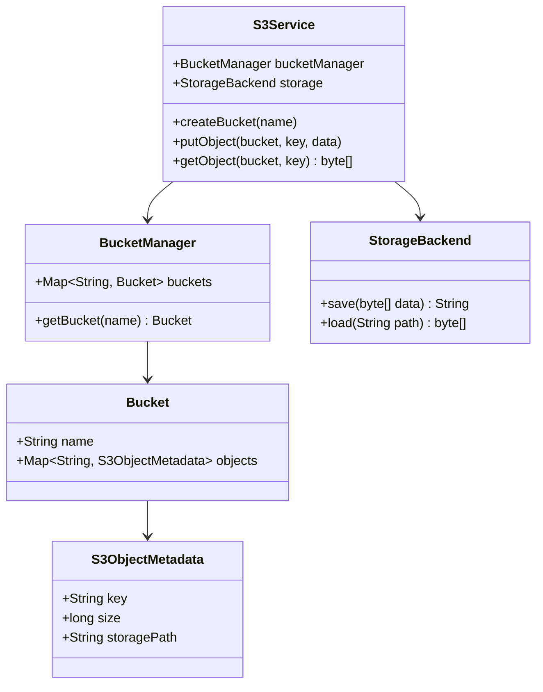

# Design AWS S3 (Object Storage)

> **Difficulty**: Hard
> **Topics**: Distributed Systems, Blob Storage, Metadata Management
> **Key Concepts**: Decoupling Metadata from Data, Immutable Objects, Flat Namespace.

## Phase 1: Requirements Gathering

### Goals
- Design a simplified Object Storage Service like AWS S3.
- Support manipulating "Buckets" and "Objects" (Files).
- Ensure high durability and availability (conceptually).

### 1. Who are the actors?
- **User/Service**: Uploads or downloads files via API.
- **Storage System**: Manages physical bytes.
- **Metadata System**: Manages indexing and attributes.

### 2. What are the must-have features? (Core)
- **Bucket Operations**: Create, Delete, List.
- **Object Operations**: Put, Get, Delete.
- **immutability**: Objects are immutable (overwrite implies new version/file).

### 3. What are the constraints?
- **Consistency**: Metadata should be eventually permissible, but strong consistency is preferred for new objects (S3 standard).
- **Blob Size**: Support small (KB) to large (GB) files.

---

## Phase 2: Use Cases

### UC1: Create Bucket
**Actor**: User
**Flow**:
1. User requests `CreateBucket("my-photos")`.
2. System checks if name is globally unique.
3. System records new Bucket in Metadata Store.

### UC2: Put Object
**Actor**: User
**Flow**:
1. User uploads data to `PutObject("my-photos", "vacation.jpg")`.
2. System (Storage Node) streams bytes to disk/SSD.
3. System generates a unique content address/path.
4. System updates Metadata Store with `{Key: "vacation.jpg", Path: "/disk1/xyz", Size: ...}`.
5. System returns Success.

---

## Phase 3: Class Diagram

### Step 1: Core Entities
- **S3Service**: Facade.
- **Bucket**: Logical container.
- **S3Object**: Metadata Wrapper.
- **StorageBackend**: Interface for physical storage (Local Disk, DFS).

### UML Diagram



---

## Phase 4: Design Patterns

### 1. Strategy Pattern
- **Description**: Defines a family of algorithms, encapsulates each one, and makes them interchangeable.
- **Why used**: The `StorageBackend` implementation can vary (Local Disk, HDFS, S3 Glacier, In-Memory). Strategy allows the storage engine to be swapped based on environment or cost requirements without changing the core S3 logic.

### 2. Facade Pattern
- **Description**: Provides a unified interface to a set of interfaces in a subsystem. Facade defines a higher-level interface that makes the subsystem easier to use.
- **Why used**: `S3Service` acts as a Facade, hiding the complexity of coordinating the Metadata Store (`BucketManager`) and the Blob Store (`StorageBackend`). Clients just call simple methods like `putObject`.

---

## Phase 5: Code Key Methods

### Java Implementation

```java
import java.io.*;
import java.nio.file.*;
import java.util.*;
import java.util.concurrent.ConcurrentHashMap;

// 1. Storage Backend (The physical layer Strategy)
interface StorageBackend {
    String save(byte[] data) throws IOException;
    byte[] load(String pathId) throws IOException;
}

class FileSystemStorage implements StorageBackend {
    private String rootDir = "./s3_data";

    public FileSystemStorage() {
        new File(rootDir).mkdirs();
    }

    @Override
    public String save(byte[] data) throws IOException {
        String pathId = UUID.randomUUID().toString();
        Path path = Paths.get(rootDir, pathId);
        Files.write(path, data);
        return path.toString();
    }

    @Override
    public byte[] load(String pathId) throws IOException {
        return Files.readAllBytes(Paths.get(pathId));
    }
}

// 2. Metadata Entities
class S3ObjectMetadata {
    String key;
    long size;
    String storagePath;

    public S3ObjectMetadata(String key, long size, String storagePath) {
        this.key = key;
        this.size = size;
        this.storagePath = storagePath;
    }
}

class Bucket {
    String name;
    // In real system, this Map is a Distributed K-V Store (DynamoDB)
    Map<String, S3ObjectMetadata> objects = new ConcurrentHashMap<>();

    public Bucket(String name) {
        this.name = name;
    }
}

// 3. S3 Service (Facade)
public class S3Service {
    private StorageBackend storage;
    private Map<String, Bucket> buckets = new ConcurrentHashMap<>();

    public S3Service() {
        this.storage = new FileSystemStorage();
    }

    public void createBucket(String name) {
        buckets.putIfAbsent(name, new Bucket(name));
        System.out.println("Bucket created: " + name);
    }

    public void putObject(String bucketName, String key, byte[] data) throws IOException {
        Bucket bucket = buckets.get(bucketName);
        if (bucket == null) throw new IllegalArgumentException("Bucket not found");

        // 1. Save Blob (physical IO)
        String physicalPath = storage.save(data);

        // 2. Save Metadata (DB update)
        S3ObjectMetadata meta = new S3ObjectMetadata(key, data.length, physicalPath);
        bucket.objects.put(key, meta);
        
        System.out.println("Object uploaded: " + key + " (" + data.length + " bytes)");
    }

    public byte[] getObject(String bucketName, String key) throws IOException {
        Bucket bucket = buckets.get(bucketName);
        if (bucket == null) throw new IllegalArgumentException("Bucket not found");

        // 1. Get Metadata
        S3ObjectMetadata meta = bucket.objects.get(key);
        if (meta == null) return null;

        // 2. Fetch Blob
        return storage.load(meta.storagePath);
    }
    
    // Demo
    public static void main(String[] args) throws IOException {
        S3Service s3 = new S3Service();
        s3.createBucket("my-images");
        s3.putObject("my-images", "vacation.png", new byte[]{10, 20, 30});
        
        byte[] data = s3.getObject("my-images", "vacation.png");
        System.out.println("Downloaded bytes: " + data.length);
    }
}
```

---

## Phase 6: Discussion

### Scalability
**Q: How to handle 1 Exabyte of data?**
- A: "The `StorageBackend` must be sharded. Use Consistent Hashing to distribute blobs across distinct storage nodes. Metadata DB (e.g., DynamoDB) is also partitioned by Bucket/Key."

### Large Files
**Q: How to upload a 5GB file?**
- A: "**Multipart Upload**. Client splits file into 100MB chunks. Uploads them in parallel.
    - `initiateMultipart()` -> returns `uploadId`.
    - `uploadPart(partId, data)` -> returns `ETag`.
    - `completeMultipart(uploadId, list_of_parts)` -> S3 assembles logic (metadata only)."

### Namespace hierarchy
**Q: Does S3 have folders?**
- A: "No. It is a flat Keyspace. 'Folders' are just prefixes. `photos/2023/jan.jpg` is the key. Validating 'folder' existence is an O(N) scan operation, which is why 'renaming a folder' is expensive (Copy+Delete)."

---

## SOLID Principles Checklist

- **S (Single Responsibility)**: `StorageBackend` handles bytes, `Bucket` handles metadata.
- **O (Open/Closed)**: Add `GlacierBackend` without changing S3Service logging.
- **L (Liskov Substitution)**: `FileSystemStorage` can be replaced with `NetworkStorage`.
- **I (Interface Segregation)**: `StorageBackend` is a simple Read/Write interface.
- **D (Dependency Inversion)**: `S3Service` depends on `StorageBackend` interface.
