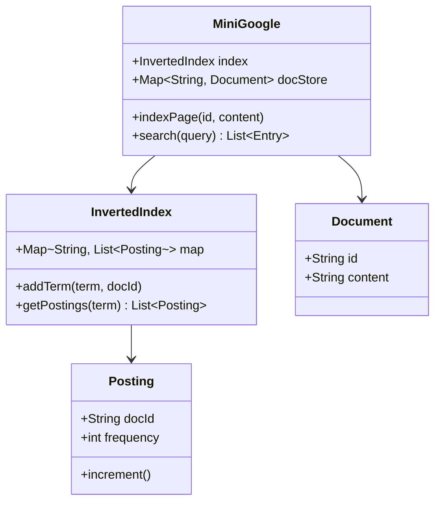

# Design Search Engine (Mini Google)

> **Difficulty**: Hard
> **Topics**: Inverted Index, TF-IDF, Ranking, Tries
> **Key Concepts**: Inverted Index, Document Scoring, Tokenization.

## Phase 1: Requirements Gathering

### Goals
- Design a system to ingest documents and allow keyword search.
- Return a ranked list of documents based on relevance.

### 1. Who are the actors?
- **User**: Types query "banana recipe".
- **Publisher**: Uploads documents/pages.
- **Crawler/Indexer**: Background process (Scope out crawler, focus on Indexer).

### 2. What are the must-have features? (Core)
- **Indexing**: Parse text and store efficient lookup structures.
- **Search**: exact match or partial match of keywords.
- **Ranking**: Order results by frequency (or TF-IDF).

### 3. What are the constraints?
- **Latency**: Search should be < 100ms.
- **Throughput**: High read QPS.

---

## Phase 2: Use Cases

### UC1: Index Document
**Actor**: Publisher/System
**Flow**:
1. System receives DocID: 1, Content: "Apple banana".
2. Tokenizer splits text -> ["apple", "banana"].
3. Inverted Index updates:
    - "apple" -> adds Doc1
    - "banana" -> adds Doc1

### UC2: Search Query
**Actor**: User
**Flow**:
1. User searches "banana".
2. System looks up "banana" in Inverted Index.
3. Returns list [Doc1, ...].
4. Ranker sorts list by score.

---

## Phase 3: Class Diagram

### Step 1: Core Entities
- **SearchEngine**: Facade.
- **InvertedIndex**: The core data structure `Map<Word, List<Posting>>`.
- **Posting**: Metadata about word in doc (frequency, position).
- **Document**: The raw content.

### UML Diagram


```mermaid
classDiagram
    class MiniGoogle {
        +InvertedIndex index
        +Map~String, Document~ docStore
        +indexPage(id, content)
        +search(query) List~Entry~
    }

    class InvertedIndex {
        +Map~String, List~Posting~~ map
        +addTerm(term, docId)
        +getPostings(term) List~Posting~
    }

    class Posting {
        +String docId
        +int frequency
        +increment()
    }
    
    class Document {
        +String id
        +String content
    }

    MiniGoogle --> InvertedIndex
    MiniGoogle --> Document
    InvertedIndex --> Posting
```

---

## Phase 4: Design Patterns

### 1. Inverted Index (Data Structure Pattern)
- **Description**: A data structure mapping content (words/tokens) to its location in a document or a set of documents.
- **Why used**: It turns the search problem from "Scan all docs" (O(N)) into "Look up the word" (O(1)). This is fundamental for full-text search engines to achieve sub-second latency.

### 2. Strategy Pattern
- **Description**: Defines a family of algorithms, encapsulates each one, and makes them interchangeable.
- **Why used**: Search relevance is subjective and evolves. We need to swap Scoring Algorithms (TF-IDF, BM25, PageRank) easily to experiment with ranking quality without rewriting the Indexer or Searcher.

---

## Phase 5: Code Key Methods

### Java Implementation

```java
import java.util.*;
import java.util.concurrent.ConcurrentHashMap;
import java.util.stream.Collectors;

// 1. Posting Entity: Links a Word to a Document
class Posting {
    String docId;
    int frequency;

    public Posting(String docId) {
        this.docId = docId;
        this.frequency = 1;
    }

    public void increment() {
        this.frequency++;
    }
}

// 2. Inverted Index
class InvertedIndex {
    // Key: Word, Value: Map<DocID, Posting> (Map used for easy update of frequency)
    private Map<String, Map<String, Posting>> index;

    public InvertedIndex() {
        index = new ConcurrentHashMap<>();
    }

    public void addDocument(String docId, String content) {
        String[] words = content.toLowerCase().split("\\W+"); // Split by non-word chars
        
        for (String word : words) {
            if (word.isEmpty()) continue;
            
            index.putIfAbsent(word, new HashMap<>());
            Map<String, Posting> docMap = index.get(word);
            
            if (!docMap.containsKey(docId)) {
                docMap.put(docId, new Posting(docId));
            } else {
                docMap.get(docId).increment();
            }
        }
    }

    public List<Posting> search(String word) {
        if (!index.containsKey(word.toLowerCase())) {
            return Collections.emptyList();
        }
        return new ArrayList<>(index.get(word.toLowerCase()).values());
    }
}

// 3. Search Service (Facade)
public class MiniGoogle {
    private InvertedIndex index;
    // Simple Doc Store
    private Map<String, String> docStore = new HashMap<>();

    public MiniGoogle() {
        index = new InvertedIndex();
    }

    public void indexPage(String id, String content) {
        docStore.put(id, content);
        index.addDocument(id, content);
    }

    public List<Map.Entry<String, Integer>> search(String query) {
        String[] keywords = query.toLowerCase().split("\\W+");
        
        // 1. Fetch Postings for all keywords
        Map<String, List<Posting>> keywordMatches = new HashMap<>();
        for(String w : keywords) {
            if(!w.isEmpty()) {
                keywordMatches.put(w, index.search(w));
            }
        }
        
        // 2. Aggregate Scores (Simple Sum of Frequencies)
        Map<String, Integer> docScores = new HashMap<>();
        for (List<Posting> postings : keywordMatches.values()) {
            for (Posting p : postings) {
                // OR Logic: Document matches if it has ANY of the keywords
                docScores.put(p.docId, docScores.getOrDefault(p.docId, 0) + p.frequency);
            }
        }

        // 3. Sort by Score (Descending)
        return docScores.entrySet()
                .stream()
                .sorted((e1, e2) -> e2.getValue().compareTo(e1.getValue()))
                .collect(Collectors.toList());
    }
    
    public static void main(String[] args) {
        MiniGoogle engine = new MiniGoogle();
        engine.indexPage("1", "Apple banana");
        engine.indexPage("2", "Banana cherry banana"); // Banana appears twice
        engine.indexPage("3", "Apple");

        System.out.println("Search 'banana': " + engine.search("banana")); 
        // Expected: Doc 2 (score 2), Doc 1 (score 1)
        
        System.out.println("Search 'apple banana': " + engine.search("apple banana"));
        // Expected: Doc 1 (score 2), Doc 2 (score 2), Doc 3 (score 1)
    }
}
```

---

## Phase 6: Discussion

### Ranking Algorithms
**Q: How do we improve simple frequency counting?**
- A: "Use **TF-IDF**.
    - **TF (Term Frequency)**: How often word appears in THIS doc.
    - **IDF (Inverse Doc Frequency)**: `log(TotalDocs / DocsWithTerm)`. Penalizes common words like 'the'."

### Concurrency
**Q: How to handle simultaneous Reads and Writes?**
- A: "**Read-Write Locks** or **double buffering**. In real systems (Lucene/Elasticsearch), segments are immutable. New docs go to a new segment. Segments are merged in background."

### Scalability
**Q: How to shard index?**
- A: "**Document Partitioning**: Each node holds a subset of documents (e.g., Doc 1-1000). Query goes to ALL nodes, results merged. Better for parallel processing."

---

## SOLID Principles Checklist

- **S (Single Responsibility)**: `InvertedIndex` manages data structure, `MiniGoogle` manages retrieval logic.
- **O (Open/Closed)**: Scoring strategy can be injected.
- **L (Liskov Substitution)**: N/A.
- **I (Interface Segregation)**: N/A.
- **D (Dependency Inversion)**: N/A.
