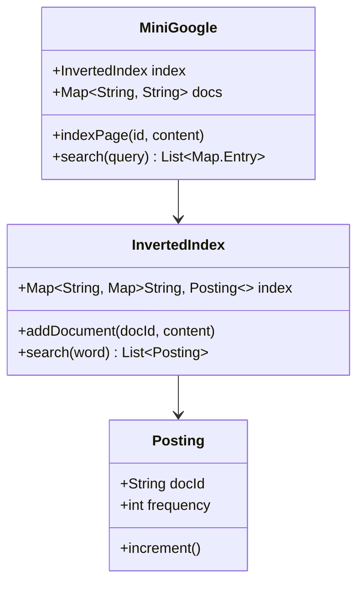

# Design Search Engine (Mini Google)

> **Difficulty**: Hard  
> **Topics**: Inverted Index, TF-IDF, Ranking, Tries  
> **Scope**: Indexing and Search only (Crawler is distinct).

## Problem Statement

Ingest documents and allow keyword search.
- **Input**: "Apple banana", "Banana cherry".
- **Query**: "banana".
- **Output**: Ranked list of documents.

## Core Concept: Inverted Index

Map: `Word -> List[DocID]`.
- "apple" -> [1]
- "banana" -> [1, 2]

## Implementation

## Implementation (Java)

#### Class Diagram



#### Flow Chart: Search Process

```mermaid
flowchart TD
    A[User Query: "banana cherry"] --> B[Tokenize Query]
    B --> C{For Each Keyword}
    C --> D[Fetch Postings List from Inverted Index]
    D --> E[Aggregate Scores per Document]
    E --> F[Sort Documents by Score]
    F --> G[Return Top Ranked Results]
```

#### Java Code

```java
import java.util.*;
import java.util.concurrent.ConcurrentHashMap;
import java.util.regex.Matcher;
import java.util.regex.Pattern;
import java.util.stream.Collectors;

// 1. Posting Entity
class Posting {
    String docId;
    int frequency;

    public Posting(String docId) {
        this.docId = docId;
        this.frequency = 0;
    }

    public void increment() {
        this.frequency++;
    }
}

// 2. Inverted Index
class InvertedIndex {
    // Word -> { DocID -> Posting }
    private Map<String, Map<String, Posting>> index;

    public InvertedIndex() {
        index = new ConcurrentHashMap<>();
    }

    public void addDocument(String docId, String content) {
        String[] words = content.toLowerCase().split("\\W+");
        for (String word : words) {
            if (word.isEmpty()) continue;
            
            index.putIfAbsent(word, new HashMap<>());
            Map<String, Posting> docMap = index.get(word);
            
            docMap.putIfAbsent(docId, new Posting(docId));
            docMap.get(docId).increment();
        }
    }

    public List<Posting> search(String word) {
        if (!index.containsKey(word.toLowerCase())) {
            return Collections.emptyList();
        }
        return new ArrayList<>(index.get(word.toLowerCase()).values());
    }
}

// 3. Search Service (Ranking)
public class MiniGoogle {
    private InvertedIndex index;
    private Map<String, String> docs;

    public MiniGoogle() {
        index = new InvertedIndex();
        docs = new HashMap<>();
    }

    public void indexPage(String id, String content) {
        docs.put(id, content);
        index.addDocument(id, content);
    }

    public List<Map.Entry<String, Integer>> search(String query) {
        String[] keywords = query.toLowerCase().split("\\W+");
        
        // 1. Fetch Postings
        // word -> [Posting, Posting]
        Map<String, List<Posting>> matches = new HashMap<>();
        for(String w : keywords) {
            if(!w.isEmpty()) {
                matches.put(w, index.search(w));
            }
        }
        
        // 2. Aggregate Scores (OR Logic)
        Map<String, Integer> docScores = new HashMap<>();
        for (List<Posting> postings : matches.values()) {
            for (Posting p : postings) {
                // Simple Score: Sum of frequencies
                docScores.put(p.docId, docScores.getOrDefault(p.docId, 0) + p.frequency);
            }
        }

        // 3. Sort by Score (Descending)
        return docScores.entrySet()
                .stream()
                .sorted((e1, e2) -> e2.getValue().compareTo(e1.getValue()))
                .collect(Collectors.toList());
    }
    
    public static void main(String[] args) {
        MiniGoogle engine = new MiniGoogle();
        engine.indexPage("1", "Apple banana");
        engine.indexPage("2", "Banana cherry");
        
        List<Map.Entry<String, Integer>> results = engine.search("banana");
        System.out.println("Results: " + results); 
        // Expected: Doc 2 (score 1), Doc 1 (score 1) - actually typically frequency based sorting
    }
}
```

## Key Topics

1.  **TF-IDF**: Replace simple frequency count with `TF * IDF` to penalize common words like "the".
2.  **Concurrency**: Use Read-Write locks or Double Buffering (Shadow Index) so writes don't block reads.
3.  **Sharding**: Document Partitioning (Shard by DocID) is better than Term Partitioning (Shard by Word) for multi-term queries.
