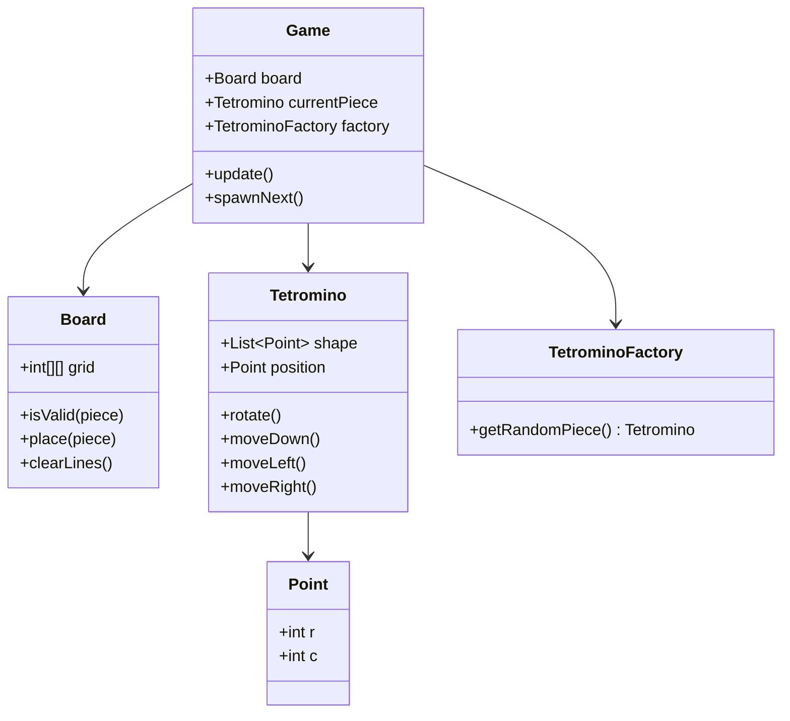

# Design Tetris Game

> **Difficulty**: Medium
> **Topics**: Matrix Manipulation, Game Loop, Factory Pattern
> **Key Concepts**: Rotation Matrix, Collision Detection, Game Loop.

## Phase 1: Requirements Gathering

### Goals
- Design the core logic for Tetris.
- Handle different shapes (Tetrominoes), rotation, movement, and line clearing.

### 1. Who are the actors?
- **Player**: Controls the active piece.
- **Game Loop**: Forces gravity (ticks).

### 2. What are the must-have features? (Core)
- **7 Shapes**: I, O, T, S, Z, J, L.
- **Movement**: Left, Right, Down (Soft Drop), Rotate.
- **Game Physics**: Gravity, Collision detection (walls, other blocks).
- **Clearing**: Full rows disappear, blocks above fall down.

### 3. What are the constraints?
- **Grid Size**: Standard is 10 cols x 20 rows.
- **Rotation**: 90 degrees clockwise.

---

## Phase 2: Use Cases

### UC1: Game Tick (Gravity)
**Actor**: System
**Flow**:
1. Timer fires (e.g., every 500ms).
2. Active Piece moves down 1 unit.
3. System checks collision.
    - If Collision: Undo move, Lock piece to board, Check for full lines, Spawn next piece.
    - If No Collision: Update Display.

### UC2: User Rotate
**Actor**: Player
**Flow**:
1. Player presses 'Up/Rotate'.
2. System calculates new coordinates for the shape.
3. System checks if new coordinates collide with walls/blocks.
    - If Safe: Apply rotation.
    - If Collision: Ignore input (or "Wall Kick" - advanced feature).

---

## Phase 3: Class Diagram

### Step 1: Core Entities
- **TetrisGame**: Main controller.
- **Board**: N*M grid state.
- **Tetromino**: The active piece (Strategy for shape).
- **Point**: Helper class.

### UML Diagram



---

## Phase 4: Design Patterns

### 1. Factory Pattern
- **Description**: A creational pattern that provides an interface for creating objects in a superclass, but allows subclasses to alter the type of objects that will be created.
- **Why used**: `TetrominoFactory` centralizes the complex logic of creating different shapes (I, L, Z, T) with their specific initial coordinates and colors. The Game Loop simply asks for a "Random Piece".

### 2. Command Pattern
- **Description**: Encapsulates a request as an object, thereby letting you parameterize clients with different requests, queue or log requests, and support undoable operations.
- **Why used**: (Optional) Mapping user inputs (Up, Down, Left, Right) to Command objects allows for remapping controls easily and implementing an "Undo" feature for debugging or training AI agents.

---

## Phase 5: Code Key Methods

### Java Implementation

```java
import java.util.*;

// 1. Point Helper
class Point {
    int r, c;
    public Point(int r, int c) { this.r = r; this.c = c; }
}

// 2. Tetromino (Shape Strategy)
class Tetromino {
    List<Point> shape; // Relative coordinates from pivot (0,0)
    Point pos;         // Absolute position on board

    public Tetromino(List<Point> shape) {
        this.shape = new ArrayList<>();
        // Deep copy points
        for(Point p : shape) this.shape.add(new Point(p.r, p.c));
        this.pos = new Point(0, 4); // Start top-center
    }

    // Rotate 90 degrees clockwise: (r, c) -> (c, -r)
    // Example: (1, 0) -> (0, -1)
    public void rotate() {
        for (Point p : shape) {
            int temp = p.r;
            p.r = p.c;
            p.c = -temp;
        }
    }

    public List<Point> getAbsolutePositions() {
        List<Point> abs = new ArrayList<>();
        for (Point p : shape) {
            abs.add(new Point(this.pos.r + p.r, this.pos.c + p.c));
        }
        return abs;
    }
    
    public void moveDown() { pos.r++; }
    public void moveUp() { pos.r--; }
    public void moveLeft() { pos.c--; }
    public void moveRight() { pos.c++; }
}

// 3. Factory
class TetrominoFactory {
    public static Tetromino getRandomPiece() {
        // Example: T-Shape
        //  *
        // ***
        // Pivot at (0,0) is center '*'
        List<Point> tShape = Arrays.asList(
            new Point(0, 0),
            new Point(0, -1),
            new Point(0, 1),
            new Point(-1, 0)
        );
        return new Tetromino(tShape);
    }
}

// 4. Board
class Board {
    int rows = 20;
    int cols = 10;
    int[][] grid = new int[rows][cols];

    public boolean isValid(Tetromino piece) {
        for (Point p : piece.getAbsolutePositions()) {
            // Check Bounds
            if (p.r < 0 || p.r >= rows || p.c < 0 || p.c >= cols) return false;
            // Check Collision with existing blocks
            if (grid[p.r][p.c] != 0) return false;
        }
        return true;
    }

    public void place(Tetromino piece) {
        for (Point p : piece.getAbsolutePositions()) {
            grid[p.r][p.c] = 1; // Mark as occupied
        }
    }

    public void clearLines() {
        for (int i = rows - 1; i >= 0; i--) {
            boolean full = true;
             for (int j = 0; j < cols; j++) {
                 if (grid[i][j] == 0) {
                     full = false;
                     break;
                 }
             }
             if (full) {
                 removeLine(i);
                 i++; // Check this row index again as lines shifted down
             }
        }
    }
    
    private void removeLine(int r) {
        // Shift everything down
        for (int i = r; i > 0; i--) {
            grid[i] = grid[i-1].clone();
        }
        // Clear top row
        Arrays.fill(grid[0], 0);
        System.out.println("Line Cleared!");
    }
}

// 5. Game Loop
class Game {
    Board board = new Board();
    Tetromino piece;
    boolean gameOver = false;

    public void start() {
        spawnNext();
        while (!gameOver) {
            update();
            try { Thread.sleep(500); } catch (Exception e) {}
        }
        System.out.println("Game Over");
    }

    private void spawnNext() {
        piece = TetrominoFactory.getRandomPiece();
        if (!board.isValid(piece)) {
            gameOver = true;
        }
    }

    private void update() {
        // Gravity
        piece.moveDown();
        if (!board.isValid(piece)) {
            // Collision detected
            piece.moveUp(); // Undo move
            board.place(piece);
            board.clearLines();
            spawnNext();
        } else {
            System.out.println("Piece fell one step.");
        }
    }
}
```

---

## Phase 6: Discussion

### Rotation Logic
**Q: How does rotation math work?**
- A: "Basic Linear Algebra. Rotating a point $(x, y)$ 90 degrees around origin $(0,0)$ results in $(y, -x)$. Since our shapes store relative coordinates to a center pivot, we just apply this transform to every point in the shape list."

### Collision
**Q: Optimal collision detection?**
- A: "Since grid is small (10x20) and shape is small (4 blocks), checking all 4 blocks against the grid array O(1) is extremely fast. No need for QuadTrees."

### Concurrency
**Q: What if user presses 'Rotate' exactly when Gravity tick happens?**
- A: "Game Loop pattern usually handles input and updates sequentially in a single thread to avoid race conditions. `while(running) { handleInput(); update(); render(); }`."

---

## SOLID Principles Checklist

- **S (Single Responsibility)**: `Board` manages grid state, `Tetromino` manages shape logic.
- **O (Open/Closed)**: Add new Shapes to Factory without changing Game logic.
- **L (Liskov Substitution)**: N/A.
- **I (Interface Segregation)**: N/A.
- **D (Dependency Inversion)**: Game depends on `Tetromino` abstraction (if made abstract/interface).
