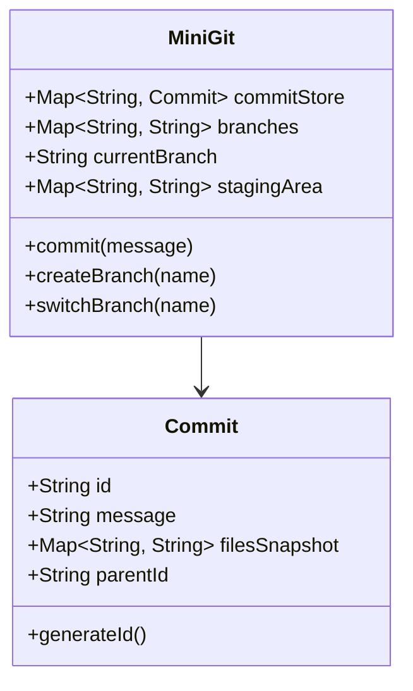

# Design Version Control System (Git)

> **Difficulty**: Hard
> **Topics**: Graph Theory (DAG), Hashing, Content Addressable Storage
> **Key Concepts**: Merkle Trees, Snapshots vs Deltas, Deduplication.

## Phase 1: Requirements Gathering

### Goals
- Design a distributed version control system like Git.
- Track history of files with efficiency (deduplication).
- Support branching and merging.

### 1. Who are the actors?
- **Developer**: Adds files, commits changes, creates branches.
- **Repository**: Stores the data and history logic.

### 2. What are the must-have features? (Core)
- **Commit**: Save a snapshot of the project.
- **Branch**: Create a lightweight pointer to a commit.
- **Checkout**: Switch working directory to a specific branch/commit.
- **Log**: View history.

### 3. What are the constraints?
- **Storage**: Don't store duplicate files. If file hasn't changed, point to old blob.
- **Integrity**: History cannot be altered without changing IDs (SHA-1).

---

## Phase 2: Use Cases

### UC1: Commit Changes
**Actor**: Developer
**Flow**:
1. Dev adds `file.txt` to Staging Area.
2. Dev executes `commit("Fix bug")`.
3. System calculates Hash of `file.txt` (Blob).
4. System creates Tree Object (Directory structure).
5. System creates Commit Object (Points to Tree, Parent Commit, Metadata).
6. Update current Branch pointer to new Commit.

### UC2: Create Branch
**Actor**: Developer
**Flow**:
1. Dev executes `branch("feature-x")`.
2. System creates a new Reference `refs/heads/feature-x`.
3. Point it to the current Commit ID (HEAD).

---

## Phase 3: Class Diagram

### Step 1: Core Entities
- **Repository**: Manages the objects.
- **Commit**: Node in the history graph.
- **Blob**: File content (Immutable).
- **Ref/Branch**: Mutable pointer to a Commit.

### UML Diagram


```mermaid
classDiagram
    class MiniGit {
        +Map~String, Commit~ commitStore
        +Map~String, String~ branches
        +String currentBranch
        +Map~String, String~ stagingArea
        +commit(message)
        +createBranch(name)
        +switchBranch(name)
    }

    class Commit {
        +String id
        +String message
        +Map~String, String~ filesSnapshot
        +String parentId
        +generateId()
    }

    MiniGit --> Commit
```

---

## Phase 4: Design Patterns

### 1. Composite Pattern
- **Description**: Composes objects into tree structures to represent part-whole hierarchies.
- **Why used**: A Version Control System models a directory tree. A `Tree` object contains entries which can be `Blobs` (Files) or other `Trees` (Subdirectories). Composite allows treating individual files and directories uniformly.

### 2. Flyweight Pattern (Content Addressable Storage)
- **Description**: Uses sharing to support large numbers of fine-grained objects efficiently.
- **Why used**: In Git, if a file hasn't changed between commits, we don't save a new copy. Instead, both commits point to the exact same Blob hash. This massive deduplication makes Git efficient.

---

## Phase 5: Code Key Methods

### Java Implementation

```java
import java.util.*;
import java.nio.charset.StandardCharsets;
import java.security.MessageDigest;

// 1. Commit Node (Immutable Snapshot)
class Commit {
    String id;
    String message;
    Map<String, String> files; // Filename -> Content Hash (Simplification of Tree)
    String parentId;
    long timestamp;

    public Commit(String message, Map<String, String> files, String parentId) {
        this.message = message;
        this.files = new HashMap<>(files); // Snapshot copy
        this.parentId = parentId;
        this.timestamp = System.currentTimeMillis();
        this.id = generateId();
    }

    private String generateId() {
        try {
            // ID depends on Content + Parent + Metadata -> Merkle DAG property
            String data = message + parentId + files.toString() + timestamp;
            MessageDigest digest = MessageDigest.getInstance("SHA-1");
            byte[] hash = digest.digest(data.getBytes(StandardCharsets.UTF_8));
            
            // Convert to Hex
            StringBuilder hex = new StringBuilder();
            for (byte b : hash) hex.append(String.format("%02x", b));
            return hex.toString().substring(0, 7); // Short Hash for readability
            
        } catch (Exception e) {
            throw new RuntimeException(e);
        }
    }
}

// 2. VCS Engine
public class MiniGit {
    Map<String, Commit> commitStore = new HashMap<>();
    Map<String, String> branches = new HashMap<>(); // Branch Name -> Commit ID
    String currentBranch = "master";
    
    // Staging: Filename -> Content (In real git: Filename -> BlobHash)
    Map<String, String> staging = new HashMap<>();

    public MiniGit() {
        // Initialize master branch (empty or creates root commit later)
        branches.put("master", null);
    }

    public void addToStaging(String filename, String content) {
        // In real Git, we'd hash the content (Blob) and store it in ObjectStore
        staging.put(filename, content);
    }

    public String commit(String message) {
        String parentId = branches.get(currentBranch);
        
        // 1. Inherit parent state (Snapshot approach)
        Map<String, String> newFiles = new HashMap<>();
        if (parentId != null) {
            Commit parent = commitStore.get(parentId);
            newFiles.putAll(parent.files);
        }
        
        // 2. Apply staging changes
        newFiles.putAll(staging);
        
        // 3. Create Commit Object
        Commit c = new Commit(message, newFiles, parentId);
        commitStore.put(c.id, c);
        
        // 4. Advance Branch Pointer
        branches.put(currentBranch, c.id);
        staging.clear();
        
        System.out.println("Committed [" + c.id + "]: " + message);
        return c.id;
    }

    public void createBranch(String name) {
        String head = branches.get(currentBranch);
        branches.put(name, head);
        System.out.println("Created branch '" + name + "' at " + head);
    }

    public void switchBranch(String name) {
        if (!branches.containsKey(name)) {
            System.out.println("Branch not found");
            return;
        }
        currentBranch = name;
        System.out.println("Switched to branch '" + name + "'");
    }
    
    public void printLog() {
        String current = branches.get(currentBranch);
        System.out.println("History for " + currentBranch + ":");
        while(current != null) {
            Commit c = commitStore.get(current);
            System.out.println(" - " + c.id + ": " + c.message);
            current = c.parentId;
        }
    }

    public static void main(String[] args) {
        MiniGit git = new MiniGit();
        
        git.addToStaging("file1.txt", "Hello World");
        git.commit("Initial Commit");
        
        git.createBranch("feature");
        git.switchBranch("feature");
        
        git.addToStaging("file2.txt", "Feature Code");
        git.commit("Added Feature");
        
        git.switchBranch("master");
        git.printLog(); // Should only show "Initial Commit"
        
        git.switchBranch("feature");
        git.printLog(); // Should show "Added Feature" -> "Initial Commit"
    }
}
```

---

## Phase 6: Discussion

### Delta vs Snapshot
**Q: "Why Snapshots?"**
- A: "SVN used Deltas (Diffs). To check out version 100, you need Base + 100 diffs. Slow. Git uses Snapshots. Version 100 is fully linked. Unchanged files just point to the same Blob hash as version 99. Fast checkout."

### Merging
**Q: "How to handle Merge Conflicts?"**
- A: "Find **Lowest Common Ancestor (LCA)** of Branch A and Branch B.
    - If File X changed in A but not B (vs LCA) -> Keep A.
    - If File X changed in Both -> Conflict. User must resolve."

### Distributed
**Q: "How does `git push` work?"**
- A: "You send your Commit Graph to the server. Server checks which Objects (Commits/Blobs) it is missing and asks for them. It then updates its Branch Pointer (Reference)."

---

## SOLID Principles Checklist

- **S (Single Responsibility)**: `Commit` stores data, `MiniGit` manages workflow.
- **O (Open/Closed)**: Logic to calculate Hash could be plugged in (SHA-1/SHA-256).
- **L (Liskov Substitution)**: N/A.
- **I (Interface Segregation)**: N/A.
- **D (Dependency Inversion)**: N/A.
