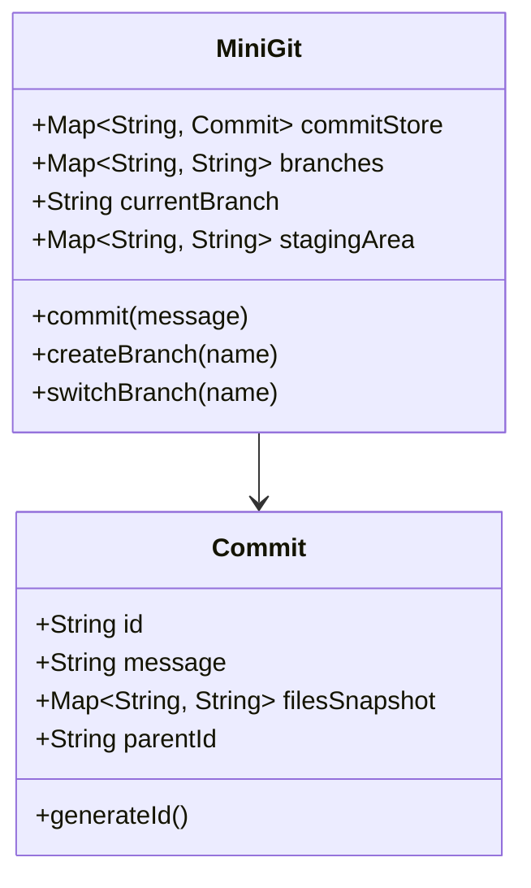

# Design Version Control System (Git)

> **Difficulty**: Hard  
> **Topics**: Graph Theory (DAG), Hashing, Content Addressable Storage  
> **Features**: Commit, Branch, Merge, Log.

## Problem Statement

Design a Git-like system.
- **Entities**: Blob (Content), Commit (Snapshot), Branch (Pointer).
- **Core Mechanism**: Deduplication via Hashing.

## Comparison: Deltas vs Snapshots

- **SVN**: Stores Deltas (Diffs). Slow to reconstruct.
- **Git**: Stores Snapshots (Full state). Fast to traverse. Uses Blobs to avoid duplicates.

## Implementation

## Java Implementation (Mini-Git)

#### Class Diagram



#### Flow Chart: Commit Process

```mermaid
flowchart TD
    A[User: Commit(Message)] --> B[Get Current Branch HEAD]
    B --> C[Clone Parent's File Snapshot]
    C --> D[Apply Staging Area Changes]
    D --> E[Create New Commit Object]
    E --> F[Generate SHA-1 Hash (ID)]
    F --> G[Save Commit to Store]
    G --> H[Update Branch Pointer to New Commit]
    H --> I[Clear Staging Area]
```

#### Code

```java
import java.util.*;
import java.security.MessageDigest;
import java.nio.charset.StandardCharsets;

// 1. Commit Node (Immutable Snapshot)
class Commit {
    String id;
    String message;
    Map<String, String> files; // Filename -> Content Hash (Simplification)
    String parentId;
    long timestamp;

    public Commit(String message, Map<String, String> files, String parentId) {
        this.message = message;
        this.files = new HashMap<>(files); // Snapshot copy
        this.parentId = parentId;
        this.timestamp = System.currentTimeMillis();
        this.id = generateId();
    }

    private String generateId() {
        try {
            String data = message + parentId + files.toString() + timestamp;
            MessageDigest digest = MessageDigest.getInstance("SHA-1");
            byte[] hash = digest.digest(data.getBytes(StandardCharsets.UTF_8));
            
            // Convert to Hex
            StringBuilder hex = new StringBuilder();
            for (byte b : hash) hex.append(String.format("%02x", b));
            return hex.toString().substring(0, 7); // Short Hash
            
        } catch (Exception e) {
            throw new RuntimeException(e);
        }
    }
}

// 2. VCS Engine
public class MiniGit {
    Map<String, Commit> commitStore = new HashMap<>();
    Map<String, String> branches = new HashMap<>(); // Branch Name -> Commit ID
    String currentBranch = "master";
    
    // Staging: Filename -> Content Hash
    Map<String, String> staging = new HashMap<>();

    public MiniGit() {
        branches.put("master", null);
    }

    public void addToStaging(String filename, String content) {
        // In real Git, we'd hash the content (Blob)
        staging.put(filename, content);
    }

    public String commit(String message) {
        String parentId = branches.get(currentBranch);
        
        // 1. Inherit parent state
        Map<String, String> newFiles = new HashMap<>();
        if (parentId != null) {
            Commit parent = commitStore.get(parentId);
            newFiles.putAll(parent.files);
        }
        
        // 2. Apply staging
        newFiles.putAll(staging);
        
        // 3. Create Commit
        Commit c = new Commit(message, newFiles, parentId);
        commitStore.put(c.id, c);
        
        // 4. Advance Branch Pointer
        branches.put(currentBranch, c.id);
        staging.clear();
        
        System.out.println("Committed [" + c.id + "]: " + message);
        return c.id;
    }

    public void createBranch(String name) {
        String head = branches.get(currentBranch);
        branches.put(name, head);
        System.out.println("Created branch " + name + " at " + head);
    }

    public void switchBranch(String name) {
        if (!branches.containsKey(name)) {
            System.out.println("Branch not found");
            return;
        }
        currentBranch = name;
        System.out.println("Switched to " + name);
    }
    
    public void printLog() {
        String current = branches.get(currentBranch);
        while(current != null) {
            Commit c = commitStore.get(current);
            System.out.println(c.id + " " + c.message);
            current = c.parentId;
        }
    }

    public static void main(String[] args) {
        MiniGit git = new MiniGit();
        
        git.addToStaging("file1.txt", "Hello World");
        git.commit("Initial Commit");
        
        git.createBranch("feature");
        git.switchBranch("feature");
        
        git.addToStaging("file2.txt", "Feature Code");
        git.commit("Added Feature");
        
        git.switchBranch("master");
        git.printLog(); // Should only show Initial Commit
    }
}
```

## Interview Q&A

**Q: "How to handle Merge Conflicts?"**
- A: "Find Common Ancestor. Diff(Ancestor, Current) vs Diff(Ancestor, Source). If both modified same lines, flag conflict."

**Q: "Detached HEAD?"**
- A: "HEAD points to Commit Hash instead of Branch Ref. Commits made here are garbage collected if not tagged/branched."
