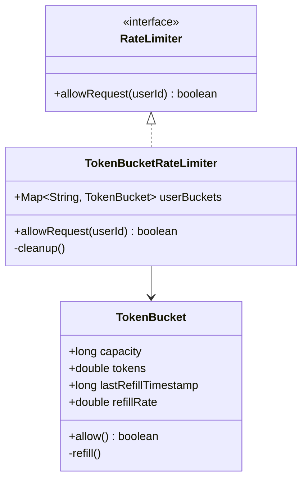

# Design Rate Limiter (Low Level)

> **Difficulty**: Medium
> **Topics**: Concurrency, Design Patterns (Strategy), Token Bucket Algorithm
> **Context**: Designing the internal class implementation (Thread-Safe), not the distributed system.

## Phase 1: Requirements Gathering

### Goals
- Design a library to limit requests based on a defined policy.
- Identify core entities: User, Request, Bucket.
- Define behavior for allowed vs. denied requests.

### 1. Who are the actors?
- **Client Application**: Sends requests that need to be rate-limited.
- **Rate Limiter System**: Decides whether to allow or block a request.

### 2. What are the must-have features? (Core)
- **User-based Limiting**: Limit requests per `userId`.
- **Configurable Rules**: Define limits (e.g., 10 requests per second).
- **Boolean Response**: Return `true` (Allowed) or `false` (Throttled).
- **Thread Safety**: Handle concurrent requests correctly.

### 3. What are the constraints?
- **Low Latency**: The check must be extremely fast (< 5ms).
- **Memory Efficiency**: Minimal memory footprint per user.
- **Concurrency**: Must handle thousands of concurrent threads.

---

## Phase 2: Use Cases

### UC1: Allow Request
**Actor**: Client App
**Flow**:
1. Client calls `allowRequest(userId)`.
2. Rate Limiter retrieves the bucket for `userId`.
3. System refills tokens based on time elapsed since last check.
4. System checks if `tokens >= 1`.
5. If yes, decrement token and return `true`.
6. If no, return `false`.

### UC2: Cleanup (Internal)
**Actor**: System
**Flow**:
1. Background process identifies inactive users (no requests for > 1 hour).
2. Remove their buckets to free memory.

---

## Phase 3: Class Diagram

### Step 1: Core Entities
- **RateLimiter** (Interface): Defines contract.
- **TokenBucketRateLimiter**: Concrete implementation using Token Buckets.
- **TokenBucket**: Holds tokens and timestamps for a specific user.

### Step 2: Relationships
- `TokenBucketRateLimiter` **implements** `RateLimiter`.
- `TokenBucketRateLimiter` **has-many** `TokenBucket` (Map: UserId -> Bucket).

### UML Diagram



---

## Phase 4: Design Patterns

### 1. Strategy Pattern
- **Description**: Defines a family of algorithms, encapsulates each one, and makes them interchangeable. Strategy lets the algorithm vary independently from clients that use it.
- **Why used**: Allows switching between different rate-limiting algorithms (Token Bucket, Leaky Bucket, Sliding Window) dynamically based on configuration without changing the client code.

### 2. Factory Pattern
- **Description**: A creational pattern that provides an interface for creating objects in a superclass, but allows subclasses to alter the type of objects that will be created.
- **Why used**: Useful for creating different types of rate limiters (e.g., `TokenBucketLimiter`, `FixedWindowLimiter`) based on user tier or configuration.

---

## Phase 5: Code Key Methods

### Java Implementation (Thread-Safe Token Bucket)

```java
import java.util.*;
import java.util.concurrent.*;

// 1. Core Bucket Entity
class TokenBucket {
    private final long capacity;
    private final double refillRate; // Tokens per second
    private double tokens;
    private long lastRefillTimestamp;

    public TokenBucket(long capacity, double refillRate) {
        this.capacity = capacity;
        this.refillRate = refillRate;
        this.tokens = capacity;
        this.lastRefillTimestamp = System.nanoTime();
    }

    // Critical section: Calculating and updating tokens must be atomic
    public synchronized boolean allow() {
        refill();
        if (tokens >= 1) {
            tokens -= 1;
            return true;
        }
        return false;
    }

    private void refill() {
        long now = System.nanoTime();
        double elapsedSeconds = (now - lastRefillTimestamp) / 1_000_000_000.0;
        double tokensToAdd = elapsedSeconds * refillRate;
        
        if (tokensToAdd > 0) {
            tokens = Math.min(capacity, tokens + tokensToAdd);
            lastRefillTimestamp = now; 
            // Note: Update timestamp only when tokens are added relative to the previous fill point
            // For strict precision, you might track 'lastRefillTimestamp' differently, but this is standard for lazy refill.
        }
    }
}

// 2. Strategy Interface
interface RateLimiter {
    boolean allowRequest(String userId);
}

// 3. Concrete Strategy
class TokenBucketRateLimiter implements RateLimiter {
    // ConcurrentHashMap handles thread-safe retrieval/insertion of buckets
    private final Map<String, TokenBucket> userBuckets = new ConcurrentHashMap<>();
    private final long capacity;
    private final double refillRate;

    public TokenBucketRateLimiter(long capacity, double refillRate) {
        this.capacity = capacity;
        this.refillRate = refillRate;
    }

    @Override
    public boolean allowRequest(String userId) {
        // computeIfAbsent is atomic: ensures only one bucket created per user even with concurrent first requests
        TokenBucket bucket = userBuckets.computeIfAbsent(userId, k -> new TokenBucket(capacity, refillRate));
        return bucket.allow();
    }
}

// 4. Client Code
public class RateLimiterService {
    public static void main(String[] args) throws InterruptedException {
        // 10 tokens max, refill 1 token/sec
        RateLimiter limiter = new TokenBucketRateLimiter(10, 1);

        String user = "User1";
        
        // Simulate bursts
        System.out.println("Processing burst...");
        for (int i = 0; i < 12; i++) {
            boolean allowed = limiter.allowRequest(user);
            System.out.println("Request " + (i+1) + ": " + (allowed ? "Allowed" : "Denied"));
        }
        
        // Wait and retry
        System.out.println("Waiting 2 seconds...");
        Thread.sleep(2000); // Wait 2s -> Refill 2 tokens
        System.out.println("Request after wait: " + (limiter.allowRequest(user) ? "Allowed" : "Denied"));
    }
}
```

---

## Phase 6: Discussion

### Concurrency
**Q: Why `synchronized` on `allow()`?**
- A: To prevent race conditions where two threads read `tokens=1`, both decrement, and tokens become negative. The lock ensures atomicity of verify-and-decrement.

### Distributed Environments
**Q: How to scale to multiple servers?**
- A: Local memory (HashMap) won't work if requests for the same user hit different servers.
- **Solution**: Use **Redis** with **Lua Scripts**. Lua scripts execute atomically in Redis, performing the `get tokens -> refill -> decrement -> set tokens` logic in one step.

### Memory Optimization
**Q: How to handle millions of users?**
- A: The current map grows indefinitely. Implement a cleanup strategy:
    - **Background Thread**: Scan map periodically and remove keys with `lastRefillTimestamp` > 1 hour ago.
    - **LRU Cache**: Use a Guava Cache or similar with `expireAfterAccess`.

---

## SOLID Principles Checklist

- **S (Single Responsibility)**: `TokenBucket` handles logic for one user. `TokenBucketRateLimiter` manages mapping of users to buckets.
- **O (Open/Closed)**: Can add new Rate Limiters (e.g., `SlidingWindowRateLimiter`) implementing `RateLimiter` interface.
- **L (Liskov Substitution)**: `TokenBucketRateLimiter` can stand in for `RateLimiter`.
- **I (Interface Segregation)**: `RateLimiter` interface is simple (one method).
- **D (Dependency Inversion)**: Client depends on `RateLimiter` abstraction.
