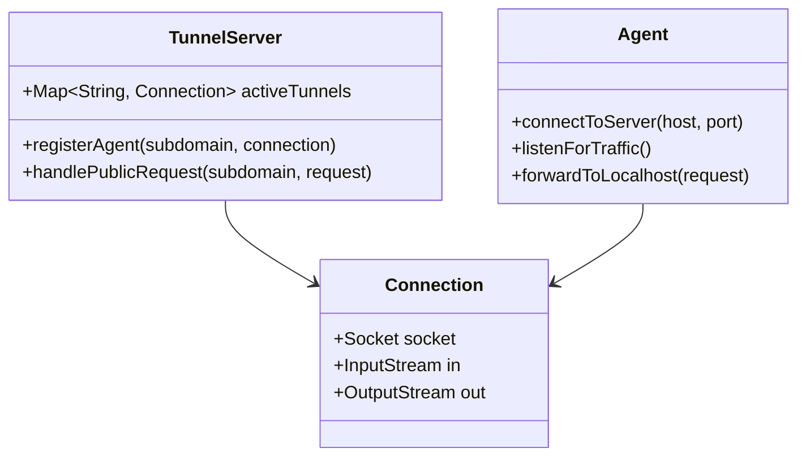

# Design Tunneling Tool (Ngrok)

> **Difficulty**: Hard  
> **Topics**: Networking, AsyncIO, Multiplexing, Reverse Tunneling  
> **Similar**: Ngrok, Cloudflare Tunnel

## Problem Statement

Expose a local web server (localhost:8080) to the public internet (myapp.tunnel.com) without port forwarding.
- **Challenges**: NAT traversal (Inbound blocked), Multiplexing multiple requests over one connection.

## Architecture: Reverse Tunnel

1.  **Agent (Client)** connects OUTBOUND to **Tunnel Server** (Cloud).
    *   Since it's outbound, NAT/Firewall allows it.
    *   Connection is persistent (TCP or WebSocket).
2.  **Public User** hits `myapp.tunnel.com`.
3.  **Tunnel Server** receives request, wraps it in a packet, and sends it *down* the persistent connection to Agent.
4.  **Agent** unwraps, hits `localhost:8080`, gets response, and sends it back *up*.

## Java Implementation (Reverse Tunnel)

#### Class Diagram



#### Flow Chart: Architecture

```mermaid
flowchart TD
    subgraph Cloud [Tunnel Server]
    A[Public User] -->|HTTP Request| B[Tunnel Entry Point]
    B -->|Lookup Subdomain| C{Is Agent Connected?}
    end
    
    subgraph Local [User Machine]
    D[Agent] -->|Persistent TCP| C
    end
    
    C -- Yes -->|Forward Request| D
    D -->|Forward to Localhost| E[Local Web Server :8080]
    E -->|Response| D
    D -->|Send Back| B
    B -->|HTTP Response| A
```

#### Code (Concept)

```java
import java.io.*;
import java.net.*;
import java.util.concurrent.*;

// 1. Tunnel Server (Cloud)
class TunnelServer {
    // Subdomain -> Agent Connection
    private static Map<String, Socket> tunnels = new ConcurrentHashMap<>();

    public static void startServer(int port) throws IOException {
        ServerSocket serverSocket = new ServerSocket(port);
        System.out.println("Tunnel Server listening on port " + port);

        while (true) {
            Socket clientSocket = serverSocket.accept();
            new Thread(() -> handleConnection(clientSocket)).start();
        }
    }

    private static void handleConnection(Socket clientSocket) {
        try {
            BufferedReader in = new BufferedReader(new InputStreamReader(clientSocket.getInputStream()));
            String line = in.readLine();
            
            if (line.startsWith("REGISTER:")) {
                String subdomain = line.split(":")[1];
                tunnels.put(subdomain, clientSocket);
                System.out.println("Registered tunnel: " + subdomain);
            } else if (line.startsWith("GET /")) {
                // Public Request Logic (Simulated)
                // In reality, this would filter by Host header
                handlePublicRequest(clientSocket);
            }
        } catch (IOException e) {
            e.printStackTrace();
        }
    }
    
    // Simplified forwarding logic
    private static void handlePublicRequest(Socket publicSocket) {
        // Assume request is for "demo"
        Socket agentSocket = tunnels.get("demo");
        if(agentSocket != null) {
            // Forward bytes from publicSocket to agentSocket
            // Forward bytes from agentSocket to publicSocket
            // This requires async IO or separate threads
        }
    }
}

// 2. Tunnel Agent (Local)
class TunnelAgent {
    public static void start(String serverHost, int serverPort, int localPort) {
        try (Socket tunnelSocket = new Socket(serverHost, serverPort)) {
            PrintWriter out = new PrintWriter(tunnelSocket.getOutputStream(), true);
            
            // 1. Handshake
            out.println("REGISTER:demo");
            
            // 2. Listen for forwarded requests
            InputStream tunnelIn = tunnelSocket.getInputStream();
            byte[] buffer = new byte[4096];
            while (true) {
                int bytesRead = tunnelIn.read(buffer);
                if (bytesRead == -1) break; // Disconnected
                
                // 3. Forward to Localhost
                String response = forwardToLocalhost(Arrays.copyOf(buffer, bytesRead), localPort);
                
                // 4. Send Response back to Tunnel
                out.println(response);
            }
        } catch (IOException e) {
            e.printStackTrace();
        }
    }

    private static String forwardToLocalhost(byte[] requestData, int localPort) {
        // Logic to open socket to localhost:localPort, write requestData, read response
        return "HTTP/1.1 200 OK\r\n\r\nHello from Localhost";
    }
}
```

```java
// Main entry point for demonstration
public class NgrokClone {
    public static void main(String[] args) {
        if(args.length > 0 && args[0].equals("server")) {
            try { TunnelServer.startServer(9090); } catch (Exception e){}
        } else {
            TunnelAgent.start("localhost", 9090, 8080);
        }
    }
}
```

## Key Design Challenges

1.  **Multiplexing (HOL Blocking)**: 
    *   In simple TCP, one request blocks the pipe.
    *   **Solution**: Use a framing protocol. `[RequestID | Length | Payload]`. Agent matches Response ID to Request ID. This allows async processing of multiple requests over one TCP socket.
2.  **Disconnection**:
    *   Agent needs a `while True` loop with exponential backoff to reconnect.
    *   Heartbeats (Ping/Pong) to keep NAT mapping alive.
3.  **Security**:
    *   Public Server does TLS termination (HTTPS).
    *   Tunnel sends plain HTTP (or re-encrypted) to Agent.
