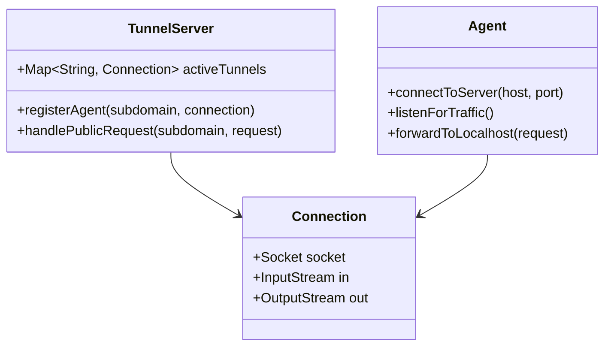

# Design Tunneling Tool (Ngrok)

> **Difficulty**: Hard
> **Topics**: Networking, AsyncIO, Multiplexing, Reverse Tunneling
> **Key Concepts**: Socket Programming, NAT Traversal, Multiplexing.

## Phase 1: Requirements Gathering

### Goals
- Design a service to expose a local web server (localhost:8080) to the public internet (myapp.tunnel.com).
- Bypass NAT/Firewalls without manual port forwarding.

### 1. Who are the actors?
- **Agent (Client)**: Runs on developer's machine.
- **Tunnel Server**: Runs in the cloud, accepts public traffic.
- **Public User**: Accesses the public URL.

### 2. What are the must-have features? (Core)
- **Reverse Tunneling**: Agent initiates connection to Server (Outbound allowed).
- **Public Endpoint**: Values like `*.tunnel.com` map to specific Agents.
- **Traffic Forwarding**: HTTP requests on Cloud are forwarded to Localhost.

### 3. What are the constraints?
- **Latency**: Minimal overhead.
- **Connection**: Must be persistent (TCP/WebSocket).

---

## Phase 2: Use Cases

### UC1: Agent Connects
**Actor**: Agent
**Flow**:
1. Agent starts: `ngrok http 8080`.
2. Agent connects to Tunnel Server via TCP (Port 4443).
3. Server assigns subdomain `ran-dom.tunnel.com`.
4. Connection remains open (Heartbeats).

### UC2: Public Request
**Actor**: Public User
**Flow**:
1. User hits `ran-dom.tunnel.com`.
2. Tunnel Server identifies the active Socket Connection for `ran-dom`.
3. Server writes raw request bytes to the Socket.
4. Agent reads bytes, opens connection to `localhost:8080`.
5. Agent proxies request/response.

---

## Phase 3: Class Diagram

### Step 1: Core Entities
- **TunnelServer**: Manages registry of active tunnels.
- **Agent**: The local process.
- **Connection**: Wrapper around the persistent TCP socket.
- **TunnelSession**: State of a specific tunnel.

### UML Diagram


```mermaid
classDiagram
    class TunnelServer {
        +Map~String, Connection~ activeTunnels
        +registerAgent(subdomain, connection)
        +handlePublicRequest(subdomain, request)
    }

    class Agent {
        +connectToServer(host, port)
        +listenForTraffic()
        +forwardToLocalhost(request)
    }

    class Connection {
        +Socket socket
        +InputStream in
        +OutputStream out
    }
    
    TunnelServer --> Connection
    Agent --> Connection
```

---

## Phase 4: Design Patterns

### 1. Reverse Proxy Pattern
- **Description**: A server that sits between client devices and a web server, forwarding client requests to the web server and returning the server's responses.
- **Why used**: The Tunnel Server acts as a gateway (Reverse Proxy), accepting public traffic on `tunnel.com` and forwarding it to the hidden Agent. It masks the identity and location of the origin server (localhost).

### 2. Multiplexing (IO Pattern)
- **Description**: Transmitting multiple signals or streams of information over a single communication channel.
- **Why used**: To prevent "Head-of-Line Blocking" and resource exhaustion, we send multiple HTTP requests over a single TCP connection between Agent and Server. This requires independent frames/streams.

---

## Phase 5: Code Key Methods

### Java Implementation

```java
import java.io.*;
import java.net.*;
import java.util.concurrent.*;
import java.util.*;

// 1. Tunnel Server (Cloud)
class TunnelServer {
    // Subdomain -> Agent Connection
    private static Map<String, Socket> tunnels = new ConcurrentHashMap<>();

    public static void startServer(int port) throws IOException {
        ServerSocket serverSocket = new ServerSocket(port);
        System.out.println("Tunnel Server listening on port " + port);

        while (true) {
            Socket clientSocket = serverSocket.accept();
            new Thread(() -> handleConnection(clientSocket)).start();
        }
    }

    private static void handleConnection(Socket clientSocket) {
        try {
            BufferedReader in = new BufferedReader(new InputStreamReader(clientSocket.getInputStream()));
            // Simple protocol: First line is command
            String line = in.readLine();
            
            if (line != null && line.startsWith("REGISTER:")) {
                String subdomain = line.split(":")[1];
                tunnels.put(subdomain, clientSocket);
                System.out.println("Registered tunnel for: " + subdomain);
            } 
            // In real impl, we'd loop here reading frames
        } catch (IOException e) {
            e.printStackTrace();
        }
    }
    
    // Simulate a public request coming in (e.g., from Nginx)
    public static void mockPublicRequest(String subdomain, String payload) {
        Socket agentSocket = tunnels.get(subdomain);
        if(agentSocket != null) {
            try {
                PrintWriter out = new PrintWriter(agentSocket.getOutputStream(), true);
                out.println(payload); // Forward to Agent
                System.out.println("Forwarded to agent: " + payload);
            } catch (IOException e) {
                e.printStackTrace();
            }
        } else {
            System.out.println("404 Tunnel Not Found");
        }
    }
}

// 2. Tunnel Agent (Local)
class TunnelAgent {
    public static void start(String serverHost, int serverPort, int localServicePort) {
        try (Socket tunnelSocket = new Socket(serverHost, serverPort)) {
            PrintWriter out = new PrintWriter(tunnelSocket.getOutputStream(), true);
            BufferedReader in = new BufferedReader(new InputStreamReader(tunnelSocket.getInputStream()));
            
            // 1. Handshake
            out.println("REGISTER:demo");
            
            System.out.println("Connected to Tunnel Server. Forwarding to localhost:" + localServicePort);

            // 2. Listen for forwarded requests
            String line;
            while ((line = in.readLine()) != null) {
                System.out.println("Received Request: " + line);
                
                // 3. Forward to Localhost (concept)
                String response = forwardToLocalService(line, localServicePort);
                
                // 4. Send Response back (Not impl in this simple concept)
            }
        } catch (IOException e) {
            e.printStackTrace();
        }
    }

    private static String forwardToLocalService(String requestData, int port) {
        // Logic: Open new socket to localhost:port, write data, read response
        return "HTTP/1.1 200 OK\r\n\r\nHello from Local";
    }
}

// 3. Main
public class NgrokClone {
    public static void main(String[] args) throws InterruptedException {
        // Run Server
        new Thread(() -> {
            try { TunnelServer.startServer(9090); } catch (IOException e) {}
        }).start();

        Thread.sleep(1000);

        // Run Agent
        new Thread(() -> {
            TunnelAgent.start("localhost", 9090, 8080);
        }).start();

        Thread.sleep(1000);

        // Simulate User
        TunnelServer.mockPublicRequest("demo", "GET / HTTP/1.1");
    }
}
```

---

## Phase 6: Discussion

### NAT Traversal
**Q: "Why does this work behind Firewalls?"**
- A: "Firewalls typically block **Inbound** connections but allow **Outbound** connections (HTTP/TCP). The Agent initiates the Outbound connection. Once established, the socket is bidirectional."

### Multiplexing
**Q: "Problem with simple TCP forwarding?"**
- A: "**Head-of-Line Blocking**. If one request takes 10s, the pipe is blocked.
    - **Solution**: Break data into Frames `[StreamID][Length][Data]`.
    - Server sends Stream 1 frame, then Stream 2 frame.
    - Agent reassembles frames by ID. Allows concurrent requests on one socket."

### Security
**Q: "How to secure the tunnel?"**
- A: "**Mutual TLS (mTLS)**. Agent and Server authenticate each other with certificates. Traffic inside the tunnel is encrypted. Also, implement Rate Limiting per tunnel."

---

## SOLID Principles Checklist

- **S (Single Responsibility)**: `TunnelServer` handles Public->Agent routing, `Agent` handles Tunnel->Local routing.
- **O (Open/Closed)**: Add new Protocols (TCP/UDP tunnel) by extending `Connection`.
- **L (Liskov Substitution)**: N/A.
- **I (Interface Segregation)**: N/A.
- **D (Dependency Inversion)**: N/A.
