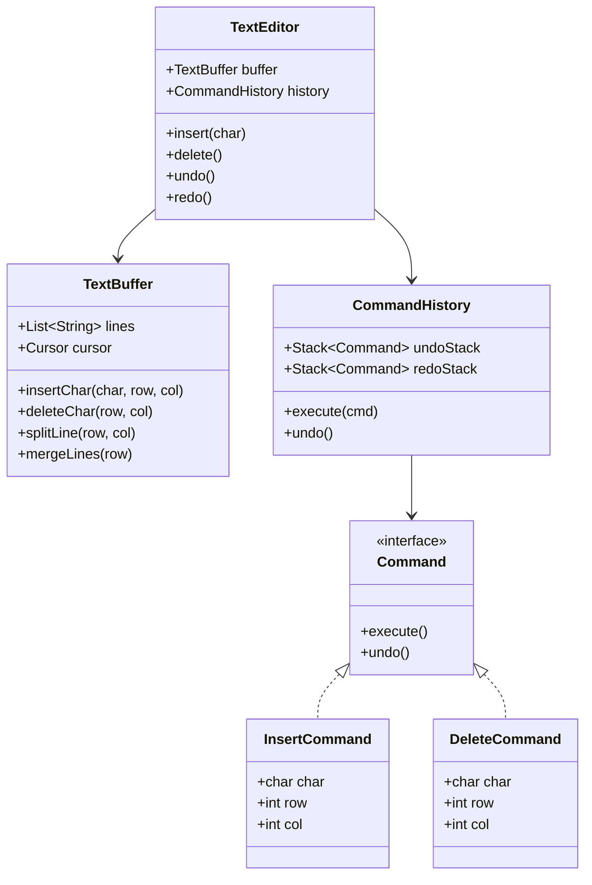

# Design Text Editor (Sublime Text / VS Code)

> **Difficulty**: Hard  
> **Topics**: Data Structures (Gap Buffer/Rope), Command Pattern, Flyweight Pattern  
> **Features**: Insert, Delete, Undo/Redo, Syntax Highlighting

## Problem Statement

Design a text editor core.
- **Core Actions**: Insert text, Delete text, Move cursor.
- **Undo/Redo**: Infinite history.
- **Efficiency**: Must handle large files and fast typing.

## Core Data Structure (The "Secret Sauce")

A simple `String` is $O(N)$ for insertion. Real editors use:

1.  **Gap Buffer** (Emacs): Array with a "gap" at cursor. Insert is $O(1)$. Moving cursor is $O(N)$ (shift gap).
    *   `[H, E, L, L, O, _, _, _, W, O, R, L, D]`
2.  **Rope** (Heavyweights): Binary tree of strings. Good for huge files.
3.  **List of Lines** (Our Choice): Linked List or Array of Strings (one per line). Vertical move is $O(1)$.

## Design Patterns

1.  **Command Pattern**: Encapsulate actions (`InsertCommand`, `DeleteCommand`) to support Undo/Redo.
2.  **Flyweight Pattern**: For syntax highlighting. Don't create an object for every 'A' character. Reuse `Glyph('A', font)`.
3.  **Memento Pattern**: Store state snapshots (optional, Command is usually enough).

## Java Implementation (Command Pattern)

#### Class Diagram



#### Flow Chart: Insert Character

```mermaid
flowchart TD
    A[User Type 'A'] --> B[Create InsertCommand('A')]
    B --> C[Execute Command]
    C --> D[Buffer: Update Text at Cursor]
    D --> E[Move Cursor Forward]
    E --> F[Push Command to Undo Stack]
    F --> G[Clear Redo Stack]
    G --> H[Update UI Render]
```

#### Code

```java
import java.util.*;

// 1. Model: Text Buffer & Cursor
class Cursor {
    int row, col;
    public Cursor(int r, int c) { row = r; col = c; }
}

class TextBuffer {
    List<StringBuilder> lines;
    Cursor cursor;

    public TextBuffer() {
        lines = new ArrayList<>();
        lines.add(new StringBuilder());
        cursor = new Cursor(0, 0);
    }

    public void insertChar(char c) {
        StringBuilder line = lines.get(cursor.row);
        line.insert(cursor.col, c);
        cursor.col++;
    }

    public void insertNewLine() {
        StringBuilder currentLine = lines.get(cursor.row);
        String suffix = currentLine.substring(cursor.col);
        currentLine.delete(cursor.col, currentLine.length());
        
        lines.add(cursor.row + 1, new StringBuilder(suffix));
        cursor.row++;
        cursor.col = 0;
    }

    public void deleteChar(int r, int c) {
        // Simplified delete logic
        lines.get(r).deleteCharAt(c);
        cursor.col = c;
        cursor.row = r;
    }
    
    // ... Additional helper methods for split/merge lines used by commands
}

// 2. Command Pattern
interface Command {
    void execute();
    void undo();
}

class InsertCommand implements Command {
    TextBuffer buffer;
    char c;
    int prevRow, prevCol;

    public InsertCommand(TextBuffer buffer, char c) {
        this.buffer = buffer;
        this.c = c;
    }

    public void execute() {
        prevRow = buffer.cursor.row;
        prevCol = buffer.cursor.col;
        if (c == '\n') buffer.insertNewLine();
        else buffer.insertChar(c);
    }

    public void undo() {
        // Simplified undo logic
        // Real implementation needs to handle merging lines for '\n'
        if(c != '\n') {
            buffer.deleteChar(prevRow, prevCol);
        }
    }
}

// 3. Invoker (History)
class CommandHistory {
    Stack<Command> undoStack = new Stack<>();
    Stack<Command> redoStack = new Stack<>();

    public void execute(Command cmd) {
        cmd.execute();
        undoStack.push(cmd);
        redoStack.clear();
    }

    public void undo() {
        if (!undoStack.isEmpty()) {
            Command cmd = undoStack.pop();
            cmd.undo();
            redoStack.push(cmd);
        }
    }
}

// 4. Client (Editor)
public class TextEditor {
    TextBuffer buffer = new TextBuffer();
    CommandHistory history = new CommandHistory();

    public void type(char c) {
        Command cmd = new InsertCommand(buffer, c);
        history.execute(cmd);
        printBuffer();
    }

    public void undo() {
        history.undo();
        printBuffer();
    }

    private void printBuffer() {
        System.out.println("--- Editor ---");
        for(StringBuilder line : buffer.lines) System.out.println(line);
        System.out.println("--------------");
    }

    public static void main(String[] args) {
        TextEditor editor = new TextEditor();
        editor.type('H');
        editor.type('i');
        editor.undo(); // Removes 'i'
    }
}
```

## Interview Q&A

**Q: "How to search efficiently?"**
- A: "KMP Algorithm inside lines. For massive files, don't load all into RAM (use Memory Mapping / Mmap)."

**Q: "How to handle a 10GB file?"**
- A: "Virtual Proxy. Load only visible lines (Viewport) + buffer. Page in other parts as user scrolls."
