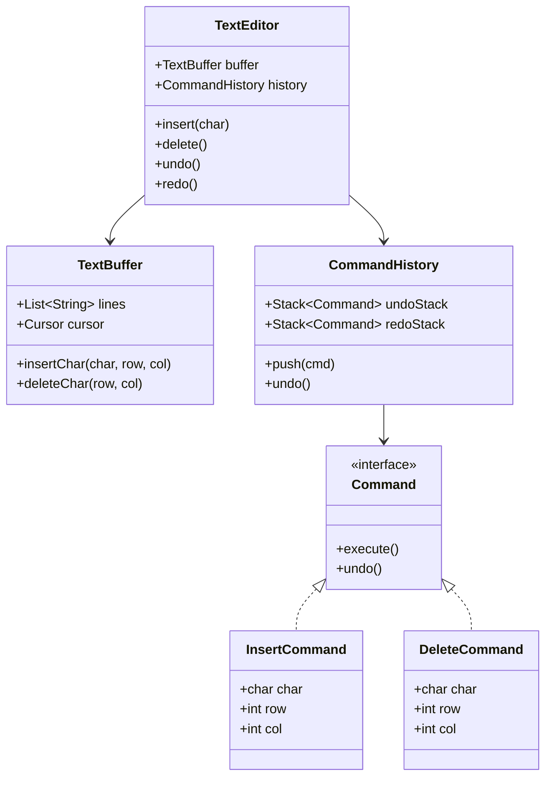

# Design Text Editor (Sublime Text / VS Code)

> **Difficulty**: Hard
> **Topics**: Data Structures (Gap Buffer/Rope), Command Pattern, Flyweight Pattern
> **Key Concepts**: Gap Buffer, Rope, Piece Table, Command Pattern.

## Phase 1: Requirements Gathering

### Goals
- Design the core engine of a text editor.
- Support efficient text manipulation and undo/redo operations.

### 1. Who are the actors?
- **User**: Types text, moves cursor, executes commands (copy/paste).

### 2. What are the must-have features? (Core)
- **Edit**: Insert/Delete characters at cursor position.
- **Navigation**: Move cursor (Arrows, Home, End).
- **History**: Unlimited Undo/Redo.
- **Selection**: Highlight text (optional but implied).

### 3. What are the constraints?
- **Latency**: Typing must be instantaneous (<16ms).
- **Memory**: Handle large files (GBs) without loading everything into RAM (if possible).

---

## Phase 2: Use Cases

### UC1: User Types Character
**Actor**: User
**Flow**:
1. User presses 'A'.
2. System creates `InsertCommand('A', cursor_pos)`.
3. Command is executed (Buffer modified).
4. Cursor moves forward.
5. Command pushed to Undo Stack. Redo Stack cleared.

### UC2: Undo Action
**Actor**: User
**Flow**:
1. User presses Ctrl+Z.
2. System pops last command from Undo Stack.
3. System calls `cmd.undo()`.
4. Command pushed to Redo Stack.
5. UI refreshes.

---

## Phase 3: Class Diagram

### Step 1: Core Entities
- **TextEditor**: Facade.
- **TextBuffer**: The data structure holding the text.
- **Command**: Interface for actions.
- **HistoryManager**: Stack wrapper.

### UML Diagram


```mermaid
classDiagram
    class TextEditor {
        +TextBuffer buffer
        +CommandHistory history
        +insert(char)
        +delete()
        +undo()
        +redo()
    }

    class TextBuffer {
        +List~String~ lines
        +Cursor cursor
        +insertChar(char, row, col)
        +deleteChar(row, col)
    }

    class Command {
        <<interface>>
        +execute()
        +undo()
    }

    class InsertCommand {
        +char char
        +int row
        +int col
    }

    class DeleteCommand {
        +char char
        +int row
        +int col
    }

    class CommandHistory {
        +Stack~Command~ undoStack
        +Stack~Command~ redoStack
        +push(cmd)
        +undo()
    }

    TextEditor --> TextBuffer
    TextEditor --> CommandHistory
    CommandHistory --> Command
    Command <|.. InsertCommand
    Command <|.. DeleteCommand
```

---

## Phase 4: Design Patterns

### 1. Command Pattern
- **Description**: Encapsulates a request as an object, thereby letting you parameterize clients with different requests, queue or log requests, and support undoable operations.
- **Why used**: Crucial for Undo/Redo. Every action (Type 'A', Backspace, Paste) is a Command object stored in a stack. To Undo, we pop the command and call its `inverse()` method.

### 2. Flyweight Pattern
- **Description**: Uses sharing to support large numbers of fine-grained objects efficiently.
- **Why used**: A text editor renders thousands of characters. Instead of creating a heavy object for every 'a' on screen with its own font/color data, we share `Glyph` instances (Intrinsic state) and pass positions (Extrinsic state) at render time.

### 3. Gap Buffer (Data Structure Pattern)
- **Description**: A dynamic array that allows O(1) insertions and deletions at a specific "gap" position.
- **Why used**: Most edits happen at the cursor. A standard array requires O(N) shifting for every keystroke. A Gap Buffer moves the "empty space" to the cursor, making typing instantaneous.

---

## Phase 5: Code Key Methods

### Java Implementation (Command Pattern + List of Lines)

```java
import java.util.*;

// 1. Model: Text Buffer & Cursor
class Cursor {
    int row, col;
    public Cursor(int r, int c) { row = r; col = c; }
    
    // Copy constructor for capturing state
    public Cursor(Cursor other) { row = other.row; col = other.col; }
}

class TextBuffer {
    // List of Lines strategy (Easier to implement than GapBuffer for interviews)
    List<StringBuilder> lines;
    Cursor cursor;

    public TextBuffer() {
        lines = new ArrayList<>();
        lines.add(new StringBuilder());
        cursor = new Cursor(0, 0);
    }

    public void insertChar(char c) {
        if (c == '\n') {
            insertNewLine();
        } else {
            lines.get(cursor.row).insert(cursor.col, c);
            cursor.col++;
        }
    }

    private void insertNewLine() {
        StringBuilder currentLine = lines.get(cursor.row);
        String suffix = currentLine.substring(cursor.col);
        currentLine.delete(cursor.col, currentLine.length());
        
        lines.add(cursor.row + 1, new StringBuilder(suffix));
        cursor.row++;
        cursor.col = 0;
    }

    public void deleteChar() {
        if (cursor.col > 0) {
            lines.get(cursor.row).deleteCharAt(cursor.col - 1);
            cursor.col--;
        } else if (cursor.row > 0) {
            // Merge with previous line
            StringBuilder current = lines.remove(cursor.row);
            StringBuilder prev = lines.get(cursor.row - 1);
            int newCol = prev.length();
            prev.append(current);
            cursor.row--;
            cursor.col = newCol;
        }
    }
}

// 2. Command Pattern
interface Command {
    void execute();
    void undo();
}

class InsertCommand implements Command {
    private TextBuffer buffer;
    private char c;
    private Cursor startCursor;

    public InsertCommand(TextBuffer buffer, char c) {
        this.buffer = buffer;
        this.c = c;
    }

    public void execute() {
        // Save state before execution for accurate undo (optional, simplified here)
        this.startCursor = new Cursor(buffer.cursor); 
        buffer.insertChar(c);
    }

    public void undo() {
        // Restore cursor
        buffer.cursor.row = this.startCursor.row;
        buffer.cursor.col = this.startCursor.col;
        
        // Inverse operation
        // Note: Real impl needs more robust delete handling for Newlines
        if (c == '\n') {
            // Complex logic to merge lines inverted
            // For interview, explain concept or implement basic char delete
             buffer.deleteChar(); // Assumes cursor is now at the start of next line/char
        } else {
             // Move cursor forward 1 to delete the char we just added
             buffer.cursor.col++; 
             buffer.deleteChar();
        }
    }
}

// 3. Invoker (History)
class CommandHistory {
    Stack<Command> undoStack = new Stack<>();
    Stack<Command> redoStack = new Stack<>();

    public void execute(Command cmd) {
        cmd.execute();
        undoStack.push(cmd);
        redoStack.clear();
    }

    public void undo() {
        if (!undoStack.isEmpty()) {
            Command cmd = undoStack.pop();
            cmd.undo();
            redoStack.push(cmd);
        }
    }
    
    public void redo() {
        if (!redoStack.isEmpty()) {
            Command cmd = redoStack.pop();
            cmd.execute();
            undoStack.push(cmd);
        }
    }
}

// 4. Client (Editor)
public class TextEditor {
    TextBuffer buffer = new TextBuffer();
    CommandHistory history = new CommandHistory();

    public void type(char c) {
        Command cmd = new InsertCommand(buffer, c);
        history.execute(cmd);
        printBuffer();
    }

    public void undo() {
        System.out.println("[Undo]");
        history.undo();
        printBuffer();
    }

    private void printBuffer() {
        System.out.println("--- Editor ---");
        for(StringBuilder line : buffer.lines) System.out.println(line);
        System.out.println("   Cursor: (" + buffer.cursor.row + "," + buffer.cursor.col + ")");
        System.out.println("--------------");
    }

    public static void main(String[] args) {
        TextEditor editor = new TextEditor();
        editor.type('H');
        editor.type('i');
        editor.type('\n');
        editor.type('W');
        
        editor.undo(); // Removes 'W'
        editor.undo(); // Removes '\n' (Merges lines) -> "Hi"
    }
}
```

---

## Phase 6: Discussion

### Data Structure Choice
**Q: "Why Gap Buffer over Array?"**
- A: "Gap Buffer makes insertions/deletions at the cursor $O(1)$. Array is $O(N)$ because you shift all subsequent characters. Gap Buffer is perfect for active editing (locality of reference)."

### Handling Large Files
**Q: "How to handle a 10GB file?"**
- A: "Use **Piece Table** or **Rope**. Also, **Memory Mapping (mmap)**. Load only the viewport (what user sees) + a buffer zone into RAM. Don't read whole file."

### Search
**Q: "How to search efficiently?"**
- A: "KMP Algorithm for pattern matching. If using Rope, search can be parallelized across sub-nodes."

---

## SOLID Principles Checklist

- **S (Single Responsibility)**: `TextBuffer` manages state, `Command` manages action logic, `History` manages stacks.
- **O (Open/Closed)**: Add `PasteCommand`, `SelectCommand` easily.
- **L (Liskov Substitution)**: N/A.
- **I (Interface Segregation)**: N/A.
- **D (Dependency Inversion)**: `CommandHistory` expects `Command` interface.
