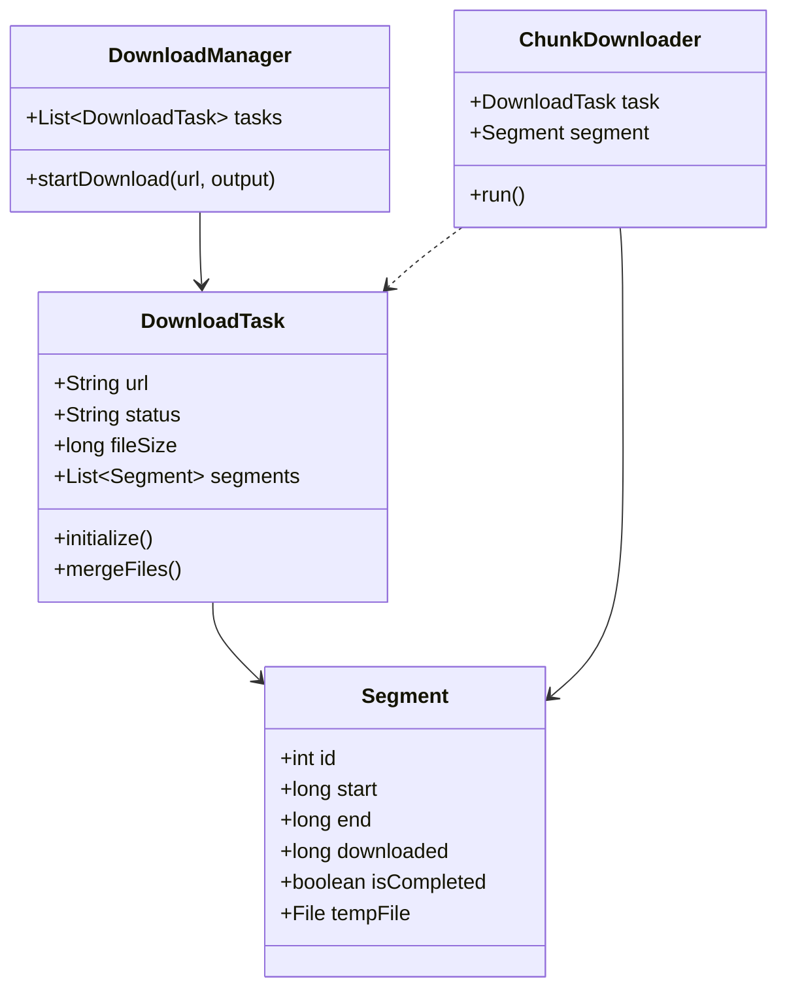

# Design Internet Download Manager (IDM)

> **Difficulty**: Hard
> **Topics**: Concurrency, Multi-threading, HTTP Range Headers, File I/O
> **Key Concepts**: Range Requests, RandomAccessFile, Thread Pooling.

## Phase 1: Requirements Gathering

### Goals
- Design a download manager that accelerates downloads using parallel connections.
- Support pausing, resuming, and error recovery.

### 1. Who are the actors?
- **User**: Starts downloads, pauses/resumes.
- **Worker Threads**: Independent threads downloading chunks.
- **Server**: HTTP Server hosting the file (must support Range requests).

### 2. What are the must-have features? (Core)
- **Parallelism**: Split file into N segments.
- **Resumability**: Save progress state to disk.
- **Assembly**: Merge segments into final file.

### 3. What are the constraints?
- **Disk I/O**: Writing to same file concurrently requires locking or `RandomAccessFile`.
- **Network**: Server might ban too many connections.

---

## Phase 2: Use Cases

### UC1: Start Download
**Actor**: User
**Flow**:
1. User provides URL.
2. Manager sends `HEAD` request to get `Content-Length`.
3. Checks `Accept-Ranges: bytes`.
4. Calculates segment size (Size / N).
5. Creates N `Segment` objects (Start, End, Downloaded=0).
6. Starts N `Worker` threads.

### UC2: Worker Progress
**Actor**: Worker Thread
**Flow**:
1. Worker sends `GET` with header `Range: bytes=Start-End`.
2. Server responds with `206 Partial Content`.
3. Worker streams bytes to `temp_part_k` file (or offsets in main file).
4. Updates `downloaded` count in shared state.
5. If interrupted, saves state.

---

## Phase 3: Class Diagram

### Step 1: Core Entities
- **DownloadManager**: Facade.
- **DownloadTask**: State of one file download.
- **Segment**: Metadata for a chunk.
- **Worker**: Runnable.

### UML Diagram



---

## Phase 4: Design Patterns

### 1. Master-Worker Pattern (Parallel Processing)
- **Description**: A controller (Master) distributes identical tasks to multiple worker threads and aggregates the results.
- **Why used**: To saturate the bandwidth, the Manager splits a large file into N segments. It assigns each segment to a Worker thread. The Manager then waits (Barrier) for all to finish before merging the parts.

### 2. State Pattern
- **Description**: Allows an object to alter its behavior when its internal state changes.
- **Why used**: A Download Task has complex states (`PENDING`, `DOWNLOADING`, `PAUSED`, `FAILED`, `COMPLETED`). The behavior of clicking "Start/Resume" depends entirely on the current state (e.g., Resume only works if Paused).

---

## Phase 5: Code Key Methods

### Java Implementation

```java
import java.io.*;
import java.net.HttpURLConnection;
import java.net.URL;
import java.util.*;
import java.util.concurrent.*;
import java.util.concurrent.atomic.AtomicBoolean;

enum DownloadStatus {
    PENDING, DOWNLOADING, COMPLETED, FAILED
}

// 1. Segment Entity
class Segment {
    int id;
    long start;
    long end;
    long downloaded;
    boolean isCompleted;
    File tempFile;

    public Segment(int id, long start, long end, File tempFile) {
        this.id = id;
        this.start = start;
        this.end = end;
        this.tempFile = tempFile;
        this.isCompleted = false;
        this.downloaded = 0;
    }
}

// 2. Worker Thread
class ChunkDownloader implements Runnable {
    private String fileUrl;
    private Segment segment;
    private CountDownLatch latch;
    private AtomicBoolean failed;

    public ChunkDownloader(String fileUrl, Segment segment, CountDownLatch latch, AtomicBoolean failed) {
        this.fileUrl = fileUrl;
        this.segment = segment;
        this.latch = latch;
        this.failed = failed;
    }

    @Override
    public void run() {
        if (segment.isCompleted) {
            latch.countDown();
            return;
        }

        // Resume from where we left off
        long startByte = segment.start + segment.downloaded;
        if (startByte >= segment.end) {
            segment.isCompleted = true;
            latch.countDown();
            return;
        }

        try {
            URL url = new URL(fileUrl);
            HttpURLConnection conn = (HttpURLConnection) url.openConnection();
            // Critical: Range Header
            String range = String.format("bytes=%d-%d", startByte, segment.end);
            conn.setRequestProperty("Range", range);
            
            System.out.println("Thread-" + segment.id + " downloading: " + range);

            try (InputStream in = conn.getInputStream();
                 // rw mode allows seeking
                 RandomAccessFile raf = new RandomAccessFile(segment.tempFile, "rw")) {
                
                raf.seek(segment.downloaded); // Seek to end of existing content
                byte[] buffer = new byte[4096];
                int bytesRead;
                
                while ((bytesRead = in.read(buffer)) != -1) {
                    raf.write(buffer, 0, bytesRead);
                    segment.downloaded += bytesRead;
                }
            }
            
            segment.isCompleted = true;
            System.out.println("Thread-" + segment.id + " finished.");

        } catch (IOException e) {
            System.err.println("Thread-" + segment.id + " failed: " + e.getMessage());
            failed.set(true);
        } finally {
            latch.countDown();
        }
    }
}

// 3. Task Entity & Manager Logic
class DownloadTask {
    String url;
    String outputPath;
    int numThreads;
    long fileSize;
    List<Segment> segments;
    DownloadStatus status;

    public DownloadTask(String url, String outputPath, int numThreads) {
        this.url = url;
        this.outputPath = outputPath;
        this.numThreads = numThreads;
        this.segments = new ArrayList<>();
        this.status = DownloadStatus.PENDING;
    }

    public void start() {
        try {
            // 1. Get File Size (HEAD Request)
            HttpURLConnection conn = (HttpURLConnection) new URL(url).openConnection();
            conn.setRequestMethod("HEAD");
            fileSize = conn.getContentLengthLong();
            String ranges = conn.getHeaderField("Accept-Ranges");
            
            if(fileSize <= 0) throw new RuntimeException("Invalid file size");
            System.out.println("File Size: " + fileSize + " bytes");

            // 2. Create Create Segments (Strategy: Split by Size)
            this.segments.clear();
            if (ranges == null || !ranges.equals("bytes")) {
                // Server doesn't support ranges -> Single Thread
                segments.add(new Segment(0, 0, fileSize, new File(outputPath + ".part0")));
            } else {
                long chunkSize = fileSize / numThreads;
                for (int i = 0; i < numThreads; i++) {
                    long start = i * chunkSize;
                    long end = (i == numThreads - 1) ? fileSize : (start + chunkSize - 1) ; // Inclusive end
                    segments.add(new Segment(i, start, end, new File(outputPath + ".part" + i)));
                }
            }

            // 3. Start Parallel Download
            ExecutorService executor = Executors.newFixedThreadPool(numThreads);
            CountDownLatch latch = new CountDownLatch(segments.size());
            AtomicBoolean failed = new AtomicBoolean(false);

            for (Segment seg : segments) {
                executor.submit(new ChunkDownloader(url, seg, latch, failed));
            }

            // Wait for all workers
            latch.await();
            executor.shutdown();

            if (failed.get()) {
                status = DownloadStatus.FAILED;
                System.out.println("Download Failed!");
            } else {
                mergeFiles();
                status = DownloadStatus.COMPLETED;
                System.out.println("Download Complete!");
            }

        } catch (Exception e) {
            e.printStackTrace();
            status = DownloadStatus.FAILED;
        }
    }

    private void mergeFiles() throws IOException {
        System.out.println("Merging segments...");
        try (FileOutputStream fos = new FileOutputStream(outputPath)) {
            for (Segment seg : segments) {
                try (FileInputStream fis = new FileInputStream(seg.tempFile)) {
                    byte[] buffer = new byte[4096];
                    int read;
                    while ((read = fis.read(buffer)) != -1) {
                        fos.write(buffer, 0, read);
                    }
                }
                seg.tempFile.delete(); // Cleanup temp file
            }
        }
    }
}

// 4. Main Class
public class DownloadManager {
    public static void main(String[] args) {
        String url = "https://speed.hetzner.de/100MB.bin"; // Example URL
        String output = "file.bin";
        
        // 4 Threads
        DownloadTask task = new DownloadTask(url, output, 4);
        task.start();
    }
}
```

---

## Phase 6: Discussion

### Resume Logic
**Q: "How to handle crashes?"**
- A: "Serialize the `DownloadTask` object (including `segments` list and `downloaded` bytes for each) to a JSON file on disk. On restart, load JSON, check file sizes of `.part` files, and adjust `Range: bytes=(Start+Downloaded)-End`."

### File I/O Optimization
**Q: "Why separate temp files?"**
- A: "Writing to a single file from multiple threads requires `RandomAccessFile` and careful seeking. While `RandomAccessFile` is thread-safe for different offsets, locking can still occur at OS level. Separate files avoid contention entirely, merging is sequential I/O (fast)."

### Concurrency
**Q: "Optimal Thread Pool Size?"**
- A: "Network Bound. Not CPU bound. However, too many threads = overhead + server ban. Usually 4-8 is optimal for consumer connections."

---

## SOLID Principles Checklist

- **S (Single Responsibility)**: `ChunkDownloader` downloads bytes, `DownloadTask` manages segments, `Manager` starts tasks.
- **O (Open/Closed)**: Add `FTPDownloader` by extending worker.
- **L (Liskov Substitution)**: N/A.
- **I (Interface Segregation)**: N/A.
- **D (Dependency Inversion)**: N/A.
