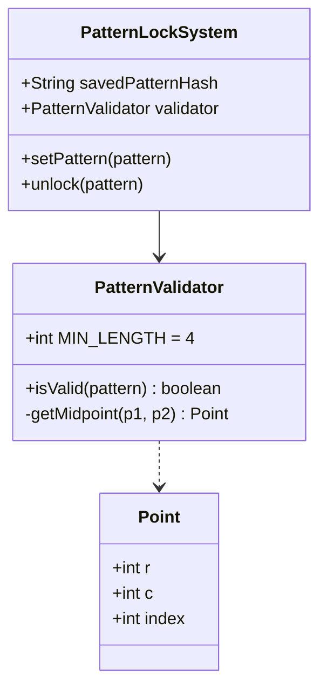

# Design Android Unlock Pattern

> **Difficulty**: Medium
> **Topics**: Graph Theory, DFS/Backtracking, Validation Logic
> **Key Concepts**: Midpoint Formula for Skip Logic, Adjacency Matrix.

## Phase 1: Requirements Gathering

### Goals
- Design the logic to validate and set the 3x3 Android Grid unlock pattern.

### 1. Who are the actors?
- **User**: Draws a pattern on the screen.
- **System**: Validates the pattern constraints.

### 2. What are the must-have features? (Core)
- **Grid**: 3x3 dots (Indices 0-8).
- **Constraints**:
    1.  Minimum 4 dots.
    2.  Each dot visited at most once.
    3.  **Skip Rule**: Connecting non-adjacent dots (e.g., 0 -> 2) is valid ONLY if the middle dot (1) was *already visited*.

### 3. What are the constraints?
- **Complexity**: $O(N!)$ validation is fine since N=9.
- **Storage**: Store hashed pattern, not raw sequence.

---

## Phase 2: Use Cases

### UC1: Set Pattern
**Actor**: User
**Flow**:
1. User connects sequence: `0 -> 3 -> 6 -> 7`.
2. System validates:
    - Length >= 4? Yes.
    - No repeats? Yes.
    - Valid moves? (0->3 adjacent, 3->6 adjacent). Yes.
3. System saves pattern hash.

### UC2: Invalid Skip
**Actor**: User
**Flow**:
1. User connects: `0 -> 2`.
2. System calculates Midpoint between 0 and 2 is 1.
3. System checks: Is 1 in `visited` set? No.
4. System rejects pattern: "Cannot skip over unvisited node".

---

## Phase 3: Class Diagram

### Step 1: Core Entities
- **PatternLockSystem**: Facade.
- **PatternValidator**: Encapsulates the complex rules.
- **Point**: Represents (r, c) or index.

### UML Diagram



---

## Phase 4: Design Patterns

### 1. Strategy Pattern
- **Description**: Defines a family of algorithms, encapsulates each one, and makes them interchangeable.
- **Why used**: Validation rules might evolve (e.g., 3x3 grid vs 4x4 grid, allow repeats vs no repeats). Strategy allows injecting different `PatternValidator` implementations without changing the `LockSystem` code.

### 2. Graph Theory (DFS)
- **Description**: Modeling the grid as a Graph where nodes are dots and edges are valid moves.
- **Why used**: Validating a pattern is essentially traversing a path in a graph. We use DFS to ensure the path doesn't visit a node twice (unless allowed) and respects the "Skip" constraints (edges exist only if intermediate node visited).

---

## Phase 5: Code Key Methods

### Java Implementation

```java
import java.util.*;

// 1. Point Entity
class Point {
    int r, c;
    int index;

    public Point(int r, int c) {
        this.r = r;
        this.c = c;
        this.index = r * 3 + c;
    }

    @Override
    public boolean equals(Object o) {
        if (this == o) return true;
        if (o == null || getClass() != o.getClass()) return false;
        Point point = (Point) o;
        return r == point.r && c == point.c;
    }

    @Override
    public int hashCode() {
        return Objects.hash(r, c);
    }
    
    @Override
    public String toString() { return "(" + r + "," + c + ")"; }
}

// 2. Validator (The Brains)
class PatternValidator {
    private static final int MIN_LENGTH = 4;

    public boolean isValid(List<Point> pattern) {
        if (pattern.size() < MIN_LENGTH) return false;

        Set<Point> visited = new HashSet<>();
        // Add first point
        visited.add(pattern.get(0));

        for (int i = 0; i < pattern.size() - 1; i++) {
            Point curr = pattern.get(i);
            Point next = pattern.get(i + 1);

            // 1. Check Revisit (Pattern itself cannot contain duplicates)
            // Note: Android actually allows revisit if it's a "crossing", but we simplify to no-revisit for Basic LLD
            if (visited.contains(next)) return false;

            // 2. Check Skip Logic
            Point intermediate = getIntermediate(curr, next);
            
            // If there IS a point strictly between curr and next
            // AND we haven't visited it yet
            // THEN it's an invalid move
            if (intermediate != null && !visited.contains(intermediate)) {
                System.out.println("Invalid Skip: " + curr + " -> " + next + " skips " + intermediate);
                return false; 
            }

            visited.add(next);
        }
        return true;
    }

    // Returns the point EXACTLY between p1 and p2, or null if adjacency/knight-move
    private Point getIntermediate(Point p1, Point p2) {
        int rowSum = p1.r + p2.r;
        int colSum = p1.c + p2.c;

        // If sum is odd, midpoint is x.5 -> No integer node in between
        // Example: (0,0) and (1,2) -> Sums (1, 2) -> Mid (0.5, 1) -> No node.
        if (rowSum % 2 != 0 || colSum % 2 != 0) {
            return null;
        }

        int midR = rowSum / 2;
        int midC = colSum / 2;
        
        // Return the midpoint
        return new Point(midR, midC);
    }
}

// 3. System
public class PatternLockSystem {
    private String savedPatternHash;
    private PatternValidator validator;

    public PatternLockSystem() {
        this.validator = new PatternValidator();
    }

    public void setPattern(List<Point> pattern) {
        if (validator.isValid(pattern)) {
            this.savedPatternHash = hashPattern(pattern);
            System.out.println("Pattern Set Successfully!");
        } else {
            System.out.println("Invalid Pattern!");
        }
    }

    public boolean unlock(List<Point> inputPattern) {
        if (savedPatternHash == null) return false;
        return hashPattern(inputPattern).equals(savedPatternHash);
    }

    private String hashPattern(List<Point> pattern) {
        // Simple string representation for demo
        StringBuilder sb = new StringBuilder();
        for (Point p : pattern) sb.append(p.index).append("->");
        return sb.toString();
    }

    public static void main(String[] args) {
        PatternLockSystem system = new PatternLockSystem();
        
        // Valid L-Shape: 0 -> 3 -> 6 -> 7
        // (0,0) -> (1,0) -> (2,0) -> (2,1)
        List<Point> pattern = Arrays.asList(
            new Point(0,0), new Point(1,0), new Point(2,0), new Point(2,1)
        );
        system.setPattern(pattern);
        
        // Invalid Skip: 0 -> 2 (Skipping 1 without visiting it)
        // (0,0) -> (0,2)
        List<Point> invalid = Arrays.asList(
            new Point(0,0), new Point(0,2), new Point(1,1)
        );
        system.setPattern(invalid); 
    }
}
```

---

## Phase 6: Discussion

### Combinatorics
**Q: "How many valid patterns exist?"**
- A: "Using DFS to count, there are exactly **389,112** valid patterns for a 3x3 grid with min length 4."

### Security
**Q: "Is it secure?"**
- A: "Entropy is lower than a 6-digit PIN. Smudge attacks (grease on screen) can reveal the pattern. Should throttle attempts (exponential backoff after 5 failures)."

### Knight's Move
**Q: "Is 0 -> 5 valid?"**
- A: "Yes. Use the midpoint formula: $(0+1)/2 = 0.5$, $(0+2)/2 = 1.0$. Row is fractional, so no integer node exists between them. Direct connection allowed."

---

## SOLID Principles Checklist

- **S (Single Responsibility)**: `PatternLockSystem` manages auth state, `Validator` manages graph rules.
- **O (Open/Closed)**: Logic is extensible.
- **L (Liskov Substitution)**: N/A.
- **I (Interface Segregation)**: N/A.
- **D (Dependency Inversion)**: N/A.
