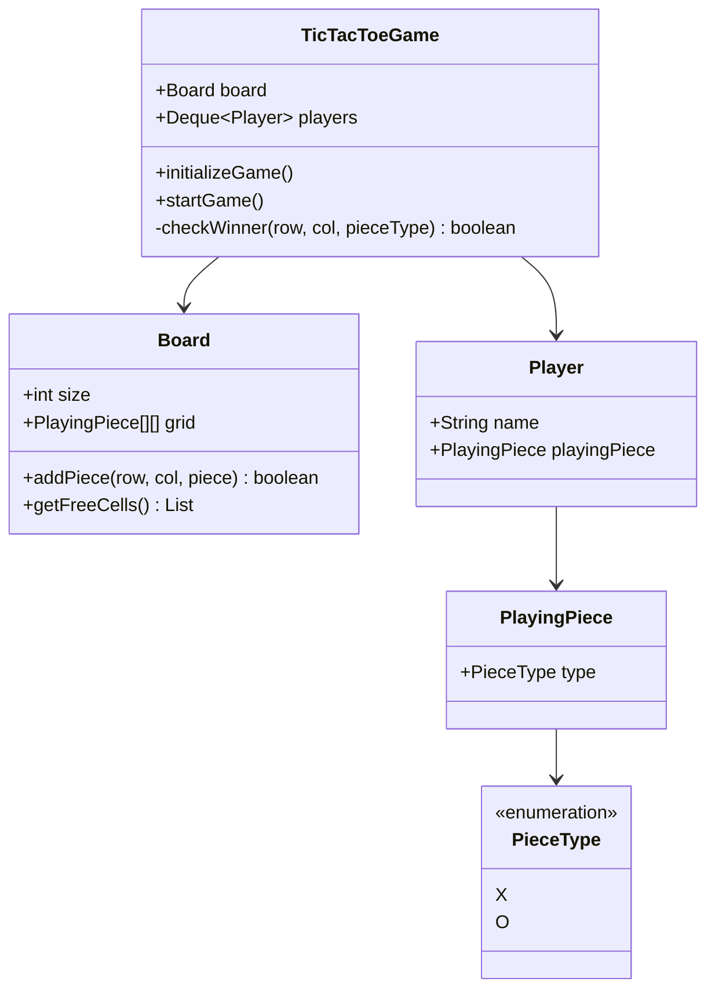

# Design Tic-Tac-Toe

> **Difficulty**: Beginner  
> **Topics**: Object-Oriented Design, Board Game Logic, 2D Arrays  
> **Extension**: NxN Board, AI Player (Minimax).

## Phase 1: Requirements Gathering

### Goals
- Design a Tic-Tac-Toe game for two players.
- Identify core entities: Board, Player, Piece.
- Define game rules and winning conditions.

### 1. Who are the actors?
- **Players**: Two players (X and O) who take turns.
- **Game System**: Validates moves, checks for winners, and manages the turn flow.

### 2. What are the must-have features? (Core)
- **Game Board**: 3x3 grid (extensible to NxN).
- **Move Logic**: Players place their piece on an empty cell.
- **Win Detection**: Check row, column, and diagonal for a match.
- **Draw Detection**: Identify when the board is full with no winner.

### 3. What are the constraints?
- **Turn-based**: Strict alternation between players.
- **Validity**: Cannot place a piece on an occupied cell.

---

## Phase 2: Use Cases

### UC1: Make Move
**Actor**: Player
**Flow**:
1. Player chooses a cell (row, col).
2. System validates if the cell is empty and within bounds.
3. System places the piece.
4. System checks for a win or draw.
5. If game over, announce result.
6. If not, switch turn to the next player.

---

## Phase 3: Class Diagram

### Step 1: Core Entities
- **Game**: Manages the flow.
- **Board**: Manages the grid.
- **Player**: Has a name and a playing piece.
- **PlayingPiece**: Represents 'X' or 'O'.
- **PieceType**: Enum for X/O.

### UML Diagram



---

## Phase 4: Design Patterns

### 1. Strategy Pattern
- **Description**: Defines a family of algorithms, encapsulates each one, and makes them interchangeable.
- **Why used**: Enables switching between different playing strategies for an AI opponent (e.g., `EasyStrategy` (Random), `HardStrategy` (Minimax)) without modifying the Game class.

### 2. Factory Pattern
- **Description**: A creational pattern that provides an interface for creating objects in a superclass, but allows subclasses to alter the type of objects that will be created.
- **Why used**: Centralizes the creation of game pieces (`PlayingPieceX`, `PlayingPieceO`) or players, making the system extensible for new piece types or player types.

---

## Phase 5: Code Key Methods

### Java Implementation

```java
import java.util.*;

// 1. Piece Enum & Class
enum PieceType {
    X, O;
}

class PlayingPiece {
    public PieceType type;

    public PlayingPiece(PieceType type) {
        this.type = type;
    }
}

class PlayingPieceX extends PlayingPiece {
    public PlayingPieceX() {
        super(PieceType.X);
    }
}

class PlayingPieceO extends PlayingPiece {
    public PlayingPieceO() {
        super(PieceType.O);
    }
}

// 2. Board
class Board {
    public int size;
    public PlayingPiece[][] grid;

    public Board(int size) {
        this.size = size;
        this.grid = new PlayingPiece[size][size];
    }

    public boolean addPiece(int row, int col, PlayingPiece piece) {
        if (grid[row][col] != null) {
            return false;
        }
        grid[row][col] = piece;
        return true;
    }

    public void printBoard() {
        for (int i = 0; i < size; i++) {
            for (int j = 0; j < size; j++) {
                if (grid[i][j] != null) {
                    System.out.print(grid[i][j].type + "   ");
                } else {
                    System.out.print("    ");
                }
                System.out.print(" | ");
            }
            System.out.println();
        }
    }
    
    public List<int[]> getFreeCells() {
        List<int[]> freeCells = new ArrayList<>();
        for (int i = 0; i < size; i++) {
            for (int j = 0; j < size; j++) {
                if (grid[i][j] == null) {
                    freeCells.add(new int[]{i, j});
                }
            }
        }
        return freeCells;
    }
}

// 3. Player
class Player {
    public String name;
    public PlayingPiece playingPiece;

    public Player(String name, PlayingPiece playingPiece) {
        this.name = name;
        this.playingPiece = playingPiece;
    }
}

// 4. Game Controller
public class TicTacToeGame {
    Deque<Player> players;
    Board board;

    public void initializeGame() {
        players = new LinkedList<>();
        PlayingPieceX pieceX = new PlayingPieceX();
        Player player1 = new Player("Player1", pieceX);

        PlayingPieceO pieceO = new PlayingPieceO();
        Player player2 = new Player("Player2", pieceO);

        players.add(player1);
        players.add(player2);

        board = new Board(3);
    }

    public String startGame() {
        boolean noWinner = true;
        while (noWinner) {
            
            // Take the player whose turn is next
            Player playerTurn = players.removeFirst();
            
            // Get free space from the board
            board.printBoard();
            List<int[]> freeSpaces = board.getFreeCells();
            if (freeSpaces.isEmpty()) {
                noWinner = false;
                continue;
            }

            // Read the user input
            System.out.print("Player: " + playerTurn.name + " Enter row,column: ");
            Scanner inputScanner = new Scanner(System.in);
            String s = inputScanner.nextLine();
            String[] values = s.split(",");
            int inputRow = Integer.valueOf(values[0]);
            int inputCol = Integer.valueOf(values[1]);

            // Place the piece
            boolean pieceAddedSuccessfully = board.addPiece(inputRow, inputCol, playerTurn.playingPiece);
            if (!pieceAddedSuccessfully) {
                // Player can not insert the piece into this cell, player has to choose another cell
                System.out.println("Incorrect position chosen, try again");
                players.addFirst(playerTurn);
                continue;
            }
            players.addLast(playerTurn);

            boolean winner = isThereWinner(inputRow, inputCol, playerTurn.playingPiece.type);
            if (winner) {
                return playerTurn.name;
            }
        }
        return "tie";
    }

    public boolean isThereWinner(int row, int col, PieceType pieceType) {
        boolean rowMatch = true;
        boolean colMatch = true;
        boolean diagonalMatch = true;
        boolean antiDiagonalMatch = true;

        // Need to check in row
        for (int i = 0; i < board.size; i++) {
            if (board.grid[row][i] == null || board.grid[row][i].type != pieceType) {
                rowMatch = false;
            }
        }

        // Need to check in column
        for (int i = 0; i < board.size; i++) {
            if (board.grid[i][col] == null || board.grid[i][col].type != pieceType) {
                colMatch = false;
            }
        }

        // Need to check diagonals
        for (int i = 0, j = 0; i < board.size; i++, j++) {
            if (board.grid[i][j] == null || board.grid[i][j].type != pieceType) {
                diagonalMatch = false;
            }
        }

        // Need to check anti-diagonals
        for (int i = 0, j = board.size - 1; i < board.size; i++, j--) {
            if (board.grid[i][j] == null || board.grid[i][j].type != pieceType) {
                antiDiagonalMatch = false;
            }
        }

        return rowMatch || colMatch || diagonalMatch || antiDiagonalMatch;
    }
}
```

---

## Phase 6: Discussion

### Scalability
**Q: How to scale to NxN board?**
- A: "The logic in `isThereWinner` already uses `board.size`. The main change would be input validation and potentially the WIN condition (e.g., in a 100x100 grid, maybe 5 in a row wins)."

### Undo Feature
**Q: How to add Undo feature?**
- A: "Use the **Command Pattern**. Encapsulate each move as a `Command` object with `execute()` and `undo()` methods. Store these commands in a stack. When `undo()` is called, pop the stack and reverse the move (set cell to null)."

### AI Opponent
**Q: How to implement a single player mode?**
- A: "Create an `AIPlayer` class. Use the **Minimax Algorithm** (potentially with Alpha-Beta pruning) to determine the best move by simulating future game states."

---

## SOLID Principles Checklist

- **S (Single Responsibility)**: `Board` handles grid, `Game` handles flow, `Player` holds data.
- **O (Open/Closed)**: New `PieceType` (e.g., Triangle) can be added by extending `PlayingPiece`.
- **L (Liskov Substitution)**: `PlayingPieceX` works wherever `PlayingPiece` is expected.
- **I (Interface Segregation)**: Not heavily used here, but interfaces are kept simple.
- **D (Dependency Inversion)**: `Game` depends on `PlayingPiece` abstraction, not concrete X/O classes.
