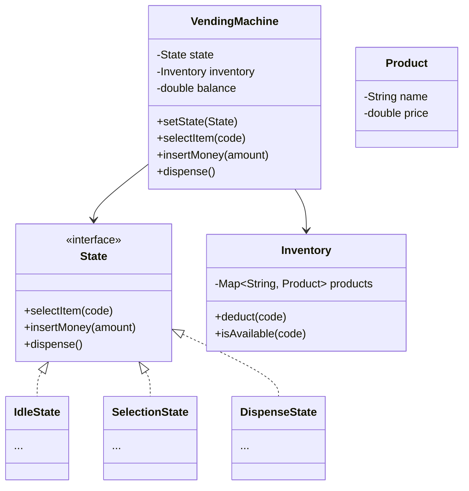
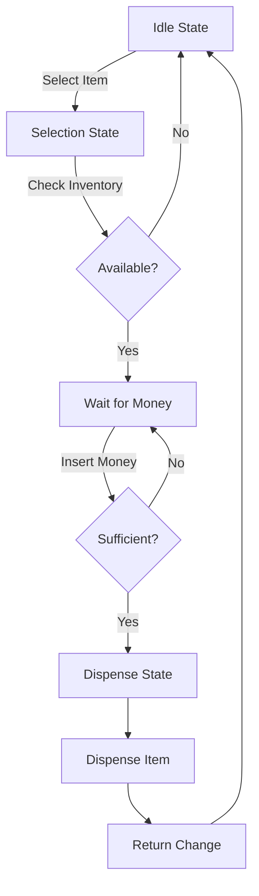

# Design Vending Machine

> **Difficulty**: Medium
> **Topics**: State Design Pattern, State Machine
> **Key Concepts**: Managing state transitions, inventory, handling money.

## Problem Statement

Design a Vending Machine that:
1.  **States**: Handles different states (Idle, Ready, Dispensing, OutOfOrder).
2.  **Inventory**: Manages products and their counts.
3.  **Money**: Accepts coins/notes and returns change.
4.  **Selection**: Allows users to select products via code (e.g., A1, B2).
5.  **Refund**: Allows cancelling the request and returning money.

## Class Diagram



## Flow Chart: Purchase Process



## Java Implementation

```java
import java.util.*;

// 1. Core Entities
class Product {
    String name;
    double price;
    public Product(String name, double price) { this.name = name; this.price = price; }
}

class Inventory {
    private Map<String, Product> products = new HashMap<>(); // Code -> Product
    private Map<String, Integer> counts = new HashMap<>();   // Code -> Count

    public void addProduct(String code, Product p, int count) {
        products.put(code, p);
        counts.put(code, count);
    }

    public double getPrice(String code) {
        return products.containsKey(code) ? products.get(code).price : 0;
    }

    public boolean isAvailable(String code) {
        return counts.getOrDefault(code, 0) > 0;
    }

    public void deduct(String code) {
        if (isAvailable(code)) {
            counts.put(code, counts.get(code) - 1);
        }
    }
    
    public Product getProduct(String code) { return products.get(code); }
}

// 2. State Interface
interface State {
    void selectItem(String code);
    void insertMoney(double amount);
    void dispense();
}

// 3. Vending Machine Context
class VendingMachine {
    private State idleState;
    private State selectionState;
    private State dispenseState;
    
    private State currentState;
    private Inventory inventory;
    private double currentBalance;
    private String selectedCode;

    public VendingMachine() {
        idleState = new IdleState(this);
        selectionState = new SelectionState(this);
        dispenseState = new DispenseState(this);
        
        inventory = new Inventory();
        currentState = idleState; // Initial State
        currentBalance = 0;
    }

    public void setState(State state) { this.currentState = state; }
    public State getIdleState() { return idleState; }
    public State getSelectionState() { return selectionState; }
    public State getDispenseState() { return dispenseState; }
    
    public Inventory getInventory() { return inventory; }
    public void addBalance(double amount) { this.currentBalance += amount; }
    public double getBalance() { return currentBalance; }
    public void setSelectedCode(String code) { this.selectedCode = code; }
    public String getSelectedCode() { return selectedCode; }
    public void reset() { currentBalance = 0; selectedCode = null; }

    // Actions delegation
    public void selectItem(String code) { currentState.selectItem(code); }
    public void insertMoney(double amount) { currentState.insertMoney(amount); }
    public void dispense() { currentState.dispense(); }
}

// 4. Concrete States
class IdleState implements State {
    VendingMachine vm;
    public IdleState(VendingMachine vm) { this.vm = vm; }

    public void selectItem(String code) {
        if (vm.getInventory().isAvailable(code)) {
            vm.setSelectedCode(code);
            vm.setState(vm.getSelectionState());
            System.out.println("Item " + code + " selected. Price: " + vm.getInventory().getPrice(code));
        } else {
            System.out.println("Item unavailable.");
        }
    }
    public void insertMoney(double amount) { System.out.println("Select item first."); }
    public void dispense() { System.out.println("Select item first."); }
}

class SelectionState implements State {
    VendingMachine vm;
    public SelectionState(VendingMachine vm) { this.vm = vm; }

    public void selectItem(String code) { System.out.println("Item already selected."); }
    public void insertMoney(double amount) {
        vm.addBalance(amount);
        double price = vm.getInventory().getPrice(vm.getSelectedCode());
        System.out.println("Inserted: " + amount + " Total: " + vm.getBalance());
        
        if (vm.getBalance() >= price) {
            vm.setState(vm.getDispenseState());
            vm.dispense();
        }
    }
    public void dispense() { System.out.println("Insufficient funds."); }
}

class DispenseState implements State {
    VendingMachine vm;
    public DispenseState(VendingMachine vm) { this.vm = vm; }

    public void selectItem(String code) { System.out.println("Dispensing..."); }
    public void insertMoney(double amount) { System.out.println("Dispensing..."); }
    public void dispense() {
        String code = vm.getSelectedCode();
        double price = vm.getInventory().getPrice(code);
        double change = vm.getBalance() - price;
        
        vm.getInventory().deduct(code);
        System.out.println("Dispensing " + vm.getInventory().getProduct(code).name);
        if (change > 0) System.out.println("Returning change: " + change);
        
        vm.reset();
        vm.setState(vm.getIdleState());
    }
}

// 5. Client
public class VendingMachineDemo {
    public static void main(String[] args) {
        VendingMachine vm = new VendingMachine();
        vm.getInventory().addProduct("A1", new Product("Coke", 1.5), 5);
        
        vm.selectItem("A1");
        vm.insertMoney(1.0);
        vm.insertMoney(1.0); // Total 2.0 -> Dispense + 0.5 Change
    }
}
```

## Interview Q&A

**Q: "How to handle concurrency (two users selecting same last item)?"**
- A: "In `Inventory.deduct()`, implement a double-check lock or use `AtomicInteger` for counts. If using database, use optimistic locking."

**Q: "How to add new states (e.g., Maintenance)?"**
- A: "Create `MaintenanceState` class implementing `State` interface. Add transition logic in Admin specific methods."

**Q: "How to handle exact change only?"**
- A: "The machine needs to track its own internal cash inventory. In `DispenseState`, check if internal cash can provide the change using a Greedy algorithm (DP for optimal)."
